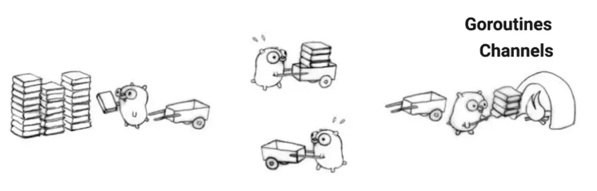

# Crystal 与 Go 的并发性比较(上)

> 原文：<https://itnext.io/comparing-crystals-concurrency-with-that-of-go-s-part-i-cd45a3388935?source=collection_archive---------1----------------------->

在我上一篇关于 Crystal 编程语言的文章中，我写了我第一次使用 Crystal 编程语言及其生态系统的经历。从那以后，我试图在 Crystal 的语法和语义方面做更多的研究。已经熟悉了 [Go](https://golang.org/) ，我想通过将一些 Go 程序转换成 Crystal 来比较 Crystal 和 Go 中的并发支持。

我假设您至少熟悉这两种语言中的一种及其并发结构。

Go 支持两种形式的并发，并且都非常成熟—

*   使用[通信顺序进程(CSP)的并发性](https://en.wikipedia.org/wiki/Communicating_sequential_processes)
*   使用共享内存多线程的并发性

虽然 Crystal 也支持 CSP 和共享内存多线程，但我发现从 Crystal 版本 0.35.1 开始，这种支持仍然不完整。此外，正如 [Crystal 官方文档](https://crystal-lang.org/reference/guides/concurrency.html)所言——“*在撰写本文时，Crystal 支持并发性，但不支持并行性:可以执行几个任务，每个任务会花费一些时间，但两条代码路径不会在同一时间执行。”*

说到这里，我将在文章系列的第一部分中通过比较对 **CSP** 的支持来比较 Crystal 和 Go 的并发性的当前状态。我将在第二部分比较共享内存多线程。

# 沟通顺序流程(CSP)

在 CSP 中，值被限制在单个活动中，多个活动通过在它们之间传递值来进行通信。

**Go** 实施 CSP 使用—

*   goroutine —轻量级执行线程
*   通道——允许一个 goroutine 向另一个 goroutine 发送值的通信机制。

**晶体**有类似的机制使用—

*   纤维——相当于 Go 中的 goroutine
*   渠道—相当于 Go 中的渠道

在本文中，我从 Go 的[A Tour](https://tour.golang.org/)(**Concurrency**小节)中选取了一些例子，并将这些程序转换成 Crystal 等价物。

让我们现在一个一个地检查程序。

## 并发 1

这个例子展示了如何创建 goroutine (Go) / fiber (Crystal)并并发执行它们。

**围棋版本——**【https://tour.golang.org/concurrency/1】T2

这里—

*   **第 16 行** : **go** 关键字在 go 中创建新的 goroutine
*   **第 8–13 行**:主 goroutine 和新创建的 goroutine(第 16 行)同时运行，执行 **say** 功能

**水晶版—**

这里—

*   **第 8–10 行** : **spawn** 块用于在水晶中创建一个新的**纤维**

## 并发 2

这个例子展示了如何使用通道在 **goroutines** (Go)或**fibre**(Crystal)之间进行通信。

**围棋版本**——[https://tour.golang.org/concurrency/2](https://tour.golang.org/concurrency/2)

这里—

*   **第 16 行**:创建一个可以传递整数值的通道
*   **第 10 行**:将**和**写入通道 **c (ch < - v** 发送 v 到通道 ch **)**
*   **第 19 行**:从通道 **c** **读取两个值( **x，y**)(v:=<-ch**从通道 ch **)**

**水晶版** —

这里—

*   **第 9 行**:创建一个可以传递整数值的通道
*   **第 3 行**:将**和**写入通道 **c(用于写入通道的发送方法)**
*   **第 19 行**:从通道**c**读取两个值( **x，y** )

## **并发 3**

此示例显示了如何使用缓冲通道，该通道根据容量最多可容纳多个值。

**围棋版本—**[https://tour.golang.org/concurrency/3](https://tour.golang.org/concurrency/3)

这里—

*   **第 6 行**:创建容量为 2 的缓冲通道

**水晶版—**

这里—

*   **第 1 行**:创建一个容量为 2 的缓冲通道

## **并发 4**

这个例子展示了如何在信道上迭代以接收多个值，并且关闭一个信道以通知接收者不再有期望的值。

**围棋版本——**【https://tour.golang.org/concurrency/4】T2

这里—

*   **第 17 行**:创建一个容量为 10 的缓冲通道来存储生成的 10 个斐波那契数
*   **第 18 行**:创建一个 goroutine，并将通道容量和通道本身传递给新的 goroutine
*   **第 13 行**:关闭通道 **c** 所有斐波纳契数都被写入通道
*   **第 14 行** : **范围**用于在 Go 中迭代通道中的可用值

**水晶版** —

这里—

*   **第 17 行**:创建一个容量为 10 的缓冲通道，用于存储生成的 10 个斐波纳契数
*   **第 14–16 行**:创建一个新纤程，并将信道容量和信道本身传递给新纤程
*   **第 9 行**:关闭通道 **c** 所有斐波纳契数被写入通道
*   **line 18–24**:与 range 在 Go 中的工作相同。 [**收到？**](https://crystal-lang.org/api/0.35.1/Channel.html#receive?-instance-method) 如果通道关闭且无其他值可读取，则返回 nil

## 并发性 5

这个例子演示了使用**选择**来多路复用多个通道上的等待。select 会一直阻塞，直到它的一个事例可以运行为止。

**围棋版本—**[https://tour.golang.org/concurrency/5](https://tour.golang.org/concurrency/5)

这里—

*   **第 19–20 行**:创建两个通道( **c，退出** ) **。**
*   **第 25 行** : **退出**通道用于通知**斐波那契**例程，使用通道 **c** 预计不会有更多的值到达，是时候返回了
*   **线 8–14**:select 用于多路复用两个通道上的等待( **c** 和 **quit** )

**水晶版—**

这里—

*   **第 17–18 行**:创建两个通道( **c，退出** ) **。**
*   **第 24 行** : **退出**通道用于通知**斐波那契**纤程，使用通道 **c** 预计不会有更多的值到达，是时候返回了
*   **线 7–13**:select 用于多路复用两个通道上的等待( **c** 和**退出**)

## 并发性 6

此示例显示了在**选择中**默认**案例( **Go** )的用法—** 默认案例在没有其他案例准备好时运行。Crystal 中的等效情况是 **else。**

**围棋版本—**`**1ed**`[https://tour.golang.org/concurrency/6](https://tour.golang.org/concurrency/6)

这里—

*   第 18–20 行:**默认**情况是在**滴答**和**吊杆**通道都没有准备好的情况下运行

**水晶版—**

这里—

*   第 18–20 行:**否则**情况运行，此时**滴答**或**吊杆**通道都没有准备好

**注:** *我没有从水晶标准库中的* *后的* ***勾选*** *和* ***。所以我写了一个小模块****time channel****(第 1–17 行)来实现同样的。***

在本文中，我试图比较和演示使用纤程和通道在 Crystal 中编写并发代码是多么容易。我在 Go 和 Crystal 中提供了等价的代码，以比较两者之间的相似之处。虽然 Go 对 CSP 的支持更加成熟，文档也更加完善，但是 Crystal 并没有落后太多，因为它的语言版本仍然是 0.35.1。

我希望这篇文章对一些读者有所帮助。请继续关注第二部分，它将关注**共享内存多线程**。

***更新:文章系列的第二部分现已出版。你可以在这里阅读—***[*https://medium . com/@ merajulislam/comparing-crystals-concurrency-with-the-the-go-part-ii-89049701 B1 a5*](https://medium.com/@merajulislam/comparing-crystals-concurrency-with-that-of-go-part-ii-89049701b1a5)

# 参考

1.  [https://tour.golang.org/list](https://tour.golang.org/list)
2.  [https://crystal-lang.org/reference/guides/concurrency.html](https://crystal-lang.org/reference/guides/concurrency.html)
3.  [https://crystal-lang.org/api/0.35.1/](https://crystal-lang.org/api/0.35.1/)

*更多详细和深入的未来技术帖子请关注我这里或点击* [*twitter*](https://twitter.com/meraj_enigma) *。*