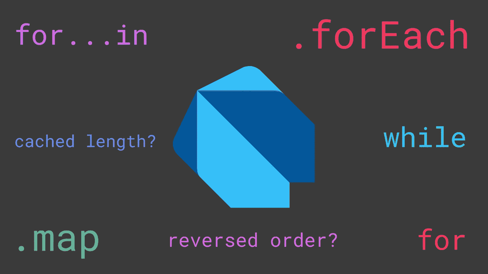
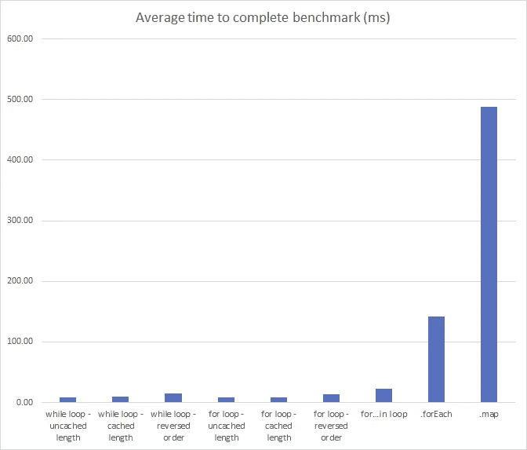

# 比较 Dart 的循环，哪个最快？

> 原文：<https://itnext.io/comparing-darts-loops-which-is-the-fastest-731a03ad42a2?source=collection_archive---------0----------------------->



art 是一种用来编写 Flutter 应用程序的语言，它有许多不同的循环，可以遍历列表或运行一些代码指定的次数。在循环中有*和*循环、*为* 循环、*为…… *forEach* 方法。*绘制*方法及更多。在本文中，我们将测试这些不同的循环方法，看看哪种是最快的！*

对于这些测试，我们将使用由 [tools.dart.dev](https://pub.dev/publishers/tools.dart.dev) 提供的 [benchmark_harness](https://pub.dev/packages/benchmark_harness) 包。

# 优化

对于或*的*有一些优化，而*循环已经在 JavaScript 等其他语言中使用，例如:缓存列表的长度和颠倒循环的顺序。*

# 缓存长度

缓存列表的长度包括在循环之前将我们将要循环的列表的长度设置为一个变量。以下是一个长度未缓存的 *while* 循环的示例:

```
var count = 0;num eachElement = 0;while (count < **list.length**) { eachElement = pow(list[count], 3); count++;}
```

下面是一个带有缓存长度的 *while* 循环的例子:

```
var count = 0;num eachElement = 0;**var length = list.length;**while (count < **length**) { eachElement = pow(list[count], 3); count++;}
```

当我们在循环之前缓存列表的长度时，列表的长度只计算一次，而不是在每次迭代时重新计算。然而，当我们不缓存长度时，每次迭代都会计算长度。对于包含大量元素的列表，这应该会显著提高性能。

# 颠倒顺序

颠倒循环的顺序包括将迭代器设置为列表的长度减 1(因为列表从 0 开始计数)，然后向后迭代(例如，每次迭代后从迭代器中减去 1)，直到迭代器等于 0。下面是一个循环的*示例，具有常规顺序:*

```
num eachElement = 0;for (var i = 0; i < **list.length**; i++) { eachElement = pow(list[i], 3);}
```

以下是一个顺序相反的循环的*示例:*

```
num eachElement = 0;for (var i = **list.length - 1**; i >= 0; i--) { eachElement = pow(list[i], 3);}
```

类似于缓存列表的长度，颠倒循环的顺序缓存列表的长度作为迭代器的初始值。因此，对于包含大量元素的列表来说，这应该会带来显著的性能提升。

# 基准

为了测量每个循环的性能，它必须遍历一个包含 3000000 个整数的列表，每个整数都是它自己在列表中的索引。对于列表中的每个元素，循环必须设置一个名为*的变量 eachElement* 为元素的立方值。

该程序将在每个循环中运行 10 次，并记录完成操作的平均时间。然后，我将整个基准测试重复了 3 次，得出了平均结果。

现在，让我们看看哪个循环和优化组合是最快的！

# While 循环

1.  无缓存长度:

```
var count = 0;num eachElement = 0;**while (count < list.length) {** **eachElement = pow(list[count], 3);** **count++;****}**
```

完成该测试大约需要 9.14 毫秒。

2.带缓存长度:

```
var count = 0;num eachElement = 0;**var length = list.length;****while (count < length) {** **eachElement = pow(list[count], 3);** **count++;****}**
```

完成该测试大约需要 9.65 毫秒。

3.顺序相反:

```
var count = list.length - 1;num eachElement = 0;**while (count >= 0) {** **eachElement = pow(list[count], 3);** **count--;****}**
```

这个测试花了大约 14.57 毫秒完成。

# 对于循环

1.  无缓存长度:

```
num eachElement = 0;**for (var i = 0; i < list.length; i++) {** **eachElement = pow(list[i], 3);****}**
```

这项测试花了大约 9.08 毫秒完成。

2.带缓存长度:

```
num eachElement = 0;**var length = list.length;****for (var i = 0; i < length; i++) {** **eachElement = pow(list[i], 3);****}**
```

这项测试花了大约 9.01 毫秒完成。

3.顺序相反:

```
num eachElement = 0;**for (var i = list.length - 1; i >= 0; i--) {** **eachElement = pow(list[i], 3);****}**
```

这个测试花了大约 14.27 毫秒完成。

# 对于…在循环中

```
num eachElement = 0;**for (var element in list) {** **eachElement = pow(element, 3);****}**
```

完成该测试大约需要 22.70 毫秒。

# 。forEach 方法

```
num eachElement = 0;**list.forEach((element) {** **eachElement = pow(element, 3);****});**
```

这个测试花了大约 142.27 毫秒完成。

# 。地图方法

```
num eachElement = 0;**list.map((e) {** **eachElement = pow(e, 3);****}).toList();**
```

这个测试花了大约 487.77 毫秒完成。

# 结果呢

我把这些测试的结果整理成一个柱状图。



带结果的条形图

从这个图中我们可以看到，循环的*用缓存的长度是最快的，而*。使用*时，地图*方法最慢(慢很多)。forEach* 方法为倒数第二。*

其余环路的性能几乎相同；然而，似乎顺序相反的循环的 *while* 和*比其他循环的性能稍差。*

# 结论

总之， *while* 或 *for* 循环中的任何一个都可以使用，每个循环之间的性能差异最小(除了反向循环)。

本文中使用的基准测试代码和包含结果的电子表格可从[这里](https://github.com/XuanHanTan/dart-loops-benchmarks)获得。

这篇文章与通常的颤振文章略有不同，我希望你喜欢阅读它！让我知道你对结果的想法，以及我是否应该在评论区发布更多的基准测试文章。如果你觉得这篇文章有用，也请鼓掌！