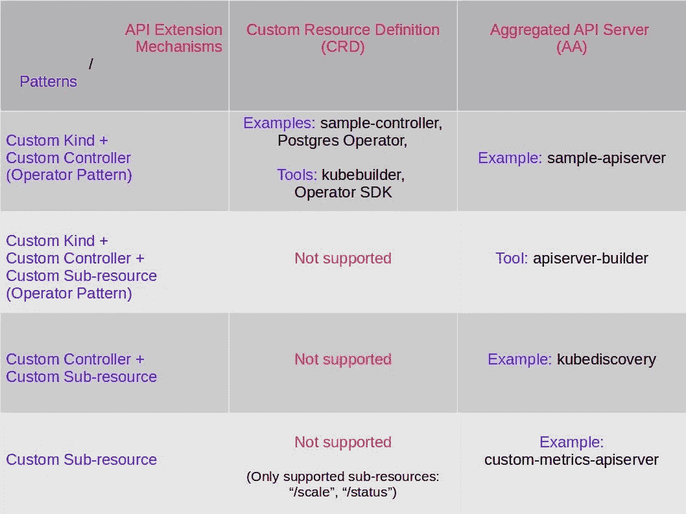

# Kubernetes API 扩展的模式

> 原文：<https://itnext.io/comparing-kubernetes-api-extension-mechanisms-of-custom-resource-definition-and-aggregated-api-64f4ca6d0966?source=collection_archive---------1----------------------->

关于 Kubernetes 的一个有趣的方面是，您可以扩展它的 API，以利用 Kubernetes 的底层功能构建一个适用的平台。可用于实现 API 扩展的机制是自定义资源定义(CRD)和聚合 API 服务器(AA)。使用这些机制构建的 API 可以使用 kubectl 直接访问，不需要其他 CLI 来访问它们。

在这篇文章中，我们从扩展 API 中涉及的基本构造的角度来看 API 扩展。使用这个镜头，我们能够考虑各种各样的*模式*，通过将这些基本结构结合在一起，这些模式是可能的。然后，我们展示了哪些模式可以使用定制资源定义来实现，哪些模式可以使用聚合 API 服务器来实现。

*扩展的 Kubernetes API 中的基本构造*

Kubernetes 扩展 API 包含三个基本构造。它们是:(a)自定义种类(b)自定义控制器(c)自定义子资源。

1.  自定义种类:自定义种类是一种构造，它允许您以声明的格式定义特定于领域的需求。例如，Postgres 自定义类型可以支持创建数据库和用户的声明性模型。自定义类型类似于现有的本地 Kubernetes 类型，如 Pod、Service。它包括元数据部分、规范部分和状态部分。
2.  定制控制器:定制控制器是一个 Kubernetes 控制器，它通过监视集群中 Kubernetes 种类的创建/更新/删除事件来协调集群的状态。这些可以是本地类型(部署、Pod、服务等。)或自定义种类(如 Postgres)。
3.  自定义子资源:Kubernetes 种类(本地或自定义)上的自定义子资源允许您在它的种类上定义细粒度的操作。在缺少子资源的情况下，Kubernetes 只允许任何类型的基本 CRUD 操作。自定义子资源的一个示例可以是在 Pod 上定义的 http_requests_total，它将允许您找出该 Pod 收到的 http 请求的数量。

不是每个扩展 API 都包含所有这些结构。事实上，我们在任何扩展 API 中都观察到了四种模式。它们如下:

1.  自定义种类+自定义控制器:这是最流行的模式。在这个模式中，您使用一个自定义种类来声明性地建模您的域需求。定制控制器包括通过对对应于定制种类(主要)的不同事件做出反应来协调集群状态的逻辑。这种模式的通俗名称是`Operator Pattern.`。这种模式可以使用 CRD 和 AA 机制来实现。
2.  自定义种类+自定义控制器+自定义子资源:和上面一样，这个模式也是`Operator Pattern.`它也支持通过自定义子资源对您的自定义种类进行自定义操作(超越 CRUD)。这种模式只能使用 AA 机制来实现。
3.  自定义控制器+自定义子资源:该模式没有定义新的种类。定制控制器对与已经在集群中注册的种类相关的事件执行其协调逻辑。自定义子资源用于检索由自定义控制器收集的信息。一个这样的例子是[控制器，它收集和维护关于各种 Kubernetes 对象的动态组合](https://medium.com/@cloudark/our-journey-in-building-a-kubernetes-aggregated-api-server-29a4f9c1de22)的信息，定制子资源用于获取这些信息。这种模式只能使用 AA 机制来实现。
4.  定制子资源:在这个模式中，没有定制控制器。定制子资源通常被用来查找关于某个 Kubernetes 对象的一些信息。这方面的一个例子是一个[度量服务器，它从 Prometheus](https://github.com/kubernetes-incubator/custom-metrics-apiserver) 获取信息，并通过自定义子资源如`http_requests.`使其可用。这种模式只能使用 AA 机制来实现。

下面的表格总结了这些模式、实现这些模式所支持的 API 扩展机制，以及指向示例的指针，在这些示例中，您可以看到用于开发阶段的模式和参考工具。

1.  自定义种类+自定义控制器:在实现这种模式时，您可以使用 CRD 或 AA。使用 CRD 时，首先查看[采样控制器](https://github.com/kubernetes/sample-controller)。这是一个如何编写、安装和使用 CRD 的好例子。你也可以看看[我们的 Postgres 操作符](https://github.com/cloud-ark/kubeplus/tree/master/postgres-crd-v2)来看看一个以样本控制器为模型的 CRD 例子。查看 [kubebuilder](https://github.com/kubernetes-sigs/kubebuilder) 和 [Operator SDK](https://github.com/operator-framework/operator-sdk) 。这些工具减少了使用 sample-controller 从头开始开发 CRD 时需要编写的样板代码。为了更好地了解这些工具的内部工作原理，请查看我们对它们的分析[这里](https://medium.com/@cloudark/kubernetes-custom-controllers-b6c7d0668fdf)(样本控制器)[这里](/under-the-hood-of-kubebuilder-framework-ff6b38c10796) (kubebuilder)，以及[这里](/under-the-hood-of-the-operator-sdk-eebc8fdeebbf) (Operator SDK)。当使用聚合 API 服务器时， [sample-apiserver](https://github.com/kubernetes/sample-apiserver) 是一个很好的起点。
2.  自定义种类+自定义控制器+自定义子资源:当使用这种模式时， [apiserver-builder](https://github.com/kubernetes-incubator/apiserver-builder) 工具可以帮助为您的服务器创建启动代码。它将帮助您在自定义种类上创建自定义种类、自定义控制器和自定义子资源。
3.  定制控制器+定制子资源:我们的 [kubediscovery API 服务器](https://github.com/cloud-ark/kubeprovenance)是这种情况的一个很好的例子。定制控制器定期轮询 Kubernetes 的主 API，以构建各种 Kubernetes 对象的动态组合树。在控制器的下一个版本中，我们计划修改其架构，使用观察/反应模型代替轮询模型。我们定义的自定义子资源是“/compositions”。这可以用于任何 Kubernetes 类型，本地的或定制的，来找出 Kubernetes 对象的所有或特定实例的动态组合信息。
4.  定制子资源:[定制度量 apiserver](https://github.com/kubernetes-incubator/custom-metrics-apiserver) 是这种模式的一个很好的例子。它定义了“pods/http_requests”子资源，可用于找出一个 Pod 收到的 http 请求的数量。在内部，它从集群中运行的 Prometheus 实例获取该信息。

前两种模式支持 Kubernetes 状态和解的*声明模型*。这些模式中可用的自定义种类用于定义所需的状态，自定义控制器用于定义协调逻辑。每当引入一种新的定制类型时，该模式也可以称为`Operator Pattern.`

最后两种模式侧重于提供在 Kubernetes 对象上执行定制操作的能力。当前的例子——custom-metrics——API server、kube discovery——展示了如何执行从集群中检索定制状态信息的操作。没有自定义子资源，只有 CRUD 操作是可能的。

*结论:*

Kubernetes 的自定义资源定义和聚合 API 服务器的 API 扩展机制由三个基本结构组成——自定义种类、自定义控制器和自定义子资源。通过对现有例子的分析，我们已经确定了四种模式，这四种模式结合了今天看到的这些结构。通过从扩展模式的角度来看 API 扩展机制，我们希望您在开发扩展 API 时能够选择合适的机制、示例和工具。

[www.cloudark.io](https://cloudark.io/)