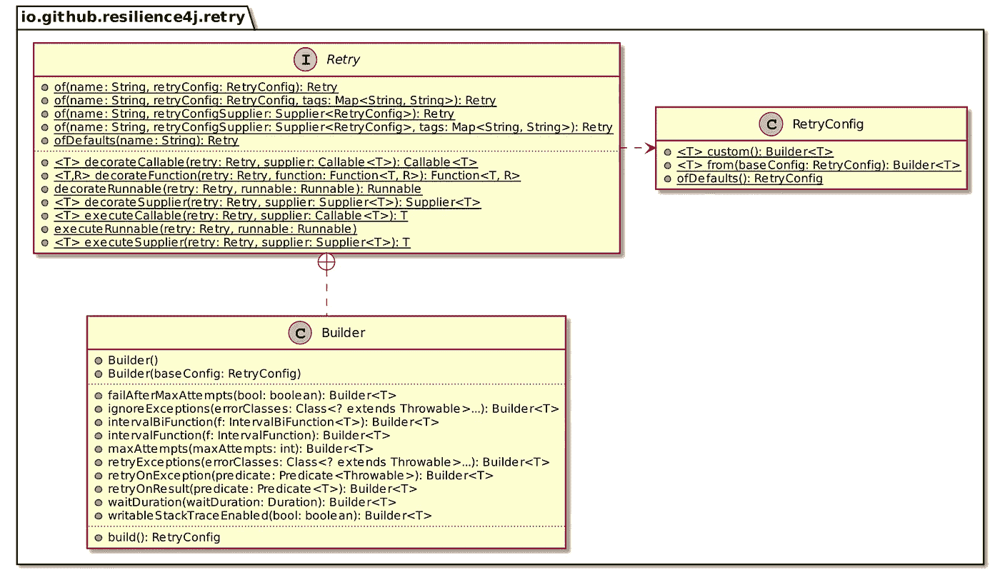
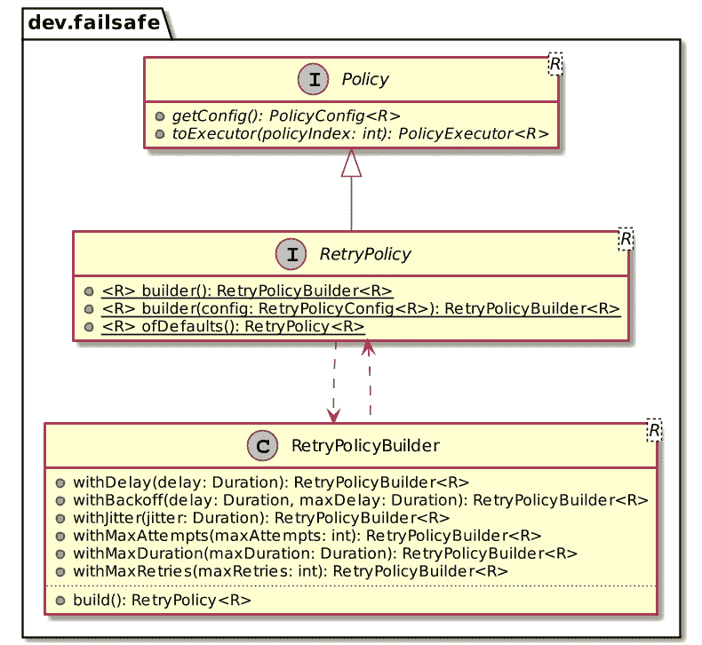
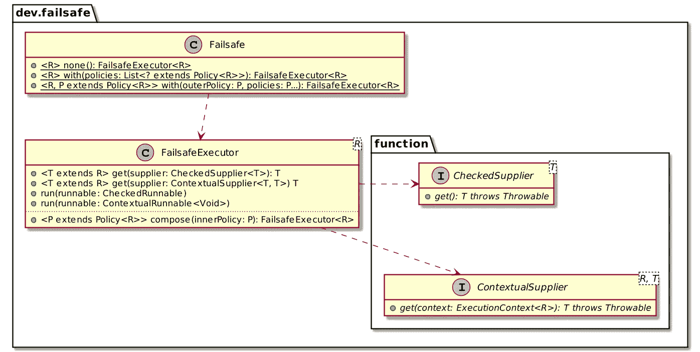

# JVM 上容错库的初步比较

> 原文：<https://itnext.io/comparison-of-fault-tolerance-libraries-f9f58b45fe2f?source=collection_archive---------3----------------------->


无论您是否正在实现微服务，都有可能调用 HTTP 端点。使用 HTTP 调用，很多事情都会出错。有经验的开发人员会为此进行规划，并设计出超越快乐路径的东西。一般来说，容错包括以下功能:

*   重试
*   超时
*   断路器
*   撤退
*   避免服务器端 429 响应的速率限制器
*   隔板:速率限制器限制在一个确定的时间范围内调用的数量，而隔板限制并发调用的数量

几个库在 JVM 上实现了这些特性。在本帖中，我们将关注微文件容错、[故障安全](https://failsafe.dev/)和 Resilience4J。

# 微文件容错

[微文件容错](https://download.eclipse.org/microprofile/microprofile-fault-tolerance-1.1.2/microprofile-fault-tolerance-spec.html)来自微文件保护伞项目。它与其他两个不同，因为它是一个*规范*，依赖运行时来提供它的功能。例如，Open Liberty 就是这样一个运行时。 [SmallRye 容错](https://smallrye.io/docs/smallrye-fault-tolerance/5.2.1/index.html)又是一个。反过来，其他组件如 Quarkus 和 WildFly 嵌入了 SmallRye。

微文件为每个特征定义了*注释*:`@Timeout`、`@Retry Policy`、`@Fallback`、`@Circuit Breaker`和`@Bulkhead`。它还定义了`@Asynchronous`。

因为运行时读取批注，所以应该仔细阅读文档，以了解如果设置了多个批注，它们是如何交互的。

> *可以指定一个* `*@Fallback*` *，如果抛出* `*TimeoutException*` *就会被调用。如果* `*@Timeout*` *与* `*@Retry*` *一起使用，则* `*TimoutException*` *会触发重试。当* `*@Timeout*` *与* `*@CircuitBreaker*` *一起使用时，如果出现* `*TimeoutException*` *，故障将导致电路开路。*
> 
> *—* [*超时用法*](https://download.eclipse.org/microprofile/microprofile-fault-tolerance-1.1.2/microprofile-fault-tolerance-spec.html#_timeout_usage)

# 弹性 4J

当我在谈论断路器模式时，我偶然发现了 Resilience4J。这个演讲包括一个演示，它依赖于 [Hystrix](https://github.com/Netflix/Hystrix) 。有一天，我想将演示更新到最新的 Hystrix 版本，并注意到维护人员已经弃用它而支持 Resilience4J。

Resilience4J 基于几个核心概念:

*   每个容错特性一个 JAR，附加 JAR 用于特定集成，*，例如*，Kotlin
*   静态工厂
*   通过*装饰模式*应用于函数的函数组合
*   与 Java 的功能接口*集成，如*、`Runnable`、`Callable`、`Function`等。
*   异常传播:可以使用抛出异常的函数接口，库将在调用管道中传播异常

这里有一个`Retry`的简化类图。



每个容错特性都是围绕上面看到的相同模板构建的。通过利用函数组合，可以创建几个特性的管道，每个特性调用另一个特性。

让我们分析一个样本:

```
var retrySupplier = Retry.decorateSupplier(                     // 1
    Retry.ofDefaults("retry"),                                  // 2
    () -> server.call()                                         // 1
);
var config = new CircuitBreakerConfig.Builder()                   // 3
        .slowCallDurationThreshold(Duration.ofMillis(200))      // 4
        .slidingWindowSize(2)                                   // 5
        .minimumNumberOfCalls(2)                                // 6
        .build();
var breakerSupplier = CircuitBreaker
.of("circuit-breaker", config)                                   // 7                                    .decorateSupplier(retrySupplier);                               // 7
supplier = SupplierUtils.recover(                               // 8
    breakerSupplier,
    List.of(
        IllegalStateException.class,
        CallNotPermittedException.class),                       // 9
    e -> "fallback"                                            // 10
);
```

1.  用`Retry`修饰基本`server.call()`功能:该功能是需要保护的功能
2.  使用默认配置
3.  创建一个新的*断路器*配置
4.  设置阈值，高于该阈值的呼叫将被视为慢速呼叫
5.  在 2 个呼叫的滑动窗口内计数
6.  决定是否打开*断路器*的最小呼叫次数
7.  用具有上述配置的*断路器*装饰重试功能
8.  创建一个当*断路器*打开时返回的回退值
9.  要处理的异常列表:它们不会被传播。当电路断开时，Resilience4J 抛出一个`CallNotPermittedException`。
10.  如果抛出任何已配置的异常，请调用此函数

函数的组合顺序可能很难理解。因此，该项目提供了`Decorators`类来使用 fluent API 组合函数。你可以在`resilience4j-all`模块中找到它。人们可以将上面的代码重写为:

```
var pipeline = Decorators.ofSupplier(() -> server.call())
    .withRetry(Retry.ofDefaults("retry"))
    .withCircuitBreaker(CircuitBreaker.of("circuit-breaker", config))
    .withFallback(
        List.of(
            IllegalStateException.class,
            CallNotPermittedException.class),
        e -> "fallback"
    );
```

这使得意图更加清晰。

# 破损安全

不久前我偶然发现了故障保护。它的原则类似于 Resilience4J:静态工厂、函数组合和异常传播。

虽然 Resilience4J 容错特性不共享类层次结构，但 Failsafe 提供了`Policy`的概念:



我认为 Resilience4J 的主要区别在于它的流水线方法。Resilience4J 的 API 要求您首先提供“基本”函数，然后将它嵌入到任何包装器函数中。您不能在不同的基础函数上重用管道。故障安全通过`FailsafeExecutor`类允许它。



下面是如何创建一个管道，*即*，一个`FailsafeExecutor`的实例。
注意这里没有对基本调用的引用:

```
var pipeline = Failsafe.with(                            // 1
    Fallback.of("fallback"),                             // 2
    Timeout.ofDuration(Duration.of(2000, MILLIS)),       // 3
    RetryPolicy.ofDefault()                              // 4
);
```

1.  按顺序定义从最后到第一个应用的策略列表
2.  后备值
3.  如果调用超过 2000 毫秒，抛出`TimeoutExceededException`
4.  默认重试策略

此时，可以结束通话了:

```
pipeline.get(() -> server.call());
```

Failsafe 还提供了流畅的 API。人们可以将上面的代码重写为:

```
var pipeline = Failsafe.with(Fallback.of("fallback"))
    .compose(RetryPolicy.ofDefault())
    .compose(Timeout.ofDuration(Duration.of(2000, MILLIS)));
```

# 结论

这三个库提供了或多或少相同的特性。如果您不使用 CDI 兼容的运行时，比如常规的应用服务器或 Quarkus，请忘记微概要文件容错。

Failsafe 和 Resilience4J 都基于函数组合，非常相似。如果您需要独立于基调用来定义函数管道，请选择 Failsafe。否则，随便挑一个。

由于我更熟悉 Resilience4J，我可能会在我的下一个项目中使用 Failsafe 来获得更多的经验。

**更进一步:**

*   [微文件容错规范](https://download.eclipse.org/microprofile/microprofile-fault-tolerance-1.1.2/microprofile-fault-tolerance-spec.html)
*   [SmallRye 容错文档](https://smallrye.io/docs/smallrye-fault-tolerance/5.0.0/index.html)
*   [resilience 4j 简介](https://resilience4j.readme.io/docs)
*   [故障保护概述](https://failsafe.dev/)

*原载于* [*一个 Java 怪胎*](https://blog.frankel.ch/comparison-fault-tolerance-libraries/)*2022 年 1 月 7 日*