# 外部系统数据移动器的比较

> 原文：<https://itnext.io/comparison-of-outsystems-data-movers-abf15afa2d6f?source=collection_archive---------2----------------------->

Cool Data Mover 和 Data Migration Manager 是两个外部系统应用程序，用于在外部系统基础结构的不同阶段之间移动应用程序数据。在这篇文章中，我们将它们相互比较。

您可能需要更多(真实的)数据来正确测试应用程序，或者您需要使用真实的生产数据在非生产环境中调试应用程序。后一个例子有一个明显的复杂因素:需要对数据进行加扰以符合 GDPR。

我们测试的这两种工具都提供了在外部系统环境的数据库之间扰乱和移动数据的可能性。

# 工具

正在审查和比较的工具有:

*   [由](https://www.coolprofs.com/cool-data-mover-en/) [Coolprofs](https://www.coolprofs.com/) 创建的 Cool Data Mover (版本 2.3.10)
*   由[infosystema](https://www.infosistema.com/)创建的[数据迁移管理器](https://www.infosistema.com/dmm-data-migration-manager/)(版本 2.6.13)

两家公司都很有帮助，并为我们提供了评估他们工具的许可。

# 测试设置

为了给这两个工具一个公平和真实的形象，我们使用了以下设置:

2 个前端服务器(AWS EC2 ),外部系统版本为 11.0.424.0，每个前端服务器都有自己的专用 MSSQL (AWS RDS)数据库。

我们使用 OutSystems 示例数据库应用程序作为起点，因为它允许您添加和修改条目。除此之外，任何使用 OutSystems 的人都可以使用它，这使得测试公平公正。

默认情况下，这个演示应用程序有 55 条雇员记录。我们认为这不足以进行适当的测试。出于这个原因，我们使用[mockaroo.com](https://mockaroo.com)为雇员表生成额外的条目。

通过使用这种方法，我们确保正确地模拟了属性类型。最后，我们扩展到总共 1367 个条目，因此我们可以保持在两个工具的许可限制内。在所有测试中，我们使用相同的数据集，以防止差异。

# 韵律学

对于这个测试，我们选择了一些度量标准来度量工具，以确保它们被平等和公平地度量。

这些指标如下:

*   易安装性:我们打算用这个来衡量平台的易安装性，例如依赖项的数量和设置站点属性的需要。这还包括首次运行该工具之前所需的步骤数。
*   可配置性:这包括应用程序本身的选项和易用性。这不包括实际操作数据的选项。
*   性能:我们通过将数据重置为默认值开始测量，然后移动数据并测量传输的总时间。我们对每种工具都这样做了 3 次，并在这些测试中取平均速度。
*   报告:我们通过测试该工具存储了多少关于“性能”中描述的移动的详细日志信息以及读取这些信息的难易程度来定义这一点。

# 易于安装

如上所述，这些步骤从下载工具、将其安装在相关平台/环境上开始，并且需要从应用程序本身内部采取步骤来设置它。

我们会提到每个应用程序，安装过程是多么容易，如果我们面临任何困难。

## 连续地层（倾角仪）

应用程序有大量的文档[可用](https://www.coolprofs.com/cdm-downloads/)，包括如何安装应用程序的信息。下载和安装应用程序所需的时间取决于您的基础设施。您需要注意正确配置所有站点属性。那些使用生命周期/平台服务器的较新版本的用户将受益于在不同阶段之间迁移站点属性的可能性。

如果您在 OutSystems cloud 上运行，那么只有在 D:\user 上的存储超过 2GB 时，您才需要联系 OutSystems

好处是应用程序没有外部依赖性，因此理论上可以安装在所有环境中，而不会干扰现有的应用程序。

## DMM 品牌

这个应用程序也有大量关于如何在你的环境中安装它的[文档](https://sites.google.com/infosistema.com/infosistemadmmusermanual)。

根据您的环境，安装相对简单直接。如果您使用 OutSystems 云环境，您还需要联系 OutSystems 支持，以安排对几个地方的访问并应用设置。在我们的测试设置中，通过 AWS 安全组配置从 1 个应用服务器到 2 个数据库的访问非常简单。如果您有一个复杂的组织或基础设施，这可能是一个很大的障碍。
由于 DMM 使用的许可方法，您还需要确保它被允许联系许可服务器。
说明中明确提到了这一点，应该不会引起意外问题，但我们认为值得一提。

在安装这个应用程序之前，您需要确保您的环境中已经安装了这些依赖项: [ArdoJSON](https://www.outsystems.com/forge/component-overview/413/ardojson) 、[文件系统](https://www.outsystems.com/forge/component-overview/68/filesystem)和 [OutSystems UI web](https://www.outsystems.com/forge/component-overview/4143/outsystems-ui-web) 。这些组件都可以从铁匠铺下载。

## 结论

这些应用程序在安装方面有着非常相似的需求和复杂性。

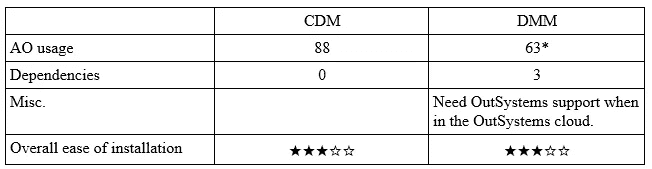

*所有 3 个依赖项都使用 0 AO。

CDM 和 DMM 在安装各自的应用程序时都有自己的障碍要克服。虽然 CDM 有大量的站点属性需要设置，但是 DMM 有一些额外的数据库配置要求。

# 可配置性

本主题包括在进行首次导出之前需要完成的大量配置，以及在应用程序本身中使用这些设置的方便性。

## 连续地层（倾角仪）

CDM 有一些设置需要在你安装的每个平台上进行配置。可以在应用程序的单个选项卡中轻松找到和定义设置，如屏幕截图所示。

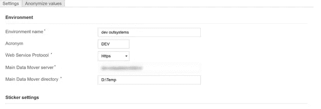

所有的设置在手册中都有明确的定义，也可以在前面提到的下载页面找到。

在另一个选项卡上，您可以定义要导出或导入的数据。

首先，定义包的名称和描述。这种描述便于以后识别包。然后，您可以选择该软件包能够执行的操作，例如导入、导出和删除。
请注意，可以通过在相应环境中使用站点属性来定义应禁用的某些操作。

定义包可以执行的操作后，您可以配置包的导出目标和/或导入来源。一旦你点击了 save，你就可以定义包应该包含哪些模块中的哪些实体。

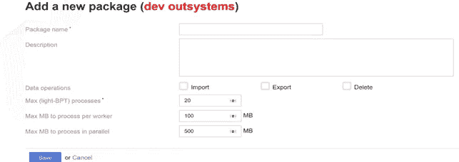

当您选择被其他实体引用的实体时，CDM 会自动通知您，并提示用户操作。所以你可以决定如何处理这件事。例如，在导出中包含实体或忽略它们。

这里一个重要的可选步骤是选择匹配属性，这样可以识别唯一的记录，并防止目标数据库中的重复记录。

例如，考虑以下情况:

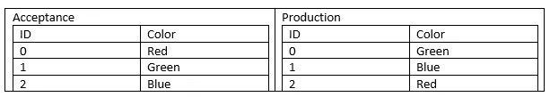

当您将数据从验收转移到生产，并且正确定义了查找属性时，它不会覆盖生产中的现有订单。这将确保所有引用保持一致，用户将看到与以前相同的内容。

从该菜单中，您还可以选择应该匿名的字段及其类型。例如:名、姓、全名、日期等。

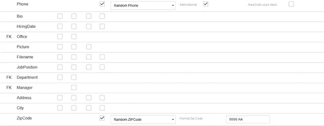

After defining this you are ready to export the selected package to the selected directory.

## DMM

The steps for configuring DMM are relatively similar to those in CDM. The configuration can be done via the top menu and navigating to a single tab.
In there you need to define the database connections you want to use. DMM has an advantage in this section that can be connected to the databases of multiple environments directly. Negating the need of having the application in the various environments. If you want to make use of this, you will of course need to make sure that the environment where the application is running can contact the other database. As stated in the ease of installation part.

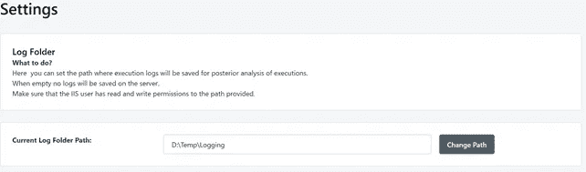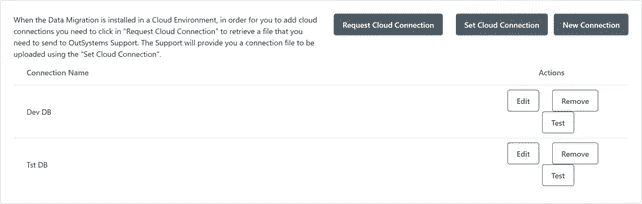

As stated in the screenshots, in case you are running on the Outsystems cloud, you need to contact OutSystems support before being able to connect to the databases. And this needs to be done before using the application.

After defining the database connections, it is time to select the data you want to move. It can be done in an easy flow.
You define the source and destination database you want to use for the move. Then select from which applications you want to move the entities.
Followed by the relevant eSpace(‘s) and then finally which entity(ies) of that eSpace. If there are any dependencies for an entity you have selected, DMM will automatically add it to the migration plan. Before the move is finalized you can define if the attributes of the selected entities need to be anonymized or skipped in the move.

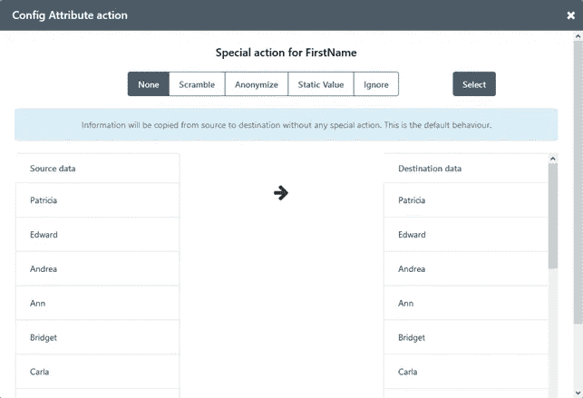

Of course you can save the created plan for another time so you can repeat the moves between different environments.

## Conclusion

Both applications have some settings to configure within the application itself before performing the moves. These steps are done relatively fast and easily and are well documented by both applications. For DMM it is necessary to have database access. Because of this it is necessary to contact OutSystems support for the environments in OutSystems cloud.

Selecting entities and creating packages, which enables repeating moves between environments, is straightforward for both applications.

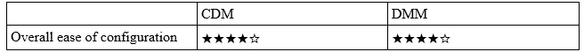

# Performance

In this category, we look at the speed of moving the dataset between two environments, with and without anonymization. We also checked the average time it takes over three runs. Using the “reset data” option in the OutSystems Sample Database. And re-uploading the prepared standard data set.

For the anonymization we choose to anonymize/scramble 3 fields: FirstName, LastName and Email.

## CDM

CDM 采用两步走的方法。首先，您必须从一个环境导出到环境的另一个阶段，例如要测试的开发。或者必须手动下载数据并将其上传到环境的下一阶段。然后在下一阶段导入数据。可以导出一组数据，并在各种环境中多次导入。事实上，它相当于数据在某个时间点的备份/快照，您可以通过再次导入数据来恢复到该时间点。

因为匿名化设置是在包级别应用的。有可能用相关设置可靠地重复所有导出和导入。
准备好要导出的包后，很容易开始导出到定义的平台服务器。

CDM 要求你手动执行导出和导入。在这个测试中，我们用每个导出/导入周期的时间来保持一致的测量。

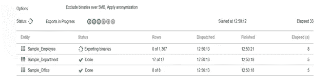

## DMM 品牌

开始迁移非常简单；选择要从中导出的环境、导入目标/位置以及要从模块中移动的实体。
或者加载配置文件。只需按下按钮即可开始迁移。

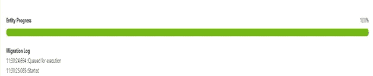

## 结论

在 1367 条记录上运行测试，两个工具都表现良好。假设传输速度随着更大的数据集而变化是合理的。但是，很难收集实际的性能数据，因为传输速度取决于多种因素，如网络速度、CPU 利用率等。
另一个因素是 CDM 使用(轻量级)BPT，通过并行执行几个传输来加速较大数据集的传输。使用较小的数据集，如我们所做的，没有利用这种能力。

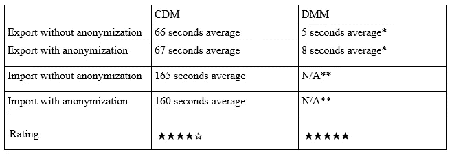

*表示将实体从一个数据库导出到另一个数据库所需的时间。

**这表示将导出加载到数据库所需的时间。DMM 在导出阶段处理这个问题。

# 报告

对您的所有移动和数据操作进行良好的审计跟踪总是有用的，可以清楚地了解发生了什么以及不同操作的速度。
如果在移动过程中出现错误或意外情况，适当的报告也很有用。

## 连续地层（倾角仪）

默认情况下，CDM 记录导入所需的平均时间，以及所选实体的记录数量。

如果您想要启用更多日志信息，您可以在“运行日志”选项卡中切换详细级别。默认情况下，此选项为“无”,但可以增加为:进度、故障排除、完整。
通过将日志记录级别提高到进度级别，可以获得关于每个步骤和相关时间戳的详细信息。
也可以将报告导出到 excel。如果你想保存它们或者对它们进行一些分析，这是很有用的。但是您需要检查自动清理日志文件的切换是如何设置的，如果启用，您将无法导出文件。

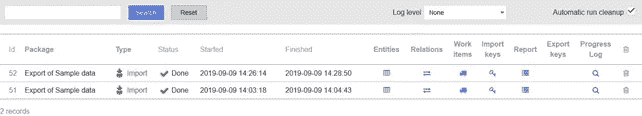

## DMM 品牌

默认情况下，DMM 会记录数据的所有导出、迁移和加扰操作。它们可以从“管理”→“执行历史”
选项卡下载和删除。记录没有不同的配置可能性。

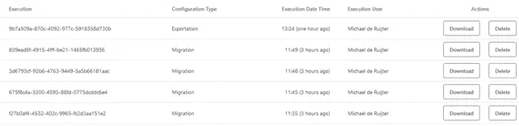

## 结论

这两个工具都有可能查看和导出已执行的移动、扰码等的日志。无论成功与否。以及所发生的活动的一些细节。但是，与 DMM 相比，CDM 在日志记录的数量和日志的详细程度方面提供了更多的选项。

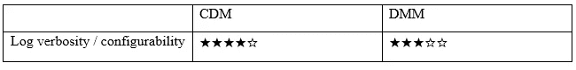

# 摘要

我们要感谢 [Coolprofs](https://www.coolprofs.com) 和[infosystema](https://www.infosistema.com)为我们提供了评估他们应用的许可，以及他们在测试期间的支持。

这两个应用程序都可以做他们宣传的事情。虽然它们都有一个学习曲线，但大量的文档使任何人都可以轻松地开始使用这些应用程序。

最大的区别在于动作本身和学习曲线，这是决定哪种工具最适合你的一个重要因素。每个工具如何处理数据一致性。
CDM 非常重视这方面。这是在数据包配置部分通过定义匹配属性来完成的。如可配置性部分所述。

Coolprofs 有一个单独的应用程序，包括测试数据。如果您想探索该应用程序，而又不想冒现有应用程序中“真实”数据的风险，您可以尝试一下。

从用户的角度来看，DMM 的学习曲线不太陡。然而，这应该被视为一个小问题，因为这种应用程序的访问权限将被限制在开发人员或管理员。以防止意外或恶意的移动。

工具的选择很大程度上取决于您想要运行它的环境。例如，如果您计划在内部或 AWS/Azure 环境中使用它，那么 DMM 的管理开销可能是一个不利因素。

另一方面，如果你主要关心的是 AO 的使用，CDM 有一个缺点；您需要将它安装在基础设施中的不同点上。当然，如果您需要将数据移入/移出生产环境，这主要是一个问题，因为您可能会受到 AO 限制的约束。

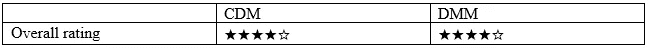

# 刊后语

选择应用程序取决于您的环境类型(内部环境、云环境或混合环境)，以及您认为最重要的因素，如速度、AO 使用情况、数据一致性等。没有放之四海而皆准的解决方案。点击这里查看伪造的申请页面，探索各种可能性: [CDM](https://www.outsystems.com/forge/component-overview/5872/cool-data-mover) 和 [DMM](https://www.outsystems.com/forge/component-overview/2812/infosistema-dmm) 。玩得开心。