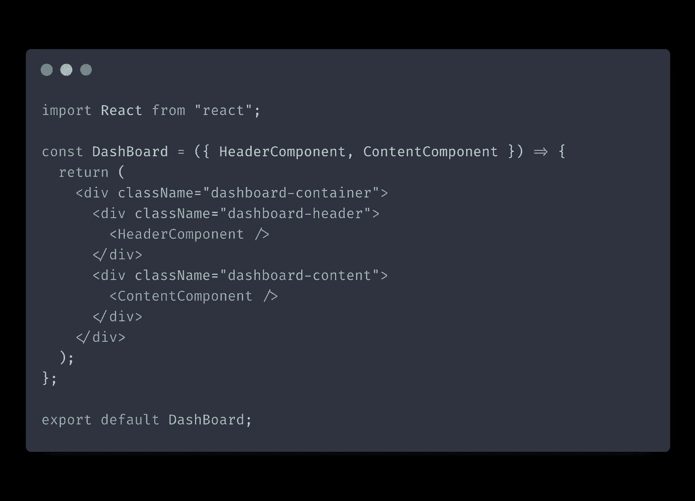

# 组件构成:成为一个固态 React 开发人员的基本技能

> 原文：<https://itnext.io/component-composition-fundamental-skill-to-become-a-solid-react-developer-3c8deb855388?source=collection_archive---------2----------------------->

组件组合是 React 中的基本概念，是学习成为一名可靠的 React 开发人员的基础。较新的 React 开发人员倾向于使用继承和上下文来解决问题，而这些问题通常可以使用组合来更好地解决。

让我们回顾一下 React 中合成背后的基本原理，重温一下我们的基础知识。

# 组件构成概述

简单地说，组件组合意味着在简单组件的基础上构建更复杂的组件。有两种方法可以解决这个问题:

*   专业组件
*   容器组件

让我们更详细地讨论这两种方法。

## 专业组件

专门化组件是通用组件的更加固执己见的版本。换句话说，专门化组件通常是我们为特定用例定制的通用组件的不可重用版本。

我们通过渲染通用组件并配置道具来匹配我们的特定用例，从而创建专用组件。

让我们看一个例子，在这个例子中，我们使用一个通用的表单组件来创建我们的新闻稿注册表单。
我们将从通用形式开始:

`Form`是一个通用组件，用于在整个应用程序中构建不同的表单。它是多用途的，允许您配置表单、标题和提交按钮的输入。

现在，我们将在我们的`Form`之上创建专门的`NewsletterForm`组件:

识别你在应用程序中经常使用的模式，并把它们转换成通用的可重用组件，这是一项需要开发的重要技能。

一旦您有了一组可靠的通用组件，在它们的基础上创建专用组件就容易得多，也快得多。这就是为什么在你的新项目中包含一个 UI 组件库总是一个好主意。

## 容器组件

容器组件在事先不知道其子组件的情况下提供某些功能。这种组件通常有一个`children`属性，允许您传递任意内容。侧栏或对话框是容器组件的好例子。

容器组件是一种灵活且通用的模式。我在应用程序中经常使用的一个例子是 gate 组件，它在呈现其子组件之前检查用户的身份验证状态。这里是我的帖子，更详细地介绍了如何创建这样一个门控组件。

现在，让我们来看看这个模式的作用，并创建一个简单版本的门控组件:

## 具有多个子道具的容器

在某些情况下，您可能需要具有多个位置的容器组件来注入您的自定义内容。

一个例子是一个假设的接受标题和内容组件的`Dashboard`组件。

当你需要构建一个有多个“洞”的容器时，你可以脱离使用`children`道具的模式，为你注入的内容添加自定义道具。

# 为什么作文很重要

到目前为止，您应该看到组件组合在使用 React 时非常有用。不过，让我们列出使用组件组合的主要优势:

*   当在通用组件的基础上构建组件时，感觉像黑盒一样的组件会更少。反过来，这将提高代码的透明度，并使其更具可读性。
*   使用智能组件组合，您通常可以避免没有上下文或冗余的钻取。更多的时候，当你认为你需要上下文来传递道具时，你需要重新考虑你的组件构成。
*   随着时间的推移，您将构建一个组件工具箱，这将提高您的开发速度。创建新组件将变得更快。

# 结论

在这篇文章中，我们讨论了组件组合——成为一名可靠的 React 开发人员的基本技能。

虽然组件组合很强大，但你也可以做得太过分，过度设计你的应用程序。不是每个简单的组件都需要通用和可重用。

一个好的经验法则是:复制粘贴组件代码两次是没问题的，但是在第三次，你应该把它抽象成可重用的代码。

*原载于 2021 年 9 月 13 日【https://isamatov.com】**。***