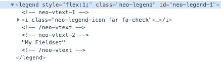
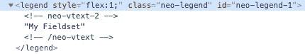
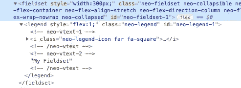
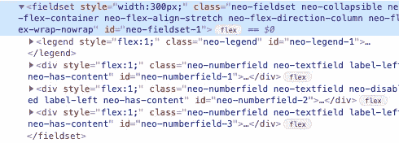
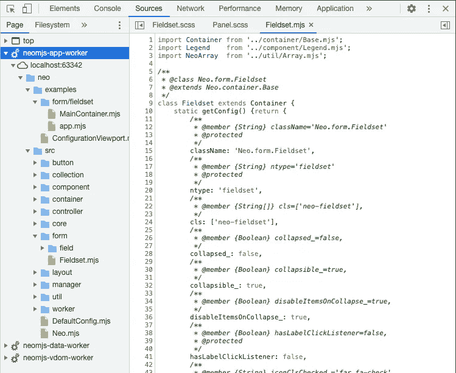
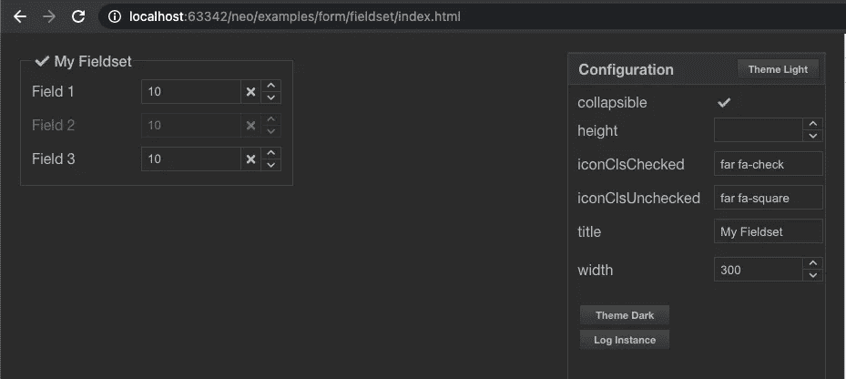

# 组件开发:如何在 neo.mjs 中创建可折叠字段集

> 原文：<https://itnext.io/component-development-how-to-create-a-collapsible-fieldset-in-neo-mjs-311bf465d829?source=collection_archive---------5----------------------->

我被要求创建更多的内容，以帮助新开发人员跟上速度。总的来说，有两个主题最有意义:

1.  如何创建自己的组件
2.  如何创建应用程序(以及架构指南)

我认为这个指南是一个很好的组合:它既不太高级(我们谈论的只是 240 行代码)，也不琐碎(即使是 Javascript 专业人士也很可能学到一些新东西)。

遵循“应用程序工作人员是主要参与者”的概念，字段集实例将存在于应用程序 web 工作人员范围内。

# 内容

1.  要求
2.  演示视频
3.  选择正确的基类
4.  创建示例应用程序
5.  创建图例组件类
6.  将图例添加到我们的字段集中
7.  调整折叠状态
8.  主题
9.  在线演示
10.  最后的想法

# 1.要求

*   字段集可以包含任意数量和任意种类的子组件。
*   它可以选择性地折叠(包括在运行时更改此设置)。
*   我们可以动态地展开和折叠它。
*   折叠的项目会从 DOM 中移除。
*   可以选择禁用折叠的项目。
*   我们不希望在折叠时破坏项目实例(以避免内存泄漏)。
*   我们希望能够修改子项的状态，即使字段集是折叠的。
*   我们想使用不同的主题(造型)。

# 2.演示视频

我制作了一个 44s 视频，让大家更清楚地了解我们将要谈论的内容:

# 3.选择正确的基类

OOP 的一个美妙之处在于我们可以选择一个最有意义的基类。它不一定是组件，最低层是[核心。Base](https://github.com/neomjs/neo/blob/dev/src/core/Base.mjs) (例如，如果您想要创建路由器或选择模型)。

对于我们的字段集，选择很简单:我们希望包含子项并能够使用不同的布局，所以我们选择[容器。基地](https://github.com/neomjs/neo/blob/dev/src/container/Base.mjs)。

我们的第一个版本是这样的:(src/form/Fieldset.mjs)

有趣的事实:这个版本已经可以使用了，但是当然还没有覆盖所有的需求。

首先，我们将[导入](https://developer.mozilla.org/en-US/docs/Web/JavaScript/Reference/Statements/import)我们的基类。

neo.mjs 使用三种不同的环境:

1.  开发(直接在浏览器中运行)
2.  分销/开发(基于 webpack 的构建。这就是你在 Angular 或 React 中所说的 dev 模式)
3.  分销/生产(基于 webpack 的构建，缩小，无源地图)

由于 dev 模式在浏览器中运行时没有任何构建或编译，请确保为您的导入添加文件扩展名。

我们将我们的配置放入`static getConfig()`方法中，这样可以发挥类配置系统的优势。在导出我们的类之前，我们需要调用`Neo.applyClassConfig()`来确保我们的配置以一种智能的方式被分配给类原型。

使用`className`是强制性的。这个配置的值将被分配给一个名称空间，所以您可以使用`Neo.form.Fieldset`来访问这个类。

`ntype`配置是可选的。默认情况下，它将用于创建实例 id。如`neo-fieldset-1`。这个 id 是 JS 实例 id，也是虚拟 DOM 根节点的 DOM id。

我们正在添加一个`cls`配置，因为我们想使用主题引擎来应用样式。

对于容器，虚拟 dom 配置是:

```
_vdom: {tag: 'div', cn: []}
```

我们改为使用一个`fieldset`标签。

# 4.创建示例应用程序

早在这一点上，我强烈建议接下来创建一个示例 app。

这样做在开发新特性时很有帮助:您可以立即看到变化，这有助于测试。

如果您在 neo.mjs 存储库中工作，您可以复制现有的 examples 文件夹，或者使用 [package.json](https://github.com/neomjs/neo/blob/dev/package.json#L15) 中的`create-app`脚本。

示例 [MainContainer.mjs](https://github.com/neomjs/neo/blob/dev/examples/form/fieldset/MainContainer.mjs) 代码:

这是视频中显示的(最终)演示。它已经为我们接下来要添加的功能提供了控件。

# 5.创建图例组件类

我们的 Fieldset 类可以选择使用一个 [legend](https://developer.mozilla.org/en-US/docs/Web/HTML/Element/legend) 标签。虽然我们可以将逻辑添加到我们的 Fieldset 类本身，但是将这个逻辑分离到一个自己的文件中感觉更干净。

我们可以从这个小小的文件中学到很多东西。

它有三个带有尾随下划线的配置:`iconCls_`、`text_`和`useIcon_`。可选地使用下划线使我们能够使用以下方法(图标 Cls 的示例):

1.  `beforeGetIconCls(value)` //修改 getter
2.  `beforeSetIconCls(value)` //预处理
3.  `afterSetIconCls(value, oldValue)` //后期处理

我们使用 afterSet()方法将配置更改映射到虚拟 dom 中。看这一条，你很可能会问:`vtype: 'text'`是什么？



我们可以将图例文本包装到自己的标签中(例如 span)。如果我们不想使用标签，但是仍然能够动态地改变内容，那么伪标签是有意义的。

查看`afterSetUseIcon()`,您会注意到我们在 vdom 项目上使用了一个`removeDom`属性。这是我最喜欢的和 neo.mjs 虚拟 dom 提供的最强大的标志之一。我们可以在运行时更改它的值，因此，标记的节点会从实际的 DOM 中删除，但 vdom 树结构保持同步。

将`useIcon`设置为假会导致:



# 6.将图例添加到我们的字段集中

我们在类中添加了更多的配置和方法:

方法`afterSetCollapsible()`将添加一个图例点击监听器，以防值为真。

其他新组态的改变将调用`updateLegend()`减少锅炉板块代码。这个方法值得仔细研究。

如果我们的`Fieldset`既没有使用`iconCls`也没有使用`text`配置，我们不希望在 DOM 中有 legend 标签。如果一个图例实例已经存在，我们将再次使用`removeDom`标志。

如果我们确实使用了一个`iconCls`和/或`text`配置，我们将检查我们是否已经创建了一个 legend Javascript 实例。我们只想创建它一次，并在动态变化中重用它。

如果我们还没有实例，我们通过使用容器基类方法`insert()`来创建它。`legendConfig`使我们能够为特定的用例定制类。您甚至可以这样扩展 legend 类并覆盖`module`配置。

如果有一个 legend 实例，我们将使用`setSilent()`一次更新多个类配置，而根本不会触发虚拟 dom 引擎。这发生在最后一行:`me.vdom = vdom;`这不是赋值，而是触发一个 setter。

如果您想一次调整多个类配置，您也可以使用`set()`，在所有配置更改映射到 vdom 配置后，它将触发 vdom 引擎一次。

# 7.调整折叠状态

剩下的最后一项是添加一个`collapsed`配置和后处理逻辑:

我们首先添加或删除一个`neo-collapsed` CSS 规则，这对样式很重要。

下一步是遍历所有顶级字段集子项，并再次使用`removeDom` vdom 标志。这在运行时动态改变`collapsed`配置时非常强大。



将它设置为 false 将从真实的 DOM 中删除项目，使其尽可能少。我们仍然可以编辑子条目状态，因为 JS 条目实例是持久的。

一旦我们再次扩展我们的字段集，我们**不**需要重新创建任何 JS 实例，所以没有内存泄漏。



最后一步是执行`disableItemsOnCollapse`配置。如果要将字段集添加到表单中，并且它确实包含表单字段，您可能不希望在字段集中提交这些字段的值，以防字段集被折叠。选择性地禁用这些项目可以达到这个目的。

但是，我们还需要支持一些项，当字段集扩展时，这些项已经被禁用了。我们不想在再次扩展字段集时删除它们的禁用状态。

为了解决这个问题，我添加了一个包含顶级项目禁用状态的地图。

可以在这里找到 Fieldset 实现的最终版本:
[dev/src/form/Fieldset . mjs](https://github.com/neomjs/neo/blob/dev/src/form/Fieldset.mjs)。

# 8.主题

正如你在视频中看到的，我们支持不同的深色和浅色主题。

做到这一点相当容易。

resources/scss/src/form/field set . scss:

resources/scss/theme-dark/form/fieldset . scss:

resources/scss/theme-light/form/field set . scss:

我们可以选择是否使用 CSS 变量来构建我们的主题。

# 9.在线演示

演示针对桌面进行了优化。

[neo.mjs/dist/production/examples/form/fieldset/index.html](https://neomjs.github.io/pages/node_modules/neo.mjs/dist/production/examples/form/fieldset/index.html)

[neo.mjs/dist/development/examples/form/fieldset/index.html](https://neomjs.github.io/pages/node_modules/neo.mjs/dist/development/examples/form/fieldset/index.html)

仅限 Chromium 和 Safari 技术预览版:

[neo.mjs/examples/form/fieldset/index.html](https://neomjs.github.io/pages/node_modules/neo.mjs/examples/form/fieldset/index.html)

检查控制台→来源:



正如承诺的那样，字段集和演示应用程序存在于应用程序工作器中。

# 10.最后的想法

如果你错过了，neo.mjs 项目获得了提名:

[](/neo-mjs-nominated-for-the-most-exciting-use-of-technology-cd5983debc7b) [## neo.mjs 获得“最令人兴奋的技术应用”提名

### JavaScript 开源奖励计划 2021 内幕。

itnext.io](/neo-mjs-nominated-for-the-most-exciting-use-of-technology-cd5983debc7b) 

您可以在以下位置找到存储库:

[](https://github.com/neomjs/neo) [## 近地天体

### neo.mjs 使您能够使用一个以上的 CPU 创建可扩展的高性能应用程序。不需要照顾一个…

github.com](https://github.com/neomjs/neo) 

我希望这个指南能帮助你快速创建你自己的组件。

非常感谢您的反馈，尤其是关于难度的反馈。这个指南对你来说是太容易了，还是太有挑战性了？

周一(2021 年 5 月 31 日)我被邀请进入(德语)[工作草案播客](https://workingdraft.de/)。在谈论 neo 概念和工人架构时，[彼得](https://twitter.com/sir_pepe)和[罗德尼](https://twitter.com/rodneyrehm)有一个想法，我们可以如何改善应用&数据工人通信，而不需要通过主线程传递后期消息。

我已经在 v2.2.6 版本中实现了这个。

如果这是一个感兴趣的话题，我可以写一篇简短的博客来介绍这是如何工作的:

[](https://github.com/neomjs/neo/issues/2224) [## 工人之间直接通信(不需要通过主线程传递消息)…

### 此时您不能执行该操作。您已使用另一个标签页或窗口登录。您已在另一个选项卡中注销，或者…

github.com](https://github.com/neomjs/neo/issues/2224) 

10+评论我就做，听起来公平吗？

如果你需要帮助来提高速度，加入 Slack 频道是值得的:

[](https://join.slack.com/t/neomjs/shared_invite/zt-6c50ueeu-3E1~M4T9xkNnb~M_prEEOA) [## 在 Slack 上加入 neo.mjs

### Slack 是一种与团队沟通的新方式。它比电子邮件更快、更有条理、更安全。

join.slack.com](https://join.slack.com/t/neomjs/shared_invite/zt-6c50ueeu-3E1~M4T9xkNnb~M_prEEOA) 

总的来说，如果有更多的贡献者能够帮助编写“初学者”指南或开发新的组件，将会有很大的帮助。

这可以让我有时间关注“困难”的部分，比如框架核心。

对于 2.3 版本，我的计划是专注于完成[日历](https://github.com/neomjs/neo/tree/dev/src/calendar)组件。

最诚挚的问候&快乐编码，
托比亚斯

预览图像:

