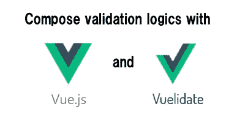
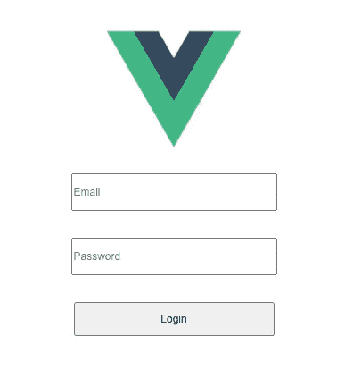
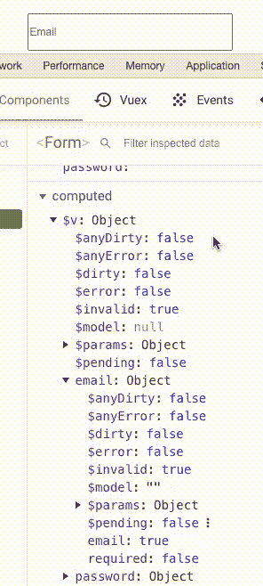
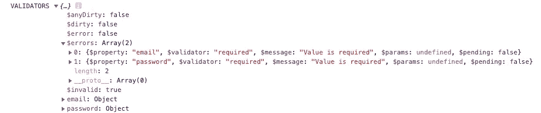

# 用 Vue 3.0 和 Vuelidate 编写验证逻辑。

> 原文：<https://itnext.io/compose-validation-logics-with-vue-3-0-and-vuelidate-20416d734295?source=collection_archive---------0----------------------->



表单验证是许多前端工程师面临的最复杂的问题之一。虽然实现起来不是超级难，但是组织验证逻辑很难。

有了 Vue，你有两个主要的选择，**基于模板的验证**和 [vee-validate](https://github.com/logaretm/vee-validate) 或者**基于模型的验证**和 [vuelidate](https://github.com/vuelidate/vuelidate) 。这两个都是很棒的图书馆。vee-validate 非常简单，可以快速解决问题。vuelidate 有更多的灵活性。

另一方面，感谢 Vue 核心团队成员，Vue 3.0 正在发布。Vue 3.0 的一个突破性变化是组合 api。它使我们能够编写更有组织性和可组合性的代码。

然后 vuelidate 还会推出一个新的 api，带有 Vue 3.0 composition api。因为它非常灵活，使开发人员能够编写超级有组织的代码，本文解释说

*   Vue 2.x 兼容 vuelidate 和 Vue 3.0 之间的实现差异
*   如何用组合 api 和 vuelidate 组织验证逻辑

# Vue 2.x 验证概述

在介绍下一代 vuelidate 之前，让我向您展示一下它在 Vue 2.x 上的样子。我准备了一个简单的登录表单，如下所示。

```
<template>
  <div>
    <input type="email" placeholder="Email" v-model="email" />
    <input type="password" placeholder="Password" v-model="password" />
    <button type="submit">Login</button>
  </div>
</template>
```



简单登录表单

要用 vuelidate 实现验证逻辑，您需要做 3 件事。

1.  实现验证逻辑
2.  控制何时验证
3.  如果需要，显示错误

## 实现验证逻辑

验证逻辑看起来非常简单，如下所示。`validations`部分用于实现如何验证每个数据。

```
<script>
import { required, email, minLength } from "vuelidate/lib/validators";export default {
  data() {
    return {
      email: "",
      password: "",
    }
  },
  validations: {
    email: { required, email },
    password: { required, minLength: minLength(8) }
  }
};
</script>
```

如果你像上面那样设置，你可以用 vue devtool 检查验证状态。`$v` computed 属性显示每个验证状态。在键入任何值之前，`$v.email.$invalid`为真，因为电子邮件要求验证失败。在输入某些内容时，`$v.email.required`变为 false，`$v.email.email`也变为 false。在输入格式化的邮件后，`$v.email.email`和`$v.email.$invalid`变为真。



验证状态更改

## 控制何时验证

要控制验证时间，您必须知道`$error`和`$dirty`属性。`$error`属性是`$dirty`和`$invalid`的逻辑组合。

`$invalid`纯粹具有验证状态。如上所述，在用户做某件事之前，`$invalid`为真。但是只有`$invalid`，在用户做一些事情之前，验证状态是失败的。为了处理这个问题，`$dirty`属性存在了。`$dirty`属性检查用户是否触摸了目标输入字段。如果用户输入内容，您必须将`$dirty`改为 true。

好了，想想什么时候验证就够了。在这个例子中，这两个计时可能是好的。

*   每个输入字段验证应该在`@blur`触发
*   在提交表单之前。如果有任何错误，最好禁用登录按钮

要实现模糊计时验证，您可以像下面这样将`$touch()`添加到`@blur`。`$touch`功能改变`$dirty`为真。所以`$dirty`和`$invalid`属性都准备好了。

```
// To fire validation in each blur <input
    type="email"
    placeholder="Email"
    v-model="email"
    @blur="$v.email.$touch()"
  /> ... <input
    type="password"
    placeholder="Password"
    v-model="password"
    @blur="$v.password.$touch()"
  />
```

要禁用提交按钮，您可以通过`$v.$invalid`。它检查所有验证密钥的`$invalid`。那么`div`标签必须是`form`标签并添加调用一个提交函数。在提交函数内部，先调用`$touch()`。它触发所有验证并检查是否有任何错误。

```
// To disable submit button disabled<button :disabled="$v.$invalid" type="submit">Login</button>// To validate before submission<template>
  <form @submit.prevent="login" >
    ...
  </form>
</template><script>... methods: {
    login() {
      this.$v.$touch();
      if (this.$v.$invalid) {
        // DO SOMETHING HERE
      }
    }
  }
...
```

因此，现在您可以控制何时进行验证。

## 如果需要，显示错误

因此，如果需要的话，让我们向用户显示错误。如果你想显示错误，你可以像下面这样实现。您需要检查目标值是否有`$error`并显示每个验证的错误消息。

```
<template>
  <form @submit.prevent="login">
    <input
      type="email"
      placeholder="Email"
      v-model="email"
      @blur="$v.email.$touch()"
    />
    <div v-if="$v.email.$error">
      <p v-if="!$v.email.email">Please enter a valid email</p>
      <p v-if="!$v.email.required">Please enter an email</p>
    </div> <input
      type="password"
      placeholder="Password"
      v-model="password"
      @blur="$v.password.$touch()"
    />
    <div v-if="$v.password.$error">
      <p v-if="!$v.password.minLength">
       Password must be more than {{ passwordMinLength }} characters
      </p>
      <p v-if="!$v.password.required">Please enter an password</p>
    </div>

    <button :disabled="$v.$invalid" type="submit">Login</button>
  </form>
</template>
```

使用 Vue 2.x 兼容的 vuelidate，您需要创建自己的验证消息。

到目前为止，所有验证都已实现。让我向你展示所有代码的样子。

```
<template>
  <form @submit.prevent="login">
    <input
      type="email"
      placeholder="Email"
      v-model="email"
      @blur="$v.email.$touch()"
    />
    <div v-if="$v.email.$error">
      <p v-if="!$v.email.email">Please enter a valid email</p>
      <p v-if="!$v.email.required">Please enter an email</p>
    </div> <input
      type="password"
      placeholder="Password"
      v-model="password"
      @blur="$v.password.touch()"
    />
    <div v-if="$v.password.$error">
      <p v-if="!$v.password.minLength">
       Password must be more than {{ passwordMinLength }} characters
      </p>
      <p v-if="!$v.password.required">Please enter an password</p>
    </div>

    <button :disabled="$v.$invalid" type="submit">Login</button>
  </div>
</template><script>
import { required, email, minLength } from "vuelidate/lib/validators";export default {
  data() {
    return {
      email: "",
      password: "",
    }
  },
  validations: {
    email: { required, email },
    password: { required, minLength: minLength(8) }
  },
  methods: {
    login() {
      this.$v.$touch();
      if (this.$v.$invalid) {
        // DO SOMETHING HERE
      }
    }
  }
};
</script>
```

如你所知，即使这个超级简单的登录表单也有很多代码。所以如果你有更多的领域和更多的其他逻辑，它很容易变得更乱。当我第一次看到这个实现时，我认为模板中的`validations`部分和错误消息可以被提取出来或者很简单。

# 使用 vuelidate 进行 Vue 3.0 验证

Vue 3.0 组合 api 让我们能够超级轻松地组合和组织逻辑。想了解 composition api，就看 [Vue 精通课程](https://www.vuemastery.com/courses/vue-3-essentials/why-the-composition-api)。

所以让我们用 Vue 3.0 composition api 和 vuelidate 实现相同的登录表单。首先，我们用 composition api 创建 vue 项目。`vue-cli`是最简单的方法。组合 api 提供了`@vue/composition-api`。

※如果 Vue 3.0 发布了，可以直接使用 vue-cli，安装 Vue 3.0。

```
$ yarn global add @vue/cli  // If you don't have it$ vue create vuelidate-with-vue-composition-api
$ cd vuelidate-with-vue-composition-api$ yarn add [@vue/composition-api](http://twitter.com/vue/composition-api)
```

改变`src/components/HelloWorld.vue`如下图。

```
// Form.vue<template>
  <div>
    <input type="text" v-model="email">
    <input type="password" v-model="password">
    <button type="submit">Login</button>
  </div>
</template><script>
import { reactive, toRefs } from "@vue/composition-api";export default {
  name: "Form",
  setup(){
    const state = reactive({
      email: "",
      password: ""
    }); return {
      ...toRefs(state)
    };
  }
};
</script>// STYLE CAN BE ANYTHING
<style scoped>
div,form {
  display: flex;
  flex-direction: column;
  justify-content: center;
}
input, button {
  width: 300px;
  height: 50px;
  font-size: 1rem;
  margin: 20px auto 0px;
}
p {
  margin: 5px 60px 0 0;
}
</style>
```

而`App.vue`一定是下面这个样子。

```
// Replace HelloWorld component with Form component
<template>
  <div id="app">
    
    <Form />
  </div>
</template><script>
import Form from "./components/Form.vue";export default {
  name: "App",
  components: {
    Form
  }
};
</script>
```

所以还是加上 vuelidate 吧。其实从 Vue 3.0 兼容版本开始，vuelidate 就被分成了两个包，`@vuelidate/core`和`@vuelidate/validators`。像`required`和`minLength`这样的验证逻辑是分离的。而且因为 vuelidate 还是 beta 版，它需要`@vue/composition-api`作为依赖，也许在不久的将来它会消失。

```
$ yarn add @vuelidate/core @vuelidate/validators
```

您应该首先设置 vuelidate 和 composition api。

```
// main.js
import Vue from 'vue';
import VueCompositionApi from '@vue/composition-api';
import { VuelidatePlugin } from '@vuelidate/core';
import App from './App.vue';Vue.config.productionTip = false;Vue.use(VueCompositionApi);
Vue.use(VuelidatePlugin);new Vue({
  render: h => h(App),
}).$mount("#app");
```

所有设置都已完成！让我们像我上面做的那样实现一个表单验证。

## 实现验证逻辑

新的 vuelidate 是使用 Vue 3.0 组合 api 实现的。看起来像下面。一点是你现在不能用`reactive`。这就变成了 T21 的问题。

```
// Form.vue<script>
import { ref } from "@vue/composition-api";
import useVuelidate from "@vuelidate/core";
import { required, email, minLength } from "@vuelidate/validators";export default {
  name: "Form",
  setup(){
    const userEmail = ref("");
    const userPassword = ref(""); // Validation Logics
    const rules = {
      userEmail: { required, email },
      userPassword: { required, minLength: minLength(8) }
    };
    const $v = useVuelidate(
      rules,
      { userEmail, userPassword }
    ); return {
      userEmail,
      userPassword,
      $v
    };
  }
};
</script>
```

实际上，当你只看到验证逻辑时，它与 Vue 2.x `validations`部分非常相似。另一方面，`$v`与 Vue 2.0 兼容的 vuelidate 有些不同。



兼容 Vue 3.0 的$v

正如你在上面看到的，全新的`$errors`属性出现了。因为它存储默认的错误信息，所以您不必编写自己的错误信息。

## 控制何时验证

让我们实现输入字段模糊和提交时间验证。

可惜因为原生`$touch`函数没有发布，所以必须自己把`$dirty`改成 true。在`handleBlur`和`login`函数中实现。希望它能在不久的将来发布。

```
<template>
  <form @submit.prevent="login">
    <input
      type="text"
      v-model="userEmail"
      @blur="handleBlur('userEmail')"
    >
    ...
    <input
      type="password"
      v-model="userPassword"
      @blur="handleBlur('userPassword')"
    >
    <button :disabled="$v.$invalid" type="submit">Login</button>
  </form>
</template><script>... setup(){

    ...

    const handleBlur = (key) =>{
      $v[key].$dirty = true;
    }; const login = () => {
      $v.$dirty = true;
      if (!$v.$error) {
        // DO SOMETHING HERE
      }
    }; return {
      userEmail,
      userPassword,
      $v,
      handleBlur
    };
  }
};
</script>
```

## 如果需要，显示错误

正如我上面提到的，Vue 3.0 兼容的 vuelidate 有`$errors`存储默认的错误信息。再配合`v-for`使用吧。

```
<template>
  <form @submit.prevent="login">
    <input
      type="text"
      v-model="userEmail"
      @blur="handleBlur('userEmail')"
    >
    <div v-if="$v.userEmail.$error">
      <p v-for="$error in $v.userEmail.$errors" :key="$error.$property">
        {{ $error.$message }}
      </p>
    </div> <input
      type="password"
      v-model="userPassword"
      @blur="handleBlur('userPassword')"
    >
    <div v-if="$v.userPassword.$error">
      <p v-for="$error in $v.userPassword.$errors" :key="$error.$property">
        {{ $error.$message }}
      </p>
    </div>
    <button :disabled="$v.$invalid" type="submit">Login</button>
  </form>
</template>
```

如您所见，错误消息部分可以分成不同的部分，如下所示。

```
// ErrorMessage.vue<template>
  <div v-if="validationStatus.$error">
    <p v-for="$error in validationStatus.$errors" :key="$error.$property">
      {{ $error.$message }}
    </p>
  </div>
</template><script>
export default {
  name: "ErrorMessage",
  props: {
    validationStatus: {
      type: Object,
      required: true
    },
  }
};
</script>
// ADD STYLE IF YOU WANT
```

创建`ErrorMessage`组件后，你的模板变得非常干净。模板中的错误消息部分被提取🎉

```
// Form.vue
<template>
  <form @submit.prevent="login">
    <input type="text" v-model="userEmail" @blur="handleBlur('userEmail')">
    <ErrorMessage :validationStatus="$v.userEmail" /> <input type="password" v-model="userPassword" @blur="handleBlur('userPassword')">
    <ErrorMessage :validationStatus="$v.userPassword" />

    <button :disabled="$v.$invalid" type="submit">Login</button>
  </form>
</template>
```

所有验证逻辑都已实现。让我给你看完整的代码。

```
// Form.vue
<template>
  <form @submit.prevent="login">
    <input type="text" v-model="userEmail" @blur="handleBlur('userEmail')">
    <ErrorMessage :validationStatus="$v.userEmail" /><input type="password" v-model="userPassword" @blur="handleBlur('userPassword')">
    <ErrorMessage :validationStatus="$v.userPassword" />

    <button :disabled="$v.$invalid" type="submit">Login</button>
  </form>
</template><script>
import { ref } from "@vue/composition-api";
import useVuelidate from "@vuelidate/core";
import { required, email, minLength } from "@vuelidate/validators";
import ErrorMessage from "./ErrorMessage.vue";export default {
  name: "Form",
  components: {
    ErrorMessage,
  },
  setup(){
    const userEmail = ref("");
    const userPassword = ref(""); const rules = {
      userEmail: { required, email },
      userPassword: { required, minLength: minLength(8) }
    };
    const $v = useVuelidate(
      rules,
      { userEmail, userPassword }
    ); const handleBlur = (key) =>{
      $v[key].$dirty = true;
    };
    const login = () => {
      $v.$dirty = true;
      if (!$v.$error) {
        // DO SOMETHING
      }
    }; return {
      userEmail,
      userPassword,
      $v,
      handleBlur,
      login
    };
  }
};
</script>
```

有了 Vue 3.0 composition api，你已经有了两样东西。

1.  因为您不必编写自己的错误消息，所以创建`ErrorMessage`组件非常容易。
2.  虽然在 Vue 2.x 中，验证逻辑在`validations`、`methods`中是分开的，但在 Vue 3.0 中，所有与验证相关的逻辑都组织在一个地方。

但是组合 api 可以让你的代码更加简洁。让我告诉你怎么做！

# 构建验证逻辑

首先，在`Form.vue`中创建`useLoginForm`函数，并复制粘贴`setup`中的所有逻辑，如下图。

```
// Form.vue<script>
import { ref } from "@vue/composition-api";
...export default {
  name: "Form",
  components: { ErrorMessage },
  setup(){    
    const { userEmail, userPassword, $v, handleBlur, login } = useLoginForm(); return {
      userEmail,
      userPassword,
      $v,
      handleBlur,
      login
    };
  }
};const useLoginForm = () =>{
  const userEmail = ref("");
  const userPassword = ref(""); const rules = {
    userEmail: { required, email },
    userPassword: { required, minLength: minLength(8) }
  }; const $v = useVuelidate(
    rules,
    { userEmail, userPassword }
  ); const handleBlur = (key) =>{
    $v[key].$dirty = true;
  }; const login = () => {
    $v.$dirty = true;
    if (!$v.$error) {
      // DO SOMETHING
    }
  }; return {
    userEmail,
    userPassword,
    $v,
    handleBlur,
    login
  };
};
</script>
```

因为`useLoginForm`函数只是一个函数，可以像`src/composables/useLoginForm.js`一样单独放在一个不同的文件里。

```
// Form.vue<script>
import { useLoginForm } from "../composables/useLoginForm";
import ErrorMessage from "./ErrorMessage.vue";export default {
  name: "Form",
  components: { ErrorMessage },
  setup(){    
    const { userEmail, userPassword, $v, handleBlur, login } = useLoginForm();return {
      userEmail,
      userPassword,
      $v,
      handleBlur,
      login
    };
  }
};
</script> // src/composables/useLoginForm.jsimport { ref } from "@vue/composition-api";
import useVuelidate from "@vuelidate/core";
import { required, email, minLength } from "@vuelidate/validators";export const useLoginForm = () =>{
  const userEmail = ref("");
  const userPassword = ref(""); const rules = {
    userEmail: { required, email },
    userPassword: { required, minLength: minLength(8) }
  }; const $v = useVuelidate(
    rules,
    { userEmail, userPassword }
  ); const handleBlur = (key) =>{
    $v[key].$dirty = true;
  }; const login = () => {
    $v.$dirty = true;
    if (!$v.$error) {
      // DO SOMETHING
    }
  }; return {
    userEmail,
    userPassword,
    $v,
    handleBlur,
    login
  };
};
```

现在`Form.vue`超级干净但是可以理解！即使在`Form.vue`中加入其他类似 fetch 的逻辑，你也可以用同样的方式进行组合，并保持`Form.vue`非常干净。

# 包裹

到目前为止，这篇文章解释说

*   Vue 2.x 兼容 vuelidate 和 Vue 3.0 之间的实现差异
*   如何用组合 api 和 vuelidate 组织验证逻辑

如有疑问，欢迎随时写评论！非常期待 Vue 3.0 的发布！谢谢你。

# 参考

*   某视频剪辑软件
*   [vee-validate](https://github.com/logaretm/vee-validate)
*   [vuelidate](https://github.com/vuelidate/vuelidate)
*   [vue-cli](https://github.com/vuejs/vue-cli-plugin-vue-next)
*   [Vue 掌握度](https://www.vuemastery.com/)