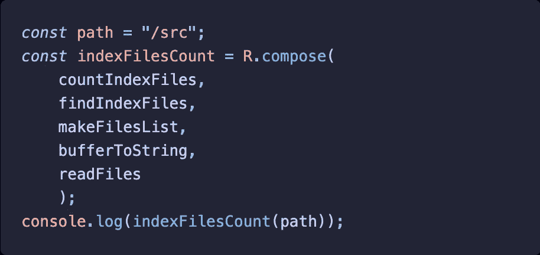

# 用 JavaScript 编写函数

> 原文：<https://itnext.io/composing-functions-in-javascript-48830f31c142?source=collection_archive---------5----------------------->

## 采用函数式编程方法实现 JavaScript 中的管道函数



*从我的* [*dev .交叉发布到标题相同的*](https://dev.to/webit/composing-functions-in-javascript-32dl) *文章。*

最近我在 Medium 上读到一篇关于在 JavaScript 中使用[管道风格的文章。有一篇文章描述了如何通过管道将函数连接在一起，从而让数据流经所有函数。
我在本文中错过的是函数式编程的味道。让我们更进一步，增加一些 FP 的味道。](https://betterprogramming.pub/whats-a-pipeline-style-in-javascript-2084b66133f0)

# 在*nix shell 中使用管道

想象一下`*nix`命令行，我们想要在某个目录中找到所有的`index.js`文件。当我们将得到一个文件列表时，我们希望对它们进行计数。假设我们把源代码放在了`src/`里面。
这是一个简单的例子，但是解释了我们如何在*nix shell 中使用管道命令(使用`|`)来传递数据。

为了实现我们想要的，我们必须执行以下命令:

```
tree src/ | grep index.js | wc -l
```

其中:

- `tree`递归地列出目录(在本例中，我将其限制为`src/`目录)
- `grep`用于过滤具有所提供模式的结果(单行)——我们只需要包含`index.js`-
-`wc`(字数)的行返回换行数、字数和字节数。与`-l`一起使用只返回第一个值，所以我们的`index.js`被找到的次数

上面命令的示例输出可以是任何数字，在我的例子中是 26。

我们在这里看到的是数据如何从一个命令传递到另一个命令。第一个命令处理输入数据，并将数据返回给第二个命令。依此类推，直到我们到达最后—然后显示最后一个命令返回的数据。

# 在 JavaScript 中使用管道

我们可以用 JavaScript 实现类似的事情。首先，让我们构建一个函数，用于模仿 shell 命令的特定目的。

```
// node’s execSync allows us to execute shell command
const { execSync } = require('child_process');// readFiles = String => Buffer
const readFiles = (path = "") => execSync(`tree ${path}`);
// bufferToString = Buffer => String
const bufferToString = buffer => buffer.toString();
// makeFilesList = String => Array
const makeFilesList = files => files.split("\n");
// isIndex = String => Boolean
const isIndexFile = file => file.indexOf("index.js") > 0;
// findIndexFiles = Array => Array
const findIndexFiles = files => files.filter(isIndexFile);
// countIndexFiles = Array => Number
const countIndexFiles = files => files.length;
```

让我们看看目前为止我们得到了什么:

- `readFiles()`函数为提供的`path`或在我们的 JS 文件被执行的位置执行`tree`命令。函数返回缓冲区
- `bufferToString()`函数将缓冲区数据转换为字符串
- `makeFilesList()`函数将接收到的字符串转换为数组，使每一行文本都成为单独的数组元素
- `isIndexFile()`函数检查提供的文本是否包含`index.js`-`findIndexFiles()`函数过滤数组并返回只包含`index.js`条目的新数组(内部使用`isIndexFile()`函数)
- `countIndexFiles()`函数只对提供的数组中的元素进行计数

现在我们得到了 JavaScript 实现的所有部分。但是怎么做呢？
我们将使用*函数组合*，这里的关键是使用*一元函数*。

# 功能组成

**一元函数**是只接收*一个参数*的函数。

因为它们接受一个参数，我们可以把它们连接起来，创建一个新的函数。这种技术叫做**功能组合**。然后，一个函数返回的数据被用作另一个函数的输入。

我们可以使用`compose`函数，你可以在流行的函数式编程库 [Ramda](https://ramdajs.com/docs/#compose) 中找到。让我们看看如何做到这一点…

```
// returns function that accepts path parameter passed to
// readFiles()const countIndexFiles = R.compose(
 countIndexFiles,
 findIndexFiles,
 makeFilesList,
 bufferToString,
 readFiles);const countIndexes = countIndexFiles("src/");console.log(`Number of index.js files found: ${countIndexes}`);
```

注意:我们甚至可以不使用`compose`函数来构造函数(但我认为这样可读性较差):

```
const countIndexes = countIndexFiles(findIndexFiles(makeFilesList(bufferToString(readFiles("src/")))));console.log(`Number of index.js files found: ${countIndexes}`);
```

正如你所看到的，函数组合允许我们加入函数，而不用担心处理它们之间的数据。以下是我们在不使用合成的情况下必须做的事情:

```
const filesBuf = readFiles("src/");
const filesStr = bufferToString(filesBuf);
const filesList = makeFilesList(filesStr);
const indexFiles = findIndexFiles(filesList);
const countIndexes = countIndexFiles(indexFiles);
```

# 合成与管道

正如你可能已经注意到的，当使用`compose`时，我们需要以相反的顺序传递函数(*从下到上*)。
按照*从上到下*的顺序阅读更容易。这就是`pipe`的用武之地。它执行与`compose`相同的操作，但以相反的顺序接受功能。

```
// NOTE even though not takes functions list in reverse order 
// it still accepts path parameter passed to readFiles()const countIndexFiles = R.pipe(
 readFiles,
 bufferToString,
 makeFilesList,
 findIndexFiles,
 countIndexFiles);const countIndexes = countIndexFiles("src/");console.log(`Number of index.js files found: ${countIndexes}`); // same result as before 🙌
```

这取决于我们将使用哪一种方法— `compose`或`pipe`。试着用一种你(和你的同事)感觉更好的方式。

## 奖励:使用拉姆达给你的全部力量

我们可以使用其他 Ramda 方法来进一步缩短我们的代码。这是因为默认情况下，所有的 Ramda 函数都是**化的**，并且带有“数据最后”的风格。
这意味着我们可以在提供数据之前对它们进行配置。例如,`R.split`创建了一个新函数，通过提供的分隔符来分割文本。但是它等待一个文本被传递:

```
const ipAddress = "127.0.0.1";
const ipAddressParts = R.split("."); // -> function accepting stringconsole.log(ipAddressParts(ipAddress)); 
// -> [ ‘127’, ‘0’, ‘0’, ‘1’ ]
```

足够的理论👨‍🎓
让我们看看我们的代码最终会是什么样子(更像 FP 风格):

```
const { execSync } = require("child_process");
const R = require("ramda");// readFiles = String => Buffer
const readFiles = (path = "") => execSync(`tree ${path}`);
// bufferToString = Buffer => String
const bufferToString = buffer => buffer.toString();
// isIndex = String => Boolean
const isIndexFile = file => file.indexOf("index.js") > 0;const countIndexFiles = R.pipe(
 readFiles,
 bufferToString,
 R.split(“\n”),
 R.filter(isIndexFile),
 R.length);const countIndexes = countIndexFiles("src/");console.log(`Number of index.js files found: ${countIndexes}`);
```