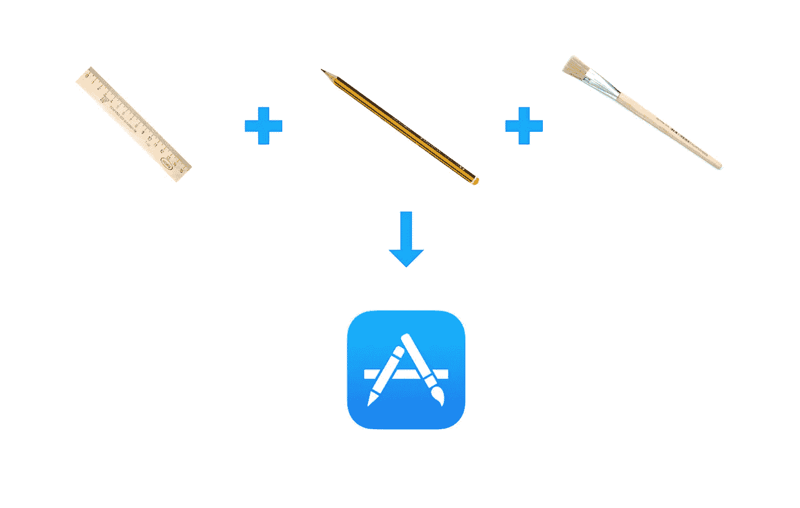
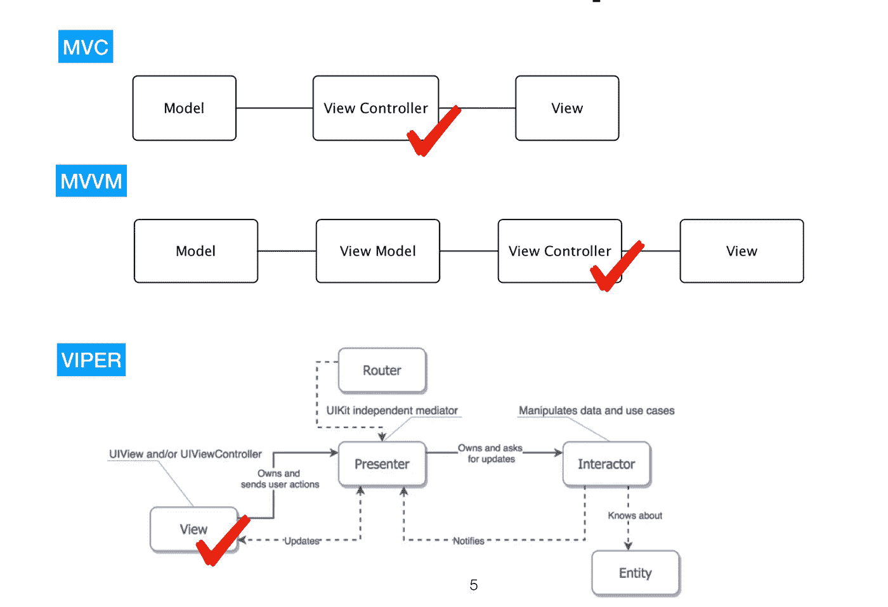
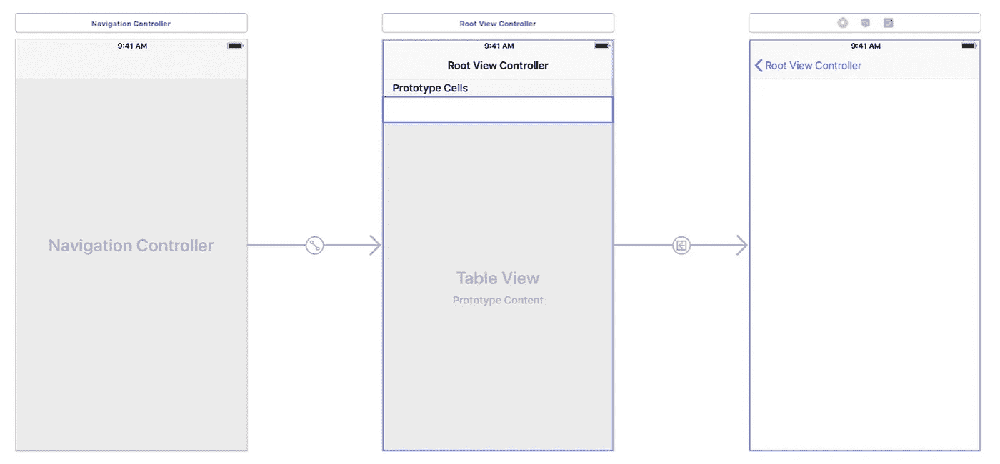
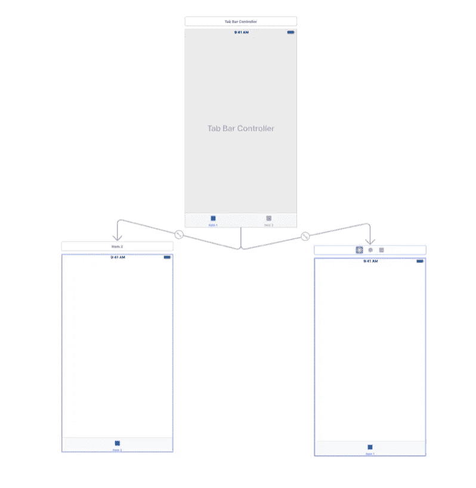
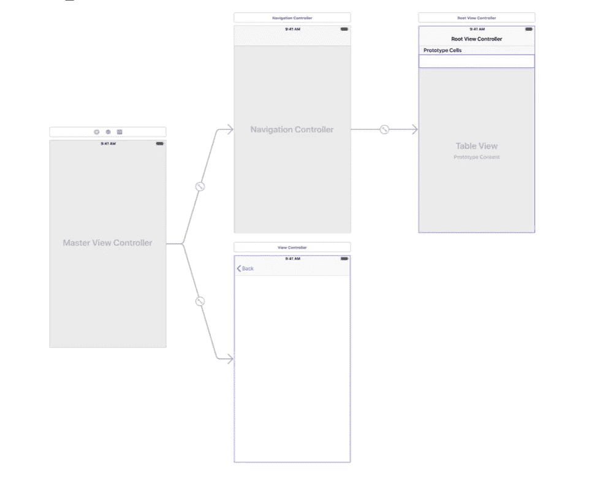
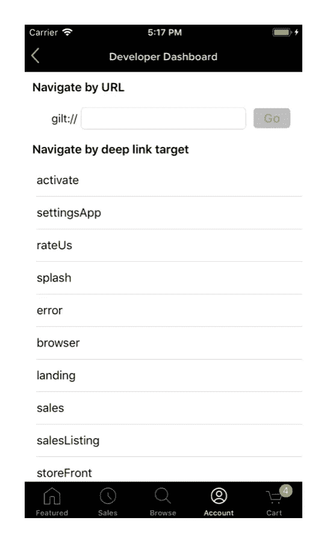

# UIViewControllers 的组合和它们之间的导航(不仅仅是)

> 原文：<https://itnext.io/composition-of-uiviewcontrollers-and-navigation-between-them-and-not-only-15b825da5ac?source=collection_archive---------2----------------------->



在这篇文章中，我想分享我们已经在我们的 iOS 应用程序中成功使用了几年的经验，其中 3 个目前在 Appstore 中( [Saks Fifth Avenue](https://itunes.apple.com/us/app/saks-fifth-avenue/id491507258?mt=8) 、 [Gilt](https://itunes.apple.com/us/app/gilt-shop-designer-sales/id331804452?mt=8) 、 [Appytoy](https://itunes.apple.com/ie/app/appytoy/id1247922134?mt=8) )。这种方法已经被证明是有效的，我们最近将它从其余代码中分离出来，并将其设计到一个单独的 [RouteComposer](https://github.com/ekazaev/route-composer) 库中，这是本文的主要焦点。它也可用作[协调器](https://www.raywenderlich.com/158-coordinator-tutorial-for-ios-getting-started)模式的通用替代物。

[https://github.com/saksdirect/route-composer](https://github.com/saksdirect/route-composer)

但是，首先，让我们试着弄清楚 iOS 中视图控制器的组成意味着什么。

在我开始解释之前，我将简单介绍一下 iOS 中的视图控制器或`UIViewController`是什么意思。这是一个继承自标准`UIViewController`的类，标准`UIViewController`是苹果推荐用于开发 iOS 应用的 [MVC](https://developer.apple.com/library/archive/documentation/General/Conceptual/DevPedia-CocoaCore/MVC.html) 模式的基本控制器。`UIViewController`用于控制代表整个屏幕或大部分屏幕的`UIView`，处理来自它的事件并在其中显示一些数据。

可选的架构模式如 MVVM、VIP、VIPER 都可以使用，但是有了它们`UIViewController`无论如何都会被使用，这个库可以和它们一起使用。



所有的`UIViewController`-可以有条件地分为**常规视图控制器**和**容器视图控制器**，常规视图控制器负责屏幕上的一些可视区域，容器视图控制器除了显示它们自己和它们的一些控件之外，还能够显示集成在其中的子视图控制器。

Cocoa Touch 提供的标准容器视图控制器:`UINavigationConroller`、`UITabBarController`、`UISplitController`、`UIPageController`等。用户可以按照 Apple 文档中描述的 Cocoa Touch 规则创建自己的自定义容器视图控制器。

将常规视图控制器集成到容器视图控制器中的过程，以及将视图控制器集成到视图控制器堆栈中的过程，在本文中称为**组合**。

我将解释为什么视图控制器的标准解决方案对我们来说不是最佳方法。然后我将浏览我们开发的方便我们工作的库。

首先，让我们看看一些标准容器视图控制器的组成，例如:

# 标准容器中组合物的例子

## UINavigationController



```
// Create a container view controller 
let tableViewController = UITableViewController(style: .plain) 
// Insert first view controller 
let navigationController = UINavigationController(rootViewController: tableViewController) 
// ... 
// Insert second view controller 
let detailViewController = UIViewController(nibName: "DetailViewController", bundle: nil)
navigationController.pushViewController(detailViewController, animated: true) 
// ... 
// Go to the first view controller 
navigationController.popToRootViewController(animated: true)
```

## UITabBarController



```
let firstViewController = UITableViewController(style: .plain) 
let secondViewController = UIViewController() 
// Create a container view controller 
let tabBarController = UITabBarController() 
// Insert two view controllers in to the container view controller 
tabBarController.viewControllers = [firstViewController, secondViewController] 
// One of the ways to switch view controllers programmatically 
tabBarController.selectedViewController = secondViewController
```

## UISplitViewController



```
let firstViewController = UITableViewController(style: .plain) 
let secondViewController = UIViewController() 
// Create a container view controller 
let splitViewController = UISplitViewController() 
// Insert first view controller 
splitViewController.viewControllers = [firstViewController] 
// Insert second view controller 
splitViewController.showDetailViewController(secondViewController, sender: nil)
```

# 堆栈上控制器的集成(组合)示例

## 将视图控制器设置为根

```
let window: UIWindow = //... 
window.rootViewController = viewController 
window.makeKeyAndVisible()
```

## 视图控制器的模态表示

```
window.rootViewController.present(splitViewController, animated: animated, completion: nil)
```

# 为什么我们决定为视图控制器的合成创建一个库

从上面的例子可以看出，没有一种方法可以将视图控制器集成到容器中，也没有一种方法可以将视图控制器构建到堆栈中。此外，如果您想稍微改变应用程序的外观或用户在其中导航的方式，您需要对应用程序代码进行重大更改。您还需要保存对容器视图控制器的引用，以便您可以在其中插入视图控制器，等等。标准方法本身意味着相当大的工作量，以及对视图控制器的引用的可用性，用于生成动作和呈现其他视图控制器。

所有这些都增加了深度链接到应用程序的各种方法的麻烦(例如，使用通用链接)，因为您必须回答这个问题:*如果在用户点击 Safari 中的链接后，必须向用户显示的控制器已经显示*或*应该显示它的视图控制器尚未创建*等等，该怎么办？所有这些情况都迫使你绕着视图控制器的树走来走去，编写让你眼睛出血的代码，这是每个 iOS 开发人员都试图隐藏的。此外，与每个屏幕都作为独立应用程序单独构建的 Android 架构不同，在 iOS 中，要在启动后立即显示应用程序的某个部分，可能需要构建一个相当大的视图控制器堆栈，隐藏在将要显示的视图控制器之下。

我还要补充一点，一旦你的营销团队表达了对实时用户进行 A / B 测试的愿望，这一切都将乘以 N:

*   让我们向 50%的用户显示标签栏，向另一半用户显示汉堡菜单。然后在一个月内，我们会告诉你哪些用户看到更多我们的特别优惠。

通常，我们的应用程序由不同团队开发的大量屏幕组成，为了在开发过程中到达其中一个屏幕，您需要通过另一个可能尚未实现的屏幕。在我们公司，我们使用了一种叫做*培养皿*的方法。在开发模式中，所有应用程序屏幕的列表都是可用的，开发人员或测试人员可以进入其中的任何一个(当然，其中一些可能需要一些输入参数)。



开发人员可以交互并单独测试它们，然后将它们组装成最终的生产应用程序。这种方法极大地方便了开发，但是，正如您从上面的例子中看到的，当您需要保持几种方式来将视图控制器集成到堆栈中时，组合就开始了。

当用户点击一个按钮时，或者当应用程序从另一个应用程序接收到一个通用链接时，只调用像`goToAccount()`、`goToMenu()`或`goToProduct(withId: "012345")`这样的方法就好了，而不用考虑这个视图控制器将如何集成到堆栈中，因为知道这个视图控制器的创建者已经提供了这个实现。

我会试着告诉你我们如何解决这个问题，并最终将它分配给 [RouteComposer](https://github.com/ekazaev/route-composer) 库。

# 路线设计者

在分析了组合和导航的所有场景之后，我们试图抽象出上面例子中给出的代码，并识别出 RouteComposer 库组成和操作的 3 个主要实体— `Factory`、`Finder`、`Action`。此外，库中有 3 个辅助实体负责导航过程中可能需要的小调整- `RoutingInterceptor`、`ContextTask`、`PostRoutingTask`。所有这些实体必须在一系列步骤中进行配置，并传递给路由器对象，路由器对象将构建您的视图控制器堆栈。

下面按顺序介绍一下它们:

## 工厂

顾名思义，`Factory`实例负责创建视图控制器。

这里，花点时间回顾一下**上下文**的概念是很重要的。在库中，我们将视图控制器可能需要创建的所有内容都称为**上下文**。例如，为了显示显示产品细节的视图控制器——有必要给它一个特定的 productID，例如，键入一个`String`。上下文的实例可以是任何东西:对象、结构、块或元组。如果你的控制器不需要创建任何东西——可以将上下文指定为`Any?`并设置为`nil`。

例如:

从上面的实现可以清楚地看到，这个工厂将从 XIB 文件中实例化视图控制器的视图，并将传输的 productID 传递给它。除了默认的`Factory`协议，该库还提供了该协议的几个标准实现，以避免您编写样板代码(特别是，如上面的例子所示)。

接下来，我不再介绍协议的描述和它们的实现示例，因为您可以通过下载库提供的示例应用程序来彻底熟悉它们。常规视图控制器和容器视图控制器有各种实现，以及配置它们的方法。

## 行动

`Action`的实例代表了一种将工厂构建的视图控制器集成到堆栈中的方法。视图控制器不能在创建后悬在空中，因此，从上面的例子可以看出，每个`Factory`必须包含`Action`。

下面是一个`Action`实现的例子，它以模态方式呈现了视图控制器:

该库包含将视图控制器集成到堆栈中的最标准方法的实现。在使用自定义容器视图控制器或表示方法之前，您可能不必创建自己的操作。然而，如果您熟悉示例，创建一个定制的`Action`应该不会引起问题。

## 探测器

`Finder`的实例为路由器提供了这个问题的答案:*“是否已经创建了这样一个视图控制器，它是否已经在堆栈上？也许什么都不需要，它足以显示已经存在的东西？*。

如果您保留了对您创建的所有视图控制器的引用，那么在您的`Finder`实现中，您可以简单地返回对所需视图控制器的引用。然而，通常情况并非如此，因为应用程序堆栈会动态变化，尤其是当它很大时。此外，在堆栈中可以有几个相同的视图控制器显示不同的实体(例如，几个`ProductViewController`显示具有不同 productIDs 的不同产品)，因此`Finder`协议可能需要定制实现并在堆栈中搜索相应的视图控制器。该库通过提供`StackIteratingFinder`作为`Finder`的扩展来促进这项任务，这是一个具有适当设置的协议，允许简化这项任务。在`StackIteratingFinder`的实现中你只需要回答这个问题:这个视图控制器是路由器搜索的那个吗？

这种实现的一个例子是:

# 辅助实体

## `RoutingInterceptor`

`RoutingInterceptor`允许您在实际导航过程开始前执行一些操作。然后它告诉路由器它是否能在堆栈上集成视图控制器。这种任务最常见的例子是身份验证(但在实现中并不简单)。例如，您希望向视图控制器显示用户帐户的详细信息，但是要这样做，用户必须登录到系统中。您可以实现`RoutingInterceptor`并将其添加到帐户视图控制器的配置中，并检查内部:如果用户登录-允许路由器开始导航，如果没有-显示提示用户登录的视图控制器，如果此操作成功-允许路由器继续导航，如果用户拒绝登录，则取消导航。

这种带有注释的`RoutingInterceptor`的实现包含在库提供的示例中。

## `ContextTask`

如果您提供了`ContextTask`的实例，它可以单独应用于配置中的每个视图控制器，不管它是由路由器创建的还是在堆栈中找到的，如果您只想更新其中的数据或设置一些默认参数(例如，显示“关闭”按钮，无论它是否是模态显示)。

## `PostRoutingTask`

在视图控制器成功集成到堆栈中之后，路由器将调用`PostRoutingTask`实现。在它的实现中，添加一些分析任务或调用一些服务是很方便的。

**关于所有描述的实体的实现的更多细节可以在库的文档和附加的例子中找到。**

PS:可以添加到配置中的辅助实体数量是无限的。

# 配置

所有这些描述的实体都很好，因为它们将合成过程分解成小的、可互换的和易于测试的块。

现在让我们继续最重要的事情——配置，也就是将这些模块相互连接起来。为了将这些块收集到一个合成步骤中，并将它们合并成一个步骤链，库提供了构建器类`StepAssembly`(用于容器- `ContainerStepAssembly`)。它的实现允许您将组合块链接到单个配置对象中，就像珠子链接到字符串一样，还可以指定对其他视图控制器配置的依赖。配置对象将来会发生什么取决于您。您可以将它和必要的参数一起传递给路由器，它将为您构建一个视图控制器堆栈。然后，您可以将它保存到字典中，并在以后通过键使用它——这取决于您的特定任务。

让我们考虑一个简单的例子:**当用户点击产品列表的表格视图中的一个单元格，或者应用程序从 safari 或电子邮件客户端接收到一个通用链接时，我们需要有模式地显示带有某个 productID 的产品视图控制器。**在这种情况下，产品视图控制器应该内置在`UINavigationController`中，这样它就可以显示其名称并关闭其导航栏上的按钮。另外，这个产品只能给已经登录系统的用户看，否则会要求他们登录系统。

**在不使用库**的情况下实现这个例子，它看起来会像这样:

这个例子不包括通用链接的实现。这将需要隔离授权代码和保存用户应该被发送到的上下文。此外，如果用户突然点击了一个链接，但这个特定的产品已经显示给用户了，这将需要额外的实现，等等，最终将使代码非常难以阅读。

**使用库实现本示例:**

如果我们把它翻译成人类语言:

*   验证用户是否已登录，如果没有，则提示用户登录
*   如果用户已成功登录，请继续
*   使用提供的`Finder`搜索产品视图控制器
*   如果找到，使其可见并完成
*   如果没有找到，创建一个`UINavigationController`，使用`PushToNavigationAction`将其与由`ProductViewControllerFactory`创建的视图控制器集成
*   使用`PresentModally`将`UINavigationController`嵌入到当前视图控制器的堆栈中

与许多复杂的解决方案一样，配置需要一些研究，例如自动布局概念。乍一看，它们似乎很复杂，没有必要。然而，这个代码片段解决的任务数量涵盖了从授权到深层链接的所有方面。将它们分解成一系列的动作可以很容易地修改配置，而不必修改代码。

此外，`StepAssembly`的实现将帮助您避免未完成的步骤链的问题，以及类型控制——不同视图控制器的输入参数不兼容的问题。

考虑一个完整应用程序的伪代码，其中`ProductArrayViewController`显示某个`ProductArrayViewController`中的产品列表。然后，用户选择某个产品。显示它取决于用户是否登录。如果用户不是，它会提供登录机会，并在成功登录后显示产品:

**配置对象**

**产品清单的实施**

**通用链接的实现**

现在你知道了！实现示例中所有条件所需的一切。

还应该提到的是，配置可以更复杂，由依赖关系组成(参见[这里的](https://github.com/saksdirect/route-composer/blob/master/EXAMPLES.md))。例如，如果您不仅需要从当前视图控制器显示一个产品，而且如果用户通过通用链接访问它，那么在它下面必须有一个`ProductArrayViewController`，它必须在一些`HomeViewController`之后的`UINavigationController`里面。那么这些都可以在配置`StepAssembly`中使用`from()`来指定。如果你的应用被`RouteComposer`全覆盖，那就不难了(见库中示例 app)。此外，您可以创建`Configuration`的多个实现，并将它们传递给视图控制器，以实现不同的组合选项。或者，如果您的应用程序正在执行 A / B 测试，您可以选择其中之一，这取决于您的用户属于哪个焦点组。

# 而不是结论

目前，上述方法已在生产中的 3 个应用程序中使用，并已证明其效果良好。将合成任务分割成小的、易读的、可互换的块使得理解和搜索 bug 变得更容易。`Fabric`、`Finder`和`Action`的默认实现允许您立即开始配置大多数任务，而无需创建自己的任务。最重要的是，这种方法提供的是自主创建控制器视图的能力，而不必引入关于它们将如何构建以及用户未来将如何移动的知识。视图控制器必须只通过用户的操作调用所需的配置。这个调用本身也可以被抽象(参见示例应用程序中的 Images 模块，其中每个视图控制器都是一个独立的框架，有两种方法可以将它们组合在一起——有或没有库)。

这个库，就像它的路由器实现一样，不使用 objective c 运行时的任何技巧，完全遵循所有 Cocoa Touch 概念，只帮助将合成过程分解成步骤，并以任何给定的顺序执行它们。该库在 iOS 到 12 的版本上进行了测试。它也已经支持 swift 4.2。

这种方法适合所有暗示使用`UIViewController`栈的架构模式(MVC、MVVM、VIP、RIB、VIPER 等)。).它也可以用作通用的[协调器](https://www.raywenderlich.com/158-coordinator-tutorial-for-ios-getting-started)模式。

该库正在积极开发中，正如我上面提到的，它已经用于生产中。我建议尝试这种方法，并分享你的印象。对我们来说，这让我们摆脱了很多令人头疼的问题。

我会很高兴你的意见和建议。

PS:文章的[第二部分](/going-deeper-into-the-routecomposer-configuration-3a54661bb16a)有一些配置示例。和关于协调器模式和 RouteComposer 库的第三部分。

PPS:如果你喜欢这个库，别忘了在 GitHub 上给它一颗星！