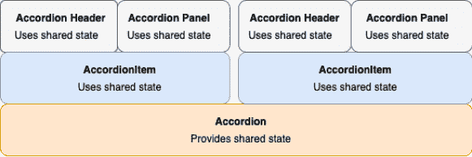
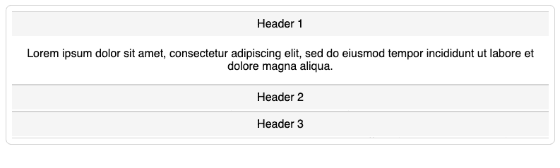
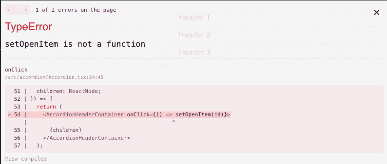

# 高级反应模式-复合组件[UI 库喜欢它]

> 原文：<https://itnext.io/compound-component-advanced-pattern-react-libraries-love-fea7a730bb73?source=collection_archive---------1----------------------->

在这篇文章中，我们来看看一个流行的 React 模式——复合组件。这种模式允许以清晰和声明性的方式编写复杂的组件。事实证明，它非常有用，几乎所有流行的 React UI 库，如[材质 UI](https://material-ui.com/components/menus/) 、[语义 UI](https://react.semantic-ui.com/collections/menu/#types-basic) 、 [Chakra UI](https://isamatov.com/chakra-ui-react/) 以及许多其他库，最终都采用了它。

这篇文章将包括构建复合组件的老方法和使用钩子和上下文 API 的新版本。

我将使用 [Emotion](https://emotion.sh/docs/introduction) 样式库和 TypeScript 编写组件。

# 什么是复合组件模式？

如前所述，复合组件模式允许为复杂组件编写声明性的灵活 API。您使用多个松散耦合的子组件来构建组件。它们中的每一个都执行不同的任务，但是它们都共享相同的隐式状态。当这些子组件放在一起时，就构成了我们的复合组件。

毫无疑问，您以前在使用 UI 库时遇到过复合组件。看一下这个片段:

结构看着眼熟吗？这就是复合组件的 API 的典型外观。

下面是手风琴组件的高级结构:

顺便提一下，很多 UI 库使用`.`作为它们的复合组件 API，如下所示:

这种方法完全是可选的，您可以按照自己喜欢的方式编写组件。它不会以任何显著的方式影响最终结果。

# 为什么要使用复合组件模式？

重申一下，以这种方式构建复杂组件的主要优点是使用起来非常容易。由于隐式状态，复合组件的内部工作对客户端是隐藏的。同时，客户可以按照自己喜欢的方式灵活地重新安排和定制子组件。

请注意，我们是如何声明性地列出 Accordion 的内容，而不必干预其内部状态的。

`Accordion`将处理所有的内部状态逻辑，包括点击时收缩和展开项目。我们所要做的就是按照我们想要的顺序列出这些项目。

所以让我们最后一次回顾一下使用复合组件模式的优点:

1.  组件的 API 是声明性的。
2.  您的子组件是松散耦合的。这使得重新排序、添加和删除子组件变得容易，而不会影响它的兄弟组件。
3.  更容易设计和改变组件的设计。

既然你已经被说服试一试了，让我们从教程开始吧。我们会做我们一直在谈论的手风琴。

如前所述，我们将讨论新旧方法。

# 旧方法

**助手方法**

在孩子之间共享状态的老方法涉及到使用两个 React 方法:`React.Children.map`和`cloneElement`。让我们简单介绍一下。

`React.Children.map`允许你迭代组件的`children`属性，就像你迭代数组一样。根据官方文件:

> "对包含在设置为 thisArg 的子级中的每个直接子级调用函数。如果 children 是一个数组，它将被遍历，并将为数组中的每个 children 调用该函数。

`cloneElement`让你创建任何反应元素的副本，并传递任何你喜欢的附加道具。根据文件:

> "以元素为起点，克隆并返回一个新的 React 元素."

**手风琴**

`Accordion`是与其所有子组件共享状态的父组件。

我们一起使用`React.Children.map`和`cloneElement`来迭代`children`属性。对于每个子元素，我们克隆元素并传递额外的属性`openItem`和`setOpenItem`，我们将使用它们来设置当前活动的项目。

**符合项**

`AccordionItem`有趣的是它既是父母又是孩子。它是`Accordion`组件的子组件，但也是`AccordionHeader`和`AccordionPanel`组件的父组件。它还使用`cloneElement`将从`Accordion`收到的道具传递给它的子节点。

代码如下:

**符合标题**

该组件将注册`onClick`事件，这将允许我们收缩/扩展每个项目。为此，我们使用从`AccordionItem`接收的`setOpenItem`方法。

**符合面板**

该组件负责显示 AccordionItem 的内容。它根据`openItem`属性的值收缩或扩展。

仅此而已就是这么回事。这种实现是可行的，但是它限制了我们如何构造孩子。例如，如果您尝试使用一些其他元素作为`Accordion`的子元素，我们的 API 将会中断，如下所示:

错误如下:

原因是`React.Children.map`只能在`Accordion`的直接子元素上迭代，所以在`div`中嵌套子元素是行不通的。

我们可以做得更好。让我们看看使用上下文 API 的新实现。

# 更新的方法

首先，很多代码都是相似的。主要区别在于，我们使用上下文 API 并创建一个提供者，而不是使用`React.Children.Map`和`cloneElement`来共享道具。

**手风琴**

下面是我们对`Accordion`的新实现:

我们创建`AccordionContext`并使用`AccordionContext.Provider`来传递`openItem`和`setOpenItem`道具。另外，请注意我们如何用 [useMemo](https://reactjs.org/docs/hooks-reference.html#usememo) 包装`value`以防止多余的重新渲染。

**根据项目**

以下是`AccordionItem`的代码:

请注意，我们不再需要传递从手风琴接收到的道具。但是我们仍然在这里使用`cloneElement`来传递`id`道具。

**折叠面板&折叠头**

这些子元素现在使用`useContext`钩子直接从上下文中拉出共享状态。下面是它们的实现:

总的来说，这个实现代码更少，性能更好。这是因为`cloneElement`会导致轻微的性能损失。

然而，主要的优势是我们为 Accordion 提供了一个更加灵活的 API，之前中断的示例代码现在也可以正常工作了。

**结论**

使用复合组件模式构建组件是一种享受。使用这种模式，您可以更好地应对设计和功能需求的不断变化。构建软件时经常发生的事情。我希望这篇文章对你有用！

感谢 Ken C. Todds 的这篇伟大的文章解释了这个概念。

这里是[链接](https://codesandbox.io/s/compound-component-with-context-krvr7)到 CodeSandbox，包含本教程的完整代码。

*原载于 2021 年 4 月 4 日*[*【https://isamatov.com】*](https://isamatov.com/compound-components-react/)*。*