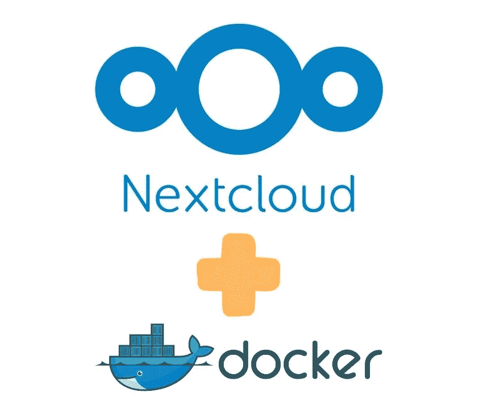
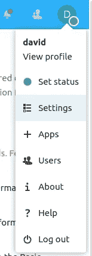
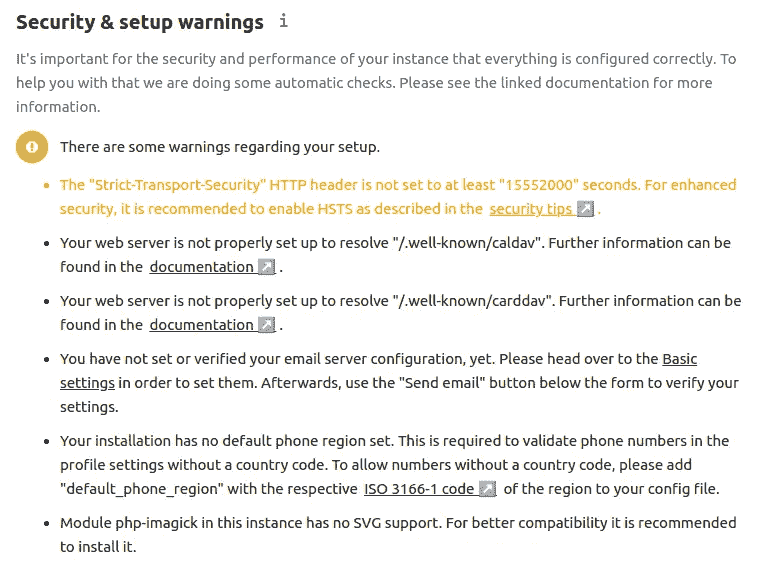
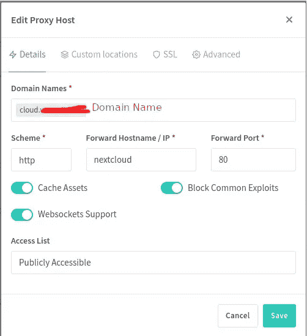
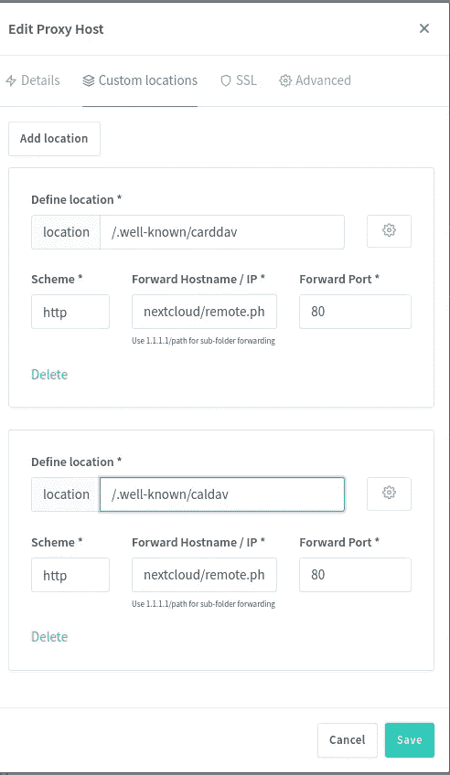

# 使用 Docker Compose the smart way 的全面 NextCloud 安装

> 原文：<https://itnext.io/comprehensive-nextcloud-installation-using-docker-compose-the-smart-way-266c19192b37?source=collection_archive---------0----------------------->

## 使用正确的配置设置解决 NextCloud 部署的几个常见问题



**NextCloud 主要专注于存储文件，使其成为等同于 Google Drive、Dropbox 等的开源软件。除了文件共享之外，它还支持文档编辑、日历、电子邮件等等，与商业云服务相匹配。但是，作为一个开源的自托管服务，你的隐私是受到保护的。**

根据 NextCloud 用户手册，推荐的安装方法是将它安装在主机系统上，就像 Ubuntu 上的“快照包”一样。NextCloud 将成为一个主机系统服务，通过包管理器管理更新。

我非常喜欢使用 Docker 的容器化服务，而不是主机系统安装。例如，如果歹徒突破了应用程序安全，容器化限制了对主机系统的损害。容器化的服务也应该更容易安装，因为大部分工作已经由容器作者完成了。但是，并非所有容器化的应用程序都易于安装，正如我们在这里看到的 NextCloud 就是这种情况。

本文在 Docker 中给出了一个完整的 NextCloud 安装，可以投入生产使用，并解决了几个常见问题。这包括用于数据库的 MariaDB 实例、用于性能改进的 REDIS 实例，以及通过正确配置 NextCloud Docker 容器来解决一些常见问题(超时等)。

虽然官方的 NextCloud 文档没有讨论 Docker 安装，但 Docker Hub 上有一个官方支持的 Docker 容器。该容器的自述文件给出了 Docker 组合文件的示例，但是这些组合文件有几个问题。这篇文章展示了一个比 Docker Hub 中显示的更完整的 NextCloud 合成文件，并讨论了使用 NGINX 代理管理器为 NextCloud 配置 NGINX 代理。

链接:

*   [https://hub.docker.com/_/nextcloud/](https://hub.docker.com/_/nextcloud/)—next cloud 的 Docker 容器
*   [https://nextcloud.com/](https://nextcloud.com/)—next cloud 主页——官方文档可在网站上找到

# NextCloud 的基本 Docker 合成文件

让我们从 NextCloud 的一个简单的`docker-compose.yml`开始，这个简单的`docker-compose.yml`来自容器的自述文件中显示的内容。

```
version: '3' # volumes: 
#   nextcloud: 
#   db:services:
   nextcloud_db:
     image: mariadb
     restart: always
     command: --transaction-isolation=READ-COMMITTED --binlog-format=ROW
     networks:
       - cloudnet
     volumes:
       - ./nextcloud-db:/var/lib/mysql
     environment:
       - MYSQL_RANDOM_ROOT_PASSWORD=true
       - MYSQL_PASSWORD=PASSWORD
       - MYSQL_DATABASE=nextcloud
       - MYSQL_USER=nextcloud nextcloud:
     image: nextcloud:24-apache
     restart: always
     networks:
       - cloudnet
     # ports:
     #  - 8080:80
     volumes:
       - ./nextcloud-docroot:/var/www/html
     environment:
       - NEXTCLOUD_DATA_DIR=/var/www/html/data
       - MYSQL_PASSWORD=PASSWORD-as-above
       - MYSQL_DATABASE=nextcloud
       - MYSQL_USER=nextcloud
       - MYSQL_HOST=nextcloud_db
  networks:
   cloudnet:
     name: cloudnet
     driver: bridge
```

这使用了两个服务:1) MariaDB 和 2) NextCloud。两者的配置都相当简单。`version`被设置为`3`,因为那是 Docker Compose 的现代版本。

对于`volumes`，我使用的是绝对路径名，而不是匿名卷。这是因为我想确定卷存储的文件系统位置。

容器自述文件中提供的合成文件的另一个问题是，它使用`links`来连接容器。这个`links`功能已经被否决或取消很多年了。相反，最佳实践是建立一个桥接网络并将容器连接到该网络。

这就是这里用`cloudnet`做的事情。NextCloud 服务的所有容器都必须连接到`cloudnet`。Docker 然后确保每个容器都有一个与容器名称匹配的主机名。因此，在`nextcloud`容器中，`MYSQL_HOST`变量被设置为`nextcloud_db`，因为这是 MariaDB 容器的容器名和主机名。

在我的例子中，名为`cloudnet`的网络是外部管理的。我使用 NGINX 代理管理器来访问所有服务。因此，N.P.M .容器必须连接到每个部署堆栈的专用网络，在这种情况下，它必须连接到`cloudnet`网络。我们稍后将查看 N.P.M .配置，但是请注意，它将在端口`80`使用`http`连接到主机名`nextcloud`。

这个设置有一些潜在的问题，其中一个我还没有解决方案。这些是许多人讨论的常见问题。

*   在安装过程中，当执行 NextCloud 初始设置时，设置可能会在浏览器中“超时”。我找不到解决办法。推荐的解决方案是取消选中“*安装常用应用*”设置，但对于 NextCloud v24，该设置根本不存在。我发现在看到超时后，如果你简单地重新加载浏览器窗口，你会看到设置已经完成。
*   在登录过程中，登录按钮可能会一直旋转。稍后我有一个解决方案。

# 运行 NextCloud 的初始设置

将`docker-compose.yml`保存到一个空目录中，然后运行以下程序:

```
$ docker network create cloudnet 
$ docker-compose up -d
```

如果你像我一样需要外部管理`cloudnet`，第一个命令应该执行一次。否则不运行该命令，只运行`docker-compose`。

这意味着你必须安装`docker-compose`。然而，请注意 Docker 团队似乎正计划弃用`docker-compose`而支持`docker compose`。请注意，新命令中缺少了`-`。这个命令`docker compose`拥有古老的`docker-compose`命令的大部分功能。

`docker compose`命令现在可以在本地 Docker 安装上部署一个`docker-compose.yml`。但是，我的部署机器无法更新到最新的 Docker 版本，我使用`docker-compose`而不是`docker compose`进行这次部署。

运行`docker-compose logs -f`将有助于您查看日志。MariaDB 容器完成后，您可以进入浏览器窗口。

使用上面显示的合成文件，NextCloud 将位于端口`80`的`http://SERVER`上。如果需要，您当然可以使用`ports`指令将其重新映射到另一个端口。例如，您可以将服务映射到端口`4080`,如下所示:

```
services:
   ...
   nextcloud:
     ...
     ports:
       - 4080:80
     ...
```

在这种情况下，您可以将浏览器连接到`[http://SERVER:4080](http://SERVER:4080.)` [。](http://SERVER:4080.)

在浏览器中输入正确的 URL。将有框输入管理员用户的用户名，以及密码。在旧版本中，有一个勾号告诉 NextCloud 安装一些推荐的应用程序，但现在已经没有了。点击安装按钮，并准备等待一段时间。

同样，我的经验是这一步在浏览器中超时了。我只是重新加载了浏览器窗口，发现 NextCloud 已经可以使用了。我一直在寻找解决方案，但没有找到有帮助的建议。

在设置阶段，您为 ADMIN 用户提供了用户名和密码。使用该组合登录，您将进入 NextCloud。在那里，您可以探索这些功能，更改一些设置，安装 NextCloud 应用程序，等等。如何使用它取决于您，我们在这里重点关注的是 NextCloud 的设置。

# 处理安装和安全警告

一个非常重要的检查是在*设置*区域。在右上角点击按钮，就像这样:



这里有许多有用的选择，但我们感兴趣的是*设置*。在“设置”区域，左侧的一列中有一个选项卡列表。向下滚动到*管理*部分，点击*概述*选项。本页概述了您的 NextCloud 实例。

在这个页面上，有一些 JavaScript 代码将被执行来检查常见问题。它应该显示如下内容:



本页显示了几个问题，让我们来解决它们。

*   *未将“严格传输安全”HTTP 头设置为至少“15552000”秒。为了增强安全性，建议按照安全提示中的描述启用 HSTS。*
*   *您的 web 服务器设置不正确，无法解析"/。知名/caldav”。更多信息可以在文档中找到。*
*   *您的 web 服务器设置不正确，无法解析"/。知名/carddav”。更多信息可以在文档中找到。*

这三个问题将在下一节的 NGINX 代理管理器配置中得到解决。如果你没有使用 N.P.M .的话，你需要用其他的方法来解决这些问题。这些消息包含指向文档的链接。

NGINX 代理管理器是一个优秀的工具，用于管理对基于 Docker 的服务的访问，特别是对于自托管的家庭实验室设置。在我的案例中，我的办公桌上有一个运行多种服务(Gitea、Jenkins 等)的英特尔 NUC，并使用 N.P.M .来简化对这些服务的访问，并帮助在公共互联网上公开它们。

但是，与我们可以使用默认 N.P.M .设置的许多服务不同，NextCloud 需要额外的设置。



这里我们给服务一个域名。接下来，我们描述对后端服务的访问，在本例中，它使用`http`来连接端口`80`上的`nextcloud`容器。我们选择*缓存资产*，*阻止常见漏洞利用*，以及 *Websocket 支持*。后者似乎对 NextCloud 很重要，因为一些按钮似乎依赖于此。

在 SSL 选项卡上，我们可以很容易地使用*let Encrypt*来配置 SSL 证书。完成后，选择这些设置:

*   *强制 SSL* 将确保每个访问 NextCloud 的人都将使用 HTTPS 连接
*   *HTTP/2 支持*将确保使用该协议
*   HSTS 启用后会修复上面显示的关于 HSTS 的消息。这是一个将增加安全性的安全协议。

要解决`/.well-known/caldav`和`/.well-known/carddav`的问题，我们必须导航到*自定义位置*选项卡。如果你阅读了 NextCloud 文档，它描述了 Apache `.htaccess`配置，以及在 NGINX 配置文件中设置`location`指令。对于 N.P.M .我们可以使用此*自定义位置*选项卡。



这将配置两个 URL 位置，以便将请求传递给 NextCloud 实例中的后端 URL。以`/.well-known`开头的 URL 位置由互联网标准委员会定义，是一个“众所周知”的 URL 路径，通过它可以访问特定的服务。NextCloud 文档说要将这些位置传递给`/remote.php/dav/` URL，为了配置 NGINX 代理管理器，我们必须输入`nextcloud/remote.php/dav/`。

有两个位置需要输入，所以点击两次*添加位置*按钮。输入如图所示的`/.well-known/caldav`和`/.well-known/carddav`位置。对于每一个，*方案*框将包含字符串`http`,*转发主机名/ IP* 框将包含 URL`nextcloud/remote.php/dav/`,*转发/端口*框将包含`80`。在这个框的下面是说明*使用 1.1.1.1/path 转发子文件夹*，这意味着文本以主机名或 IP 地址开始，然后以任何附加路径继续。主机名是`nextcloud`，路径是`/remote.php/dav/`。

一旦您保存 N.P.M .配置，它将重建 NGINX 配置文件，然后在 NextCloud 概述页面中，上述问题将得到解决。然而，还有其他问题需要解决。

# 自定义 NextCloud 配置以避免某些超时情况

N.P.M .代理的这种配置修复了几个问题。但是，我看到了一个与登录相关的问题。我输入我的用户名和密码，点击登录按钮，进度指示器旋转 10 多分钟没有变化，然后重新加载浏览器显示我实际上登录了。

在 N.P.M .的日志中，发现了以下错误:

```
2022/05/14 07:00:06 [error] 965099#965099: *2145208 upstream timed out     (110: Operation timed out) while reading response header from upstream,    client: IP-ADDRESS, server: cloud.DOMAIN,    request: "POST /index.php HTTP/2.0",    upstream: "http://172.20.0.5:80/index.php",    host: "cloud.DOMAIN"
```

在 Reddit 上，我发现 [*NextCloud 自托管站点超时*](https://www.reddit.com/r/unRAID/comments/l24cix/nextcloud_selfhosted_site_times_out/) 带有 NextCloud 配置文件中的一些设置。

使用上面的`docker-compose.yml`配置文件，`config.php` 文件在主机文件系统中显示为`nextcloud-docroot/config/config.php`，但是受到保护，只有 ROOT 用户可以编辑该文件。因此，编辑或查看该文件需要主机上的以下命令:

```
$ sudo vi nextcloud-docroot/config/config.php
```

一个重要的建议是对`config.php`的更改:

```
'trusted_domains' =>
 array (
   0 => '192.168.1.200:444',
   1 => 'nextcloud.my-domain.com',
 ), 
'overwrite.cli.url' => 'https://nextcloud.my-domain.com', 
'overwritewebroot' => '/nextcloud', 
'overwritehost' => 'nextcloud.my-domain.com', 
'overwriteprotocol' => 'https', 
'trusted_proxies' => ['NginxProxyManager'],
```

然而，所有这些变化都可以通过使用`docker-compose.yml`中的环境变量来实现。NextCloud 容器基于它在环境变量中发现的内容创建了`config.php`。

因为`config.php`只在第一次执行容器时创建，所以`nextcloud-docroot`目录一定不在那里。如果该目录缺失，NextCloud 将创建该目录，如果该目录存在，容器将跳过目录创建过程。

因此，在编辑`docker-compose.yml`之前，运行以下命令:

```
$ sudo rm -rf nextcloud-db nextcloud-docroot
```

这将删除数据库目录和 NextCloud 目录，以便从头开始创建这两个目录。

然后，对`docker-compose.yml`进行以下更改:

```
services:
   ...
    nextcloud:
     ...
     environment:
       - MYSQL_PASSWORD=PASSWORD
       - MYSQL_DATABASE=nextcloud
       - MYSQL_USER=nextcloud
       - MYSQL_HOST=nextcloud_db
       # - REDIS_HOST=redis
       - APACHE_DISABLE_REWRITE_IP
       - VIRTUAL_HOST=cloud.DOMAIN
       - OVERWRITEPROTOCOL=https
       - TRUSTED_PROXIES=NginxProxyManager
       - OVERWRITECLIURL=http://cloud.DOMAIN
```

我跳过了由`NEXTCLOUD_TRUSTED_DOMAINS`环境变量控制的`trusted_domains`设置。NextCloud 容器自述文件中针对这些设置的文档包括:

*   `NEXTCLOUD_TRUSTED_DOMAINS`(默认不设置)可选的空格分隔的域列表
*   `APACHE_DISABLE_REWRITE_IP`(默认不设置):置 1 禁用重写 IP。
*   `TRUSTED_PROXIES`(默认为空):以空格分隔的可信代理列表。IPv4 支持 CIDR 符号。
*   `OVERWRITEHOST`(默认为空):设置代理的主机名。也可以指定端口。
*   `OVERWRITEPROTOCOL`(默认为空):设置代理的协议，http 或 https。
*   `OVERWRITECLIURL`(默认为空):设置代理的 cli url(如`[https://mydnsname.example.com](https://mydnsname.example.com))` [)](https://mydnsname.example.com))
*   `OVERWRITEWEBROOT`(默认为空):设置代理的绝对路径。
*   `OVERWRITECONDADDR`(默认为空):Regex 覆盖依赖于远程地址的值。

最好在`docker-compose.yml`做这些改动。但是，如果您的 NextCloud 实例已经完全建立并投入生产使用，从头重新创建它就没有意义了。在这种情况下，最好在`config.php`中进行这些更改。

# 将 REDIS 缓存添加到 NextCloud 设置中

你会注意到我们刚刚展示的环境变量包括`REDIS_HOST`。让我们看看如何将 REDIS 添加到 NextCloud 中。

```
services:
   ...
    nextcloud:
     ...
     environment:
       ...
       - REDIS_HOST=redis
       ...
   ...
   redis:
     image: redis:alpine
     restart: always
     networks:
       - cloudnet
```

添加 REDIS 理论上会通过在内存中缓存东西来提高性能。

如果您需要安装 REDIS，而不删除并重新创建 NextCloud 安装，那么`config.php`中的等效内容大致如下:

```
'filelocking.enabled' => true,
'memcache.distributed' => '\\OC\\Memcache\\Redis',
'memcache.locking' => '\\OC\\Memcache\\Redis',
'redis' =>    array (
     'host' => 'redis',
     'password' => '',
     'port' => 6379,
),
```

在文档中，给出了使用 REDIS 的两个目的。第一个是将文件锁定转移到 REDIS 服务器，因为在数据库中进行锁定非常慢。第二种是在内存中缓存一些数据以提高性能。有关详细信息，请参见:

*   [https://docs . next cloud . com/server/latest/admin _ manual/configuration _ files/files _ locking _ transactional . html](https://docs.nextcloud.com/server/latest/admin_manual/configuration_files/files_locking_transactional.html)
*   [https://docs . next cloud . com/server/latest/admin _ manual/configuration _ server/caching _ configuration . html](https://docs.nextcloud.com/server/latest/admin_manual/configuration_server/caching_configuration.html)

# 配置 NextCloud 使用 GMAIL 发送电子邮件

NextCloud 发送各种电子邮件，如密码重置和各种通知。这需要有一个 SMTP 服务器来发送电子邮件。安装自托管 SMTP 服务器是一项很大的任务，幸运的是，有一种简单的方法。你可能有一个谷歌账户，因此也有一个 GMAIL 账户。可以将 NextCloud 配置为使用 GMAIL SMTP 服务器。

另一种方法是，如果你的 NextCloud 安装在网络托管服务上，你可以使用你的网络托管提供商的 SMTP 服务器。或者你可以使用付费的 SMTP 服务。无论你使用的是什么 SMTP 服务，是 GMAIL 还是其他，你只需在 NextCloud SMTP 配置屏幕中输入具体信息。

NextCloud 文档包括一个关于配置 SMTP 电子邮件支持的章节。在本教程中，我们将重点介绍如何使用 GMAIL 的 SMTP。这对于小型私有 NextCloud 实例来说应该没问题，但是对于有几十个或更多用户生成大量电子邮件的实例来说，最好使用另一种 SMTP 服务。

在*管理*设置的*基本设置*区域，有一个配置 SMTP 服务器的部分。在此之前，请转到*个人信息*选项卡中的*个人*区域，并设置您的个人电子邮件地址。回到*基本设置*，为 SMTP 配置添加以下条目:

*   加密设置为`STARTTLS`的发送模式`SMTP`
*   发件人地址设置为您的电子邮件地址`gmail.com`
*   认证方法设置为*登录*，需要*认证*
*   服务器地址设置为端口 587 上的`smtp.gmail.com`
*   凭证`YOUR-EMAIL@gmail.com`，然后对于密码有特殊的考虑。

您不能简单地将您的 Google 帐户密码用作此目的的密码。相反，有必要为你的谷歌账户设置一个*应用密码*。参见:【https://support.google.com/accounts/answer/185833 

为此，在登录 GMAIL 时，点击右上角的身份图标，您会看到一个标有*管理谷歌账户*的按钮。点击它，然后选择*安全*和*登录谷歌*。在该选项下，选择*应用程序密码*，这是您设置特定应用程序密码的地方。我所做的是告诉它设备和应用程序是 NextCloud。然后它向我显示了一个密码字符串，我将它复制到了 NextCloud 设置的密码字段中。

完成后，有一个发送测试邮件的按钮。点击它，如果一切正常，你将很快收到一封电子邮件。如果没有，将会有一个错误消息，我发现这个错误消息是很有帮助的指导。以上过程是基于解决了我看到的错误信息。

# 使用 Cron 为 NextCloud 配置后台作业执行

另一个问题是，NextCloud 可以运行后台作业来维护系统。通常这些都是从 Cron 运行的，Cron 是运行后台作业的古老程序。

有一种复杂的方法来设置对 NextCloud 的 Cron 支持，即使用一个显式创建的 Docker 映像。参见:

*   [https://hub.docker.com/r/rcdailey/nextcloud-cronjob/](https://hub.docker.com/r/rcdailey/nextcloud-cronjob/)
*   [https://github.com/rcdailey/nextcloud-cronjob](https://github.com/rcdailey/nextcloud-cronjob)

但是，有一种简单得多的方法，那就是在执行 NextCloud 实例的主机上使用 Cron 服务。

在我的例子中，Docker 环境托管在 Ubuntu 上，运行在我办公桌上的英特尔 NUC 上。我已经在使用主机系统 Cron 服务执行一些后台任务。

运行`crontab -l`允许您查看正在运行的 Cron 作业的当前列表。

运行`crontab -e`可以编辑 crontab 文件。

我将该作业添加到我的 crontab 文件中:

```
*/5 * * * * /usr/bin/docker exec -u www-data nextcloud php cron.php
```

记住`docker exec`在指定的容器中运行命令。添加`-u www-data`确保容器内使用的用户 ID 是正确的。`nextcloud`参数标识在其中执行命令的 docker 容器。要确定容器名称，运行`docker ps -a | grep nextcloud`。这个命令的最后一位是要在容器内部执行的 shell 命令。

注意在`nextcloud-docroot`目录中有一个文件`cron.php`。这样做的目的是每五分钟执行一次 PHP 脚本。

在 NextCloud 设置中，管理员部分的基本设置下，有一个后台作业部分。只需选择 *Cron* 。

# 摘要

NextCloud 是替代许多商业云服务的优秀工具。我们希望设置会更直接，因为这将向更多的人开放它的使用。这就是本文的目标，记录一种简单的 NextCloud 安装方法，这种方法非常有用。

# 关于作者


[**大卫·赫伦**](https://davidherron.com/) :大卫·赫伦是一名作家和软件工程师，专注于技术的明智使用。他对太阳能、风能和电动汽车等清洁能源技术特别感兴趣。David 在硅谷从事了近 30 年的软件工作，从电子邮件系统到视频流，再到 Java 编程语言，他已经出版了几本关于 Node.js 编程和电动汽车的书籍。

*原载于*[](https://techsparx.com/software-development/docker/self-hosting/nextcloud.html)**。**