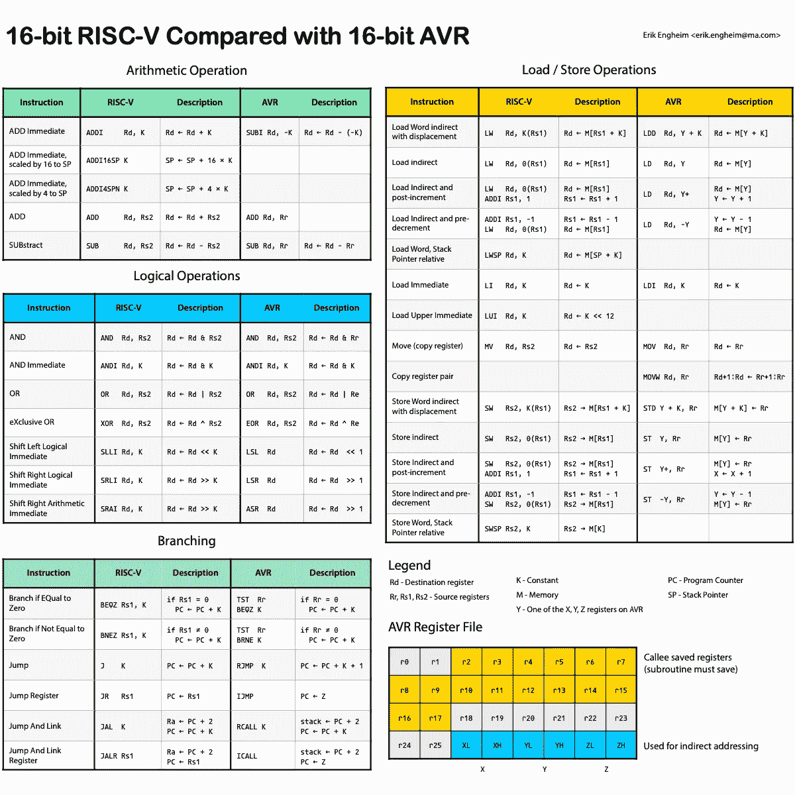
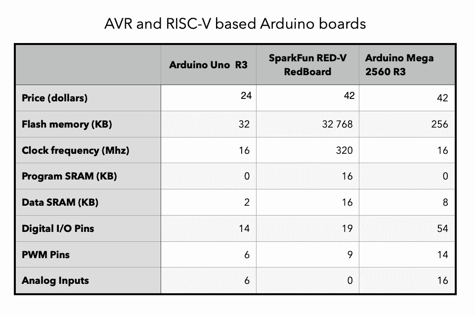
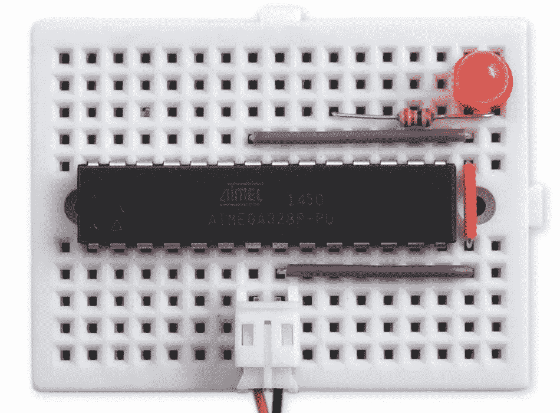

# 与 AVR 相比，压缩的 16 位 RISC-V 指令

> 原文：<https://itnext.io/compressed-16-bit-risc-v-instructions-compared-to-avr-1f58a0c1c90f?source=collection_archive---------0----------------------->

## 由于 AVR 主要使用 16 位指令，因此与 16 位 RISC-V 指令进行比较会很有意思

ISC-V 有压缩指令扩展 *C* ，仅仅增加了 400 个门就能给 RISC-V 处理器提供 16 位指令。我认为将这 27 条指令与 AVR 微处理器的指令进行比较会很有趣，AVR 微处理器是微控制器的知名处理器(用于 Arduino)。这将与 AVR 的 [78 指令](http://www.avr-asm-tutorial.net/avr_en/overview/overview.html)的子集进行比较。

下面的“备忘单”是通过在描述汇编指令的通用 RISC-V 和 AVR 符号之间找到一些折衷而制成的。我使用了 AVR 使用 K 来描述即时值的惯例。按照 AVR 惯例，寄存器被大写，如`Rd`、`Rr`、`Rs1`和`Rs2`。当访问内存位置`K`的值时，AVR 会写`(K)`，但是我决定使用一种更像 RISC-V 的方式写`M[K]`。在指令之间没有很好的映射的情况下，我要么跳过编写类似的指令，要么编写指令的组合。

*PDF 可读性更好:* [*RISC-V 和 AVR 指令集对比*](http://blog.translusion.com/images/posts/RISC-V-vs-AVR-cheat-sheet.pdf) *。*

当你只有 16 位来编码指令时，你必须做出许多妥协。我认为比较两种架构所做的一些妥协是很有趣的。

## RISC-V 对寄存器使用的限制

为了支持 32 个寄存器，需要留出 5 位来编码一个寄存器。如果你的指令做了很多事情，比如添加一个常数或者跳转到一个有偏移量的特定地址，那么你就没有多少位可以使用了。由于这个原因，AVR 和 RISC-V 在使用 16 位指令时都不允许你寻址所有的寄存器。

RV32C(RISC-V 的压缩指令)只允许你直接指定 8 个最常用的寄存器`s0`、`s1`、`a0`到`a5`。这是因为只有 3 位被留出来指定寄存器。也有一些例外。`MV`(移动)、`ADD`、`ADDI`(立即添加)、`LWSP`(从 SP 加载字)和`SWSP`(从 SP 存储字)提供对所有 32 个 RISC-V 寄存器的访问。

这些都是明智的选择，因为读写堆栈是非常常见的操作。这同样适用于复制和添加。`a0`到`a7`用于将参数传递给函数，但是大多数函数不会接受多达八个参数。五个应该够大部分了。

## 寄存器使用的 AVR 限制

使用 AVR，您几乎可以将所有 32 个寄存器用作目的寄存器`Rd`，这是 AVR 优于 RV32C 的一个优势。对于双操作数指令，如`ADD`、`AND`、`OR`、`MOV`和`SUB`，源寄存器`Rr`往往被限制为 4 位，总共有 16 个高位寄存器可供使用。

## 哪种指令集更好？

这样的评估自然是相当主观的。如果我们只看 16 位指令，那么显然 AVR 指令更有能力。它们通常允许您访问更大范围的寄存器，并且有更多的 16 位指令可供使用。

然而，我选择了比较这两种指令集的道路，因为我感兴趣的是哪一种既能在内存有限的小型微控制器中运行良好，又能很容易地教给初学者。

这使得人们更难称之为赢家。RISC-V 得益于具有更少但更通用的指令的设计。例如，RISC-V 依赖于分支指令、加载和存储中的立即值和寄存器的组合，这使得它们都非常灵活。相反，AVR 依赖于许多变体，例如带位移的加载，带后增量或前减量。分支是相对的、直接的和间接的。只是有更多的变量需要跟踪。

此外，对于可以使用哪些寄存器，还有一些任意的限制。间接加载和存储只允许使用`X`、`Y`和`Z`寄存器，它们实际上是寄存器对。

## RISC-V 对汇编编码人员来说更容易

现在，RV32C 有更多任意和复杂的限制，但一个关键的区别是，RISC-V 汇编编码器需要关心这些限制。RISC-V 汇编代码编写人员编写代码时，就好像所有 32 位指令都可用一样。只要有机会，汇编程序就会选择压缩的 16 位变量。如果我在 RV32C 允许的范围之外的寄存器中使用加载指令，那么汇编程序会自动为我选择一条 32 位指令。

这样，作为一名程序员，我只需要处理一个看起来非常干净和正交的指令集，而没有很多奇怪的边缘情况。那么，这是不是意味着 RISC-V 赢了？

## AVR 更容易分析

没那么快。AVR 使得在重要的子程序中只用 16 位指令编程变得很容易。32 位指令相对较少，可以轻松避开(`CALL`、`LDS`、`STS`、`JMP`)。这使得通过计算指令来判断一段代码将消耗多少时钟周期成为可能。如果您知道时钟频率，就可以很容易地计算出不同代码段需要多长时间。对于高级编码来说，这是无关紧要的，但对于时序很重要的低级微控制器编码来说，这种能力在我看来是一件好事。

另一个优势是基于 AVR 的 Arduino 板的运行时钟频率低于闪存，因此这使得指令的执行速度非常可预测。您不需要处理高速缓存未命中、分支预测失误和流水线停顿。

## 带 ATmega328P 或 SiFive FE310 的 Arduino 板？

比较这两种芯片的一个可用的方法是看一些硬件，这适合初学者进行微控制器开发和编程。那是我最感兴趣的领域。最原始和最著名的 Arduino 板是 Arduino Uno R3。它运行在一个 [ATmega328P](https://ww1.microchip.com/downloads/en/DeviceDoc/Atmel-7810-Automotive-Microcontrollers-ATmega328P_Datasheet.pdf) 微控制器芯片上。我们可以将其与硬件兼容板进行比较，SparkFun 的 [RED-V RedBoard](https://www.sparkfun.com/products/15594) 基于 [SiFive FE310-G002](https://starfivetech.com/uploads/fe310-g002-datasheet-v1p2.pdf) 微控制器。

基于 RISC-V 的主板的一个主要缺点是价格昂贵。SparkFun 的 Arduino Uno R3 售价为 24 美元，而 RED-V RedBoard 的售价为 42 美元，几乎是前者的两倍。另一方面，如果你比较规格，它会更有能力。

挑选和基于 AVR 或 RISC-V 的 Arduino 板的利弊

在许多方面，与爱好者通常想要做的事情相比，它完全被压制了。它有将近 1000 倍的闪存。SRAM 容量增加 16 倍。以高出 20 倍的时钟频率运行。因为它以如此高的频率运行，所以它使用 SRAM 作为缓存，因为闪存不够快。我认为这是负面的，因为处理缓存未命中意味着运行代码的时间更加不可预测。

但这款芯片所基于的 SiFive 的 E3 系列内核有一个锦囊妙计。他们支持他们所谓的*紧密集成内存* (TIM)。您可以将指令缓存和数据缓存配置为像常规内存一样工作。这提供了基于 AVR 的解决方案在时间上的可预测性。

还有一些其他的负面因素。RISC-V 板没有任何模拟输入。这些在许多项目中都很方便。业余爱好者的另一大优势是 [ATmega328P 可以在 DIP 封装中购买](https://www.sparkfun.com/products/10524)。那是什么意思？你得到的微控制器本身是一个有 28 个引脚的芯片，你可以把它插在试验板上。

Arduino 板上的微控制器可以直接插入试验板，如图所示。

对于业余爱好者来说，这太棒了，因为你可以从很多地方买到这些用 Arduino 引导加载程序预编程的家伙。SparkFun 仅售 6.5 美元。您可以在常规 Arduino Uno R3 板上交换这些芯片。这允许你在 Arduino 板上开发一个解决方案，当你完成后，你可以把它移到一个试验板上，得到一个便宜且更持久的解决方案。

## 结论

比较这两种解决方案是一项持续的工作，随着我的进一步探索，我将会写更多关于这个主题的文章。目前我还没有下定决心。我认为 RISC-V 有一个非常引人注目的汇编代码指令集。在很多方面，我也更喜欢工具环境。我主要用 macOS 和 Linux，远离 Windows。AVR 编程和工具都是以 Windows 为中心的。事实证明，为运行在 macOS 或 Linux 上的 AVR 处理器找到好的模拟器是很困难的。对于 RISC-V，我发现了许多选择。

特别是，我想对[莫滕·博鲁普·彼得森](https://github.com/mortbopet)表示感谢，感谢他制作了令人敬畏的 [Ripes 模拟器。](https://github.com/mortbopet/Ripes)它可以让你非常详细地了解 RISC-V 处理器是如何工作的，并且很容易上手。

米歇尔·波莱制作了一个 AVR 模拟器，名为 [simavr](https://github.com/buserror/simavr) ，看起来真不错。唯一的问题是我还不知道如何运行它。这一直是我在 macOS 和 Linux 上使用 AVR 的问题。它们不容易使用，我正在寻找对初学者友好的工具。

在一个理想的世界里，RISC-V 微控制器生态系统要成熟得多。这将使选择变得更容易，但现在，我们有几个没有明确赢家的选择。让事情变得复杂的是，我们可以加入 Arm，它实际上已经在 Arduino 生态系统中广泛使用。

我没有进一步探索 ARM，因为现代 ARM 指令集相当复杂，而且在我看来对初学者并不友好。至少这是我的印象。也许，如果在拇指模式下运行，这不是一个问题。对于那些在 AVR 和基于 Arm 的板上都做过微控制器汇编编程的人来说，听听你的经历会很酷。