# 中的并发处理。NET 6 带系统。线程通道(奖励:间隔树)

> 原文：<https://itnext.io/concurrent-processing-in-net-6-with-system-threading-channels-bonus-interval-trees-441b7539b5d1?source=collection_archive---------0----------------------->

通道是一种简化并发执行和数据管道化的构造，通常被吹捧为 Go 的主要吸引力之一。但是你知道吗？NET 也内置了对通道的支持？

如果您正在构建处理大量数据的应用程序，或者需要在聚合结果的同时与多个 API 进行交互，那么使用通道可以提高应用程序的整体吞吐量和响应能力，因为它允许您在合并结果和/或以流的形式执行后处理的同时并发执行这些 API 调用。

让我们看看如何在 C# 10 中使用通道。NET 6 以及使用内置的`**System.Threading.Channels**`实现并发处理是多么容易。

如果你想跟进回购，请点击此处查看:

[](https://github.com/CharlieDigital/dn6-channels) [## GitHub-Charlie digital/dn6-channels:演示 dotnet 6 通道用于…

### 通道是一种结构，它简化了数据的并发执行和流水线操作，而不使用基于锁的…

github.com](https://github.com/CharlieDigital/dn6-channels) 

# 使用案例

首先，假设我们正在构建一个日历协调应用程序。一个用户有两个或多个日历(如 Google、Outlook 和 iCloud Calendar ),我们希望从中读取并在该用户的所有日历中找到冲突事件。

一种方法是简单地循环每个日历并收集所有事件:

```
# Pseudo code:

# Use an interval tree to hold our events and detect conflicts
var **interval_tree** = new IntervalTree()

do {
  # API calls to get the google events; 3s
} while (**has_more_google_events**)

do {
  # API calls to get the outlook events; 4s
} while (**has_more_outlook_events**)

do {
  # API calls to get the iCloud events; 3s
} while (**has_more_icloud_events**)# Requires 10s if executed sequentially!
```

我们可以使用一个`[IntervalTree](https://github.com/mbuchetics/RangeTree)`数据结构作为一种机制，将事件表示为时间间隔，这样我们就可以很容易地查询哪里有冲突。根据文件:

> 查询需要`O(log n + m)`时间，`n`为间隔总数，`m`为报告结果数。建造需要`O(n log n)`时间，存储需要`O(n)`空间。

一旦我们从不同的日历中检索到所有的事件，这给了我们一个非常有效的检查重叠的方法。

这种串行检索方法的问题在于*从提供者处检索事件的每个 API 调用都是 I/O 绑定的*；换句话说，大部分时间将会花在网络上进行 API 调用，而这样做意味着我们的程序必须花费大量时间在网络上等待。

如果调用平均花费`[3s, 4s, 3s]`，那么顺序处理这个操作的总时间是 10 秒。但是，如果我们可以同时执行*和*，我们的总操作时间将更接近 4s。

为什么这很重要？在无服务器的环境中，计费通常是通过 vCPU/秒等计算/时间指标产生的。因此，如果能够在更短的时间内执行相同的任务，尤其是不会给 CPU 带来压力的 I/O 受限任务，如 HTTP API 调用，那么通过实现更高的吞吐量(更不用说对最终用户交互的更快响应)，就可以节省运营成本。

。NET 提供了许多不同的选项来同步这种并发执行，例如`[**ConcurrentQueue**](https://learn.microsoft.com/en-us/dotnet/api/system.collections.concurrent.concurrentqueue-1?view=net-7.0)`或直接使用锁原语(如互斥体或信号量)来控制对共享资源(间隔树)的访问，但是今天让我们来看看一个使用`[**System.Threading.Channels**](https://learn.microsoft.com/en-us/dotnet/api/system.threading.channels?view=net-6.0)` 的*高级生产者/消费者抽象*，它提供了一个易于使用的范例来管理并发执行流的同步。

# 模仿日历 API

为了模拟这一点，我们将创建一组简单的模拟提供程序来代替从 Google Calendar、Outlook 和 Apple iCloud Calendar 返回事件页面的实际 API 调用(在这种情况下没有实际的 API 调用，因为这需要设置 OAuth 令牌！).

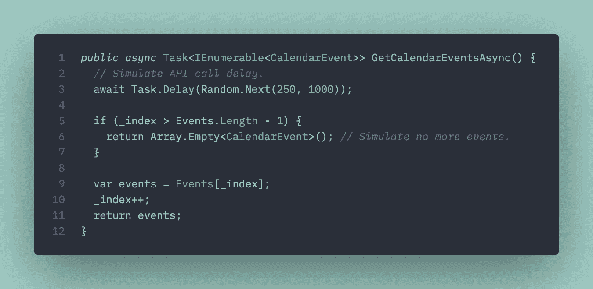

模拟一个延迟，然后将我们为提供者提供的事件集作为一组页面进行循环，就好像我们是从 API 中提取的一样。

如果你不熟悉 C#，`**Task<>**`相当于 TypeScript 中的`**Promise<>**`(或者只是 JavaScript 中的`**Promise**`)；如果你想了解 JavaScript、TypeScript 和 C#有多相似，请查看以下报告:

[](https://github.com/CharlieDigital/js-ts-csharp) [## GitHub-Charlie digital/js-ts-cs harp:一个展示 C# 10 函数技术的资源库…

### 这个库旨在突出 C#中可用的各种功能技术。点击此处阅读更多内容…

github.com](https://github.com/CharlieDigital/js-ts-csharp) 

出于模拟目的，我们的每个提供者都创建了一个事件列表，我们将对其进行分页:

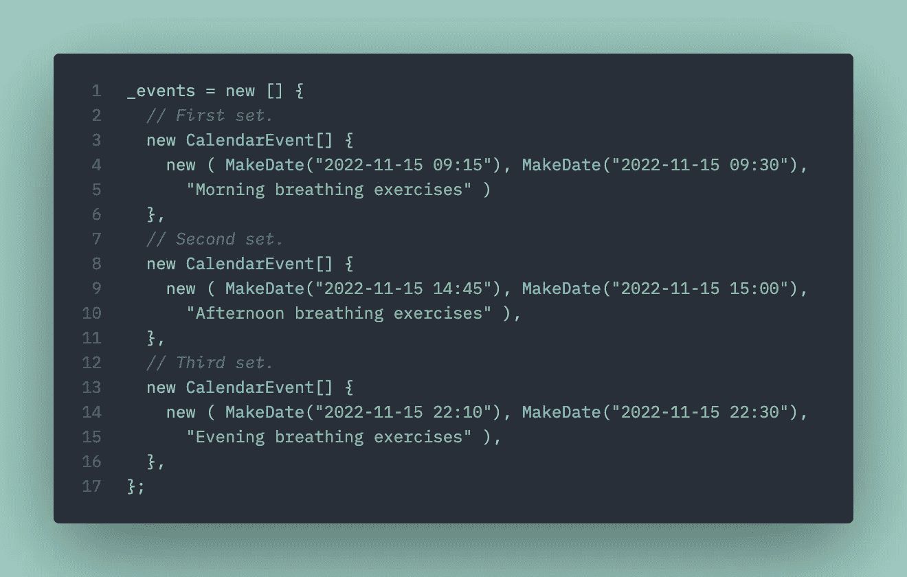

模拟在 3 个独立的 API 调用中返回 3 页事件。为了概念上的清晰，我将任务分成了“早上”、“中午”和“晚上”几组。

这将导致在对`**GetCalendarEventsAsync**`的调用中返回 3“页”的数据。

(您可以轻松地派生出代码并对其进行试验，看看不同的时间表会如何产生冲突。)

# 并发执行

该应用程序的核心是一组并发调用的简单设置，这些调用将使用一个`**System.Threading.Channel**`在并发执行和我们调度器中冲突检查器的聚合之间进行通信。

我们从创建渠道开始:

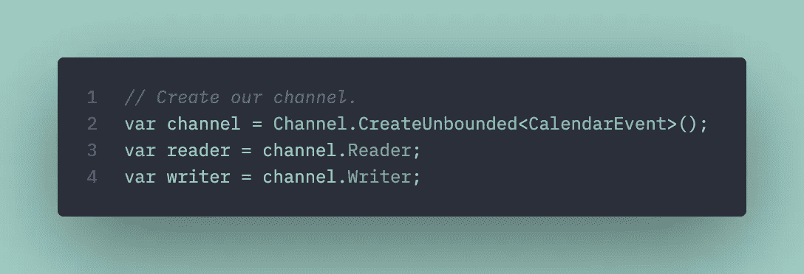

注意，我们的通道是强类型的——它接受 **CalendarEvent** 实例

现在我们立即开始我们的`Scheduler`:

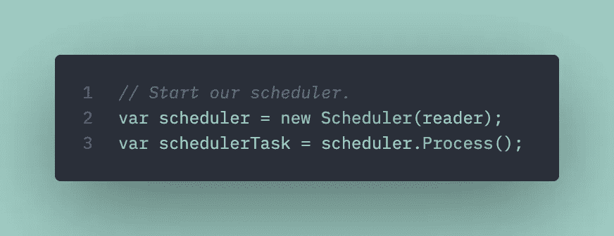

并为三个日历中的每一个设置我们的并发任务，这三个日历在通道的生产者端传递—`writer`:

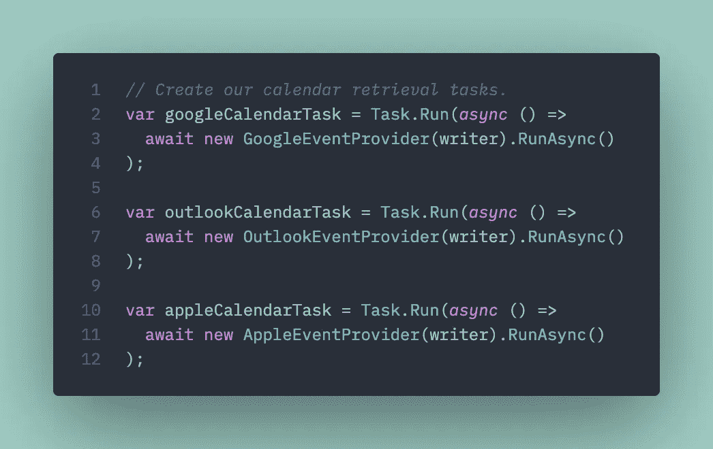

在第 3、7 和 11 行，我们将编写器传递给提供者，这样当我们同时检索事件时，它们可以写入通道。

上面的代码设置了我们的并发调用；每个日历提供者都获得一个对我们的`**writer**`的引用。

现在，我们等待所有提供程序完成，然后向我们的通道发出信号，表示写入已完成(我们已经从日历中获取了所有事件):


该通道包括一个内置的从编写器到读取器的信号机制。

最后，我们等待调度程序完成:

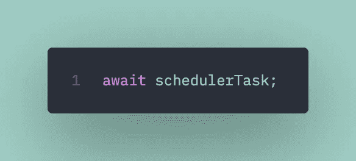

# 输出

在我们的示例中，我们将获得以下输出:

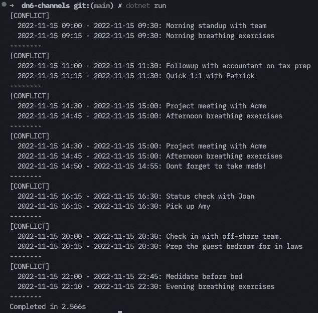

请注意，尽管我们总共运行了 12 次调用(最后一组调用返回 0 个结果，表示数据集结束),并且随机休眠了 1 秒，但我们的执行仅用了 2.566 秒就完成了(在这种情况下)！非常酷，几乎没有任何工作，使它并发！

现在让我们看看我们实际上是如何使用通道的。

# 制作方

这是*将*写入通道的一面。换句话说，当我们进行 API 调用和检索事件页面时，我们希望通过通道将这些事件推送到调度程序。

出乎意料的简单:

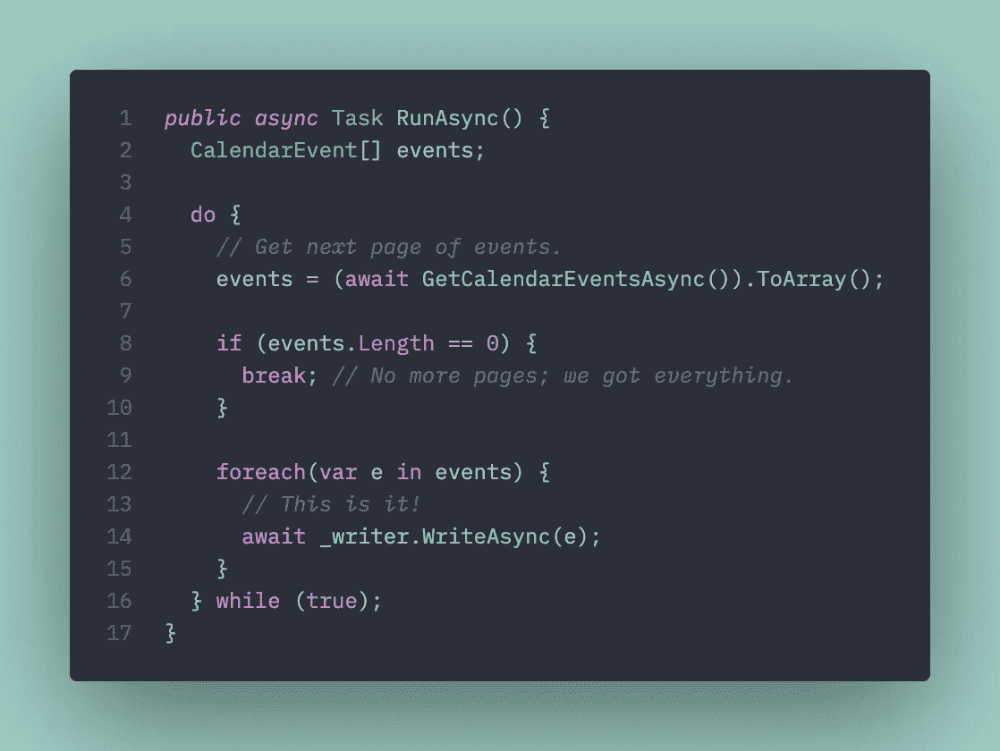

第 14 行是我们编写日历事件并将其推送到频道的地方。

当我们获取事件时，我们只需使用 writer end 将它们写入通道。我们的通道甚至是*强类型的:*

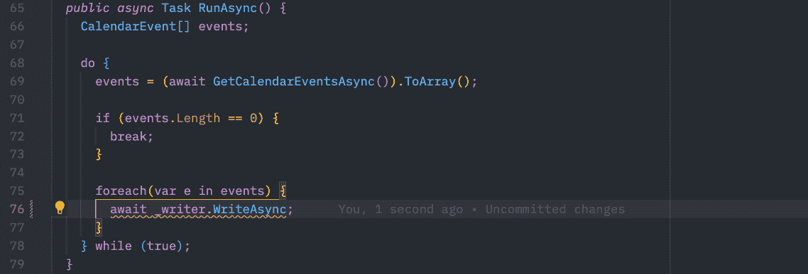

请注意，我们的通道期望编写一个 CalendarEvent 实例。

# 消费者方面

这是*从通道读取*的一面。在这种情况下，当我们的日历事件提供者进行 API 调用并返回结果并将它们写入通道时，我们将使用`**Scheduler**`从通道中读取并检查冲突。

它也出奇的简单:

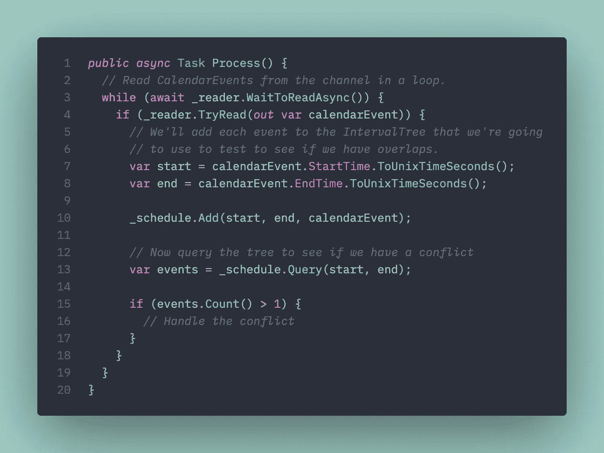

第 3-4 行是我们与渠道互动的地方。在第 10 行，我们将事件添加到间隔树中，然后在第 13 行和第 15 行进行测试，看看在间隔中是否有不止一个事件。

就是这样！

对`writer.Complete()`的调用向读取端发出信号，表明所有消息都已写入通道，我们可以退出循环。

像写端一样，读端也是*强类型*，所以我们确切地知道我们从通道中得到什么。

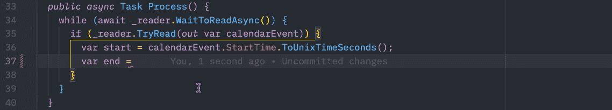

强类型，在读取端也有完整的智能感知。

[**间隔树**](https://en.wikipedia.org/wiki/Interval_tree) 是一个很好的奖励，通过简单地将事件添加到树中，然后查询树以查看给定间隔内是否有不止一个事件，可以非常容易地检测重叠。

几乎没有任何额外的努力或复杂性，我们已经编写了一个日历调度冲突检测引擎，它可以并发执行，并从多个端点检索事件以检测冲突！

# 包裹

我们只是触及了渠道的表面。创建复杂的、多生产者和多消费者的场景是可能的；多级数据处理流水线；并使用通道而不是基于锁的同步技术实现其他高吞吐量场景。

[Michael Shpilt 撰写了一篇精彩的文章，介绍了中不同同步技术的性能。NET](https://michaelscodingspot.com/performance-of-producer-consumer/) :

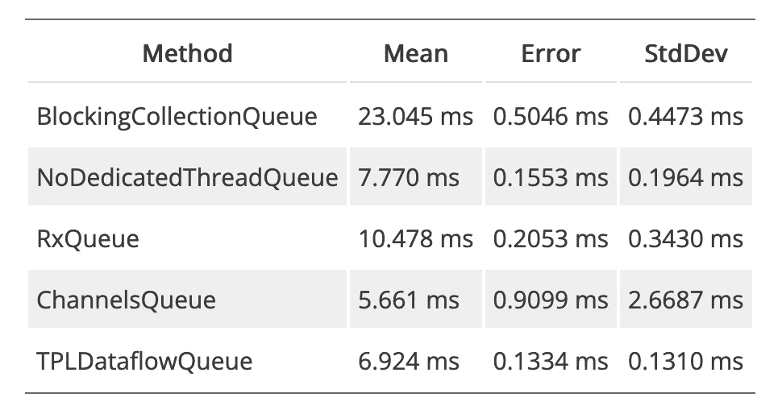

处理 10 万个作业；查看迈克尔的文章了解更多细节。

(需要注意的是，[内部实现的](https://github.com/dotnet/corefx/blob/master/src/System.Threading.Channels/src/System/Threading/Channels/UnboundedChannel.cs#L21) `[Channel](https://github.com/dotnet/corefx/blob/master/src/System.Threading.Channels/src/System/Threading/Channels/UnboundedChannel.cs#L21)` [实际上是一个](https://github.com/dotnet/corefx/blob/master/src/System.Threading.Channels/src/System/Threading/Channels/UnboundedChannel.cs#L21) `[ConcurrentQueue](https://github.com/dotnet/corefx/blob/master/src/System.Threading.Channels/src/System/Threading/Channels/UnboundedChannel.cs#L21)`)

`**System.Threading.Channels**`是考虑使用的众多理由之一。NET 和 C#来完成后端或计算密集型任务。对于可以并发运行的 I/O 密集型任务，使用通道可以显著提高性能和吞吐量。

如果你感兴趣，看看这些过去的文章:

*   [**c#与。NET**](/the-case-for-c-and-net-72ee933da304)
*   [**6。净神话被驱散**](https://blog.devgenius.io/6-net-myths-dispelled-celebrating-21-years-of-net-652795c2ea27)
*   [**用 C#实现功能**](/getting-functional-with-c-6c74bf279616)

如果您喜欢这篇文章，请关注并订阅电子邮件更新。在 Twitter[***@ chrlschn***](https://twitter.com/chrlschn)*或[LinkedIn](https://www.linkedin.com/in/charlescchen/)；我很想收到你的来信！*