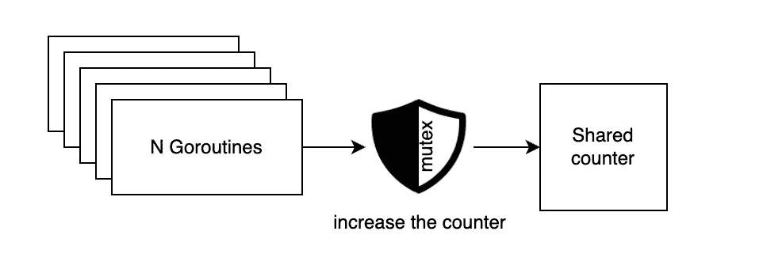
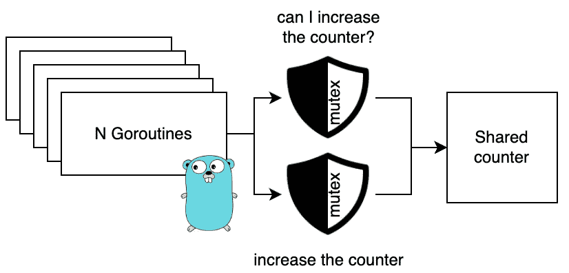
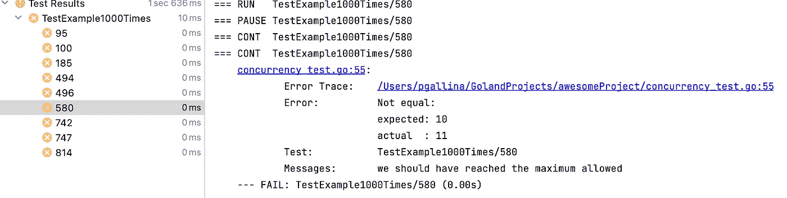

# 并发编程:为什么同步数据访问是不够的

> 原文：<https://itnext.io/concurrent-programming-why-synchronizing-data-access-is-not-enough-3b74e999ef7d?source=collection_archive---------1----------------------->

同步数据访问解决了并发编程的许多挑战。如果正确实现，您可以确保一次只允许一个工作流处理代码的共享部分。

另一方面，一个常见的问题是忘记原始数据(变量、属性/字段、对象等。)并不是唯一需要同步访问的数据。

# 陷阱

由于共享对象而检索或计算的数据可能会在您使用它隐藏微妙的错误之前被不同的线程/进程无效。例如，对于互斥体，只要您希望由于共享数据而做出的任何决定保持有效，就应该保持对共享数据的锁定。

> 一旦释放了独占锁，由于共享数据而检索或计算的所有内容都可能不再有效

## 方案

> 下面的代码展示了一个关于这个问题的虚拟例子，以及如何在带有*互斥* 的 [*Golang* 中重现这个问题，但是你可能会在带有*同步方法*的 *Java* 中遇到同样的问题。](https://gobyexample.com/mutexes)

让五个 Goroutines 同时增加一个计数器会导致不同步的问题。使用互斥体，您可以强制一次只有一个 Gorouting 来作用于计数器值，并保护自己免受意外行为的影响。



另一方面，即使数据访问总是与互斥体同步，您也不能依赖任何检索到的信息来检查计数器的值。

一旦你释放了互斥体，任何由于数据而做出的决定现在都是过时的和误导的。



即使没有其他的 Goroutine 可以直接访问`okToIncrease`，也有可能该变量在计算后立即无效。

```
**if** okToIncrease := d.isSafeToIncrease(); okToIncrease{
   d.increase()
}
```

因此，即使方法`isSafeToIncrease`和`increase`都利用互斥体来访问计数器，只要您进入`if`语句，Goroutine 就可能被暂停，当恢复时，您就面临溢出的风险。

这是因为锁定机制是在错误的级别实现的，忽略了数据是如何被使用的，并且我们应该“锁定”我们做出的决定。

# 代码

> 你可以在这里查看代码示例

例如具有带有互斥体的共享计数器，以同步来自不同例程的访问:

```
**const *maxCounter*** = 10

**type** data **struct** {
   m       sync.Mutex
   counter int
}

**func** (d *data) isSafeToIncrease() bool {
   d.m.Lock()
   **defer** d.m.Unlock()

   **return** d.counter < ***maxCounter*** }

**func** (d *data) increase() {
   d.m.Lock()
   **defer** d.m.Unlock()

   d.counter += 1
}
```

我们可以测试计数器，并注意到一切似乎都在按预期工作。计数器的值似乎尊重`maxCounter`，不会发生溢出。

```
**func** TestExample(t *testing.T) { d := &data{
      m: sync.Mutex{},
   }

   wg := &sync.WaitGroup{}

   wg.Add(2)
   **go** increaseNTimes(wg, d, 10)
   **go** increaseNTimes(wg, d, 10)
   wg.Wait()

   require.Equal(t, ***maxCounter***, d.getCounter())
}**func** increaseNTimes(wg *sync.WaitGroup, d *data, n int) {
   **defer** wg.Done()

   **for** i := 0; i < n; i++ {
      **if** d.isSafeToIncrease() {
         d.increase()
      }

   }
   **return** }
```

然而，如果我们运行相同的测试 1000 次，我们可以看到平均有 1%的时间失败。这是一个必须发现的错误，因为这是一个只在最后一次迭代中才会发生的数据竞争。拥有更高的 *maxCounter 将进一步减少 bug 的出现。*

```
**func** TestExample1000Times(t *testing.T) {
   **for** i := 0; i < 1000; i++ {
      t.Run(fmt.Sprint(i), TestExample)
   }
}
```



1000 次执行中有 10 次失败并导致计数器溢出

在这种情况下，解决方案是显而易见的，但在大型代码库中，如果不锁定大部分代码，发现和修复 bug 可能会更加复杂。

```
d.m.Lock()
**defer** d.m.Unlock()

**if** d.counter < ***maxCounter*** {
   d.counter += 1
}
```

【https://www.youtube.com/watch?v=oV9rvDllKEg】T2

## 外卖食品

在一个大而复杂的代码库中，发现它可能是一个棘手的问题。
要意识到这一点，特别是当你重构减少方法的大小以尊重 SRP(单一责任原则)时，你可能会试图过度减少互斥体的范围。
我回顾了几个结构完美、设计良好的代码挑战，但仍然存在这样的问题。

*   原始数据(变量、属性/字段、对象等)不是唯一需要同步访问的数据。
*   一旦释放了独占锁，由于共享数据而检索或计算的所有内容都可能不再有效