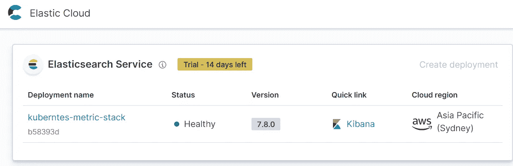
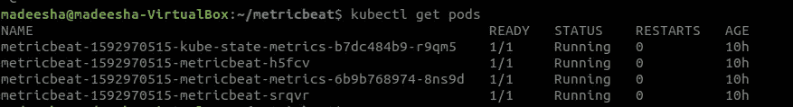
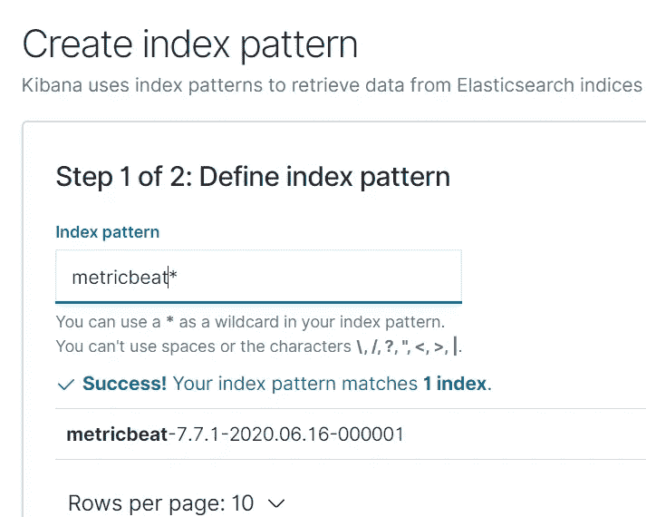
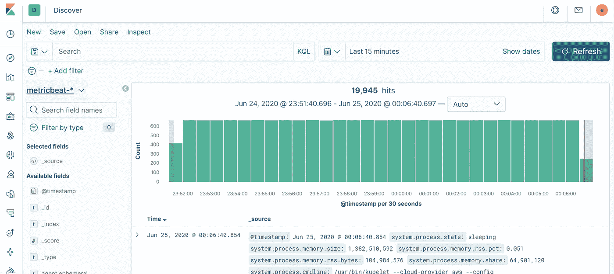
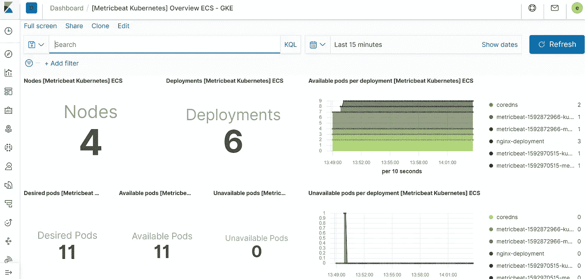
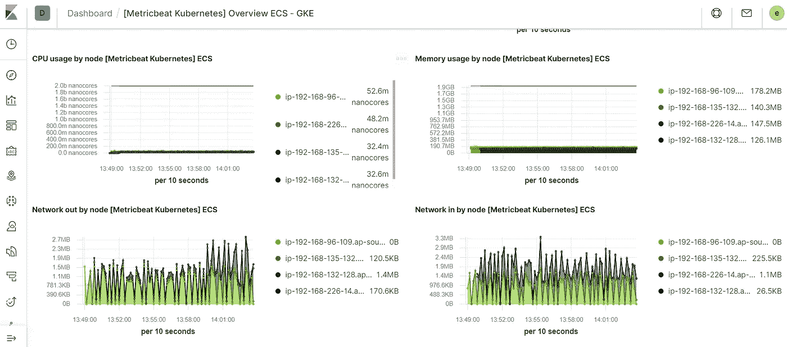

# 在 Kubernetes 上设置 Metricbeat 并配置 Kibana 仪表板以可视化集群数据

> 原文：<https://itnext.io/config-kibana-dashboard-to-visualize-your-kubernetes-cluster-data-20a87bd7111d?source=collection_archive---------2----------------------->

什么是基巴纳？

ibana 是一个开源应用程序，为 Elasticsearch 中的索引数据提供搜索和数据可视化功能。Kibana 主要充当监控和管理弹性堆栈集群的用户界面。

Kibana 通过创建条形图、饼图、表格、直方图和地图来简化数据分析。然后，仪表板视图将这些可视元素组合起来，然后通过浏览器共享，以提供实时分析视图。

您也可以使用 Kibana 来分析 Kubernetes 集群的健康状况。它允许您通过分布在任何云环境中的 pod、名称空间和节点来分析所有容器的健康状况。

今天，我将使用弹性搜索云来导出和可视化我的 Kubernetes 集群指标。

我已经使用 https://cloud.elastic.co/home 的弹性云[创建了一个弹性部署，如下图所示。](https://cloud.elastic.co/home)



现在，我将把 Kubernetes 集群指标导出到这个弹性云部署中。首先，我们需要将 metric-beat 部署部署到我们的 Kubernetes 集群。

您可以使用标准的 elastic helm repo 将 metric-beat 安装到集群中。但是要让 metric-beat 将指标发送到您的弹性云部署，您需要修改标准弹性/metricbeat repo 的 values.yaml。你可以使用[自定义数值。我提交给我自己的 git 回购的 YAML](https://github.com/madeesha/metricbeat/blob/master/values.yaml) 文件。将内容复制到一个本地文件，在文件中搜索“elastic_cloud_id”和“elastic_password ”,并用实际的 elastic cloud 部署 id 和密码替换它。确保在 values.yaml 文件中替换 daemonset 和 deployment 的值。然后使用该文件将 metric-beat helm chart 安装到您的 Kubernetes 集群中。

```
**helm repo add elastic https://Helm.elastic.co****helm install  metricbeat elastic/metricbeat -f values.yaml**
```

如果此命令成功，您将能够看到 metric beats pods 已成功部署到您的集群，如下所示。



现在，metric-beat 设置为向您的弹性云部署发送集群指标。然后我们可以在 Kibana 中配置索引模式，开始分析数据。在 Kibana 中，进入**管理→ Kibana →索引模式**页面，点击**创建索引模式**。Kibana 将自动识别和显示 Metricbeat 指数。

输入' *metricbeat-** '并在下一步选择 *@timestamp* 字段，以完成在 Kibana 中创建索引模式。

现在转到 **Kibana → Discover** 页面，您将看到从 Kubernetes 集群收集的所有指标都显示在那里。



现在剩下要做的就是创建一个 Kibana 仪表板来可视化指标数据。为此，我们可以简单地将 metric-beat 安装到我们的本地机器中，并将标准的 Kibana 仪表板加载到我们的 Kibana 部署中。

[安装公制节拍](https://www.elastic.co/guide/en/beats/metricbeat/7.7/metricbeat-installation.html):

```
**curl -L -O https://artifacts.elastic.co/downloads/beats/metricbeat/metricbeat-7.7.1-linux-x86_64.tar.gz
tar xzvf metricbeat-7.7.1-linux-x86_64.tar.gz**
```

然后打开 metric beat-7 . 7 . 1-Linux-x86 _ 64/metric beat . YAML 文件，取消“cloud.id”和“cloud.auth”变量的注释，并给出正确的值。cloud.auth 值应该是弹性用户名和密码的组合。

cloud . auth = " elastic:elastic _ cloud _ 密码"

然后您可以使用下面的命令加载 Kibana 仪表板，

```
**cd metricbeat-7.7.1-linux-x86_64**
**./metricbeat setup --dashboards**
```

之后，转到 Kibana →仪表盘→ [[Metricbeat Kubernetes]概述 ECS](https://7b68ae1bbdd745f6a7781fdfe6340ea2.ap-southeast-2.aws.found.io:9243/app/kibana#/dashboard/AV4RGUqo5NkDleZmzKuZ-ecs) 仪表盘，您将能够看到一个包含所有 Kubernetes 指标的漂亮仪表盘。



所以现在，你已经成功地配置了 Kubernetes metric-beat 与弹性云 Kibana 仪表板。干杯！！！