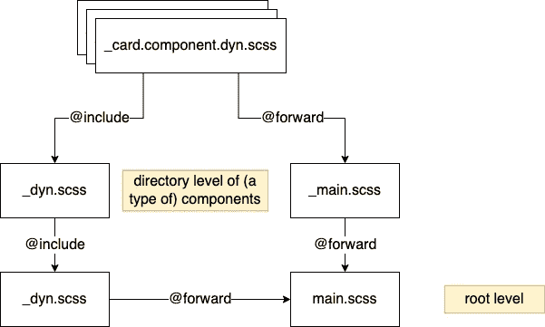

# 大型项目和 monorepos 的可配置主题和风格(角度示例)

> 原文：<https://itnext.io/configurable-themes-and-styles-for-big-projects-and-monorepos-angular-example-24be595ff2f8?source=collection_archive---------3----------------------->

对于大型前端项目，主题化的问题以及依赖于上下文的低级组件样式自然会出现。在任何给定的项目中，都有一个自定义的按钮组件、一张卡片和一个根据它们出现的页面使它们看起来不同的要求。组合这些基本组件的组件也是如此，以此类推。如果这敲响了警钟，这里有一个简单而有效的方法来处理这种情况，最精简的非黑客方式。

工作实例在[https://github.com/amdor/monorepo-dynamic-styles-example](https://github.com/amdor/monorepo-dynamic-styles-example)。


照片由 [Pawel Czerwinski](https://unsplash.com/@pawel_czerwinski?utm_source=medium&utm_medium=referral) 在 [Unsplash](https://unsplash.com?utm_source=medium&utm_medium=referral) 上拍摄

# 一个普通样式的包

需要同样几行代码的常见 CSS 问题应该被提取出来。省略就是一个例子。它总是这样

```
white-space: nowrap;
overflow: hidden;
text-overflow: ellipsis;
```

处理这个问题的一个简单方法是创建一个 npm 包，添加一个`main.scss`作为“公共 API ”,并通过暴露的 [mixins](https://sass-lang.com/documentation/at-rules/mixin) 包含所需的代码片段。这甚至可以应用于重复的*相似的* CSS 片段，它们只是在值上不同。

因为 SASS 很好地处理了导入，所以没有其他事情可做。发布软件包，将其添加到您想要使用它的应用程序中，然后执行`@use package-name as whatever;`，您就可以像这样自由地`@include whatever.ellipsis;`。

示例包:[https://github . com/amdor/mono repo-dynamic-styles-example/tree/master/common-styles](https://github.com/amdor/monorepo-dynamic-styles-example/tree/master/common-styles)

# 其他包装中的可定制组件(在 monorepo 中)

很多时候，我们需要创建一些组件，根据屏幕、平台，甚至是使用的组件，这些组件需要有不同的外观(❗️不依赖于❗️，这是针对预定义的静态场景)。如果仅仅是字体大小、颜色之类的差异，那么这只是简单的主题化，但也可能有其他情况。不仅如此，它们可能在不同的包装中。

## 错误的解决方案:

我们可以向组件添加一个输入。然后在组件代码内部，根据输入，比方说，不同的类被应用到组件的 HTML 中的元素，这触发了相关的 CSS 部分。

为什么不呢？这不仅是多余的(专门为此目的使用 JS、HTML 和 CSS)，而且违反了最佳实践，例如单一责任。

## 更好的解决方案:



简而言之，包含组件的包公开了 SCSS mixin 接口来控制整个应用程序和单个组件的样式。

*   该组件创建一个 mixin，它接受一个配置作为参数，并使用它来覆盖该组件的样式。

```
@mixin card-component-dynamic($config) {
  $component-config: map-merge(
    (
      lib-card-border: null,
    ),
    $config
  );

  .lib-card {
    border: map-get($component-config, lib-card-border);
  }
}
```

*   这是通过组件上一级的`_main.scss`进行`@forward`处理的，之后的所有内容都通过根`main.scss`转发给包消费者。这些层是必需的，因此当发生变化时，只需要修改一个文件，并且这个文件不会太大。

_main.scss

```
@forward './card/card.component.dyn';
@forward './button/button.component.dyn';
```

*   市电旁边有`_dyn.scss`档。这些是包含混合，包括每一个可配置的混合下一层。

_dyn.scss

```
@use "./card/card.component.dyn" as card;
@use "./button/button.component.dyn" as button;

@mixin lib($config) {
  @include card.card-component-dynamic($config);
  @include button.button-component-dynamic($config);
}
```

主网站

```
@forward './src/lib/main';
@forward './dyn';
```

这些使得在我们想要使用的地方直接`@include`组件的 mixin 成为可能，而且，通过像`@lib`这样的 mixin，我们可以定义一个应用程序级的配置来为所有组件提供一个基本主题。这很像[棱角分明的材料是如何构成的](https://github.com/angular/components/blob/fd5afe7038ad8d69648eaae80c7f07ac71f3a4c8/src/material/core/_core-theme.scss#L72)，只是稍微简单一点。

在应用程序中使用所有这些(在组件中)

```
@use "common-styles" as theme;
@use "components/main" as components;

.app-component {
  &-first-container > p {
    max-width: 200px;
    @include theme.ellipsis;
    @include theme.round-dotted-border(5px);
  }

  &-card-container {
    max-width: 300px;
    margin: 12px 0;
    @include components.card-component-dynamic((lib-card-border: 1px dotted blue));
  }
}
```