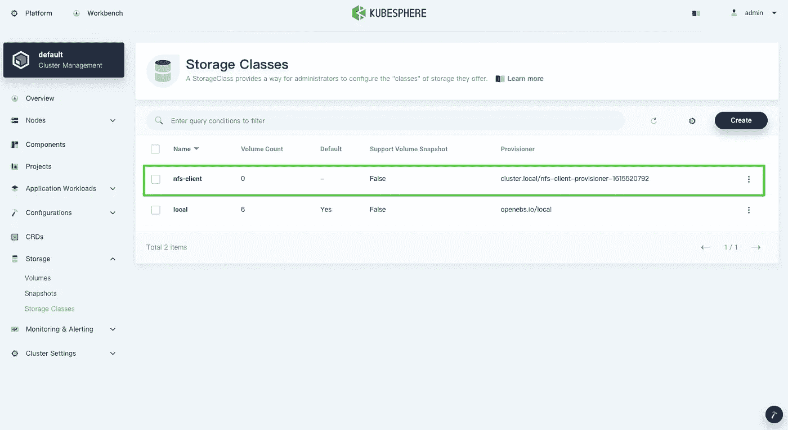
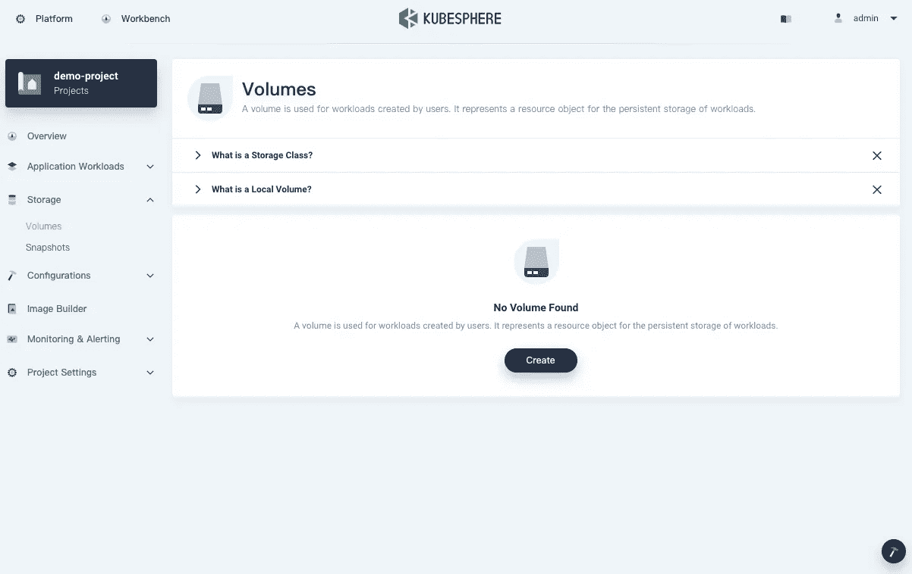
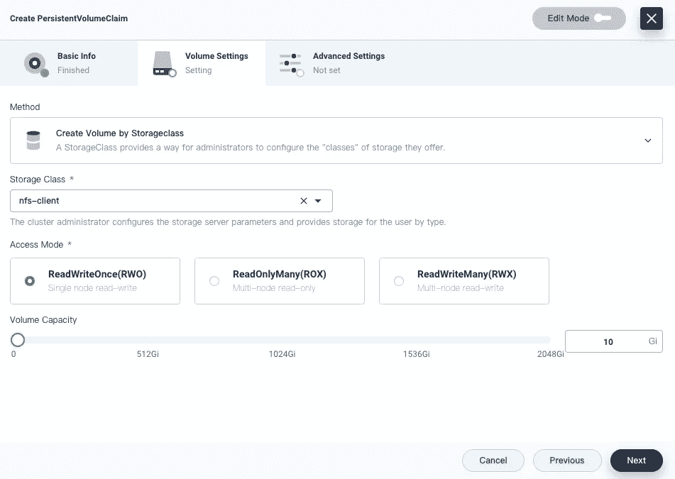
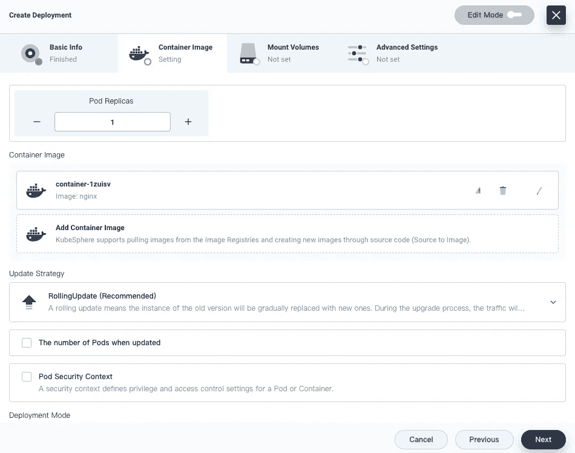
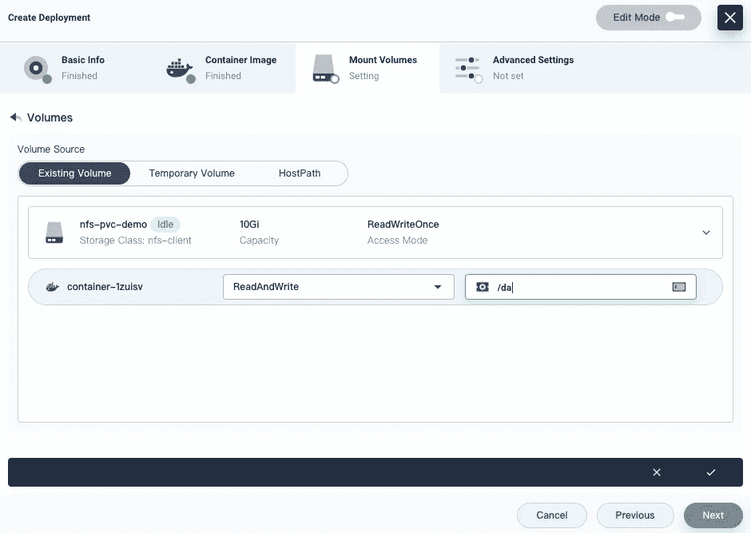
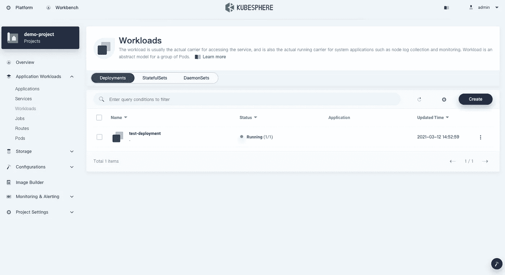
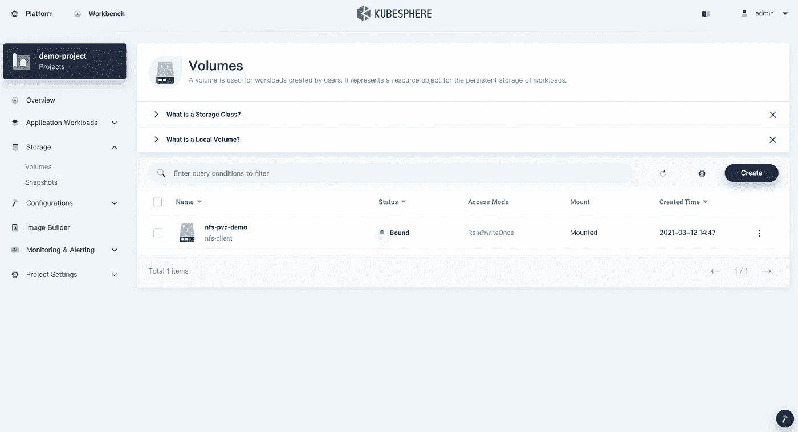
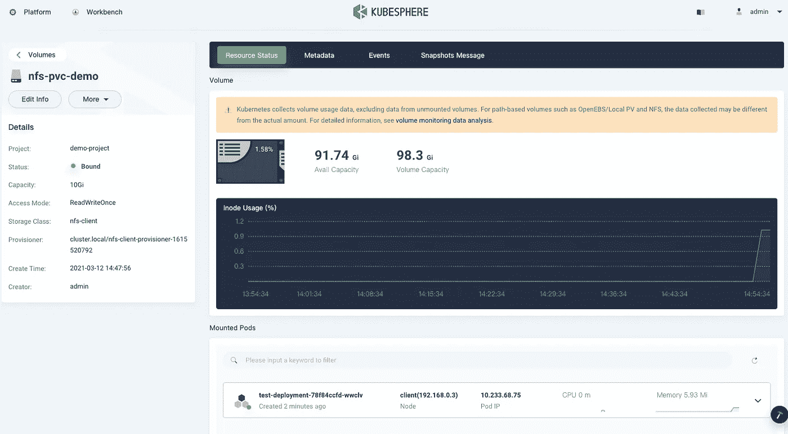

# 在现有的 KubeSphere 集群上配置一个 NFS 存储类，并创建一个 PersistentVolumeClaim

> 原文：<https://itnext.io/configure-an-nfs-storage-class-on-an-existing-kubesphere-cluster-and-create-a-persistentvolumeclaim-c4d4dc82442f?source=collection_archive---------2----------------------->

在我的[上一篇文章](https://kubesphere.io/blogs/install-nfs-server-client-for-kubesphere-cluster/)中，我谈到了如何使用 KubeKey 和 NFS 存储创建一个 Kubernetes 和 KubeSphere 集群。事实上，KubeSphere 为您提供了极大的灵活性，因为您可以在创建集群时使用 KubeKey 来安装 NFS 存储，同时它也可以单独部署在现有的集群上。

KubeSphere 拥有一个高度交互式的仪表盘，几乎所有的操作都可以在上面进行。在本文中，我将展示如何在现有的 KubeSphere 集群上配置一个 NFS 存储类，并使用该存储类创建一个 PVC。

# 开始之前

*   您已经[设置了一个 Kubernetes 集群，其中安装了 KubeSphere】。以下是我的集群信息，供您参考:](https://kubesphere.io/docs/quick-start/all-in-one-on-linux/)

```
# kubectl get node -o wideNAME     STATUS   ROLES            AGE   VERSION   INTERNAL-IP   
client   Ready    master,worker    17m   v1.17.9   192.168.0.3EXTERNAL-IP     OS-IMAGE               KERNEL-VERSION      
<none>          Ubuntu 16.04.4 LTS     4.4.0-116-genericCONTAINER-RUNTIME
docker://20.10.5
```

*   您有一个可用的 NFS 服务器，它为外部存储服务提供导出的目录。更多信息见[我之前的文章](https://kubesphere.io/blogs/install-nfs-server-client-for-kubesphere-cluster/#install-and-configure-an-nfs-server)。

# 配置客户端机器

这与我上次所做的基本相同，因为我们需要确保我们所有的客户端机器都可以使用基本的 NFS 客户端库和实用程序。

1.  运行以下命令以确保您使用的是最新的包。

`sudo apt-get update`

2.在所有客户端上安装`nfs-common`。

`sudo apt-get install nfs-common`

*注*

*对于基于 CentOS 的 Linux 发行版，需要安装* `*nfs-utils*` *。*

3.为了确保您可以使用 NFS 存储，您需要安装其相应的卷插件。因为默认情况下 Helm 是和 KubeSphere 一起安装的，所以我将通过 Helm 图表安装 [NFS 客户端供应器](https://github.com/kubernetes-retired/external-storage/tree/master/nfs-client)，包括它的存储类。首先运行以下命令添加一个存储库:

`helm repo add stable [https://charts.kubesphere.io/main](https://charts.kubesphere.io/main)`

*注*

*   *由于 NFS 本身没有内部供应器，我将使用 NFS 客户端供应器进行卷的动态供应。*
*   `*kubectl*` *被集成到 KubeSphere 的控制台中。您可以从 KubeSphere 仪表盘右下角的* ***工具箱*** *中运行命令。*

4.总计[NFS-客户供应方](https://github.com/kubernetes-retired/external-storage/tree/master/nfs-client)。

```
helm install stable/nfs-client-provisioner --set nfs.server=192.168.0.2 --set nfs.path=/mnt/demo
```

*注*

*   *在上面的命令中，用您自己的地址替换服务器 IP 地址和导出的目录。*
*   *对于头盔 3，必须指定旗帜* `*--generate-name*` *。*
*   *关于可配置参数的更多信息，参见本表* [*。*](https://github.com/kubesphere/helm-charts/tree/master/src/main/nfs-client-provisioner#configuration)

5.使用默认帐户和密码(`admin/P@88w0rd`)登录 KubeSphere 控制台，并转到**集群管理**页面上的**存储类**。您可以看到已经添加了 NFS 存储类。



# 创建一个 PVC 并将一个卷装载到一个工作负载

要将一个卷挂载到您的工作负载，您需要首先创建一个[PersistentVolumeClaim](https://kubernetes.io/docs/concepts/storage/persistent-volumes/#persistentvolumeclaims)(PVC)。如果您的存储类支持动态预配置，KubeSphere 会自动将创建的 PVC 绑定到满足您为 PVC 设置的请求(如访问模式和容量)的 [PersistentVolume](https://kubernetes.io/docs/concepts/storage/persistent-volumes/) (PV)。然后，您可以将其装载到您的工作负载中，以提供存储服务。

1.  在 KubeSphere 中，工作负载运行在不同的项目(即名称空间)中。转到一个项目，导航到**卷**页面，然后单击**创建**。



*注*

*   *在此页面上创建的所有对象本质上都是 PVC。*
*   *本文不关注 KubeSphere 的多租户系统，该系统具有不同的租户隔离级别。有关 KubeSphere 工作区和项目的更多信息，请参见本文*[](https://kubesphere.io/docs/quick-start/create-workspace-and-project/)**。**

*2.点击**创建**，为 PVC 设置一个名称和必要的参数。您可以选择`nfs-client`作为存储类别，如下图所示:*

**

**注**

**事实上，您也可以使用卷快照来创建卷，但您的存储类必须支持此功能。更多信息，请参见* [*卷快照*](https://kubesphere.io/docs/project-user-guide/storage/volume-snapshots/) *。**

*3.PVC 现在被绑定了。*

**

*4.转到**应用程序工作负载**并从**工作负载**创建一个部署。这里我以 NGINX 为例。*

**

**注**

**要在 KubeSphere 中创建工作负载，您可以像之前一样创建并应用 YAML 文件(右上角的* ***编辑模式*** *)。同时，您还可以在 KubeSphere 仪表盘上为您的工作负载逐个设置参数。我不会详细谈论整个过程，因为本文主要是关于如何配置存储和创建卷。查看 KubeSphere 文档* *以了解更多关于如何创建工作负载的信息。**

*5.在**挂载卷**选项卡上，点击**添加卷**并选择刚刚创建的 PVC。下面是我的配置，供你参考。有关仪表板属性的更多信息，请参见[卷](https://kubesphere.io/docs/project-user-guide/storage/volumes/)。*

**

*6.部署将在创建后很快启动并运行。*

**

*7.该卷也已成功装载。*

**

*8.单击 PVC 查看详细页面。*

**

# *摘要*

*我想一旦你准备好了你的 NFS 存储服务器，用 Helm 安装存储类就不是一件复杂的事情了(KubeSphere 默认为你安装 Helm)。至于创建和使用 PVC，KubeSphere 提供了一致的用户体验，因为您可以像往常一样从命令行创建您的资源。也就是说，尝试使用它的仪表板来创建 PVC 并不是一个坏主意，这样您就不用手动创建和应用任何 YAML 配置了。*

# *参考*

*[卷](https://kubesphere.io/docs/project-user-guide/storage/volumes/)*

*[持久卷和存储类](https://kubesphere.io/docs/cluster-administration/persistent-volume-and-storage-class/)*

# *关于 KubeSphere*

*KubeSphere 是一个基于 Kubernetes 的开源容器平台，其核心是应用程序。它提供全栈 It 自动化操作和简化的开发运维工作流。*

*[KubeSphere](https://kubesphere.io) 已被全球数千家企业采用，如 **Aqara、新浪、奔来、中国太平、华夏银行、国药控股、微众银行、Geko Cloud、VNG 公司、Radore** 。KubeSphere 为运维提供向导界面和各种企业级功能，包括 Kubernetes 资源管理、[、DevOps (CI/CD)](https://kubesphere.io/devops/) 、应用生命周期管理、服务网格、多租户管理、[监控](https://kubesphere.io/observability/)、日志记录、警报、通知、存储和网络管理以及 GPU 支持。有了 KubeSphere，企业能够快速建立一个强大且功能丰富的容器平台。*

*欲了解更多信息，请访问 [https://kubesphere.io](https://kubesphere.io/)*