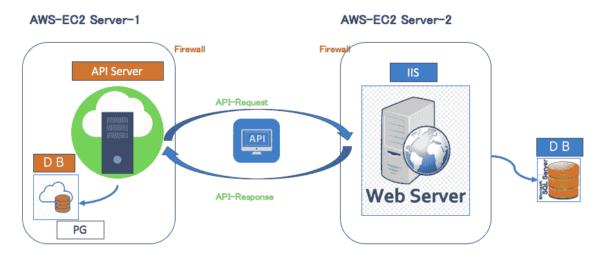
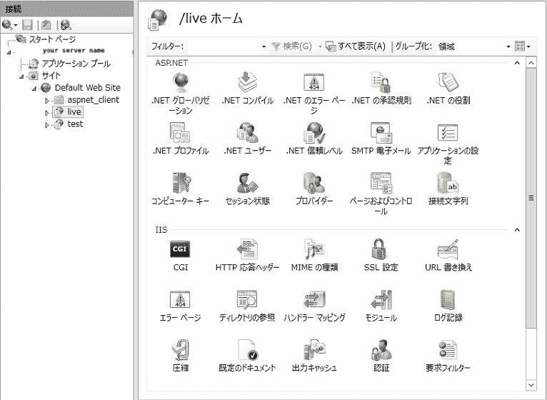
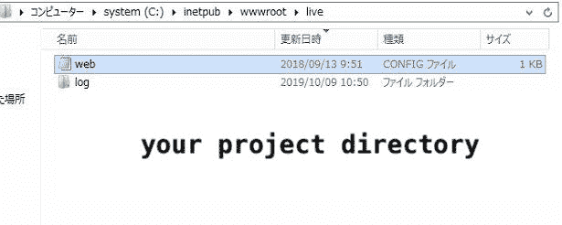

# 在 windows server 上使用 ruby on rails 应用程序配置 IIS

> 原文：<https://itnext.io/configure-iis-with-ruby-on-rails-app-on-windows-server-95f963bc7c5f?source=collection_archive---------6----------------------->

*顾名思义，RubyOnRails 在 Windows Server 上的应用部署？？？实际上？？*

是的，今天我想分享我的经验，我是如何在窗口服务器(IIS)上部署 Ruby 应用程序的。

大多数 Ruby 应用程序都部署在 Linux 系统上(cents、ubuntu、AMI) &从性能的角度来看，这也非常好，开发者也更喜欢在 Linux 系统上开发，因为与安装在 Windows 机器上相比，所有的 gem 都很容易安装在 Linux 机器上。

让我们回到主题，
在 2018 年，我们在 Windows 服务器上发布了 Ruby 应用程序，这已经快 1.5 年了，它运行得非常完美，没有出现任何大问题。关于这个问题，我稍后会讨论。

和大家分享系统架构。如果你觉得有帮助，请分享并留下你的评论。



起初我们在 Linux 机器上开始开发，但是突然我们知道我们必须在 Windows 服务器(IIS)上发布它。当时，我们与客户和车队内部讨论了所有的利弊，但这是一个上帝的愿望，要获得一个新的乘坐。我们接受了这个挑战。

在深入研究之前，
我研究了在 production env(窗口服务器)上部署 RubyonRails 应用程序有多大的实用性。我在互联网上找到了一些文章，但看起来像是关于开发环境的部署。

分享申请详情。
**语言:** Ruby
**框架:** Rails
**数据库:** SQL Server 2014
**平台:**Windows Server(2012)
**应用服务器:** Puma

现在是时候把它放入 windows 服务器了。

步骤 1:安装 Ruby 和 Rails 框架。这一步很容易，因为我过去也是这么做的。所以第一步很清楚。

第二步:在 Windows 上运行我们的应用程序。
众所周知，rails 默认提供 puma 服务器，所以我使用了 puma，虽然存在一些依赖问题，但已成功解决。最后，我们的应用程序处于运行模式。

**第三步:IIS 安装。**
可以找到很多安装 IIS 的文章。因为我们需要按照一些步骤来安装 IIS。所以这一步也很清楚，没有任何问题。

步骤 4:在 IIS 上部署应用程序。
打开 IIS 管理器，然后转到**站点**，右键点击**默认网站**和**添加新应用**。
如下图所述。



第五步:配置 web.config 文件。
这一步最难。为什么？？？
因为首先你必须创建一个 web.config 文件，其中包含 Ruby 应用程序的所有基本设置。
第二个 web.config 文件的位置(我应该把这个文件放在哪里，在 ruby 应用程序文件夹里面还是外面)。
第三是，如何在 IIS 中运行 puma 服务器。

我尝试了许多设置，在 IIS 和配置文件中做了许多更改。但是没有运气。

终于有一天，我成功地在 IIS 中运行了一个 Ruby 应用程序。耶…干杯。

下面的第一个是 web.config 文件，供您参考。第二，请将你的 web.config 文件复制到你的邮件目录下。(请查看下图。)
3、请检查下面的 web.config 文件。

设置和配置已完成。



**步骤 6:如何设置环境(在开发或生产模式下运行应用程序？).**
在 apache 或者 Nginx 中，很容易定义环境。但是这并不是一项容易的任务。所以下一个障碍是:在开发和生产环境中运行我们的应用程序。
这里是开发&生产环境的 **web.config** 。
**■开发环境:**

```
<?xml version=”1.0" encoding=”UTF-8"?>
<configuration>
 <system.webServer>
 <handlers>
 <add name=”httpplatformhandler” path=”*” verb=”*” modules=”httpPlatformHandler” resourceType=”Unspecified” /> 
 </handlers>
 <httpPlatform stdoutLogEnabled=”true” processesPerApplication=”1" stdoutLogFile=”log\rails.log” startupTimeLimit=”20" processPath=”C:\Ruby24-x64\bin\ruby.exe” arguments=”-S puma — env development — dir C:\inetpub\wwwroot\live\<your-project-folder-name> -p %HTTP_PLATFORM_PORT% “>
 <environmentVariables> 
 <environmentVariable name=”RAILS_ENV” value=”development” /> 
 </environmentVariables> 
 </httpPlatform> 
 </system.webServer> 
</configuration>
```

**■生产环境:**

```
<?xml version=”1.0" encoding=”UTF-8"?>
<configuration>
 <system.webServer>
 <handlers>
 <add name=”httpplatformhandler” path=”*” verb=”*” modules=”httpPlatformHandler” resourceType=”Unspecified” /> 
 </handlers>
 <httpPlatform stdoutLogEnabled=”true” processesPerApplication=”1" stdoutLogFile=”log\rails.log” startupTimeLimit=”20" processPath=”C:\Ruby24-x64\bin\ruby.exe” arguments=”-S puma — env production — dir C:\inetpub\wwwroot\live\<your-project-folder-name> -p %HTTP_PLATFORM_PORT% “>
 <environmentVariables> 
 <environmentVariable name=”RAILS_ENV” value=”production” /> 
 <environmentVariable name=”SECRET_KEY_BASE” value=”<generate-your-secret-key>” /> 
 </environmentVariables> 
 </httpPlatform> 
 </system.webServer> 
</configuration>
```

到目前为止，它运行良好。但是这是一个非常有趣的新组合(IIS 上的 ruby on rails)。

如果你有同样的情况，那么请仔细阅读这篇文章。希望有所帮助。

**■问题**寻找解决方案…

如果你在这篇文章中发现任何错误，请让我知道。

谢谢你的宝贵时间。

享受编码。


*原载于 2020 年 1 月 19 日 https://qiita.com*[](https://qiita.com/alokrawat050/items/d757b23a063435a2619c)**。**