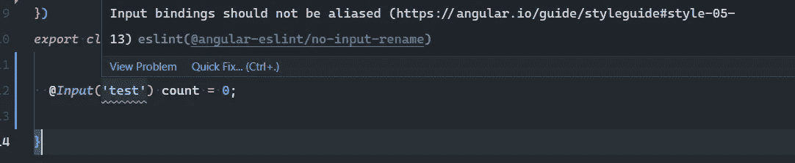
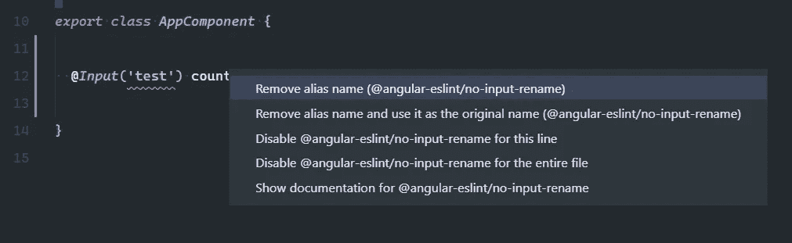
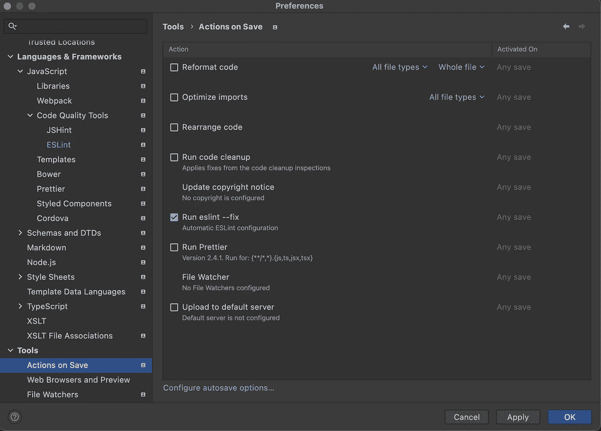

# 用 Angular 配置更漂亮的 ESLint

> 原文：<https://itnext.io/configure-prettier-and-eslint-with-angular-e7b4ce979cd8?source=collection_archive---------0----------------------->


用 Angular 配置更漂亮的 ESLint

每个人都想以快速无 bug 的方式编写代码，大多数时候都不考虑它的风格。这就是为什么在这篇文章中，我将讨论如何在一个[](https://angular.io/)****项目中配置[](https://eslint.org/)****和 [**更漂亮的**](https://prettier.io/) 。********

## ****ESLint 有什么帮助？****

****通过静态分析我们的代码，ESLint 可以发现问题，并为我们提供修复建议。它可以做得更好，它可以自动修复我们的代码(谁不想这样呢？).****

## ****安装和配置 ESLint****

****在这一节中，我将解释如何在 Angular 项目中安装 ESLint，并配置它以更好地符合 Angular 风格指南和社区标准。****

****使用以下命令打开终端并安装 ESLint schematics:****

```
**ng add @angular-eslint/schematics**
```

****就这样。感谢 [Angular-ESLint](https://github.com/angular-eslint/angular-eslint) 团队提供的` ***ng add*** `命令，现在我们已经安装并配置了 ESLint。****

****错误示例以及 ESLint 如何帮助修复错误:****

********

****关于角度输入绑定别名的 ESLint 错误****

********

****角度输入混叠的 ESLint 快速修复****

****我们也可以在终端中运行这个命令:****

```
**ng lint --fix**
```

****修复项目中所有可修复的 bug。****

## ****安装和配置更漂亮****

****即使我们让 ESLint 监视我们的代码是否有 bug，我们也需要一个工具来更好地设计和格式化它。这就是漂亮发挥作用的地方。****

****Prettier 是一个自以为是的代码格式化程序，它可以在我们每次保存代码时帮助我们以一种标准化的方式美化代码。****

****打开终端并键入:****

```
**npm install prettier --save-dev**
```

****或者如果你用的是纱线:****

```
**yarn add prettier -D**
```

****然后我们需要添加 **.prettierrc.json** 和[**。忽略我们根项目目录中的**](https://prettier.io/docs/en/ignore.html) 文件。****

****内部**。忽略**最好添加我们在**中拥有的任何东西。gitignore** 文件。****

****然后我们可以在项目中运行这个命令来格式化它。****

```
**npx prettier --write .**
```

****在 **.prettierrc.json** 中，我们可以通过覆盖它们来改变默认设置。****

****我大多数时候使用的设置是这样的:****

****我用的更漂亮的配置。****

****就这样更漂亮。但是我们还没有结束。****

> ****有时候，ESLint 和 T2 对代码格式和风格有不同的看法。这就是为什么我们需要调整这一部分。[更多信息请点击这里。](https://prettier.io/docs/en/integrating-with-linters.html)****

******配置更漂亮的作为 ESLint 插件使用******

****为了让 ESLint 和 pretty 更好地合作，我们需要让 pretty 作为 ESLint 插件运行。这样，我们只需调用 **ng lint — fix** ，ESLint 将修复 bug 并格式化代码。****

****打开终端并键入:****

```
**npm install prettier-eslint eslint-config-prettier eslint-plugin-prettier --save-dev**
```

****或者****

```
**yarn add prettier-eslint eslint-config-prettier eslint-plugin-prettier -D**
```

****现在我们需要编辑 **.eslintrc.json** 文件来包含更漂亮的插件。****

******VSCode 和 web storm shortcuts******

****就这样。我们已经完成了配置部分。****

****在我们编辑一个文件后，我们想格式化它，然后保存。这就是我们现在要为 [VS 代码](https://code.visualstudio.com/)和 [Webstorm](https://www.jetbrains.com/webstorm/) 配置的。****

*******首先确定你已经安装了***[***ESLint***](https://marketplace.visualstudio.com/items?itemName=dbaeumer.vscode-eslint)***和***[](https://marketplace.visualstudio.com/items?itemName=esbenp.prettier-vscode)****插件。WebStorm 对两者都有现成支持。********

*****对于 VS 代码，我们需要将这一行添加到 **settings.json** :*****

*****对于 Webstorm:
我们需要检查:**在保存设置页面的操作上运行 eslint-fix**:*****

**********

*****保存时修复文件*****

> *****在这里你可以找到总结出来的步骤:[Angular ESLint&beauty Configuration](https://gist.github.com/eneajaho/17bbcf71c44eabf56d404b028572b97b)*****

## *****如何自动化所有这些配置？*****

*****正如您所看到的，有许多您应该安装和配置的包。我可以自信地告诉你，有一种方法可以自动管理所有这些。**[**NX**](https://nx.dev)**就是答案。*********

## *****NX 是什么？*****

*****NX 是下一代**构建系统**，具有**一流的 monorepo 支持**和强大的集成。*****

*****如果我们*将我们的 Angular 应用程序迁移到 Nx monorepo* (有一个简单的[迁移路径](https://nx.dev/migration/migration-angular))我们可以免费获得所有这些配置。*****

*****但 NX 的特别之处在于一些疯狂的功能，如**计算缓存**、**智能重建**、**分布式任务执行**、**远程构建缓存**、**强大的代码生成器**、**编辑器插件**等。*****

********原来如此。感谢您的阅读！下一次再见。********