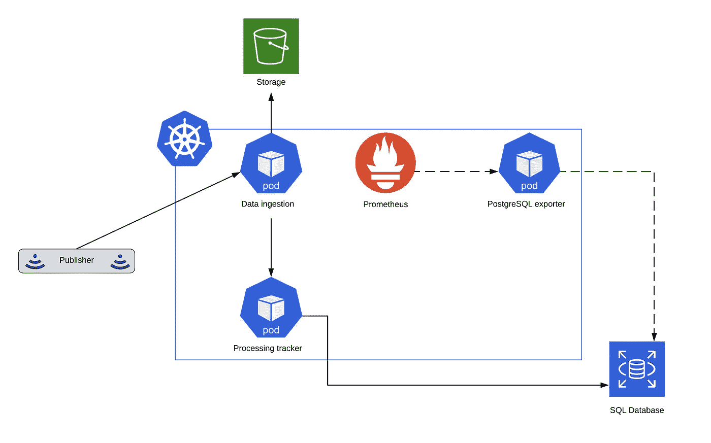
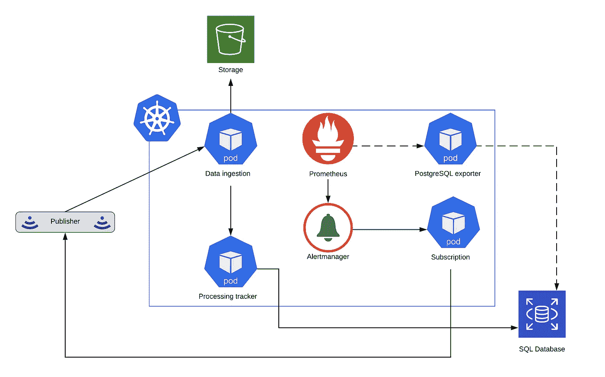

# 从 Kubernetes 中的关系数据库配置 Prometheus 抓取

> 原文：<https://itnext.io/configure-prometheus-scraping-from-relational-database-in-kubernetes-9b4466d16f85?source=collection_archive---------1----------------------->

对于那些在 Kubernetes 集群中安装了 Prometheus，并且愿意使用可以从 SQL 数据库中提取的定制业务指标的人来说，本文将会很有帮助。

# 先决条件

*   库伯内特星团
*   普罗米修斯在你的集群中像豆荚一样运行
*   SQL 数据库

# 简短的业务案例描述

## 成分

让我们描述一个我们将要实现的用例。假设我们有一个数据源，我们称之为**发布者**。

另一个组件是一个**数据接收**服务，处理一个重要的业务逻辑，并最终将结果存储在任何一种**存储中**。一旦处理完成，它可以有*成功*或*失败*的结果。

我们还有一个特殊的**处理跟踪器** (Tracker) 服务，负责通过 HTTP 通道接收数据摄取的结果。Tracker 服务也连接到 SQL 数据库，结果将保存在该数据库中。

最后但并非最不重要的元素是 **Prometheus** ，它目前只收集 Kubernetes 集群状态。


初始配置

## 任务描述

到目前为止很棒！现在我们有了新的要求。我们必须意识到在数据摄取中数据处理失败的情况。如果发生这种情况，我们必须立即通知我们的支持团队和第三个新的**订阅**服务，该服务将对数据源执行新的订阅。

## 解决办法

乍一看，很简单。您需要在基础设施中添加一些东西，以便能够访问数据库、执行查询并将结果存储在某个地方。应该分析该结果并进行通知。

幸运的是，有一个社区支持的数据库扫描器，它可以通过 SQL 调用扫描您的业务信息，并以 Prometheus 可理解的格式存储结果。然后，Prometheus 自己正在 ping 这个扫描仪并输入数据。

# 实施阶段

## 普罗米修斯出口商

为我们提供普罗米修斯度量格式的附加软件(扫描仪)称为普罗米修斯导出器。在官方文件中，你可以找到一个大的出口商名单。对于我们的例子，我们感兴趣的是 [postgresql 导出器](https://github.com/wrouesnel/postgres_exporter)。我们先安装一下。

## PostgreSQL 导出器安装

我们回到 Kubernetes 集群，使用 helm 来安装 PostgreSQL exporter。为了加快速度，你可以使用一张[现有的舵图](https://github.com/helm/charts/tree/master/stable/prometheus-postgres-exporter)。您的执行命令将如下所示:

```
helm upgrade --install --wait postgres-exporter \
 -f ./helm/postgres-exporter/values.yaml \
 stable/prometheus-postgres-exporter
```

导出器将尝试连接您的数据库，因此我们必须填写数据库配置属性。

## PostgreSQL 导出器查询定义

一旦我们的出口商能够连接到数据库，我们必须定义这些查询，将在每次刮擦时间执行。您可以用三种普罗米修斯指标[中的一种来标记查询中的每个选定值。](https://prometheus.io/docs/concepts/metric_types/)

在我们的例子中，我们希望将过去 5 分钟内发生的错误数量存储在 errors 变量中。因此，我们将错误标记为**规格**度量(14–16)。至此，您可以开始在 Prometheus 数据库中搜索<query _ name>_<GAUGE metric name>metric。指标的名称将是***pg _ failing _ event _ processing _ errors***。

此外，您可以在您的指标中包含几个额外的标签，作为**标签**的查询类型，因为它是用事件名称(17–19)完成的。

## 连接 Prometheus 和 PostgreSQL 导出程序

我们假设您已经在集群中安装了一个 Prometheus。如果没有，您可以找到[一个完美的掌舵图](https://github.com/helm/charts/tree/master/stable/prometheus)并为集群提供它。此外，我们将集中扩展一个输入配置文件，以便您可以等到文章结束。

好了，现在我们需要添加一个新的 scraper，它将在 Prometheus 端运行，并从 PostgreSQL exporter 中提取导出值。

看起来很简单，对吧？这里只有一个工作名称，频率和目标的地方刮的指标。我们刚刚使用了一个 PostgreSQL exporter 服务，它自动安装到带有 helm chart 的集群中，默认情况下有 80 个端口(第 5 行)。



Prometheus + PostgreSQL 导出程序

## 警报管理器

我们的系统必须配备 Alertmanager，它将负责在触发警报时向订阅服务发送通知。

Alertmanager 与 Prometheus chart 一起交付。您只需要提供一个适当的 *alertmanager.yml* 属性:

警报管理器配置

您可以找到关于[警报](https://prometheus.io/docs/prometheus/latest/configuration/alerting_rules/)的综合文档，并应用符合您目的的配置。

警报是包含 [PromQL](https://prometheus.io/docs/prometheus/latest/querying/basics/) 表达式的普罗米修斯实体。表达式会不时地被求值，一旦表达式变得有效，就会向 Alertmanager 发送适当的警报。

普罗米修斯警报

## 订阅服务

您还需要开发一个警报接收器。将会推出订阅服务。我们将引入一个用于 POST 请求的**/通知**端点和文档中定义的[消息数据模型](https://prometheus.io/docs/alerting/configuration/#webhook_config)。

## 确认

如果您现在部署 Prometheus，将状态为**ERROR**的警报放入数据库，并等待 5 分钟(您可以减少测试时间),然后您将看到警报已被检测到并发送到 Alertmanager，后者将消息进一步转发到订阅服务。



最终建筑

您可以按照自己的意愿自由管理收到的警报。在我们的例子中，我们希望订阅服务找出事件的来源，并通知它发生了错误，这意味着我们希望再次收到丢失的消息。

不要忘记，Alertmanager 已经能够向[预定义的系统](https://prometheus.io/docs/alerting/configuration/#webhook_config)发送消息。我们描述的方法是基于 webhook 的，旨在提供最灵活的警报消息处理方式。

# 结论

在本文中，我们学习了如何识别传入消息处理中发生的问题，以及如何执行操作以避免丢失数据。

我们观察了 Prometheus 导出器的现有实现。

接下来，我们安装了 PostgreSQL exporter 并定义了一个定期执行的查询。结果被普罗米修斯抓住，在内部坚持。

我们描述了如何配置 Alertmanager。之后，如果触发了特殊的 Prometheus 实体警报，将会生成一条适当的消息，并发送给充当代理的 Alertmanager，并将消息转发给 webhook。