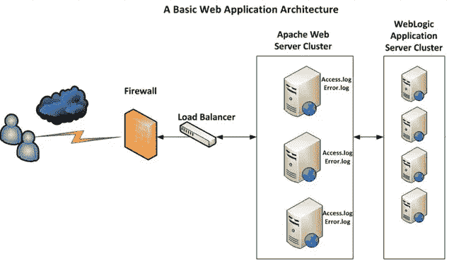
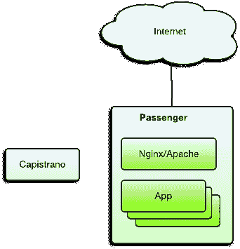
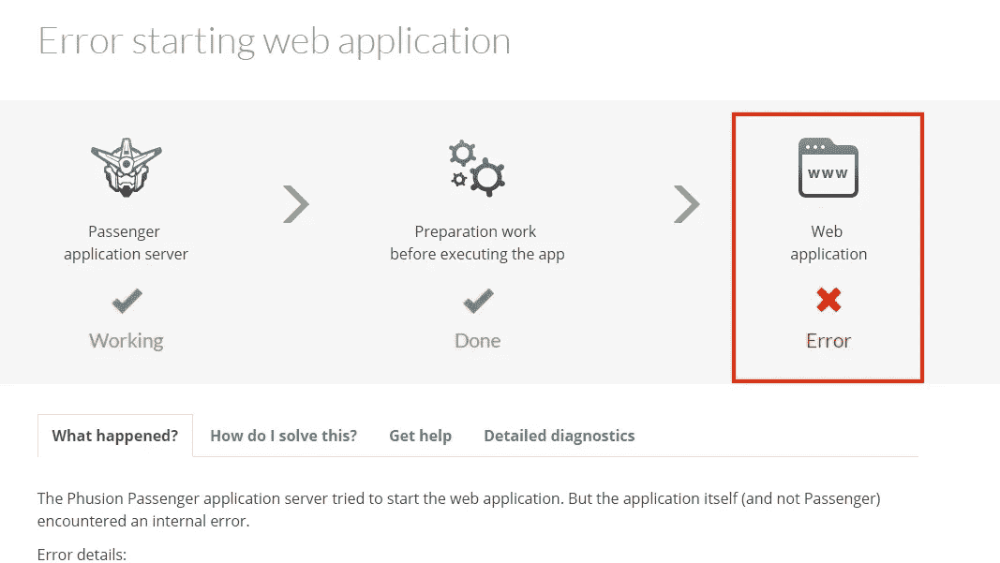

# 使用 CentOS 上的 Apache 和 Passenger 配置 Rails 应用程序

> 原文：<https://itnext.io/configure-rails-app-with-apache-and-passenger-on-centos-4b650adeb7d9?source=collection_archive---------4----------------------->


正如标题所描述的，我们将学习如何在 centOS 上使用 Apache & Passenger 配置我们的 RubyOn Rails 应用程序。

我花了很多时间阅读了很多文章，但我并不满意。所以，我决定和你分享我的经验，希望对你有帮助。如果你是一个初学者，不知道如何配置 apache 和 passenger，那么你是一个合适的地方。我也是第一次做这个配置。所以不需要担心，读完这篇文章你就可以配置你的应用了。

你们都是 RubyOnRails 的硕士，那就先从 Apache 和 passenger 的基础了解开始吧。

如果任何信息不正确或不合适，请与我分享正确的信息。

# ■什么是阿帕奇:

Apache Web Server 是一个开源的 Web 服务器创建、部署和管理软件。最初由一群软件程序员开发，现在由 Apache 软件基金会维护。



# ■什么是乘客:

Phusion Passenger 是一个开源的 web 应用服务器。它处理 HTTP 请求，管理进程和资源，并支持管理、监控和问题诊断。乘客非常易于使用，使得在生产中部署更加容易，并且是可伸缩的。



在开始之前，让我们检查主机名:
运行下面的命令

```
hostname
hostname -f
```

(第一个命令应该显示您的短主机名，第二个命令应该显示您的完全限定域名(FQDN))。

# 步骤 1——用 RVM 安装 Ruby

**注意:不要由 root 用户安装，最好安装其他用户，并且该用户应该有 sudo 访问权限。**

在我们做任何事情之前，我们应该运行一个快速更新，以确保我们下载的所有软件包都是最新的:

```
sudo yum update
```

如果您遇到以下错误，
**您的用户名不在 sudoers 文件中。这一事件将被记录和报告。**

下面是解决方案。
root**用户登录**，打开/etc/sudoers 文件，
**取消注释，允许组 wheel 成员执行任意命令** %wheel ALL=(ALL) ALL

结束了。

然后从 root 用户中退出，现在再次尝试更新。

```
sudo yum update
```

一旦完成，我们就可以开始安装 RVM，Ruby 版本管理器。

如果您的系统上没有 curl，您可以从安装它开始:

```
sudo yum install curl
```

要安装 RVM，请打开终端并键入以下命令:

```
curl -sSL [https://get.rvm.io](https://get.rvm.io) | sudo bash -s stable
```

如果出现“GPG 签名验证失败”的错误，屏幕上的说明应该描述如何检索和安装 RVM 签名密钥。例如:

```
gpg --keyserver hkp://keys.gnupg.net --recv-keys 409B6B1796C275462A1703113804BB82D39DC0E3
```

可以通过为当前会话加载 RVM 环境来启动 RVM。

```
source /etc/profile.d/rvm.sh
```

# 步骤 2 —安装 Ruby

一旦你使用了 RVM，安装 Ruby 就很容易了。

```
rvm install 2.4.1
```

Ruby 现在已经安装好了。然而，由于我们是通过一个拥有多种 Ruby 版本的程序来访问它的，我们需要告诉系统默认使用 2.4.1。

```
rvm use 2.4.1 --default
```

查看当前通过 RVM 安装的 Ruby 版本。

```
rvm list
```

安装捆绑器
捆绑器是管理应用程序 gem 依赖关系的流行工具。我们将在本教程中使用 Bundler，所以让我们安装它:

```
$ gem install bundler --no-rdoc --no-ri
```

可选:如果使用 Rails，安装 **Node.js**

```
sudo yum install -y epel-release 
sudo yum install -y --enablerepo=epel nodejs npm
```

# 步骤 3 —安装 RubyGems

下一步是确保我们拥有 Ruby on Rails 的所有必需组件。我们可以继续使用 RVM 安装宝石；在终端中键入这一行。

```
rvm rubygems current
```

# 步骤 4 —安装导轨

```
gem install rails
```

一旦一切就绪，就该安装 Rails 了。要开始，请打开“终端”并键入:

# 步骤 5 —安装 apache

**你必须以根用户身份登录。**
所需软件的安装说明

*   要安装 Apache 2:

```
yum install httpd
```

*   要安装 Apache 2 开发头:

```
yum install httpd-devel
```

*   要安装 Apache Portable Runtime (APR)开发头:

```
yum install apr-devel
```

*   要安装 Apache 可移植运行时实用程序(APU)开发头:

```
yum install apr-util-devel
```

**现在 apache 安装成功。**

# 步骤 6 —安装乘客

**注意:不要用 root 安装。**

用以下部件安装乘客宝石:

```
gem install passenger --no-rdoc --no-ri
```

-no-rdoc-no-ri 参数实际上并不必要，但是它跳过了一代 API 文档，从而加快了安装速度。

运行乘客 Apache 模块安装程序，并遵循屏幕上的说明:

```
passenger-install-apache2-module
```

在安装过程的最后，会要求您复制并粘贴一个配置片段(包含 LoadModule、PassengerRoot 等。)到 Apache 配置文件中。

```
LoadModule passenger_module /home/myuser/.rvm/gems/ruby-2.4.1/gems/passenger-5.3.1/buildout/apache2/mod_passenger.so
  <IfModule mod_passenger.c>
    PassengerRoot /home/myuser/.rvm/gems/ruby-2.4.1/gems/passenger-5.3.1
    PassengerDefaultRuby /home/myuser/.rvm/gems/ruby-2.4.1/wrappers/ruby
  </IfModule>
```

# 步骤 7 —启用并重启 httpd

允许 Apache 在引导时启动，并重新启动服务以使上述更改生效:

```
sudo systemctl enable httpd.service
sudo systemctl restart httpd.service
```

# 步骤 8-在 httpd.conf 上配置应用程序

要编辑 httpd.conf 文件，您必须以 root 用户身份登录。
您的 httpd 文件将位于以下路径。

```
/etc/httpd/conf
```

现在打开，

```
vi httpd.conf
```

在这个文件中做一些修改。

```
user <your_username>
ServerName <your_id>:80

<VirtualHost *:80>
ServerName http://aws.amazon.com/amazon-linux-ami/
# !!! Be sure to point DocumentRoot to 'public'! 
    RackEnv development
    RailsEnv development
    DocumentRoot /var/www/yourapp/current/public
    <Directory /var/www/yourapp/current/public>
        # This relaxes Apache security settings. 
        AllowOverride all
        # MultiViews must be turned off. 
        Options -MultiViews
        Order allow,deny
        Allow from all
        #Require all granted
        Options Indexes ExecCGI FollowSymLinks
       </Directory>
#    ServerAdmin webmaster@dummy-host.example.com
#    DocumentRoot /www/docs/dummy-host.example.com
#    ServerName dummy-host.example.com
#    ErrorLog logs/dummy-host.example.com-error_log
#    CustomLog logs/dummy-host.example.com-access_log common
</VirtualHost>
```

保存此文件。**(按 esc - > : - > wq - >回车。)**

**注意:这里我假设您已经使用 Capistrano 部署了您的应用程序。**

# 步骤 9-重新启动 httpd 服务

```
sudo systemctl restart httpd.service  
or 
service httpd start
```

# 步骤 10 —在防火墙中添加端口


配置防火墙以允许网络流量

```
sudo firewall-cmd --add-service=http --permanent && sudo firewall-cmd --add-service=https --permanentsudo systemctl restart firewalld
```

(它仅适用于端口 80)

如果你要在不同的端口上设置你的应用程序，那么使用下面的命令。

```
firewall-cmd --permanent --zone=public --add-port=<your_port>/tcp
firewall-cmd --reload
```

完成了。现在转到您的浏览器，打开您的应用程序。


# 解决纷争



1.  **如果您遇到错误，请查看以下路径的错误日志。**

```
/etc/httpd/logs
```

运行以下命令，检查错误:

```
tail -f error_log
```

**2。如果有 bundler 错误，那么试试这个。**
转到您的部署目录(在 centOS 上)并运行以下命令:

```
gem list
gem install bundler
bundle install
```

应该是工作。


祝你今天开心！玩的开心！
享受编码。


谢谢，

*原载于*[*qiita.com*](https://qiita.com/alokrawat050/items/ecd864a098198ebb3537)*。*