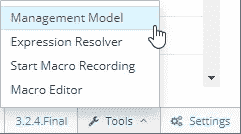

# 用 Galleon 配置 EAP 子系统

> 原文：<https://itnext.io/configuring-eap-subsystems-with-galleon-9c824684a7bd?source=collection_archive---------5----------------------->

虽然绿地 Java 开发更有可能从基于 Spring Boot、Microprofile 或 Quarkus 的 API 驱动设计开始，但在传统 JEE 运行时基础上构建的遗留应用程序仍有很长的寿命。人们不应该为了获得容器化的好处而大量重构现有的应用程序。

但是传统环境通常会有特定于应用程序的配置调整。配置传统的 JEE 运行时并没有想象中那么简单。直到最近，还没有容易的中间立场；开发人员要么必须满足于现成的 EAP 配置，要么覆盖整个服务器配置的副本。后者意味着在两次发布之间手动将上游变更集成到他们的定制版本中。EAP 7.3 通过一个名为 [Galleon](https://docs.wildfly.org/galleon/) 的工具增加了选择，该工具允许开发人员管理较小的服务器配置。

不幸的是，简单的 Galleon 例子仍然少之又少。让我们通过应用一个小的服务器配置更改来支持一个遗留应用程序，从而解决这个问题。

我们的遗留应用程序通过 POST 方法将大量参数发送回服务器。EAP 7.3 将 POST 和 query 参数的限制设置为 1000 个。这是很多，但传统应用程序发送的更多。在我们的传统环境中，我们已经在回流子系统的 HTTP 侦听器上设置了 [max-parameters](https://access.redhat.com/solutions/2757361) 。让我们看看如何在 Galleon 上实现这一点。

# 查找配置路径

Galleon 的配置似乎遵循 EAP API。有几种方法可以找到路径。

服务器的 web UI 包括一个用于管理模型的浏览器，可在右下角的“工具”下访问。容器化安装不会启用 web UI，但是 JBoss CLI 实用程序可以用来查找相同的信息。

为此，我们将使用 Docker 启动 EAP 映像的副本，并使用`docker exec`在单独的窗口中运行 CLI 工具。(类似的，Kubernetes 用户启动一个裸 pod，用`kubectl exec`代替。)

`$ docker run -it --rm --name eap73 registry.redhat.io/jboss-eap-7/eap73-openjdk11-openshift-rhel8`

EAP 现在运行在一个名为`eap73`的容器中。我们现在将从另一个窗口启动 CLI。

`$ docker exec -it eap73 /opt/eap/bin/jboss-cli.sh --connect`

我们应该看到这样的提示:

`[standalone@localhost:9990 /]`

可以通过`ls`和`cd`探索 CLI。在某些领域，它使用`/`作为路径分隔符。在其他情况下，它使用`=`。制表符补全会有所帮助，因为它会在适当的时候自动添加`=`。

我们想配置回流子系统。键入`ls /sub`并点击<标签>会导致`ls /subsystems=`。我们执行:

继续以这种方式，我们进一步深入。

就在那里:`max-parameters=1000`，在`/subsystem=undertow/server=default-server/http-listener=default`。

您可以使用 Control-C 关闭两个终端窗口。我们在 EAP 管理模型中有路径。

但是现在我们该怎么办呢？

# 使用 Galleon 应用配置

总体目标是将我们的应用程序容器化。当通过 S2I 调用时(通过 [S2I CLI](https://github.com/openshift/source-to-image/releases) 或通过 OpenShift BuildConfig)，EAP 镜像可以调用 Galleon 来应用自定义配置。该配置应该包含在`galleon/provisioning.xml`的源代码树中。

我们将从一个基于 Red Hat 的[文档](https://access.redhat.com/documentation/en-us/red_hat_jboss_enterprise_application_platform/7.3/html/getting_started_with_jboss_eap_for_openshift_container_platform/capability-trimming-eap-foropenshift_default#custom-provisioning-files-jboss-eap_default)的最小文件开始。

回想一下，EAP 管理模型中的路径是`/subsystem=undertow/server=default-server/http-listener=default`。我们将通过在`<config/>`元素中添加一个新块来将其映射到 Galleon 配置。我们将在每个路径元素上进行构建，以获得最终的块。

第一个`/subsystem=undertow`。

接下来是`/subsystem=undertow/server=default-server`。

注意名称(default-server)是如何指定的:作为一个`<param>`，其名称和值取自 CLI 路径的末尾。也就是`server=default-server`变成了`<param name=”server” value=”default-server”/>`。

如果我们省略了这个`<param>`条目，Galleon 将会报告“Non-nil lable parameter server of { EAP-servlet @ maven(org . JBoss . universe:product-universe)} subsystem . under flow . server 尚未初始化”并失败。

让我们按照这个模式来添加 HTTP 侦听器。

最后，我们可以包含我们想要设置的属性。

我们将这个插入到我们之前的最小`galleon/provisioning.xml`中，现在已经完成了。

# 确认

让我们证明这是可行的。为了使用 CLI 进行测试，将我们的`galleon/provisioning.xml`添加到您的 Maven 项目中，然后运行构建。

`$ s2i build . registry.redhat.io/jboss-eap-7/eap73-openjdk11-openshift-rhel8 app`

像以前一样，让我们使用 EAP CLI 来检查。这里有细微的变化；我们将我们的容器映像称为`app`，S2I 的输出将 jboss-cli.sh 放在一个不同于原始 EAP 映像的路径中。

在一个终端上:

`$ docker run -it --rm --name app app`

服务器启动后，从另一个窗口启动 CLI:

`$ docker exec -it app /s2i-output/server/bin/jboss-cli.sh --connect`

看看我们的 http-listener 配置。

成功！S2I 进程构建了我们的应用程序，并创建了一个定制的服务器配置，其中包括我们指定的最少量的配置。