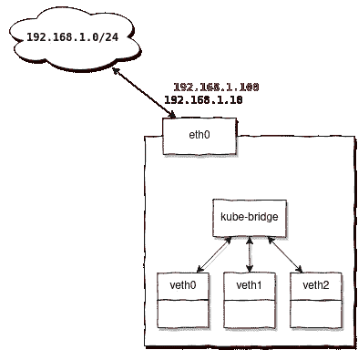
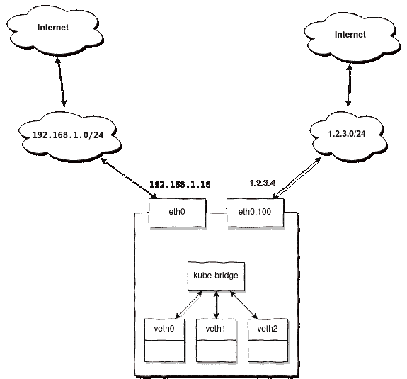
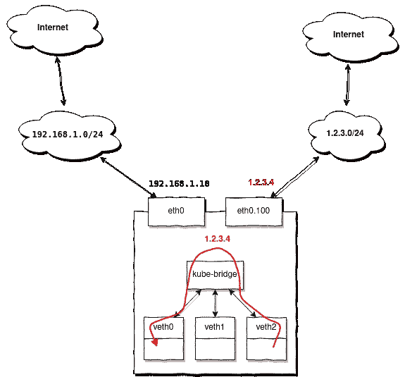
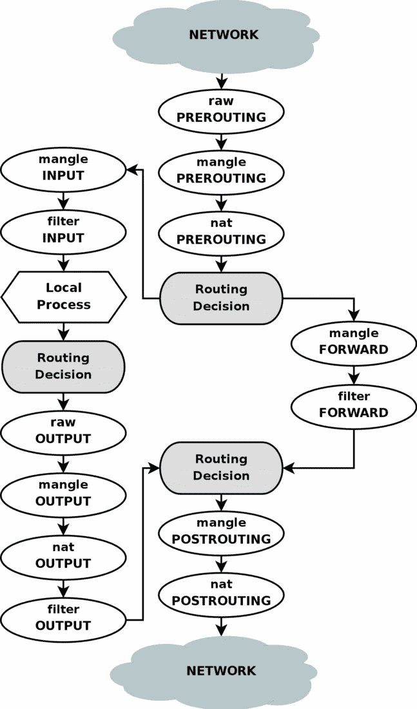

# 在 L2 模式下为 MetalLB 配置路由

> 原文：<https://itnext.io/configuring-routing-for-metallb-in-l2-mode-7ea26e19219e?source=collection_archive---------0----------------------->


不久前，我还面临着一个非常不寻常的任务，为 MetalLB 配置路由。所有这些都不算什么，因为 MetalLB 通常不需要用户进行任何额外的配置，但是在我们的例子中，有一个相当大的集群，其网络配置非常简单。

在本文中，我将向您展示如何为集群上的外部网络配置基于源和基于策略的路由。

我不会详细讨论 MetalLB 的安装和配置，因为我假设您已经有了一些经验。先了解本质，配置路由。所以我们有四种情况:

# 情况 1:当您不需要配置任何东西时

让我们考虑一个简单的案例。



当 MetalLB 发出的地址与您的节点上配置的地址位于同一子网时，不需要额外的路由配置。

例如，您有一个子网`192.168.1.0/24`，它有一个路由器`192.168.1.1`，并且您的节点有地址:`192.168.1.10–30`，那么您可以为 MetalLB 配置范围`192.168.1.100–120`，并确保它无需任何额外配置即可工作。

为什么这样因为您的节点已经配置了路由:

```
# ip route
default via 192.168.1.1 dev eth0 onlink 
192.168.1.0/24 dev eth0 proto kernel scope link src 192.168.1.10
```

来自同一子网的地址将重复使用它们，无需任何额外设置。

# 案例 2:当您需要额外的配置时


每当您的节点没有为 MetalLB 发出地址的子网配置 IP 地址或路由时，您都需要配置额外的路由。

我会更详细地解释。每当 MetalLB 发出一个地址时，这可以被比作一个简单的分配，例如:

```
ip addr add 10.9.8.7/32 dev lo
```

请注意:

*   **a)** 该地址分配有前缀`/32`，因此该子网的路由不会自动添加(这只是一个 IP 地址)
*   **b)** 可以在节点上的任何接口上分配地址(例如，环回)。这里值得一提的是 Linux 网络栈的特性。不管您在哪个接口上添加地址，内核总是处理 arp 请求并向其中任何一个发送 arp 回复，这种行为被认为是正确的，而且，它在 Kubernetes 这样的动态环境中被广泛使用。

例如，可以通过启用严格 arp 来配置此行为:

```
echo 1 > /proc/sys/net/ipv4/conf/all/arp_ignore
echo 2 > /proc/sys/net/ipv4/conf/all/arp_announce
```

在这种情况下，只有当接口明确包含特定的 IP 地址时，才会发送 arp 回复。如果您计划使用 MetalLB 并且您的 kube-proxy 在 IPVS 模式下工作，则需要此设置。

尽管如此，MetalLB 并不使用内核来处理 arp 请求，而是在用户空间中自行处理，因此该选项不会影响 MetalLB 的操作。

让我们回到我们的任务。如果您的节点上不存在已发布地址的路由，请提前将其添加到您的所有节点:

```
ip route add 10.9.8.0/24 dev eth1
```

# 案例 3:当您需要基于源的路由时

当您通过单独的网关(而不是默认配置的网关)接收数据包时，您需要分别配置基于源的路由，响应数据包必须通过同一个网关。

例如，您为节点分配了相同的子网`192.168.1.0/24`,但您希望使用 MetalLB 发布外部地址。假设您有几个来自位于 VLAN 100 的`1.2.3.0/24`子网的地址，并且您想使用它们从外部访问 Kubernetes 服务。



当访问`1.2.3.4`时，您将从`1.2.3.0/24`之外的不同子网发出请求，并等待响应。当前包含由 MetalLB 分配的地址`1.2.3.4`的节点将从路由器`1.2.3.1`接收数据包，但是对它们的应答必须通过`1.2.3.1`沿着相同的路由进行。

由于我们的节点已经配置了默认网关`192.168.1.1`，默认情况下，这些响应包将通过它，而不是通过我们接收原始包的`1.2.3.1`。

那么如何应对这种情况呢？

在这种情况下，您需要准备好所有节点，以便在不进行额外配置的情况下为外部地址提供服务。也就是说，对于上面的示例，您需要提前在节点上创建一个 VLAN 接口:

```
ip link add link eth0 name eth0.100 type vlan id 100
ip link set eth0.100 up
```

然后添加路线:

```
ip route add 1.2.3.0/24 dev eth0.100 table 100
ip route add default via 1.2.3.1 table 100
```

注意，我们将路由添加到单独的路由表`100`中，它将只包含通过`eth0.100`接口和`1.2.3.1`网关发送响应数据包所需的两条路由。

现在我们需要添加一个简单的规则:

```
ip rule add from 1.2.3.0/24 lookup 100
```

其中明确表示:如果数据包的源地址在`1.2.3.0/24`中，则使用路由表`100`。我们已经添加了将通过`1.2.3.1`网关发送的路由。

# 案例 4:当您需要基于策略的路由时

网络拓扑与上例相同，但假设您也希望能够从 pod 内部访问`1.2.3.0/24`范围的外部地址:



独特之处在于，当访问`1.2.3.0/24`中的任何地址时，到达节点并且源地址在范围`1.2.3.0/24`内的响应包将顺从地通过`eth0.100`发送，但是我们希望让 Kubernetes 将其重定向回我们的第一个 pod，这是由原始请求生成的。

解决这个问题并不容易，但多亏了基于策略的路由，这才成为可能。

让我们从前面的例子开始，创建一个额外的路由表并向其中添加所需的路由:

```
ip route add 1.2.3.0/24 dev eth0.100 table 100
ip route add default via 1.2.3.1 table 100
```

**方法由** [**乔治·舒克林**](https://medium.com/u/d67b2f5867f9?source=post_page-----7ea26e19219e--------------------------------) 提出

在这篇文章发表后，我得到了一个更简单、更优雅的方法来解决这个问题，为此你只需要添加两条规则:

```
ip rule add from 1.2.3.0/24 lookup 100
ip rule add from 1.2.3.0/24 to 10.112.0.0/12 lookup main
```

其中:

*   `1.2.3.0/24` —是外部网络
*   `10.112.0.0/12` —是你的 podNetwork

为了获得最高优先级，第二个规则必须添加在第一个规则之后。

**带连接标记的方法**

为了更好地理解，我将在这里提供一个 netfilter 框图:



现在添加一些 iptables 规则:

```
iptables -t mangle -A PREROUTING -j CONNMARK --restore-mark
iptables -t mangle -A PREROUTING -m mark ! --mark 0 -j RETURN
iptables -t mangle -A PREROUTING -i bond0.100 -j MARK --set-mark 0x100
iptables -t mangle -A POSTROUTING -j CONNMARK --save-mark
```

这些规则将标记到`eth0.100`接口的传入连接，通过将`0x100`标记添加到其中的所有数据包，同一连接内的响应数据包也将被标记相同的标记。

现在我们可以添加一个路由规则:

```
ip rule add from 1.2.3.0/24 fwmark 0x100 lookup 100
```

也就是说，所有带有源地址`1.2.3.0/24`和标签`0x100`的数据包都应该使用表`100`进行路由。

因此，来自其他接口的其他数据包将不满足此规则，这允许它们使用标准 Kubernetes 机制进行路由。

在 Linux 中还有一个东西，它被称为反向路径过滤器，s̶p̶o̶i̶l̶s̶̶t̶h̶e̶̶w̶h̶o̶l̶e̶̶r̶a̶s̶p̶b̶e̶r̶r̶y 执行一个简单的检查:对于所有传入的数据包，它将源地址更改为目的地址，并检查数据包是否可以通过接收它的同一个接口，如果不能，那么它将被内核丢弃。

问题是在我们的例子中它不能正常工作，但是我们可以禁用它:

```
echo 0 > /proc/sys/net/ipv4/conf/all/rp_filter
echo 0 > /proc/sys/net/ipv4/conf/eth0.100/rp_filter
```

注意，第一个命令控制 rp_filter 的全局行为，必须禁用它，否则第二个命令将没有任何作用。但是，其他接口将保持启用 rp_filter。

为了不完全限制过滤器，我们可以使用 netfilter 的 rp_filter 实现。使用 rpfilter 作为 iptables 模块，您可以配置相当灵活的规则，例如:

```
iptables -t raw -A PREROUTING -i eth0.100 -d 1.2.3.0/24 -j RETURN
iptables -t raw -A PREROUTING -i eth0.100 -m rpfilter --invert -j DROP
```

将在`eth0.100`接口上为除`1.2.3.0/24.`之外的所有地址启用 rp_filter