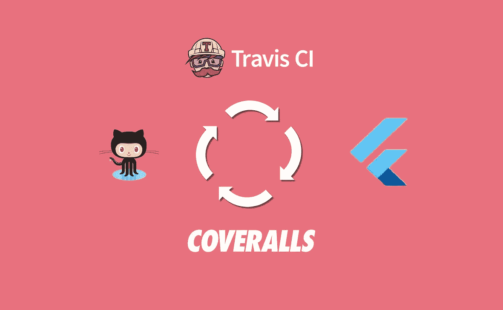
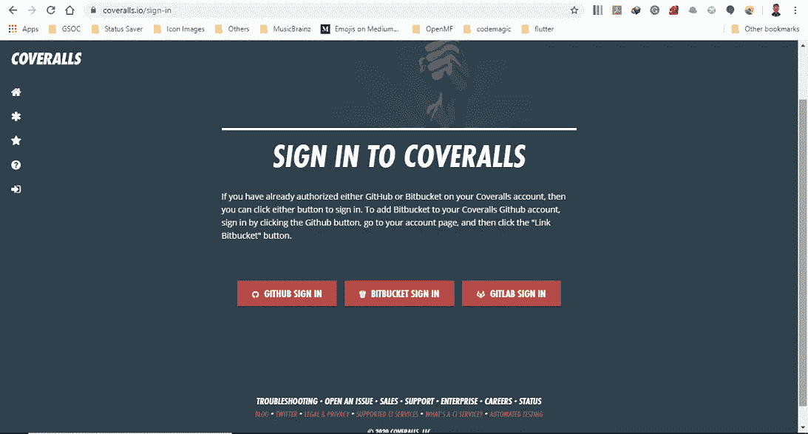
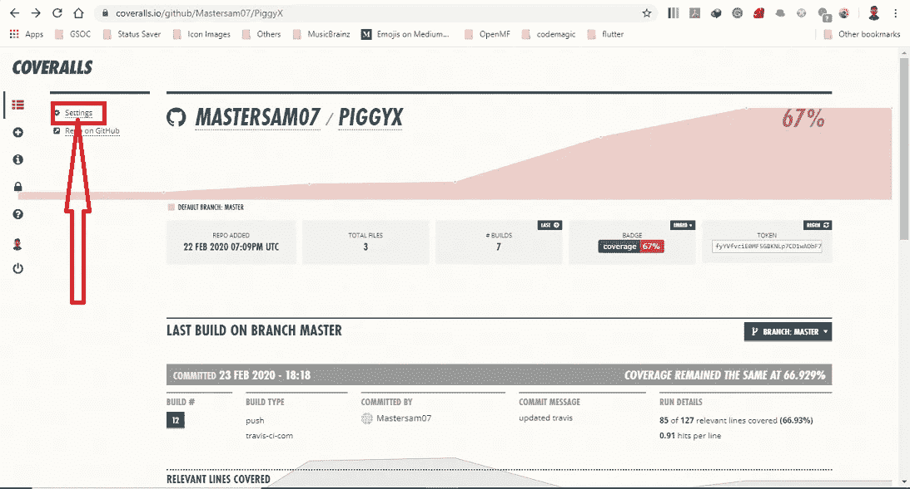
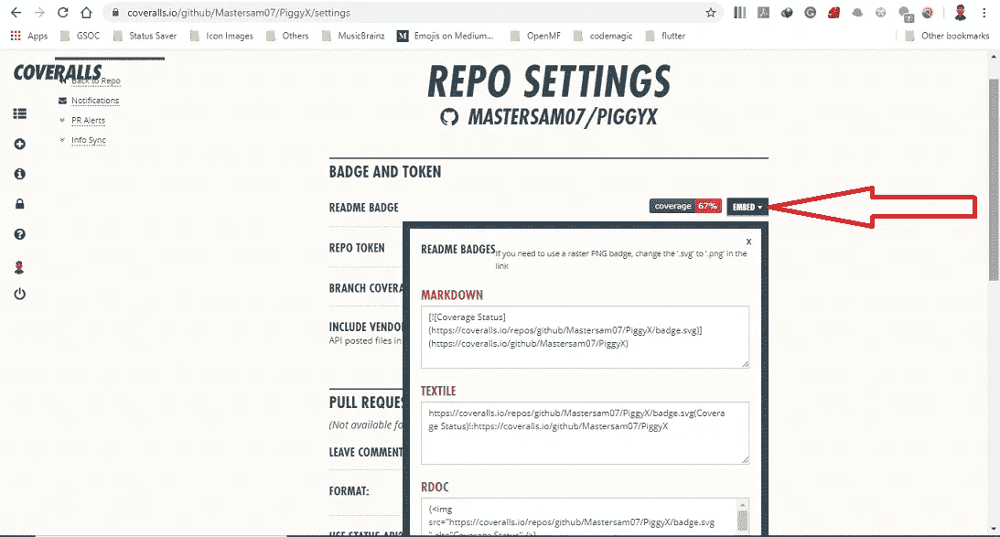
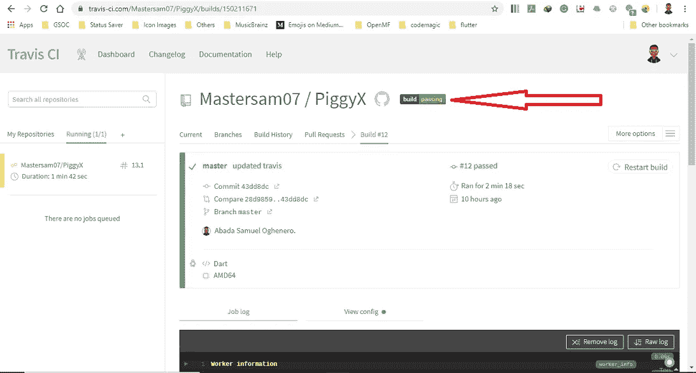
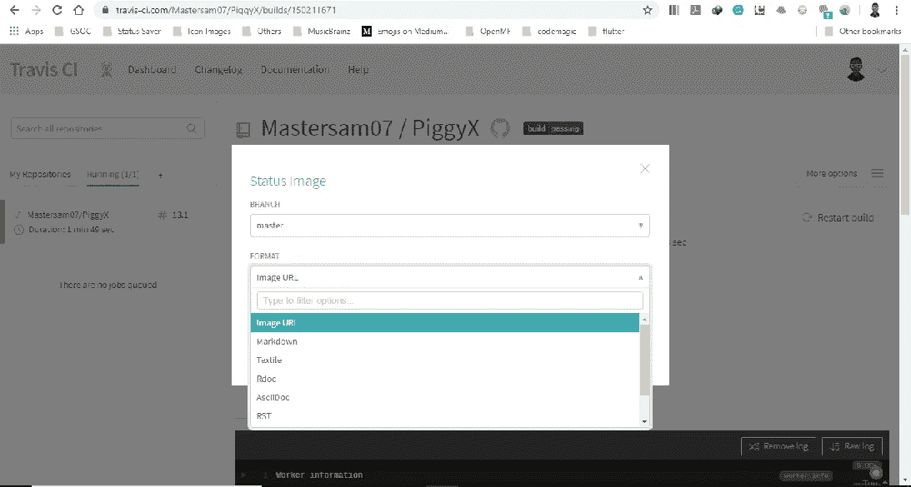
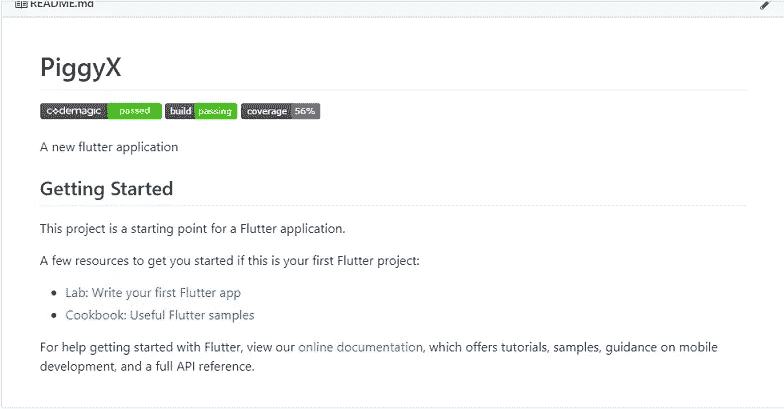

# 使用 Flutter 配置 Travis CI 和工作服

> 原文：<https://itnext.io/configuring-travis-ci-and-coveralls-with-flutter-4c65edfc42d3?source=collection_archive---------4----------------------->



颤振和特拉维斯 CI

在我之前的文章中，我谈到了使用 Flutter 的测试驱动开发(TDD)，你可以在这里阅读[。这一次，我们将尝试为](https://medium.com/@sammytech/test-driven-development-in-flutter-e7fe7921ea92) [Travis-CI](https://travis-ci.com/) 进行设置，并将 Flutter 应用程序与[套装](https://coveralls.io/)集成在一起，这将为我们提供关于您的应用程序中的测试覆盖率的反馈。

**我希望这个指南能帮到你**😀**。**

# **要求**

*   Flutter app 应该托管在 GitHub、GitLab 或者 Bitbucket 上。
*   Travis CI 帐户
*   颤振 SDK

# 创建 Github/BitBucket/GitLab 项目

创建您的 flutter 应用程序，并将其推送到 GitHub/BitBucket/GitLab。出于本教程的目的，我将使用 PiggyX 应用程序来演示在 Flutter 中测试驱动开发的概念。这些代码可以在 Github 上找到。点击[此处](https://github.com/Mastersam07/PiggyX)进入代码。你可以在这里阅读之前关于测试驱动开发[的文章。](https://medium.com/@sammytech/test-driven-development-in-flutter-e7fe7921ea92)

# 与 Travis CI 集成

您需要首先在 Travis-CI dashboard 上注册您的 GitHub 项目/资源库。这样，travis 就可以检测到存储库中的变化。如果您的存储库是公共的，请前往[https://travis-ci.org/](https://travis-ci.org/)，如果是私有的，请前往[https://travis-ci.com/](https://travis-ci.com/)。

在 Travis 中，您在名为`.travis.yml`的文件中定义的 *YAML* 模式下实现管道。为了让事情继续进行下去，Travis 你需要做的就是将正确的`.travis.yml`添加到你的库的根中，并告诉 Travis 按照他们的指示[开始你的库的连续构建。这里我只解释一下`.travis.yml`文件中的内容。下面是我选定的配置:](https://docs.travis-ci.com/user/getting-started)

```
language: dart
dist: xenial
addons:
  apt:
    packages:
      - lib32stdc++6
install:
  - git clone https://github.com/flutter/flutter.git -b stable
  - ./flutter/bin/flutter doctor
script:
  - ./flutter/bin/flutter test
cache:
  directories:
    - $HOME/.pub-cache
```

**语言** 这为特定语言定制 CI 环境。省略这一部分告诉 travis 使用默认语言 **Ruby** 。
**Dist** 指定使用的 Ubuntu 基础版本。我指定 Xenial Xerus 支持到 2021 年。
**插件** 这可以让你在操作系统上安装额外的软件包。在我的实验中，没有`lib32stdc++6`的测试仍然通过，但是`flutter doctor`抱怨了，所以我把它包括进来。
**安装** 这应该调用 Dart 的`pub get`，但是 Flutter 报错了，所以让我们忽略它，安装 Flutter。 **脚本** 这是我们运行测试的地方。所以我们在这里提供了运行测试的方法。
**缓存** 这里是最后的部分。这告诉 Travis 缓存默认 Dart 包缓存的内容。这应该会让 Flutter 更快地安装应用程序的依赖项。

此配置运行良好，完成时间不到 2 分 30 秒。

# 将 Github 项目添加到工作服

要将项目添加到工装服，请登录到[https://coveralls.io/](https://coveralls.io/)并使用您的 GitHub/GitLab/BitBucket 帐户登录，转到*添加仓库*并选择您想要集成的存储库。然后，当你去 *Repos* 的时候，你应该会看到你的项目。



[工作服](https://coveralls.io/)

# 更新. travis.yml

要调用 Travis build 上的工作服，您需要更改`.travis.yml`文件。我们需要做的只是稍微调整一下，就可以生成并发送覆盖报告。

```
language: dart
dist: xenial
addons:
  apt:
    packages:
      - lib32stdc++6
install:
  - git clone https://github.com/flutter/flutter.git -b stable
  - ./flutter/bin/flutter doctor
  - gem install coveralls-lcov
script:
  - ./flutter/bin/flutter test --coverage
after_success:
  - coveralls-lcov coverage/lcov.info
cache:
  directories:
    - $HOME/.pub-cache
```

我们又添加了两行并编辑了脚本:
**安装**:我们添加了*宝石安装套装-lcov 安装套装* ***脚本*** *:我们将脚本改为。/flutter/bin/flutter test——生成测试覆盖率报告的覆盖率。* ***【after _ success】****:我们在这里添加了工作包-lcov coverage/lcov.info* 来发送覆盖报告。

至此，您已经为 travis-ci 和工作服配置了 flutter，并且应该能够看到您的测试覆盖率了😄 😄 😄。

**加分** 你可以在项目自述中添加一个徽章，让人们知道项目是如何测试的。要添加服务范围/工作服工卡，登录并打开工作服项目，点击设置。



项目委员会工作服

在回购设置中，您会看到 readme 徽章旁边有一个**嵌入**下拉按钮。点击此按钮将为您提供各种徽章选项。对于这个[项目](https://github.com/Mastersam07/PiggyX)，我使用了 Markdown 变种并添加到项目 README.md 中



回购设置工作服. io

要添加 travis build 状态徽章，请登录并打开 travis 上的项目。您应该在项目仪表板上看到一个带有构建状态的标记。构建状态各不相同，可能是未知、失败、通过、错误，视具体情况而定。单击此构建状态徽章。



项目仪表板 travis-ci

你的屏幕上应该会出现一个弹出窗口，为你提供状态图像的选项。对于这个[项目](https://github.com/Mastersam07/PiggyX)，我整合了主分支并使用了降价状态图像。



状态图像 travis-ci

就是这样！现在，在 Travis 上正确构建之后，您将能够在您的项目中看到您的测试覆盖率和一些闪亮的徽章💃 💃 💃。完整示例可在[此处](https://github.com/Mastersam07/PiggyX)获得。



[https://github.com/Mastersam07/PiggyX/blob/master/README.md](https://github.com/Mastersam07/PiggyX/blob/master/README.md)

如果您有任何问题，请随时发表评论🙂。