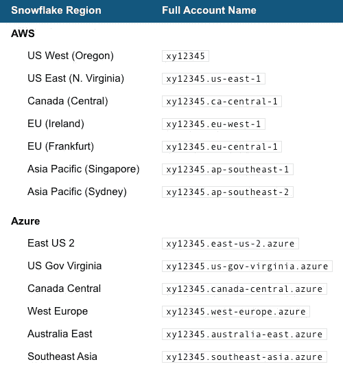
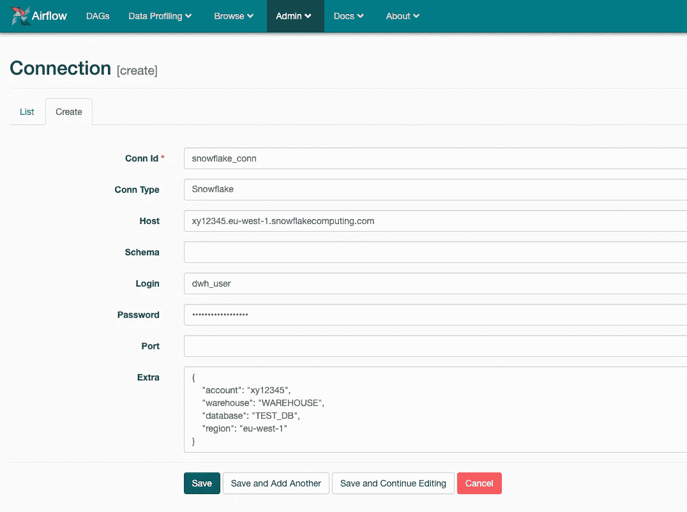

# 将 Apache Airflow 连接到雪花数据仓库

> 原文：<https://itnext.io/connect-apache-airflow-to-snowflake-data-warehouse-37936a9edfa1?source=collection_archive---------0----------------------->

> TL；DR，创建雪花连接，并使用 Airlfow 雪花贡献钩子和雪花操作符在雪花 DWH 上执行 SQL 命令。


# [阿帕奇气流:](https://airflow.apache.org)

Airflow 是一个以编程方式创作、调度和监控工作流的平台。广泛用于编排复杂的计算工作流、数据处理管道和 ETL 过程。

## [雪花云数据仓库](https://www.snowflake.com):

雪花是作为软件即服务(SaaS)提供的分析数据仓库。其独特的架构是传统共享磁盘数据库架构和无共享数据库架构的混合，允许对结构化和半结构化数据(CSV、JSON、ORC、Avro、Parquet、XML)提供完整的关系数据库支持。

## 依赖关系:

Apache airflow 附带社区贡献的操作符和用于雪花启动 airflow 版本`1.10.0`
除了 airflow 版本 1.10.0 或更高版本之外，您还需要安装以下软件— `[snowflake-sqlalchemy](https://pypi.org/project/snowflake-sqlalchemy/)`

> pip 安装雪花-sqlalchemy

## 正在创建连接:

第一步是在`Admin -> Connecitons`为雪花 dwh 创建一个连接，并创建一个新的`Conn Type = Snowflake`连接

```
Conn Id: <CONNECTION_ID>
Conn Type: Snowflake
Host: <YOUR_SNOWFLAKE_HOSTNAME>
Schema: <YOUR_SNOWFLAKE_SCHEMA>
Login: <YOUR_SNOWFLAKE_USERNAME>
Password: <YOUR_SNOWFLAKE_PASSWORD>
Extra: {
        "account": <YOUR_SNOWFLAKE_ACCOUNT_NAME>,
        "warehouse": <YOUR_SNOWFLAKE_WAREHOUSE_NAME>,
         "database": <YOUR_SNOWFLAKE_DB_NAME>,
         "region": <YOUR_SNOWFLAKE_HOSTED_REGION>
    }
```

> 上面的模式部分可以留空，可以在您的 SQL 查询中提到。

现在，让我们深入了解雪花帐户、地区、云平台和主机名。雪花账户可以托管在以下任一云平台上:

*   [亚马逊网络服务(AWS)](https://aws.amazon.com/)
*   [微软 Azure](https://azure.microsoft.com/en-us/)

下面将基于托管雪花的云平台来解释帐户名、区域、主机名


雪花—帐户名和主机名

例如，如果帐户名是`xy12345`:



您的雪花连接应该类似于以下示例



## 正在创建 DAG:

让我们创建一个 DAG，它使用雪花操作符& hook 并通过上面创建的连接连接到雪花 DWH。

雪花运算符—当运算符执行某些 SQL 命令时，它会执行，但不会返回查询结果。当不需要查询结果时，最好使用运算符，即`create, insert, merge, update, delete, copy into, truncate`所有这些都可以与运算符一起使用。

雪花钩子——当钩子被使用时，查询结果总是被返回，因此钩子应该在`select`查询必须被执行并且结果需要被传递给 python 进行进一步处理时被使用。

下面是一个 DAG 示例:

样本雪花连接器 DAG

在上面的 DAG 中，雪花运算符创建了一个表，并将数据插入到该表中。然后，雪花钩子用于查询由操作符创建的表。