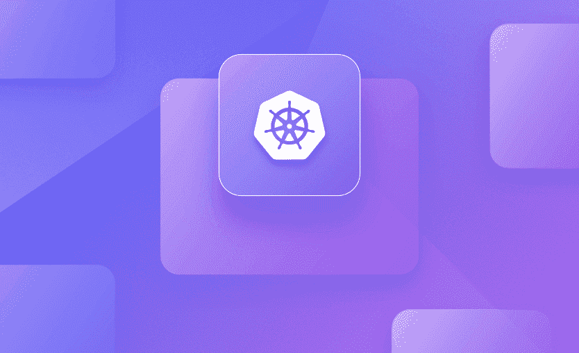
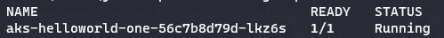
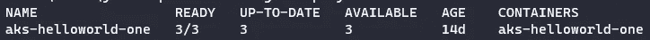
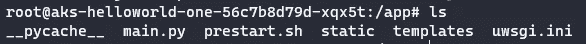
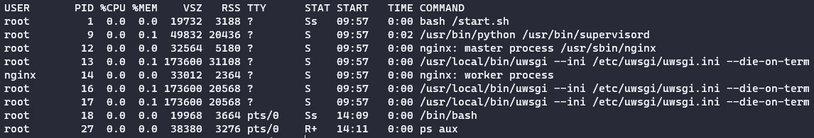
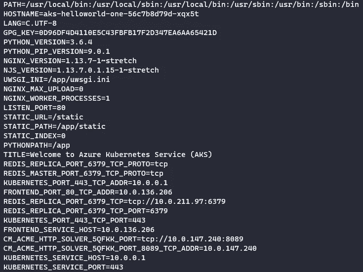
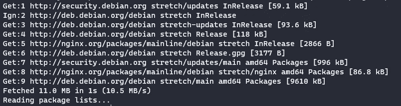

# 使用 Kubectl Exec 连接到容器

> 原文：<https://itnext.io/connect-to-containers-using-kubectl-exec-b1fb5c171f03?source=collection_archive---------6----------------------->

## 如何连接到您的 Kubernetes 容器

在本文中，我们将研究`kubectl exec`命令，展示如何将 shell 放入 Kubernetes (K8S)集群中正在运行的容器，以及如何在容器上运行单独的命令，并提供一些有用的示例。



## 示例设置

要将 shell 添加到容器中，首先要找到它的名称。

```
kubectl get pods
```



请注意，为了获得一个外壳，您的容器映像必须有可用的外壳。

我在我的 Azure Kubernetes 服务(AKS)集群上运行了一个名为*AKS-hello world-one-56 c7b 8d 79d-lkz6s*的服务，我们将在这些示例中使用它。这使用了 [Hello world image](https://hub.docker.com/_/microsoft-azuredocs-aci-helloworld) ,这是一个简单的 Node.js web 应用程序，用在 Azure 容器实例中，用于 docs.microsoft.com 的例子。

这个容器由一个名为*的部署控制。*

```
kubectl get deployments
```



我的*aks-hello world-one . YAML*部署文件如下所示:

```
apiVersion: apps/v1
kind: Deployment
metadata:
  name: aks-helloworld-one
spec:
  replicas: 1
  selector:
    matchLabels:
      app: aks-helloworld-one
  template:
    metadata:
      labels:
        app: aks-helloworld-one
    spec:
      containers:
      - name: aks-helloworld-one
        image: mcr.microsoft.com/azuredocs/aks-helloworld:v1
        ports:
        - containerPort: 80
        env:
        - name: TITLE
          value: "Welcome to Azure Kubernetes Service (AKS)"
---
apiVersion: v1
kind: Service
metadata:
  name: aks-helloworld-one
spec:
  type: ClusterIP
  ports:
  - port: 80
  selector:
    app: aks-helloworld-one
```

如果您正在进行，您可以创建上面的文件，并使用下面的命令在您的集群上部署容器:

```
kubectl create deployment aks-helloworld-one.yaml
```

## 连接到您的容器

要将 bash shell 放入正在运行的容器:

```
kubectl exec --stdin --tty aks-helloworld-one-56c7b8d79d-xqx5t -- /bin/bash
```

*   双破折号(`--`)将您想要传递给命令的参数与`kubectl`参数分开。
*   `/bin/bash`是您想要的外壳类型(例如也可以是`/bin/sh`)。
*   `--stdin`选项将 stdin(或标准输入)传递给容器。简称用`-i`。
*   标准输入是一个 TTY。简称用`-t`。
*   您也可以指定`--quiet`或`-q`选项来禁用`kubectl`本身的所有输出。您只会看到容器中运行的流程产生的输出。
*   您还可以使用`-pod-runnning-timeout`指定等待时间长度，直到至少有一个 pod 正在运行，默认为 1m。这被指定为时间长度(如 5s、2m 或 3h，大于零)，例如`--pod-running-timeout=2m`。

进入容器后，您可以直接运行命令，例如`ls`来列出目录的内容。



或`ps aux`查看正在运行的进程:



一旦你在容器中完成，输入`exit`返回到你的控制台外壳。

## 在容器中运行单个命令

您也可以使用`kubectl exec`直接运行单个命令，下面显示了一些有用的示例:

*   获取时间和日期

```
kubectl exec <pod name> -- date
```


*   列出运行环境变量

```
kubectl exec <pod name> -- env
```



*   更新包

```
kubectl exec <pod name> -- apt-get update
```



*   查看装载点

```
kubectl exec shell-demo -- cat /proc/1/mounts
```

## 当一个 Pod 有多个容器时，连接到指定的容器

如果一个 Pod 有多个容器，使用`--container`或`-c`在`kubectl exec`命令中指定一个容器。

```
kubectl exec -i -t <pod name> --container <container name> -- /bin/bash
```

## 摘要

您可以使用`kubectl exec`连接到一个正在运行的容器，并使用它来执行单个命令。连接到容器对于查看日志、检查进程、挂载点、环境变量和包版本等非常有用。

`kubectl exec`将为您提供对容器的完全 shell 访问权限，因此可以修改它并安装不属于容器映像的包，但除非出于临时故障排除的目的，否则不建议这样做。如果容器永久地需要额外的修改或打包，那么应该修改映像并部署新版本以保持不变性和可再现性。

干杯！🍻

[](https://www.buymeacoffee.com/jackwesleyroper) [## Jack Roper 正在 Azure、Azure DevOps、Terraform、Kubernetes 和 Cloud tech 上写博客！

### 希望我的博客能帮到你，你会喜欢它的内容！我真的很喜欢写技术内容和分享…

www.buymeacoffee.com](https://www.buymeacoffee.com/jackwesleyroper) 

*最初发表于*[*space lift . io*](https://spacelift.io/)*。*