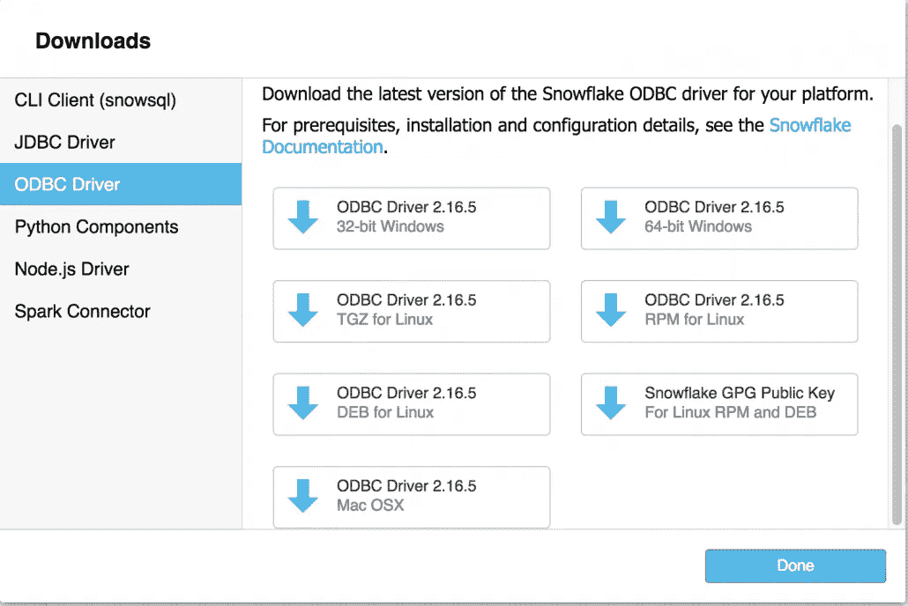

# 使用 GO 连接到雪花数据仓库

> 原文：<https://itnext.io/connect-to-snowflake-data-warehouse-with-go-c42bbcfbbfe4?source=collection_archive---------5----------------------->

在这一期中，我将介绍连接 GO 到雪花数据仓库服务(DWaaS)的过程。本教程要求您有一个雪花帐户。你可以在这里注册[30 天/400 美元的试用期。](https://trial.snowflake.net/)

下载并安装 ODBC 驱动程序

一旦你在雪花中设置了你的帐户，按照指示下载 ODBC 驱动程序。它将与您找到 snowSQL 下载的位置相同:



安装 GO

安装 GO 可以通过自制软件或者访问 [GoLang 下载页面](https://golang.org/dl/)来完成。如果你选择了自制，可以在他们的页面上找到安装说明[，或者你可以复制粘贴:](https://brew.sh/)

```
/usr/bin/ruby -e "$(curl -fsSL https://raw.githubusercontent.com/Homebrew/install/master/install)"
```

这会让你马上行动起来。一旦你开始自制，你可以简单地输入:

```
Macbook Pro:~ dbryant$ brew install go
```

确认 GO 已安装:

```
Macbook Pro:~ dbryant$ go version
go version go1.10.1 darwin/amd64
```

安装 GO 后，这将是更新你的好时机。配置文件包含一个 GOPATH 环境变量。对于我的配置，它看起来像这样:

```
$ cat .bash_profile
export PS1="$ "
export GOPATH=/Users/dbryant/go

$ echo $GOPATH
/Users/dbryant/go
```

安装 dep

dep 是一个用于 Go 的原型依赖管理工具。需要 Go 1.9 或更新版本才能编译。由于家酿已经在您的机器上，我们可以很容易地使用 brew 安装 dep:

```
$ brew install dep
Updating Homebrew...
==> Auto-updated Homebrew!
Updated 1 tap (homebrew/core).
==> New Formulae
amtk
==> Updated Formulae
annie                      git-quick-stats            nvc
ansiweather                giter8                     ola
apache-flink               gitlab-runner              overmind
babel                      gnome-latex                packer
bareos-client              grpc                       paket
bazel                      harfbuzz                   proxychains-ng
binaryen                   jpeg-archive               pulseaudio
byteman                    kube-aws                   sane-backends
ccextractor                latex2rtf                  sipp
charm                      lensfun                    snakemake
cmake                      libdvbpsi                  sphinx-doc
cockroach                  libfixbuf                  tepl
collectd                   libtorrent-rasterbar       tiger-vnc
conjure-up                 liquibase                  traefik
fakeroot                   mpop                       util-linux
fastqc                     mutt                       vala
file-roller                neomutt                    webpack
fn                         net-snmp                   webtorrent-cli
folly                      nifi                       weechat
fwup                       npth                       xonsh

==> Installing dependencies for dep: go
==> Installing dep dependency: go
==> Downloading [https://homebrew.bintray.com/bottles/go-1.10.3.high_sierra.bottl](https://homebrew.bintray.com/bottles/go-1.10.3.high_sierra.bottl)
######################################################################## 100.0%
==> Pouring go-1.10.3.high_sierra.bottle.tar.gz
==> Caveats
A valid GOPATH is required to use the `go get` command.
If $GOPATH is not specified, $HOME/go will be used by default:
  [https://golang.org/doc/code.html#GOPATH](https://golang.org/doc/code.html#GOPATH)

You may wish to add the GOROOT-based install location to your PATH:
  export PATH=$PATH:/usr/local/opt/go/libexec/bin
==> Summary
🍺  /usr/local/Cellar/go/1.10.3: 8,170 files, 336.7MB
==> Installing dep
==> Downloading [https://homebrew.bintray.com/bottles/dep-0.4.1_1.high_sierra.bot](https://homebrew.bintray.com/bottles/dep-0.4.1_1.high_sierra.bot)
######################################################################## 100.0%
==> Pouring dep-0.4.1_1.high_sierra.bottle.tar.gz
🍺  /usr/local/Cellar/dep/0.4.1_1: 7 files, 8.8MB
==> Caveats
==> go
A valid GOPATH is required to use the `go get` command.
If $GOPATH is not specified, $HOME/go will be used by default:
  [https://golang.org/doc/code.html#GOPATH](https://golang.org/doc/code.html#GOPATH)

You may wish to add the GOROOT-based install location to your PATH:
  export PATH=$PATH:/usr/local/opt/go/libexec/bin
```

安装 GO 雪花驱动程序:

获取 Gosnowflake 源代码和 [dep](https://github.com/golang/dep) (依赖管理工具)，如果没有安装，确保安装了依赖库。

```
go get -u github.com/snowflakedb/gosnowflake
go get -u github.com/golang/dep/cmd/dep
cd $GOPATH/src/github.com/snowflakedb/gosnowflake/
dep ensure
```

既然我们已经完成了连接的大部分先决条件，我们需要构建示例程序

```
$ make install
for c in $(ls cmd); do \
		(cd cmd/$c;  GOBIN=$GOPATH/bin go install $c.go); \
	done
$
```

在执行 make install 命令之后，我在下面的子目录中找到了我们的测试文件“select1.go ”:

```
/Users/dbryant/go/src/github.com/snowflakedb/gosnowflake/cmd/select1/
```

如果您已经正确配置了所有的路径信息，那么这对于您测试连接应该是没问题的。这个测试程序将简单地尝试连接到雪花数据仓库。通过 GO 和 select1.go 测试文件连接到雪花需要三个参数。

让我们看看 select1.go 文件中的代码片段

```
...

// getDSN constructs a DSN based on the test connection parameters
func getDSN() (string, *sf.Config, error) {
	env := func(k string, failOnMissing bool) string {
		if value := os.Getenv(k); value != "" {
			return value
		}
		if failOnMissing {
			log.Fatalf("%v environment variable is not set.", k)
		}
		return ""
	}

	account := env("SNOWFLAKE_TEST_ACCOUNT", true)
	user := env("SNOWFLAKE_TEST_USER", true)
	password := env("SNOWFLAKE_TEST_PASSWORD", true)
	host := env("SNOWFLAKE_TEST_HOST", false)
	port := env("SNOWFLAKE_TEST_PORT", false)
	protocol := env("SNOWFLAKE_TEST_PROTOCOL", false)

	portStr, _ := strconv.Atoi(port)
	cfg := &sf.Config{
		Account:  account,
		User:     user,
		Password: password,
		Host:     host,
		Port:     portStr,
		Protocol: protocol,
	}

	dsn, err := sf.DSN(cfg)
	return dsn, cfg, err
}
...
```

上面的函数来自 select1.go 测试文件。您应该注意到**帐户**、**用户**和**密码**的 env 函数传递了一个 true 参数。这些是从 O/S 环境变量中读取的值。出于测试目的，我创建了一个 shell 脚本来设置这些值。

```
$ cat .sfgo.sh
#!/bin/sh
export SNOWFLAKE_TEST_ACCOUNT=my_account_name
export SNOWFLAKE_TEST_USER=user_name
export SNOWFLAKE_TEST_PASSWORD=password
$ 
$ chmod 755 .sfgo.sh
$ . .sfgo.sh
```

运行脚本后，检查是否设置了环境变量:

```
$ echo $SNOWFLAKE_TEST_USER
user_name
$ echo $SNOWFLAKE_TEST_ACCOUNT
my_account_name
$ echo $SNOWFLAKE_TEST_PASSWORD
password
$
```

验证这些环境变量设置正确后，确认您位于 select1.go 文件所在的目录中，并执行以下命令:

```
$ go run select1.go
Congrats! You have successfully run SELECT 1 with Snowflake DB!
```

如果你看到祝贺！消息，那么恭喜你，你已经成功连接到雪花数据仓库云服务。


尽情享受吧！

*最初发表于* [*dbaonTap*](http://dbaontap.com/2018/07/18/connect-snowflake-using-go/) *。*