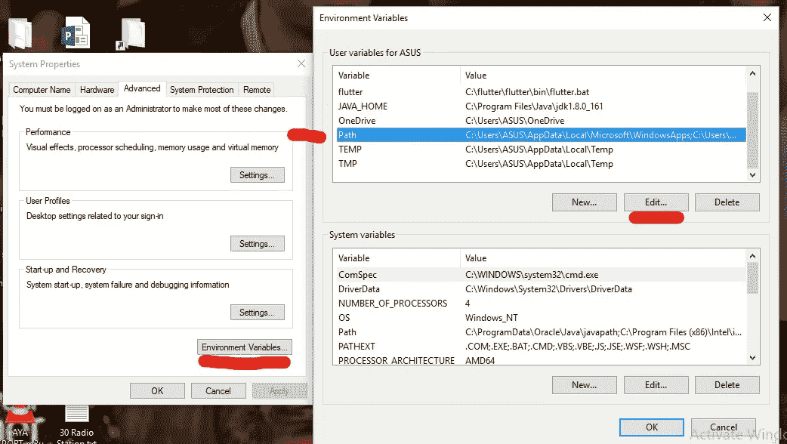
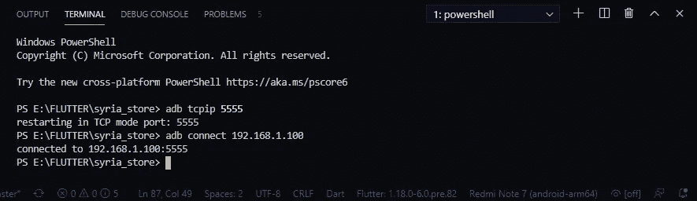

# 在 VScode(Visual Studio 代码)中通过 WIFI 而不是 USB 电缆连接您的设备，以调试您的 Flutter 应用程序

> 原文：<https://itnext.io/connect-your-device-over-wifi-instead-of-usb-cable-in-vs-visual-studio-to-debug-your-flutter-app-24496f596e9?source=collection_archive---------1----------------------->

首先你必须确保你的扩展是最新的

如果你没有看这里，首先检查你已经有了 ADB:[链接](https://www.xda-developers.com/install-adb-windows-macos-linux/)

然后确保启用开发者选项…

现在安装用于 VSCode 扩展的 [ADB 命令](https://marketplace.visualstudio.com/items?itemName=vinicioslc.adb-interface-vscode)

您必须确保将 ADB 添加到我们的系统环境变量中

开始输入“环境”在 cortana 搜索框中，点击编辑系统环境变量

现在点击“环境变量”

选择路径并点击编辑

现在，您必须将路径正确地添加到平台工具中

我的情况是

> " C:\ Users \ ASUS \ AppData \ Local \ Android \ Sdk \ platform-tools "

点击“新建”，添加之前的路径就可以了！

**现在**你必须在你的设备中启用 usb 调试。

这取决于你的手机型号，但一般来说

1.导航至设置>关于手机>滚动至底部>轻按内部版本号七(7)次。您将在显示屏的下方看到一个简短的弹出窗口，提示您现在是一名开发人员。

2.返回并访问开发者选项菜单，检查' **USB 调试**'并点击提示上的确定

在虚拟代码中，按 Ctrl+shift+p 并选择

> ADB::连接到设备 IP

要**查找您手机的 IP** 地址，请前往设置>关于设备>状态。

或者在设置搜索框中点击 IP，因为这取决于您的手机品牌

请注意:

**首先，你可能需要通过 usb 连接你的手机，然后一切完成后，你可以拔掉它**

**或者:**

您只需按照以下步骤，无需任何分机即可连接您的手机:

1 .通过 usb 连接手机。

2 .打开您的 vs 终端(您可以使用 Ctrl+`)打开终端

## 亚行 tcpip 5555

## ADB connect[您的 IP 地址]

3 .拔掉手机，尽情享受吧。

# **奖金**:

你可以显示和控制 android 设备，并使用完全免费的轻量级工具 [**Scrcpy**](https://github.com/Genymobile/scrcpy) 将其完全镜像到你的 pc 上

安装使用超级简单。

您可以直接从 github 页面下载:

> [https://github.com/Genymobile/scrcpy](https://github.com/Genymobile/scrcpy)

scrcopy