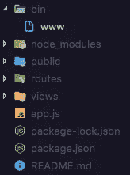
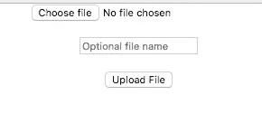

# 如何用 Reactjs 和 Nodejs 上传文件

> 原文：<https://itnext.io/connecting-a-node-js-and-reactjs-example-17dd2673979e?source=collection_archive---------6----------------------->

上传文件似乎是一项需要被征服的任务，尤其是如果你正在从事 web 开发的话。在本教程中，使用 Reactjs 在前端和 Node.js 后端上传简单的基于 AJAX 的文件。这很容易用下面的技术来实现，因为整个源代码将使用一种语言，JavaScript。在本例中，为了演示 Reactjs 应用程序与 Node.js 后端的连接，我们将使用一个简单的文件上传示例。我们将讨论的主题包括:

*   使用`express-generator`设置我们应用程序的后端
*   使用`create-react-app`搭建前端反应堆应用程序
*   使用`axios`进行跨来源 API 调用
*   在我们的服务器上处理 POST 请求
*   使用`express-fileupload`，一个基于承诺的库
*   最后，在 Reactjs 和 Node.js 之间建立一个连接

# 入门指南

我们将首先开始没有后端。我们将编写一个具有必要配置的服务器应用程序，以接受跨源请求和上传文件。首先，我们需要安装`express-generator`,这是开始快速后端应用程序的官方和最快捷的方式。

我们将从我们的终端在全球范围内安装这个模块。安装这个全局`npm`模块后，我们有一个名为`express`的实例来生成我们的项目结构。

当将当前目录更改为刚刚搭好的项目`express`命令时，我们可以观察到以下结构和文件:

要在默认配置下运行这个后端服务器，我们必须首先安装`package.json`中提到的依赖项。

Express-generator 具有以下依赖性。其中一些是必不可少的，比如`morgan`和`body-parser`，有些我们可以在这个项目中省去。

我将为我们的可配置后端应用程序添加两个以上的包，以按照我们想要的方式运行。

`cors`为 Express 应用程序提供中间件功能，以支持各种跨来源的资源共享选项。CORS 是一种允许来自另一个域的 web 页面上的受限资源(在我们的例子中，是 API 或 AJAX 请求)的机制。它帮助浏览器和服务器进行通信，并且可以被托管在不同的域中。当你看到它发挥作用时，你会更理解它。

另一个模块`express-fileupload`是一个用于上传文件的简单的 express 中间件功能。它的优点是支持承诺，并且可以处理多个文件上传。

将这两个重要的包作为依赖项添加到我们的项目中后，我们现在可以从修改`app.js`文件中的默认 Express 后端开始。

在上面的代码中，你会注意到我们做了一些添加。我们做的第一件事是在加载完其他依赖项后，在`app.js`中导入包`cors`和`express-fileupload`。

然后就在其他中间件功能之后，我们将实例化这两个新导入的包。

此外，我们需要允许数据来自一个表单。为此，我们必须启用`body-parser`模块的`urlencoded`选项，并指定一个路径来存储来自客户端的图像文件。

这样，我们可以通过运行以下命令来查看我们的服务器是否正常工作:

如果你在端口`http://localhost:3000`上导航得到下面的屏幕，说明我们的服务器正在运行。

在我们开始生成前端应用程序之前，我们需要为我们的后端更改端口，因为使用`create-react-app`生成的前端应用程序也将在端口`3000`上运行。打开`bin/www`文件并编辑:

# 设置前端

`create-react-app`是另一个命令行实用程序，用于生成默认的 Reactjs 前端应用程序。

我们还将安装所需的库，我们将使用它对我们的后端服务器进行 API 调用。

`index.js`是我们的应用程序在`src/`目录中的起点。它通过安装`App`组件使用`ReactDOM.render()`注册渲染功能。组件是任何 Reactjs 应用程序的构造块。这个`App`组件来自`src/App.js`。我们将在我们的前端源代码中编辑这个文件。

# 文件上传表单

我们将使用 HTML `form`元素，它的输入提供了对值的访问，也就是使用`refs`的文件。`Ref`是 React 中可以附加到任何组件的特殊属性。它采用一个回调函数，这个回调函数将在组件挂载后立即执行。它也可以用在 HTML 元素上，相关的回调函数将接收 DOM 元素作为参数。这样，`ref`可以用来存储 DOM 元素的引用。这正是我们要做的。

`input`元素必须有`type="file"`,否则它将无法识别我们使用它的类型。类似于`email`、`password`等数值。

`handleUploadImage`方法将负责我们需要向服务器请求的 API 调用。如果调用成功，我们 React 应用程序的本地状态将被设置为让用户知道上传成功。在这个函数中，为了进行 API 调用，我们将使用在设置前端应用程序时安装的`axios`库。

FormData 对象允许您编译一组键/值对，以便使用 XMLHttpRequest 发送。它主要用于发送表单数据，但也可以独立于表单使用，以传输键控数据。构建一个 FormData 对象，实例化它，然后通过调用它的`append()`方法向它追加字段，就像我们上面做的那样。

因为我们没有使用任何样式，所以我们的表单看起来非常丑陋。但是你可以让它看起来更专业。为了简洁，我将保持事情简单。我建议你总是输入一个 uname 文件，否则它会以`undefined.jpg`名存储文件。

# 更新服务器以处理 AJAX 请求

现在，我们的服务器代码中没有处理 React 应用程序请求的`POST`请求。我们将在定义默认路线的 Express 应用程序中的`app.js`中添加路线。

当向`/upload/`发出请求时，该路由被触发。使用路由关联的回调包含`req`、`res`对象和对`next`的访问，这是在 Express 应用程序中定义中间件功能的标准方式。`req`对象包含在表单提交过程中从客户端应用程序上传的文件和文件名。如果出现任何错误，我们将返回 500 服务器错误代码。否则，我们返回实际文件的路径，并控制`response`对象来检查是否一切都如我们预期的那样工作。

`.mv`文件是基于承诺的，由我们之前安装的`express-fileupload`包提供给我们。现在尝试从客户端上传图像文件。此时，确保客户端和服务器都从不同的终端选项卡运行。如果您在终端中收到这样的成功消息:

与此同时，客户端正在使用`GET` HTTP 方法请求在前端查看文件。这意味着来自浏览器的路由`/upload`被成功调用，一切正常。一旦文件上传到服务器上，它将被发送回客户端，以反映用户已经成功上传了文件。

你可以在[**file upload-Example**](https://github.com/amandeepmittal/fileupload-example)Github 库找到这个例子的完整代码。

*本文原载于 2018 年 6 月 20 日*[*Zeolearn.com*](https://www.zeolearn.com/magazine/connecting-reactjs-frontend-with-nodejs-backend)