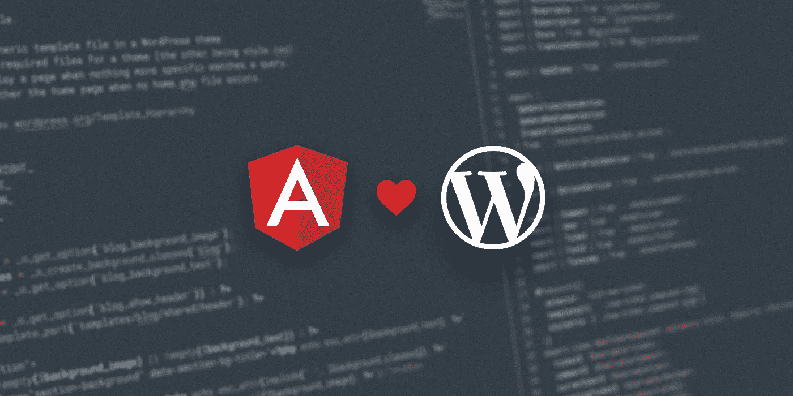
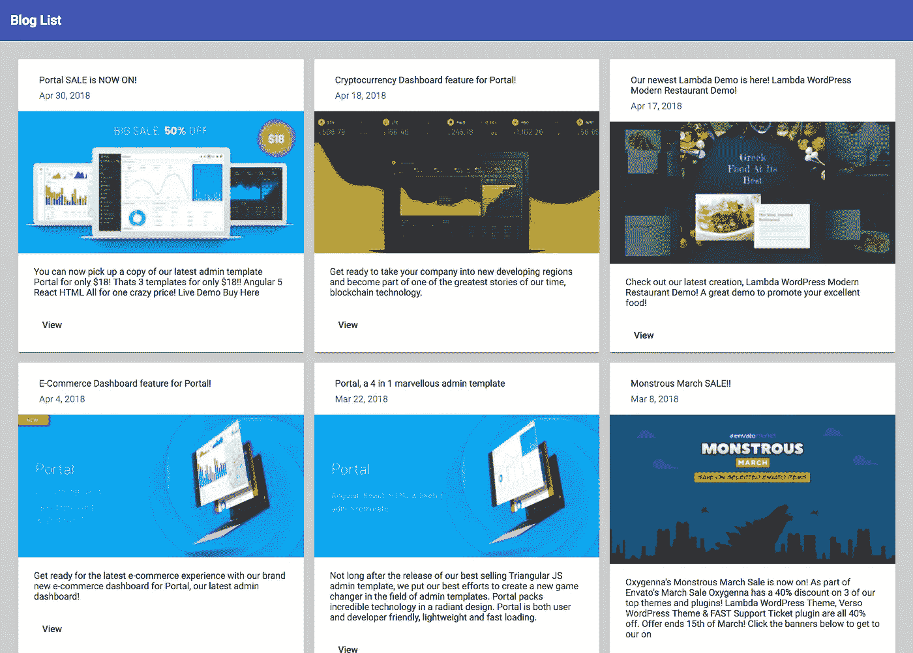

# 将 Angular 6 连接到 WordPress

> 原文：<https://itnext.io/connecting-angular-6-to-wordpress-ee0055686a70?source=collection_archive---------2----------------------->



Angular 和 WordPress

我们爱 Angular，也爱 WordPress。所以让我们永远做他们的朋友。

在本教程中，我们将创建一个新的 Angular 6 应用程序，将其连接到一个 WordPress 网站，并制作一个漂亮的材料设计博客列表页面。

因此，让我们开始使用 [Angular CLI](https://cli.angular.io/) 来创建一个新的应用程序。

## 创建角度应用程序

```
ng new angular-wordpress-api --style scss
```

这将为我们创建一个新的闪亮的应用程序，使用 Sass 的造型！但是我们仍然需要安装[角状材料](https://material.angular.io/)，这样我们就可以让我们的应用看起来更好，幸运的是，从角状 6 开始，使用命令行界面非常简单。

```
ng add @angular/material
```

接下来，我们将添加[角度灵活布局](https://github.com/angular/flex-layout)，这样我们就可以为我们的帖子制作一个漂亮的网格。*截至 2018 年 5 月 29 日，Flex 布局尚未准备好进行 ng 添加，因此我们将暂时使用旧的 NPM*

```
npm i --save [@angular/flex-layout](http://twitter.com/angular/flex-layout)@6.0.0-beta.15
```

现在我们已经打下了基础，我们可以开始创建一些代码。所以，在你最喜欢的代码编辑器中打开新的应用程序，让我们开始破解吧。

## 导入物料模块。

让我们导入一些可以用来使应用程序看起来很棒的材料组件。在 src/app 文件夹中创建一个新文件，并将其命名为 app-material.module.ts

然后转到 app.module.ts 文件，将该模块添加到应用程序导入中。

```
imports: [
  BrowserModule,
  BrowserAnimationsModule,
  AppMaterialModule  
],
```

## 导入 Flex 模块

我们还应该将 Flex 布局模块导入 app.module.ts，这将帮助我们创建帖子的网格。

```
import { FlexModule } from ‘@angular/flex-layout’;
```

请确保将此添加到您的应用导入中

```
imports: [
  BrowserModule,
  BrowserAnimationsModule,
  AppMaterialModule,
  FlexModule
],
```

## 从 WordPress 获取一些内容

为了从 WordPress 获取一些数据，我们首先需要为我们的应用程序添加 HTTP 功能，我们可以通过添加 Angular HttpClient 模块来实现。

打开 app.module.ts 并添加以下内容

```
import { HttpClientModule } from '@angular/common/http';
```

然后将此添加到您的导入中

```
imports: [
  BrowserModule,
  BrowserAnimationsModule,
  AppMaterialModule,
  FlexModule,
  HttpClientModule
],
```

接下来，我们将创建一个处理获取 post 数据的服务，这也通过使用 Angular CLI 得以简化

```
ng generate service wordpress
```

这将生成一个新的服务文件。

在这个文件中，我们创建了一个简单的函数 getPosts，它将使用 HttpClient 从我们的一个 [WordPress 站点](http://www.oxygenna.com)获取帖子，这个函数将返回一个可观察到的帖子。我们添加了一个 per_page 参数，只抓取最近的 6 篇文章，并添加了？_ 嵌入到 url，这确保了 WordPress API 也将包含帖子特色图片的 url。

## 使用我们的文章数据创建博客列表

接下来，我们希望将这个闪亮的新服务投入使用并显示结果。

因此，让我们更改主要的应用程序组件，以显示来自 WordPress 服务的帖子的 3x2 网格。

首先，让我们更改 app.component.ts 文件以使用我们的服务。

这到底是怎么回事？

我们创建了一个名为 posts$的新的可观察变量，它将存储我们使用 WordpressService 从 API 获取的帖子列表。

我们将使用异步管道在我们的 app.component.html 视图文件中订阅这个可观察对象。

在这里，您可以看到我们使用 Material 组件构建了一个简单的博客列表页面。我们首先添加一个以博客列表为标题的工具栏。接下来，我们添加一个页面包装器 div 来添加一些填充。接下来是 Flexy 部分，我们使用 Angular Flex 创建一个行布局，在每个元素之间添加 16px 的间隙。

在 Flex Layout div 中，我们使用角形材质卡片，循环遍历每个帖子，为每个帖子创建一个卡片。

结果看起来是这样的。



你可以[在 GitHub](https://github.com/oxygenna/angular-wordpress-api) 上查看这里的所有源代码。

请在下面的评论中告诉我们你的想法，如果你喜欢这个，那么一定要看看我们最新的管理模板门户网站[！](https://themeforest.net/item/portal-angular-react-html-material-admin-template/21513258?ref=oxygenna)包括 Angular、React 和 HTML 管理面板模板。