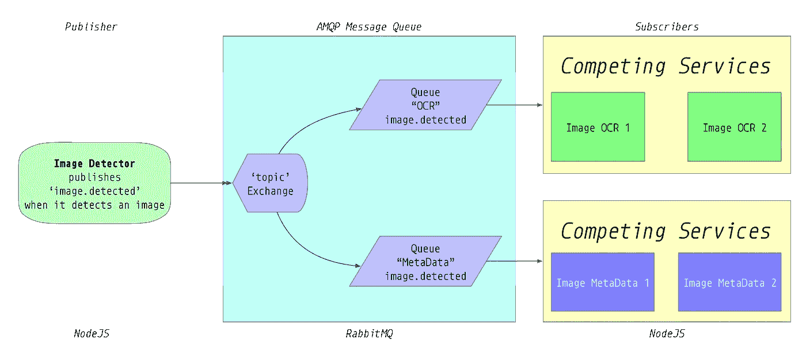

# 使用 RabbitMQ 连接竞争的微服务

> 原文：<https://itnext.io/connecting-competing-microservices-using-rabbitmq-28e5269861b6?source=collection_archive---------3----------------------->


一起在电梦兔女郎里。(改编自 rente42 的公共域[照片)](https://www.flickr.com/photos/129713999@N05/21164282874)

将现有的整体应用程序分解为微服务的一个常见原因是“可扩展性”。通过 StackOverflow 的快速[搜索显示，很少有人真正了解如何做到这一点，对于如何协调竞争的微服务这个问题，实际上没有真正好的答案。](https://stackoverflow.com/search?q=rabbitMQ+competing+consumers)

许多人的核心问题是，如果多个相同的服务竞争使用一个事件，一旦该事件被一个服务使用，如何确保其他不竞争的服务也被调用。

在本文中，我用一个简单的假设的例子来解释如何做到这一点，这个例子用 [NodeJS](https://nodejs.org) 编写，使用 [RabbitMQ](https://www.rabbitmq.com) 作为消息总线。

# 方案

假设您正在构建一个系统，该系统从网络上检索图像，对它们进行 ocr 以提取任何文本内容，并记录与该图像相关的任何元数据。OCR 过程很慢，所以您希望通过运行许多相互竞争的 OCR 服务来并行处理系统的这一方面。

只是为了更好地衡量，您还希望运行多个元数据分析服务。

所以你编写三个微服务，它们将通过`[AMQP](https://www.amqp.org)`消息总线发送的消息链接在一起。

1.  **图像检测器**:获取一幅图像，完成后通过`AMQP`发出一个`'image.detected'`事件。
2.  **图像 OCR 服务**:它监听`'image.detected'`事件，当它听到该事件时，它对图像进行 OCR。您将运行该服务的两个竞争实例。
3.  图像元数据服务:它也监听`'image.detected'`事件，当它听到时，提取图像的元数据。您还将运行两个相互竞争的实例。

`ImageOCR`和`ImageMetaData`服务都需要监听`'image.detected'`事件，但是**每个服务**中只有一个应该实际处理消息。

整个系统将如下所示:



使用 RabbitMQ 的图像分析微服务架构

当然，在现实世界中，这些服务也需要一种方式将图像发送到其他服务，并存储或传输它们提取的数据。但是这里的重点是消息交换，所以我忽略了这些方面。

# 密码

github.com/davesag/competing-services-example 的全部来源。

## 该图像检测器

撇开它从哪里获得图像，以及如何存储或传输图像不谈，让我们只关注这项服务的*事件发布*方面。

首先定义一些所有服务可以共享的常量:

## src/constants.js

```
const exchange = 'IMAGE-ANALYSIS'
const routingKey = 'image.detected'const OCR_QUEUE = 'OCR'
const META_DATA_QUEUE = 'META-DATA'module.exports = {
  exchange,
  routingKey,
  OCR_QUEUE,
  META_DATA_QUEUE
}
```

然后是`ImageDetector` ( *只是它的发布者部分*):

**注** : *我用* `[*amqp-simple-pub-sub*](https://github.com/davesag/amqp-simple-pub-sub)` *来说明这一点，因为 1)这是我写的，2)这使得构建 AMQP 发布/订阅系统非常简单。*

## src/ImageDetector/index.js

```
const { makePublisher } = require('amqp-simple-pub-sub')
const { exchange } = require('../constants')const makeService = () => makePublisher({ exchange })const start = async () => {
  const service = makeService()
  await service.start()
  return service
}module.exports = { start }
```

对于`OCR`和`MetaData`服务，定义一个`genericSubscriber`外壳:

## src/genericSubscriber.js

```
const { makeSubscriber } = require('amqp-simple-pub-sub')const { exchange, routingKey } = require('./constants')const genericSubscriber = (queueName, makeHandler) => {
  const routingKeys = [routingKey] const makeService = () =>
    makeSubscriber({ exchange, queueName, routingKeys }) const start = async name => {
    const service = makeService()
    const handler = makeHandler(service, name)
    await service.start(handler)
    return service
  } return { start }
}module.exports = genericSubscriber
```

然后按如下方式声明每个服务:

## `src/ImageMetaData/index.js`

```
const genericSubscriber = require('../genericSubscriber')
const makeHandler = require('./makeHandler')
const { META_DATA_QUEUE: queueName } = require('../constants')module.exports = genericSubscriber(queueName, makeHandler)
```

并且:

## `src/ImageOCR/index.js`

```
const genericSubscriber = require('../genericSubscriber')
const makeHandler = require('./makeHandler')
const { OCR_QUEUE: queueName } = require('../constants')module.exports = genericSubscriber(queueName, makeHandler)
```

真正的服务实现所在的`handlers`很简单:

## `src/ImageMetaData/makeHandler.js`

```
const makeHandler = (subscriber, name) => async message => {
  const data = JSON.parse(message.content.toString())
  console.log('Meta Data', name, data.meta)
  // do service implementation.
  subscriber.ack(message)
}module.exports = makeHandler
```

并且:

## `src/ImageOCR/makeHandler.js`

```
const makeHandler = (subscriber, name) => async message => {
  const data = JSON.parse(message.content.toString())
  console.log('OCR', name, data.text)
  // do service implementation.
  subscriber.ack(message)
}module.exports = makeHandler
```

# 将它连接在一起

下面是一个简单的`index.js`文件，它实例化了各种服务并运行事件发布器:

## src/index.js

```
const ImageDetector = require('./ImageDetector')
const ImageMetaData = require('./ImageMetaData')
const ImageOCR = require('./ImageOCR')const { routingKey } = require('./constants')
const FIVE_SECONDS = 5000const start = async () => {
  const imageDetector = await ImageDetector.start()
  const listeners = await Promise.all([
    ImageMetaData.start('MetaData A'),
    ImageMetaData.start('MetaData B'),
    ImageOCR.start('OCR A'),
    ImageOCR.start('OCR B')
  ])
}// Go and get some image and generate a message.
// Obviously I'm just faking it here for brevity.
const run = async () => {
  await start()
  let count = 0 setInterval(async () => {
    const message = JSON.stringify({
      text: `This is message ${count}`,
      meta: `This is meta-data for ${count}`
    })
    await imageDetector.publish(routingKey, message)
    count += 1
  }, FIVE_SECONDS)
}run()
  .then(() => {
    console.log('Services running.')
  })
  .catch(err => {
    console.error(err)
  })
```

***注意*** *我已经省略了处理* `*ctrl-c*` *关闭服务这样的细节。查看完整的源代码。*

## 设置 RabbitMQ

你需要运行`RabbitMQ`。为了不污染基础现实，我喜欢在`Docker`容器中运行消息队列、数据库等服务。

这个`docker-compose.yml`文件将完成这项工作:

```
version: "3"
volumes:
  rabbit-data:
    driver: localservices:
  amqp:
    image: rabbitmq
    ports:
      - 15672:15672
      - 5672:5672
    volumes:
      - rabbit-data:/var/lib/rabbitmq
    healthcheck:
      test: "exit 0"
```

现在，在您的终端中，运行:

```
docker-compose up -d
npm start
```

瞧:

```
> Services running. 
> OCR OCR B This is message 0
> Meta Data MetaData A This is meta-data for 0
> Meta Data MetaData B This is meta-data for 1
> OCR OCR A This is message 1
> OCR OCR B This is message 2
> Meta Data MetaData A This is meta-data for 2
> Meta Data MetaData B This is meta-data for 3
> OCR OCR A This is message 3
... etc
```

`ImageDetector`每 5 秒发出一条新消息，每个`OCR`和`MetaData`服务竞相完成各自的工作。

# 结论

把微服务连在一起很琐碎。您需要做出的真正的设计决策不是[如何使用](https://www.rabbitmq.com/tutorials/tutorial-four-javascript.html) `[topic](https://www.rabbitmq.com/tutorials/tutorial-four-javascript.html)` [交换](https://www.rabbitmq.com/tutorials/tutorial-four-javascript.html)等等，而是简单地应该如何构造您的路由键。

路由键是微服务网络的*语法*，将是另一篇文章的主题。

## 链接

*   [AQMP 简单发布/订阅](https://github.com/davesag/amqp-simple-pub-sub) : *我写这篇文章是为了简化 AMQP 微服务网络的制作。*
*   [竞争服务示例](https://github.com/davesag/competing-services-example) : *它有效，并且具有 100%的测试覆盖率。耶。*
*   [RabbitMQ](https://www.rabbitmq.com) : *太牛了。*

—

你也可以使用 Kafka，这也是 StackOverflow 中的许多答案所推荐的，但是 Kafka 实际上是为了解决一个不同的问题，即构建分布式流媒体系统。如果您正在构建下一个网飞，这没问题，但是如果您正在构建一个相当简单的微服务网络，这就有点过了。

—

像这样但不是订户？你可以通过 davesag.medium.com 加入[来支持作者。](https://davesag.medium.com/membership)