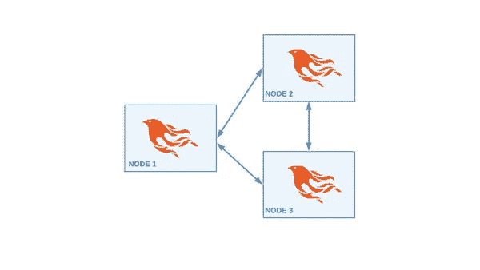
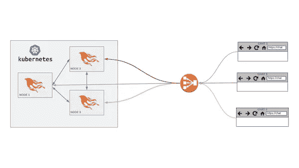

# 在本地和 Kubernetes 上连接 Elixir 节点和 libcluster

> 原文：<https://itnext.io/connecting-elixir-nodes-with-libcluster-locally-and-on-kubernetes-feb704158d41?source=collection_archive---------2----------------------->

最初发表于:【poeticoding.com】

## 资源

GitHub:[lib cluster](https://github.com/bitwalker/libcluster)
GitHub:[poeticoding/phoenix _ chat _ example](https://github.com/poeticoding/phoenix_chat_example/tree/libcluster)
docker hub:[alvises/phoenix-chat-example](https://cloud.docker.com/repository/docker/alvises/phoenix-chat-example)

## 有用的文章

[在 Docker 容器中运行药剂](https://www.poeticoding.com/running-elixir-in-docker-containers/)
[使用 PubSub PG2 适配器的分布式 Phoenix Chat](https://www.poeticoding.com/distributed-phoenix-chat-with-pubsub-pg2-adapter/)
[使用 Kops 在 AWS 上创建高可用性 Kubernetes 集群](https://www.poeticoding.com/create-a-high-availability-kubernetes-cluster-on-aws-with-kops/)

## 副本

在前几篇文章中，我们看到了如何使我们的凤凰聊天应用程序分布式；一开始是 Redis，之后是将节点连接在一起的分布式仙丹。

我们只有一个问题:我们必须手动连接到 IEX 控制台中的节点。这是生产中的一个问题。在这个视频中，我们将看到如何在本地使用 libcluster 库，以及在具有动态数量节点的 Kubernetes 集群上，对 Phoenix chat 节点进行自动集群。

让我们从我 github 帐户 [poeticoding](https://github.com/poeticoding/phoenix_chat_example) 下载凤凰聊天示例的第一个[代码，并使用](https://github.com/poeticoding/phoenix_chat_example) [pubsub_pg2](https://github.com/poeticoding/phoenix_chat_example/tree/pubsub_pg2) 分支。让我们克隆代码，并检查到 pubsub_pg2 分支。

```
$ git clone https://github.com/poeticoding/phoenix_chat_example.git
...
$ cd phoenix_chat_example
$ git co pubsub_pg2
$ mix deps.get
```

让我们下载依赖项，并尝试在本地运行它，这样我们就可以将端口作为一个环境变量传递，因此端口`4000`处的第一个节点。我们给一个名字，第一个节点`A`。我们启动另一个凤凰服务器，节点`B`，端口`4001`。

```
# Node A
$ PORT=4000 iex --sname a -S mix phx.server
# Node B
$ PORT=4001 iex --sname b -S mix phx.server
```

好极了。现在让我们将节点`A`连接到`B`。我们看到，这需要正确连接。让我们用这两种浏览器试试聊天应用程序。

```
iex(a@mbp)> Node.connect :b@mbp
true
iex(b@mbp)> Node.list
[:a@mbp]
```

因此，让我们用一个选项卡连接到`4000`(节点 A)，另一个选项卡连接到`4001`(节点 B)。我们看到消息被正确地传播。

## libcluster

我们必须使用`Node`模块中的`connect/1`功能手动连接节点。让我们看看如何使用`[libcluster](https://github.com/bitwalker/libcluster)`来自动连接节点。

所以首先，我们需要添加 [libcluster 库](https://hex.pm/packages/libcluster)作为依赖项。

```
# mix.exs
defp deps do 
  [
    ...
    {:libcluster, "~> 3.0"}
  ] 
end# lib/chat.ex
defmodule Chat do
  use Application

  def start(_type, _args) do
    import Supervisor.Spec, warn: false

    topologies = [
      chat: [
        strategy: Cluster.Strategy.Gossip
      ]
    ]

    children = [
      {Cluster.Supervisor, [topologies, [name: Chat.ClusterSupervisor]]},
      supervisor(Chat.Endpoint, [])
    ]
    opts = [strategy: :one_for_one, name: Chat.Supervisor]
    Supervisor.start_link(children, opts)
  end
end
```

然后我们需要启动一个`Cluster.Supervisor`，它是`libcluster`库的一部分，带有一些`topologies`。我们使用`Gossip`策略，该策略使用多播 UDP 将节点名称透露给网络中的其他节点。

```
# Node A
$ PORT=4000 iex --sname a -S mix phx.server
# Node B
$ PORT=4001 iex --sname b -S mix phx.server
# Node C
$ PORT=4002 iex --sname c -S mix phx.server
```



三个凤凰节点连接

太好了，它应该马上就能工作。与之前一样，我们启动一个节点，端口`4000`上的`A`节点和端口`4001`上的节点 B。您会看到节点 A 现在连接到节点 B，反之亦然。节点列表。我们发现我们不必手动连接它们。如果我在端口`4002`上添加另一个名为`C`的节点，情况也是如此。它们会自动连接。

## 库伯内特斯

现在，让我们看看如何在 Kubernetes 上部署这个分布式应用程序，并使用 libcluster 自动对节点(即 Elixir 节点)进行集群。



我们将在我的 Kubernetes 本地设置上部署多个聊天节点。但是，我要向您展示的是，任何云提供商都不需要做任何根本性的改变。我们将使用 Kubernetes 部署来部署我们的聊天节点，我们将借助 libcluster 和一种称为 Kubernetes headless 服务的东西将它们自动连接在一起，我们稍后会看到这种服务。然后我们将创建一个负载平衡器，它将把不同浏览器的连接分散到不同的聊天节点。

那么，什么是无头服务呢？[我已经把这个文件，Nginx kube 测试](https://github.com/poeticoding/phoenix_chat_example/blob/libcluster/nginx_kube_test.yaml)。您可以在 [libcluster 分支下找到所有这些代码。](https://github.com/poeticoding/phoenix_chat_example/tree/libcluster)所以，让我们试着用一个简单的 Nginx 部署来看看，什么是无头服务。

```
# nginx_kube_test.yaml
kind: Service
apiVersion: v1

metadata:
  name: nginx-nodes
  namespace: default
spec:
  clusterIP: None
  selector:
    app: nginx
  ports:
    - name: http
      port: 80
```

这是一个服务，但是我们指定了`clusterIP: None`，DNS 将是 nginx- nodes，在`default`名称空间下。而港口，在这种情况下，要去的目标港口是`80`。

这只是一个有 4 个副本的 Nginx 部署。让我们创建服务和部署。

```
$ kubectl apply -f nginx_kube_test.yaml
```

然后我们开始安装`dnsutils`和`curl`的`ubuntu`集装箱。

```
$ kubectl run bash --rm -it --image ubuntu --bash
# apt-get update && apt-get install dnsutils curl -y
# nslookup nginx-nodes
```

我们看到，使用这个 DNS，我们能够列出所有 nginx 节点。如果我们横向扩展添加更多副本，我们会再次看到新节点都出现在列表中。

让我们开始改变拓扑结构。所以我们现在使用`Cluster.Kubernetes.DNS strategy`，它将使用我们将要创建的无头服务。

```
# lib/chat.ex
topologies = [
  k8s_chat: [
    strategy: Cluster.Strategy.Kubernetes.DNS,
      config: [
        service: "chat-nodes",
        application_name: "chat"
      ]
    ]
  ]# web/controllers/page_controller.ex
defmodule Chat.PageController do
  use Chat.Web, :controller

  def index(conn, _params) do
    self_node = inspect(node())
    nodes = inspect(Node.list())
    render(conn, "index.html", %{node: self_node, nodes: nodes})
  end
end# web/templates/page/index.html.eex
<div>
  <p>nodes: <%=@nodes%></p>
  <p>self: <%=@node%></p>
</div>
<div id="messages" class="container">
</div>
...
```

所以应用程序现在已经准备好了。我们需要建立一个码头工人的形象。但是在构建 Docker 映像之前，我们将首先看到无头服务 Kubernetes 文件。

```
kind: Service
apiVersion: v1

metadata:
  name: chat-nodes
  namespace: default
spec:
  clusterIP: None
  selector:
    app: chat
  ports:
    - name: epmd
      port: 4369
```

我们公开 EPMD，DNS 是`chat-nodes`。我们还创建了一个聊天负载平衡器。

```
kind: Service
apiVersion: v1

metadata:
  name: chat
  namespace: default
spec:
  type: LoadBalancer
  selector:
    app: chat
  ports:
    - name: http
      port: 8000
      targetPort: 4000
```

来看看部署。

```
---
kind: Deployment
apiVersion: apps/v1
metadata:
  name: chat
  namespace: default
spec:
  replicas: 4
  selector:
    matchLabels:
      app: chat

  template:
    metadata:
      labels:
        app: chat
    spec:
      containers:
      - name: phoenix-chat
        image: chat:libcluster #alvises/phoenix-chat-example:libcluster-kube
        ports:
        - containerPort: 4000
        env:
        - name: PORT
          value: "4000"
        - name: PHOENIX_CHAT_HOST
          value: "localhost"
        - name: ERLANG_COOKIE
          value: "secret"
        - name: MY_POD_IP
          valueFrom:
            fieldRef:
              fieldPath: status.podIP
        command: ["elixir"]
        args: [
          "--name", 
          "chat@$(MY_POD_IP)", 
          "--cookie","$(ERLANG_COOKIE)", 
          "--no-halt", 
          "-S","mix",
          "phx.server"
        ]
```

我们首先要创建 4 个副本。我们将建立我们的形象，但你可以使用我在 DockerHub 上发布的形象:[alvises/phoenix-chat-example:lib cluster-kube](https://cloud.docker.com/u/alvises/repository/docker/alvises/phoenix-chat-example)。
公开的容器端口是`4000`，我们还需要在每个节点中设置相同的 Erlang cookie(在生产中更好地使用 Kubernetes Secrets)。

重要的部分是环境变量`MY_POD_IP`。我们定义了一个环境变量，在这里我们设置每个节点的 IP。然后，我们在启动服务器时使用这个变量来指定节点名和 cookie

```
elixir --name chat@$(MY_POD_IP) --cookie $(ERLANG_COOKIE) --no-halt -S mix phx.server
```

构建 Docker 映像非常简单。

```
$ docker image build -t chat:libcluster .
```

让我们在 Kubernetes 中创建聊天部署和服务

```
$ kubectl create -f kube_chat_deploy_and_svc.yaml
```

然后，我们将负载平衡器连接到我们的本地端口`8000`。我们看到节点列表，节点会自动连接。如果我们添加新的副本，我们几乎会立即在节点列表下看到新节点。

## 包裹

我们看到使用`libcluster`将节点连接在一起并进行部署是多么容易，在 Kubernetes 上也是如此，这是一个分布式 Phoenix 聊天应用程序。

如果您有任何问题或不清楚的地方，请在下面的评论区发表评论，订阅新的文章和视频。下周见！