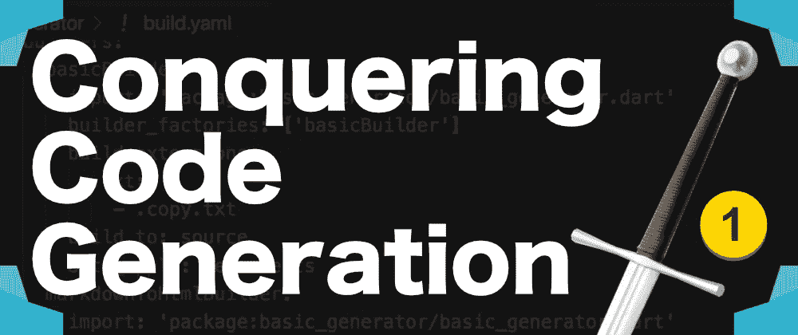

# 征服 Dart 中的代码生成—第 1 部分

> 原文：<https://itnext.io/conquering-code-generation-in-dart-part-1-ce3bacdc93c5?source=collection_archive---------6----------------------->

## 解开困惑，编写你的第一个构建器



代码生成描述了自动生成代码的过程，否则需要手工编写代码。在这个新系列中，我们将探索可用于 Dart 项目代码生成的工具。

由于缺乏相关文档，这一直是最少涉及和理解的主题之一。我们将征服这个工具怪兽，并增强您对其使用的信心。

# 如何开始

代码生成可通过名为 [**build**](https://pub.dev/packages/build) 的包获得。这个包公开了一组接口，用于创建所谓的*构建器*。一个`Builder`是你定义业务逻辑来指导构建过程如何生成代码的地方。

虽然我们将逻辑封装在一个`Builder`类中，但是我们需要一种方法来运行这个构建器...这就是 [**build_runner**](https://pub.dev/packages/build_runner) 的用武之地。它基于在一个`build.yaml`文件中定义的配置运行构建过程。为了让它理解这个`build.yaml`配置，使用[**build _ config**](https://pub.dev/packages/build_config)**包来解析其中定义的指令。因此 **build_runner** 包在后台使用 **build_config** 。**

**为项目创建文件，使用[**stagehand**](https://creativebracket.com/generate-the-scaffolding-for-your-next-project/)**工具搭建控制台应用程序:****

```
****$** mkdir code_generators && cd code_generators
**$** stagehand console-full**
```

****打开 pubspec.yaml 文件，更新`dependencies`和`dev_dependencies`:****

```
**dependencies:
  **build**: ^1.1.6
  path: ^1.6.0dev_dependencies: 
  **build_config**: ^0.4.1+1 
  **build_runner**: ^1.6.6 
  pedantic: ^1.7.0 
  test: ^1.5.0**
```

****通过运行`pub get`更新所有的依赖项。****

# ****配置`build.yaml`文件****

****`build.yaml`文件包含**目标**、**构建器**和**后处理构建器**的配置。`builders`配置允许您注册已经实现的构建器，以及要调用的顶级函数，以便为正在讨论的构建器运行构建过程。您还可以将`build_extensions`键设置为与配置相关的`Builder`类的`buildExtensions`成员中设置的值相同。`targets` config 允许您配置您的构建器来运行您的项目中的文件子集，以及指定它们是否被启用。****

****这里有一个注册我们的`CopyBuilder`并为它配置一些目标的典型例子:****

```
****targets**: 
  $default: 
    **builders**: 
      code_generators|**copyBuilder**: 
        generate_for: 
         - lib/* 
        enabled: True **builders**: 
  **copyBuilder**: 
    import: 'package:code_generators/code_generators.dart' 
    builder_factories: ['copyBuilder'] 
    build_extensions: 
      .txt: 
       - .copy.txt 
    build_to: source 
    auto_apply: dependents**
```

****[了解关于配置 build.yaml 文件的更多信息](https://github.com/dart-lang/build/blob/master/build_config/README.md)****

******继续上面视频中的完整教程。******

****[**获取源代码**](https://github.com/graphicbeacon/codegeneration_with_dart)****

# ****分享是关怀****

****如果你喜欢阅读这篇文章，请通过屏幕左侧/顶部的各种社交按钮来分享。此外，检查和 [**订阅我的 YouTube 频道**](https://youtube.com/c/CreativeBracket) ( *打铃图标太*)的 Dart 上的视频。****

****在 Egghead.io 和 [**上观看我的**](http://eepurl.com/gipQBX)**[免费**Dart**入门课程](https://egghead.io/courses/get-started-with-dart)订阅我的电子邮件简讯** 下载我的标题为**Dart**的 35 页免费电子书，并在新内容发布时得到通知。****

****喜欢，分享** [**关注我**](https://twitter.com/creativ_bracket) 了解更多关于 Dart 的内容。**

***最初发表于*[*https://creativebracket.com*](https://creativebracket.com/conquering-code-generation-in-dart-1/)*。***