# 控制台.规则(💪)

> 原文：<https://itnext.io/console-rules-b30560fc2367?source=collection_archive---------1----------------------->

如何提升您的控制台外观

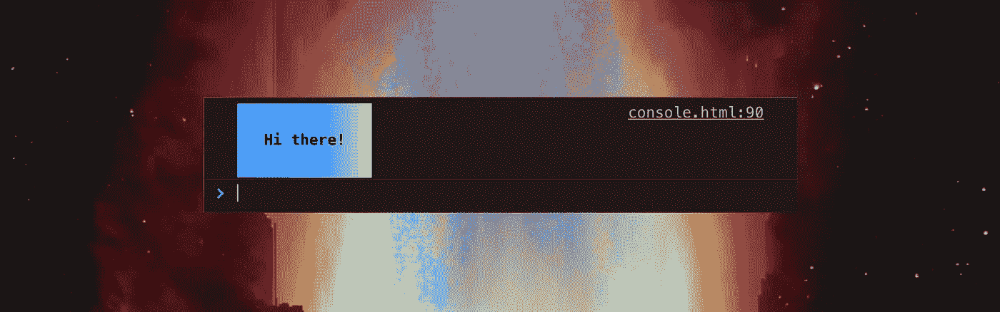

背景是我的一个视频。更多请看:[https://vimeo.com/199548973](https://vimeo.com/199548973)

## 序

如果你正在使用 Chrome，你想有一个像我一样的深色控制台，进入开发工具的“设置”，在“首选项”中选择深色主题。

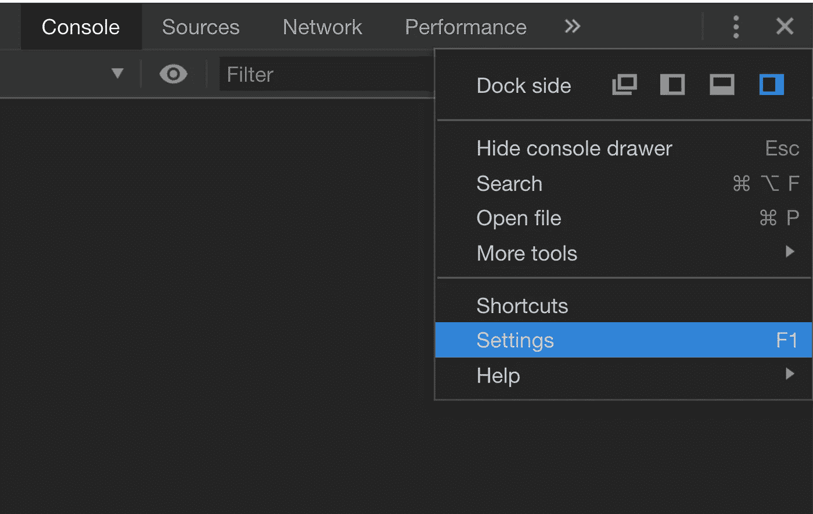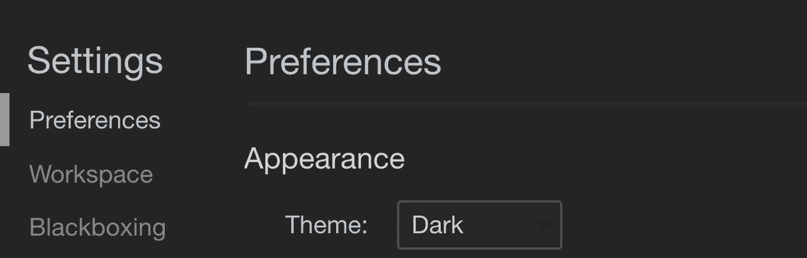

现在，让我们来玩玩游戏机吧🌴。

# 以内插值替换的

“%s”允许您用其他内容替换该空间。

```
// interpolatedconsole.log('hello %s!', '💩');
```

结果是:

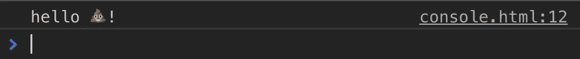

好吧，我知道你有一个漂亮的便便，但是使用这种语法有什么好处呢？
'%s '就像一个看不见的占位符，你可以在其中放入一个变量，或者更好的，一个函数。
让我们尽情享受随机表情符号问候吧！

```
// interpolated with funconst emoji = ['💩', '👯‍', '😸', '🏄', '🚀', '🔥', '🎉', '😄', '🦁'];function randomEmoji() {
  let random = Math.floor(Math.random() * emoji.length);
  return emoji[random];
}console.log('hello %s!', randomEmoji());
```

刷新时的结果是:

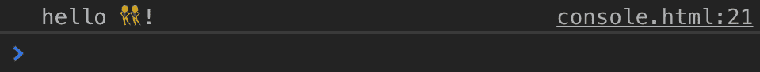

你好！！

# 设计

“%c”允许您从决定放置 CSS 的位置开始注入 CSS。

```
// styledconsole.log(
  '%cHave a nice day!',
  'font-size: 20px; background-color: yellow; color:red; margin-left: 20px;'
);
```

结果是:

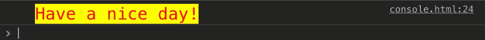

样式取决于“%c”位置。

```
// styledconsole.log(
  'Have a %cnice day!',
  'font-size: 20px; background-color: yellow; color:red; margin-left: 20px;'
);
```

结果是:

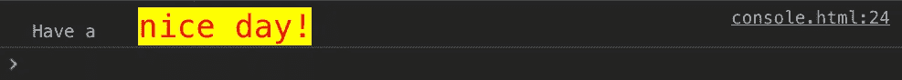

**但是..还有更好的增加风格的方法！我喜欢用 join('；'将样式存储在一个数组中)以保持更好的可读性。**

```
const style = [
  'background: #000',
  'color: #fff',
  'padding: 10px 20px',
  'line-height: 35px'
  ].join(';');console.log('%c Coded with ♥️', style);
```

结果是:

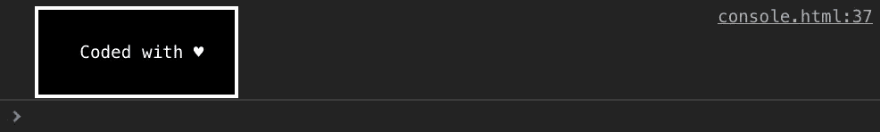

你可以使用不同的背景。

## **渐变**

```
const style = [
  'background: linear-gradient(to right, #5433ff, #20bdff, #a5fecb);',
  'color: #fff',
  'padding: 10px 20px',
  'line-height: 35px'
  ].join(';');console.log('%cHi there!', style);
```

结果是:

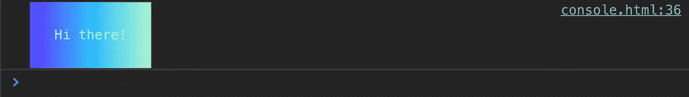

## **图像**

```
const style = [
  'background-image: url("https://media.giphy.com/media/3o85xoi6nNqJQJ95Qc/giphy.gif")',
  'background-size: cover',
  'color: #fff',
  'padding: 10px 20px',
  'line-height: 35px'
  ].join(';');console.log('%cHi there!', style);
```

结果是:

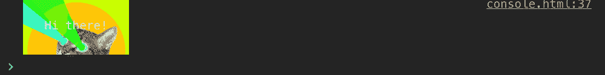

疯猫来了！

## 添加多个样式

您可以添加更多的“%c”以在控制台中添加更多样式，方法如下:

```
const style1 = [
  'background: red',
  'color: #fff',
  ].join(';');const style2 = [
  'font-size: 40px',
  'color: red'
  ].join(';');console.log('%cHi %cthere!', style1, style2);
```

结果是:

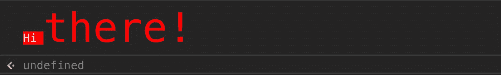

## 添加不带文本的样式

也许你想添加一些样式，比如一个没有文字的图片。你可以，只要记住在“%c”后面加一个空格就可以了。

```
const style = [
  'background-image: url("https://media.giphy.com/media/3o85xoi6nNqJQJ95Qc/giphy.gif")',
  'background-size: cover',
  'color: #fff',
  'padding: 10px 20px',
  'line-height: 35px'
  ].join(';');console.log('Hi there!%c', style); // it doesn't work
```

结果是:

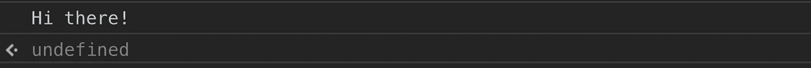

但它适用于太空。

```
const style = [
  'background-image: url("https://media.giphy.com/media/3o85xoi6nNqJQJ95Qc/giphy.gif")',
  'background-size: cover',
  'color: #fff',
  'padding: 10px 20px',
  'line-height: 35px'
  ].join(';');console.log('Hi there!%c ', style); // it works!
```

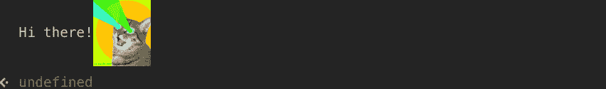

## 动画片

我找到了这个家伙 [erik](https://medium.com/u/c221303079e9?source=post_page-----b30560fc2367--------------------------------) 他发现:浏览器控制台中的 SVG 动画是可能的！有兴趣可以在这里看他的文章[。这是我在寻找一种让动画进入控制台的方法时找到的全部内容。
我尝试了不同的方法来使用 CSS 关键帧动画，但这似乎是不可能的。如果有人知道这样做的方法，请与我联系，我喜欢把 CSS 无处不在😄。](https://hackernoon.com/i-made-a-discovery-svg-and-svg-animations-in-the-js-console-are-doable-6c367c95726a)

## 假动画

很难放弃，这就是为什么我创造了这个假动画，一个简单的事物的出现和消失。

```
const textStyle = [
  'color: red',
  'font-size: 30px',
  ].join(';');const imageStyle = [
  'background-image: url("https://media.giphy.com/media/sXOj0wtpyELdu/source.gif")',
  'background-size: cover',
  'padding: 150px 300px'
  ].join(';');// it's just a joke 😸console.log('%cYou have 6 seconds to count all the cats', textStyle);setTimeout(function() {
  console.log('%c ', imageStyle);
}, 3000);setTimeout(function() {
  console.clear();
}, 9000);
```

结果是:

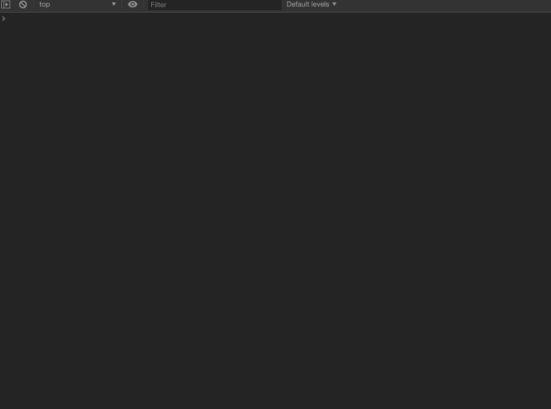

希望您喜欢这些 console.log()实验。如果你知道他们的一些好消息，请联系我😎！