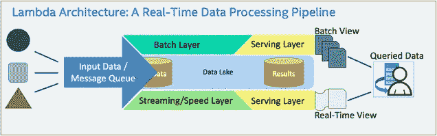
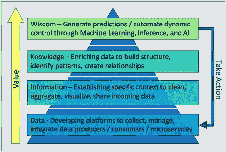
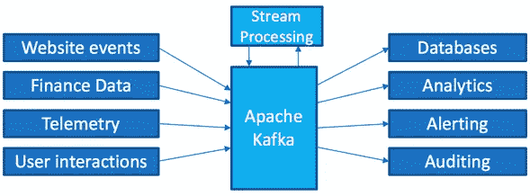
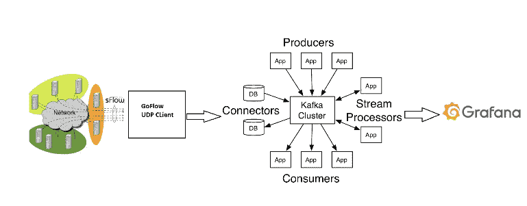
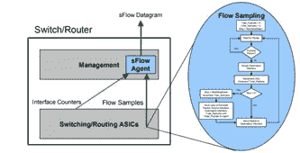
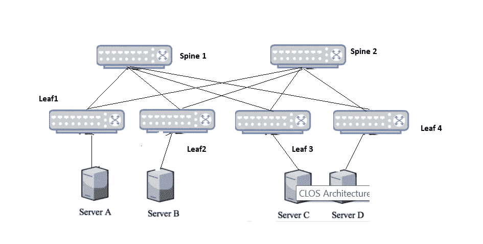
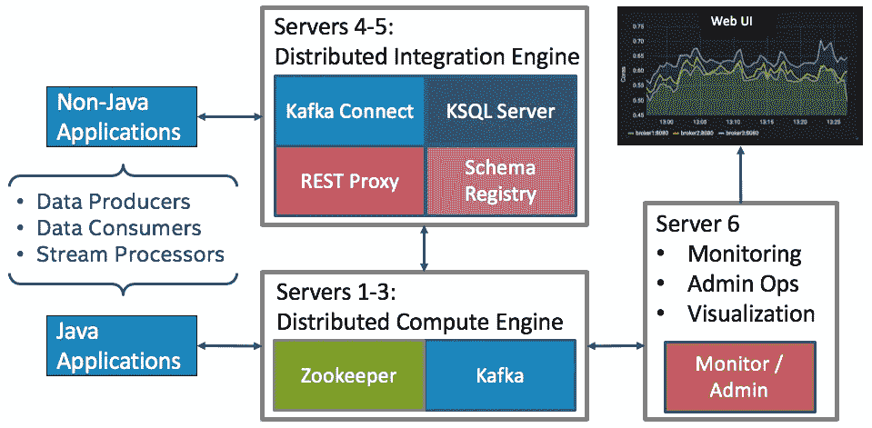
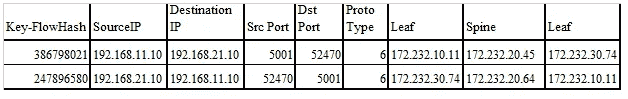
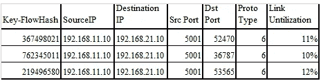

# 运行时网络数据管理和分析的结构；以数据为中心的方法

> 原文：<https://itnext.io/constructs-for-run-time-network-data-management-analysis-a-data-centric-approach-4d051e0b4cef?source=collection_archive---------3----------------------->

## 以数据为中心在运行时管理网络数据的方法和应用

**摘要** —本文详细介绍了在运行时以数据为中心管理网络数据的方法、手段和应用。我们通过解释领域专家和数据科学家在数据分析中所需的方法，介绍了 Lambda 架构，从而展示了对以数据为中心的架构的一次尝试。然后，我们通过对比数据电路和构建电子电路，介绍理解 lambda 架构所需的基本概念和结构。最后，利用 CLOS 架构的测试平台，我们利用 sFlow、GoFlow 和 Apache Kafka 提出了一个可以在运行时大规模分析和管理网络数据的模型。

图 1:使用 Lambda 架构的实时数据处理[3]

**关键词** —遥测、以数据为中心、Kafka、sFlow、分析、Lambda 架构、GoFlow、CLOS、大象流

# 一.导言

数据中心网络故障因其网络复杂、规模大而难以调试。大型 DCNs 可容纳超过 10，000 台交换机和 100，000 台物理服务器，每台都有 10 和 40 Gbps 的网络连接。峰值利用率时，总流量很容易超过 100 Tbps。由于 DCNs 的规模，及时调试故障是管理员经常面临的一大挑战。要排除故障，必须需要(1)流中的数据包样本，(2)实时收集和分析数据，(3)针对潜在原因设计和测试算法。我们提出了一种独特的解决方案:( 1)识别 DCNs 中的运行时流;( 2)当大规模出现大流量时，检测并创建通知。

为了在数据中心进行适当的数据分析并创建智能解决方案，例如利用来自训练有素的机器学习模型的结果在软件定义的环境中实现动态闭环流程，首先必须了解适应此类解决方案所需的数据和分析的层次关系。集成以下开源组件，我们提出了运行时网络数据管理的方法、途径、构造和分析:

*   sFlow
*   数据包采样
*   GoFlow UDP 客户端
*   阿帕奇卡夫卡溪流
*   格拉夫纳

# 二。以数据为中心的架构

## A.数据分析方法

类似于马斯洛的需求层次理论，这是心理学教授的一门基础课程[1],“以数据为中心”的需求层次理论(图 2)实质上转化为与每个层次相关的以下角色类型[2]:

图 2:“以数据为中心的需求层次”价值金字塔

*   ***数据层:*** 在金字塔的最底层，是数据收集和管理软件。传统的软件工程和开发类型的角色帮助部署基础代码库，并为数据收集环境中的源代码管理建立最佳实践。
*   ***数据级+信息级:*** 数据运营工程师类型角色位于层级的下一级，作为基础数据收集级和层级的其他级之间的接口。这些角色使数据科学家能够从数据中生成信息，并将高级算法和系统响应集成到端到端数据流中
*   ***信息级+知识级:*** 在这一级，数据科学家类型的角色在数据流管道之上部署算法，以生成丰富的数据上下文和实时数据的统计摘要。数据操作工程师应与数据科学家密切合作，在流式数据收集的基础上实施部署算法的标准化方法。
*   ***知识层+智慧层:*** 知识层丰富的数据上下文为机器学习工程师提供了至关重要的指导，以训练和应用先进的机器学习模型到数据收集中。例如，训练系统响应以基于由数据科学识别的统计阈值进行分类，然后允许模型被实时部署以检测统计异常值
*   ***智慧层面+数据层面:*** 人工智能(AI)工程师是利用机器学习解决方案在软件定义的上下文中创建闭环系统并采取行动的主要角色。这需要了解高级机器学习模型，以及如何执行实时更新，以根据端到端数据流中识别的事件，从本质上为自动化创建负反馈循环。此外，人工智能工程师需要与数据操作工程师密切合作，以将闭环流程正确集成到基础代码堆栈中。

在以数据为中心的环境中，数据操作工程师的角色可以说是开发高价值自动化解决方案所需的最关键的技能，但却常常被忽视。研讨会将讨论主要功能和跨领域角色，以帮助关联领域专家和人工智能工程师的依赖性。

## B.遥测分析的数据中心架构

以数据为中心的架构将数据视为一等公民。在这些类型的体系结构中，所有(或大多数)数据都通过一个公共消息队列集中起来，该队列允许传入数据(1)被标准化和上下文化，(2)将传入数据流从数据生产者路由到其目标数据消费者，以及(3)支持高级流程和算法的动态部署和集成，从而在应用上下文中实现以数据为中心的价值金字塔。需要考虑一些关键因素，以确保这样的体系结构是稳定的、高性能的，并且利用了在开发的所有级别上驱动协作和透明性的基础设施。为满足这些考虑而部署的常见数据中心架构被称为 lambda 架构[3]，如图 2 所示。基于 Lambda 架构的变体和简化架构是存在的，例如 Kappa 架构[4]，但它们往往具有与 Lambda 架构相似的应用、优势和挑战。该研讨会将从以下几个方面对比类似架构的优缺点:(1)容错性，(2)可扩展性和可靠性，(3)集成的简易性，(4)状态分析，(5)批处理层处理等。

在[5，6]中讨论了在大规模企业中作为中心架构部署的应用 Lambda 架构的示例及其数据操作，在下一节中讨论了基本概念，以在应用环境中开发类似类型的架构

# 三。部署 LAMBDA 架构的基本概念和类比

为了在软件定义的环境中成功开发流分析架构，理解和应用应用电路理论中使用的类似概念是有帮助的。这些类比为使用软件定义的组件而不是传统的物理电子电路组件开发端到端数据流电路提供了背景和思维模式。

## A.分布式消息总线:“线包”

分布式消息总线本质上作为系统的“中枢神经系统”来运行，以实施以数据为中心的模型，并且是部署应用的 Lambda 架构的核心。总线支持部署独特的数据流和分析系统所需的一对多应用程序的集成。Apache Kafka 是一个以消费者为中心的分布式消息代理，它使用不可变的提交日志来支持这种大规模集成，并且很好地符合 Lambda 架构的需求[2]。从本质上讲，Apache Kafka 提供了将数据流彼此解耦的方法(图 3)，并将流处理集中在单个数据流上[7–11]。

图 3:用 Apache Kafka [8]解耦数据流

## B.集装箱化:“集成电路包装”

子系统组件的容器化用于测试和部署作为数据源和数据接收器运行的应用程序。这些容器化的子系统与其他子系统接口，以便启动开发自动化和智能云解决方案所需的特定数据流上下文。Docker 是用于将应用打包成
be[12–16]的主要工具:

*   灵活、轻便、可互换、便携、可扩展和可堆叠
*   支持容器化和非容器化的多个应用程序之间的通信
*   兼容在 Linux、Windows 和 MacOS 上运行

## C.容器管理:“试验板”

多容器部署管理用于配置、启动和管理多个容器化的子系统和服务，例如使用 Kubernetes 或 Docker-compose[17–21]

云应用程序之间的数据流可以在每个所需子系统 API 的上下文中进行本地部署和测试，并使“端点”能够远程访问每个单独类型的已部署服务。通过容器管理，特定于上下文的数据流可以

*   在一个引用所有所需 Docker 图像的文件中制作原型
*   启用快速验证，以确保所有已定义的子系统和服务都经过正确配置，能够在本地相互通信，并与其他远程应用程序通信
*   链接在一起并启动基于彼此和其他相关服务构建的多个应用程序。

## D.数据输入/输出:“引脚规格”

服务之间的数据输入/输出通过每个特定服务应用程序的开发人员 API 进行访问，如[22–27]中所述。参考这些 API 来理解如何从各种云服务访问数据，类似于参考电子硬件组件的规格表。

## E.信号定义/数据模式:“数据信号”

在以数据为中心的上下文中，远程过程调用(RPC)模式用于定义数据信号和要操作的特定参数。特别是，Apache Avro 类型模式[28，29]有助于在 Lambda 架构的范围内启用和实施以下内容:

*   数据是强类型的，支持:基本类型、复杂类型、逻辑类型和数据记录
*   数据被自动压缩(CPU 更少)
*   JSON 定义的模式包含在数据中
*   文档可以嵌入到模式中
*   数据可以跨任何语言(二进制)读取
*   模式可以随着时间安全地发展

## F.数据模式管理和注册:“信号域”

模式注册中心用于管理已定义的数据模式，并从本质上创建一个“信号域”来支持许多不同的数据流，而不会破坏数据生产者和数据消费者之间的模式依赖性[30- 34]。如果一个数据生成应用程序发布了一个新版本，那么 API 可能会发生变化，模式也必须更新——传统上，这将中断系统数据流到所有依赖项。这就是为什么模式和模式注册中心是部署 Lambda 架构的关键组件。

## G.流分析和动态控制器:“闭环反馈”

部署微服务应用以支持动态控制器和流分析处理器。理解控制理论是理解如何结合实时流处理的核心。利用扩展的 Apache Kafka Streams API 是如何将闭环系统部署标准化并集中到流数据平台的示例[34–35]。记住这些基本概念和类比，下面几节中描述的架构和解决方案采用了 Lambda 架构的简化部署，称为 Kappa 架构。在 Kappa 架构中，只有流/速度层部署在架构中，所有数据都被视为流数据[4]。

在这种情况下，Apache Kafka 生态系统成为部署这种架构的主要候选对象，因为 Kafka 本身提供了(1)容错和高可用性，(2)水平扩展，(3)通过 Confluent REST 代理和 Kafka Connect 扩展 API 与许多遥测源集成的便利性，以及(4)状态分析和(5)扁平批处理数据到流数据，这两者都是通过 Kafka Streams 扩展 API 实现的。基于满足 Lambda 架构的要求和以数据为中心的要求，Apache Kafka 生态系统被选为我们解决方案和方法的核心。

# 四。使用 CLOS 数据中心网络架构的网络流量分析

图 4:测试床架构

该研讨会通过利用最古老的 DCN 架构之一并将其与现代网络流量分析框架相结合，展示了软件定义的网络环境中 Lambda 架构的真实示例。我们的解决方案在 DCN 提供实时交通可视化和大流量检测。为了实现这一点，我们的测试平台使用 CLOS 架构。我们在 CLOS 中的每个交换机上启用 sFlow 代理。启用 sFlow 代理可以将收集的所有样本发送到集中式收集器。GoFlow 是我们的收集器，它接收数据并将其格式化为经纪人上的 Kafka 输入主题。卡夫卡从这个输入主题中读出数据流，并运用数据科学算法进行识别

*   交换流使用的路径。
*   网络中的大流量。

输出在 Grafana 中对用户是可视化的。图 5 显示了我们的
架构。

## A.CLOS 数据中心网络架构

我们使用 CLOS 拓扑在我们的服务器上运行工作负载。CLOS 拓扑由主干层和叶层组成。服务器连接到叶交换机(TOR——机架顶部),每个叶交换机连接到所有主干。没有直接的叶对叶和脊柱对脊柱的连接。以下是该拓扑的一些架构优势。

*   无论是否处于相同的 VLAN 条件下，每台服务器与其他服务器之间都有三跳的距离。这就是为什么它被称为 3-5 级 CLOS 拓扑。无论有多少级，任何两个交换机之间的总跳数都是相同的，从而导致一致的延迟。
*   多机箱链路聚合组(MLAG 或 MCLAG)在服务器端仍然可用。服务器可以连接到两个不同的叶子或 TOR 交换机，以便具有冗余和负载平衡能力。另一方面，由于这种拓扑结构中的连接矩阵非常复杂，因此可以很好地处理故障。即使两个 spines 交换机同时出现故障，连通性仍然保持一致。
*   CLOS 拓扑可以水平扩展，因此随着工作负载的增加，可以轻松添加更多主干和边缘交换机。

## B.sFlow 和数据包采样

我们使用行业标准技术对高速交换网络中的数据包进行采样——SF low。CLOS 网络中的所有交换机都启用了 sFlow，并将其配置为向收集器发送数据报。sFlow 是嵌入在交换机和路由器中的多供应商采样技术。它能够同时以线速连续监控所有接口上的应用层流量。sFlow 代理是一个软件进程，作为设备中网络管理软件的一部分运行(图 5)

图 5: sFlow 采样

## C.GoFlow:来自 Cloudflare 的 UDP 客户端

从交换机采样的所有数据随后被发送到 UDP 代理，该代理将 sFlow 数据报转换为数据包级记录，并将数据生成 KAFKA。

此应用程序是 Go 中的 NetFlow/IP fix/SF flow 收集器。它从不同的流协议中收集网络信息(IP、接口、路由器)，将其序列化为 protobuf 格式，并使用 Sarama 的库将消息发送给 Kafka。GoFlow 是所有函数的包装器，并将它们链接起来，生成字节到 Kafka 中。

## D.阿帕奇卡夫卡和卡夫卡溪流

我们在 Kafka 流中设计和实现算法来分析数据包和发布数据。算法与 Kafka 流一起运行，以

*   创建所有流在 DCN 中采用的路径，DCN 由主干和边缘交换机组成。
*   在交换机的众多流量中识别出一个大流量，并在 Grafana 上创建一个通知。

## E.格拉夫纳

Grafana 是一款开源软件，为 Graphite、Elasticsearch、OpenTSDB、Prometheus 和 InfluxDB 提供了丰富的度量仪表板和图形编辑器。我们使用 Grafana 是为了可视化的目的。卡夫卡的所有数据都被推送到 Grafana。

# 动词 （verb 的缩写）试验台和分析

图 6: CLOS 测试床

测试床由 2 个主干交换机(主干 1 和主干 2)、4 个叶交换机(叶 1、叶 2、叶 3、叶 4)和 4 个主机(主机 1–主机 4)组成，如图 6 所示。每个叶交换机连接到一台主机。主干交换机和边缘交换机以 CLOS 拓扑连接。来自试验台的数据被集中并集成在一个小型生产级 Kafka 集群中[37]。如图 7 中 Kafka 集群的简化架构所示，必要的基础设施已经到位，可以轻松地对从测试床产生的流实时数据进行摄取、情境化和执行分析。

图 7:生产级 Kafka 集群的简化架构

图 6 中描述的 CLOS 测试床将采样数据发送到 GoFlow UDP 客户端，然后被中继并生成到 Kafka 中。Kafka producer 是用 Go-Lang 编写的，它提供了一个包装协议，以与本地 Java 应用程序相同的方式将数据直接保存到 Kafka 中。通过来自测试平台的实时数据流，我们的监控服务器能够访问数据流，并使用 Grafana UI 实时显示数据流。此外，可以使用 Kafka Streams API 对所有数据流进行分析处理。

## A.场景 1:确定数据包路径。

Iperf 会话在服务器 A 和 c 之间建立。Kafka 流应用程序的输出将采用以下格式。FlowId 是流标识号，图 8 列出了流经过的交换机。输出显示每个流在服务器之间采用的交换路径是唯一的。

图 8:卡夫卡输出

## B.场景 2:大流量识别。

在这个场景中，多个 Iperf 会话在服务器和客户端之间运行。在任何给定时间，服务器向客户端发送 100 个流。在这些流量中，2–3 是大象流量。大象流被定义为占用超过 10%的链路带宽的流。Kafka 流应用识别流中的大象流，并创建关于新 Kafka 主题的通知，如图 9 所示。

图 9:示例通知

# 参考

[1]麦克劳德，S. (2018)。马斯洛的需求层次理论。[在线]单纯心理学。可从以下网址获取:simply psychology . org/Maslow . html[2019 年 2 月 16 日获取]。

[2]罗加蒂，M. (2017)。人工智能的需求层次。[在线]黑客正午。可从以下网址获得:hackernoon.com/the-aihierarchy-of-needs- 18f 111 FCC 007[2019 年 2 月 16 日获得]。

[3]n .马尔兹和 j .沃伦(2015 年)。大数据。纽约州谢尔特岛:曼宁出版社。

[4]Milinda.pathirage.org。(2019).卡帕建筑——一切都是溪流。[在线]见:mi Linda . pathi rage . org/kappa-architecture . com/[2019 年 2 月 16 日查阅]。

[5]乔卡，S. (2017 年)。Spotify 怎么这么了解你？—会员专题报道—中等。【在线】中等。可从以下网址获得:medium . com/s/story/spot ifys-discover-weekly-how-machine learning-finds-your-new-music-19 a 41 ab 76 EFE[2019 年 2 月 16 日访问]。

[6]韦茨勒，M. (2017 年)。巨人的架构:脸书、网飞、Airbnb 和 Pinterest 的数据堆栈——非常好的指标。[在线]非常好的指标。可从以下网址获取:blog . keen . io/architecture-of-giants-data-stacks-at-face book Netflix-Airbnb-and-Pinterest/[2019 年 2 月 16 日获取]。

[7]阿帕奇卡夫卡。(2019).阿帕奇卡夫卡。[在线]位于:kafka.apache.org/[2019 年 2 月 15 日访问]。Maarek，S. (2019 年)。Apache Kafka 系列—Apache Kafka 简介。[在线] Udemy。发布地点:udemy.com/apache-kafka/[2019 年 2 月 15 日发布]。汇合。(2019).什么是阿帕奇卡夫卡？|汇合。[在线]

[8] [9]可在以下地点获得:confluent.io/what-is-apache-kafka/[2019 年 2 月 15 日获得]。

[10]科兹洛夫斯基，S. (2017 年)。阿帕奇卡夫卡全面介绍-
黑客正午。[在线]黑客正午。可从以下网址获得:hacker noon . com/through-introduction-to-Apache-Kafka-6 fbf 2989 BBC 1[2019 年 2 月 15 日访问]。

[11] Docs.confluent.io. (2019)。卡夫卡操作——融合平台。
【在线】发布地点:docs.confluent.io/current/kafka/operations.html【2019 年 2 月 15 日发布】。

[12]Docker.com。(2019).为什么是码头工人。[在线]见:www . docker . com/what-docker[2019 年 2 月 15 日查阅]。

[13]Hub.docker.com。(2019).码头枢纽。[在线]见:hub . docker . com/[2019 年 2 月 15 日访问]。

[14]陶和李(2018 年)。Docker 为忙碌的开发者提供的速成课程。[在线] Udemy。可从以下网址获取:www . udemy . com/docker-tutorial-for-devo PS-run-docker containers/[2019 年 2 月 15 日获取]。

[15]t .里德(2015 年)。为什么以及如何使用 Docker 进行开发-Travis on Docker-Medium。【在线】中等。可从以下网址获取:medium . com/Travis-on-docker/why-and-how-to-use-docker-for development-a 156 C1 de 3 b 24[2019 年 2 月 15 日获取]。

[16]侯赛因·h .(2017 年)。Docker 如何帮助你成为更有效的数据科学家。[在线]走向数据科学。可从以下网址获得:towards data science . com/how-docker-can-help-you-bec-amore-effective-data-scientist-7fc 048 ef 91d 5[2019 年 2 月 15 日访问]。

[17] Kubernetes.io. (2019)。生产级容器编排。[在线]位于:kubernetes.io/[2019 年 2 月 15 日访问]。

[18] Docker 文档。(2019).码头工人作曲。[在线]位于:docs.docker.com/compose/[2019 年 2 月 15 日访问]。

[19] Sanche，D. (2018 年)。Kubernetes 101:豆荚、节点、容器和集群。【在线】中等。可从以下网址获得:medium . com/Google cloud/kubernetes-101-pods-nodes-containers-and-clusters c 1509 e 409 e 16[2019 年 2 月 15 日访问]。

[20] Guminski，L. (2018 年)。用
Docker Compose 编排开发容器。[在线] via @codeship。可从以下网址获得:blog . codeship . com/orchestrate-containers-for-development-with docker-compose/[2019 年 2 月 15 日访问]。

[21] Viaene，E. (2019)。学习 DevOps:完整的 Kubernetes
课程| Udemy。[在线] Udemy。可在:【www.udemy.com/learn-devops-the-complete-kubernetes-course/ 【2019 年 2 月 15 日获取】。

[22]马托斯、维尔马和马斯内(2019 年)。什么是 REST——学习
创建永恒的 RESTful APIs..[在线]Restfulapi.net。可从以下网址获得:restful API . net/[于 2019 年 2 月 16 日访问]。

[23]黑客正午。(2019).什么是 Web API——黑客正午。[在线]
发布地点:hackernoon.com/what-are-web-apis-c74053fa4072【2019 年 2 月 16 日发布】。

[24]Developer.spotify.com。(2019).面向
开发者的 Web API 教程| Spotify。[在线]网址:developer.spotify.com/documentation/web-api/quick-start/[访问日期:2019 年 2 月 16 日]。

[25] Blockchain.info. (2019)。区块链数据 API — blockchain.info.
【在线】可在:blockchain.info/api/blockchain_api【2019 年 2 月 16 日访问】。

[26]Developer.twitter.com。(2019).API 参考索引。[在线]见:developer . Twitter . com/en/docs/API-reference-index[2019 年 2 月 16 日获取]。

[27] GitHub。(2019).中等/中等-api-docs。[在线]可在 github.com/Medium/medium-api-docs
查阅[2019 年 2 月 16 日查阅]。

[28]Avro.apache.org。(2019).欢迎来到阿帕奇 Avro！。[在线]见:avro . Apache . org/[2019 年 2 月 16 日查阅]。

[29]马瑞克，S. (2017 年)。Apache Kafka 中的模式介绍和融合模式注册表。【在线】中等。可从以下网址获得:medium . com/@ Stephane . maarek/introduction-to-schemas-ina pache-Kafka-with-the-confluent-schema-registry-3bf 55 e 401321[2019 年 2 月 15 日访问]。

[30] Docs.confluent.io. (2019)。模式注册表—融合平台。
【在线】发布地点:docs.confluent.io/current/schemaregistry/docs/index.html【2019 年 2 月 16 日发布】。[31] GitHub。(2019).confluent Inc/架构注册表。[在线]可从以下网址获得:github . com/confluent Inc/schema-registry[访问日期:2019 年 2 月 16 日]。

[32]马瑞克，S. (2017 年)。如何使用 Apache Kafka 将一个批处理
管道转化为实时管道？【在线】中等。可从以下网址获得:medium . com/@ Stephane . maarek/how-to-use-Apache-Kafka-to transform-a-batch-pipeline-into-a-real-time-one-831 b48 a6 ad 85[2019 年 2 月 16 日访问]。

[33] Maarek，S. (2019 年)。Apache Kafka 系列—融合模式
注册表和 REST 代理。[在线]见:udemy . com/confluent-schema-registry/[2019 年 2 月 15 日访问]。

[34]中等。(2019).使用 Kafka Streams API 进行预测预算 Pinterest 工程-中等。[在线]可从以下网址获得:medium . com/@ Pinterest _ Engineering/using-Kafka-streams-API for-predictive-budgeting-9f 58d 206 c 996[访问日期:2019 年 2 月 16 日]。

[35]马瑞克，S. (2019 年)。Apache Kafka 系列—用于数据
处理的 Kafka 流。[在线] Udemy。发布地点:udemy.com/kafkastreams/[2019 年 2 月 16 日发布]。

[36]Godoc.org(2019 年)。萨拉马包。[在线]atgodoc.org/github.com/Shopify/sarama 可用[2019 年 2 月 28 日访问]。

[37]沙皮拉，G. (2016 年)。融合的企业参考架构。[在线]合流。可从以下网址获取:www . confluent . io/resources/Apache-Kafka-confluent-enterprise reference-architecture/[2019 年 2 月 15 日获取]

***注*** *:本文原由* [*伦芬克泰勒*](https://medium.com/u/aef28eaa4ad3?source=post_page-----4d051e0b4cef--------------------------------)*[*孙库 R*](https://medium.com/u/4427ab1d38b9?source=post_page-----4d051e0b4cef--------------------------------) *和 Sravanthi Tangeda 及其发表于 ISA Interchange 博客(* [*此处*](https://blog.isa.org/constructs-for-run-time-network-data-management-analysis?hs_preview=vPyBBVwk-68500202108) *)**