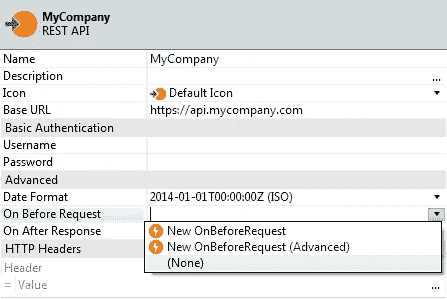
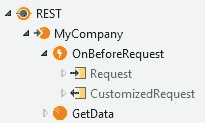
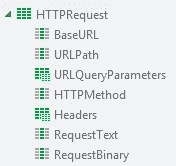

# 使用外部系统的多部分/形式数据 REST 方法

> 原文：<https://itnext.io/consuming-a-multipart-form-data-rest-method-with-outsystems-c466e404118d?source=collection_archive---------0----------------------->

更新:文章中有一些技术上的错误，我已经改正了。

更新(2023 年 2 月 22 日):OutSystems 宣布，在 Service Studio 11.53.40 和 Platform Server 11.19.0 中，下面描述的功能现在是 OutSystems REST consume 的原生部分。我暂时保留这篇文章，以后我可能会用原生功能更新它。

## 前言

几周前，我被要求在 OutSystems 中创建一个与外部供应商的 REST API 的接口。除了 REST API 的供应商严重缺乏功能文档之外，这个过程非常简单，直到我遇到了一个绊脚石:其中一个上传文档的方法使用了一种叫做“多部分/表单数据”的东西，该平台本身并不支持这种东西。在 [OutSystems 社区论坛](https://www.outsystems.com/forums)上相当活跃，我经常看到有人在尝试消费 REST 服务时遇到这个问题(例如，这里的、这里的和这里的)，但我自己从未经历过，直到现在。所以我做了两件事:首先，我为 OutSystems 创建了一个[社区想法](https://www.outsystems.com/ideas/5022/rest-native-support-of-multipart-form-data)来本地支持它；其次，我想到了如何满足 REST API，同时对其接口的实现产生最小的影响，这将在本文中描述。

## 在外部系统中休息

我想看的第一件事是 OutSystems 实现 REST 的方式。REST 是 HTTP(用于检索网页的协议)之上的一个协议，通常(但不是唯一的)使用 JSON 进行数据通信。通过 HTTP 发送数据时，发送方必须指定要发送的内容类型。因为 OutSystems 只支持 JSON，所以它在 HTTP“Content-Type”头中发送“application/json”。在消息体中，实际的 JSON 以紧凑的方式(没有换行)发送，如下所示:

```
{"name":"Test for POST","type":"PACKAGE","language":"en","description":"This is a test for posting a package"}
```

这适用于大约 95%的 REST 方法，因此它符合支持最常用软件模式的 OutSystems 哲学，而不需要支持所有这些模式。

## 多重什么？

那么我前面提到的“多部分/形式数据”是什么，为什么要使用它呢？首先介绍一些背景。“表单数据”是 HTTP 术语，指用户在网页上输入的任何数据(“HTML 表单”)，这些数据随后通过 HTTP 发送(或“发布”)到 web 服务器。通常，表单只包含简单的输入字段，并且这些字段以您可能认识的格式发送，因为它与用于向 web 屏幕传递参数的格式相同:它由名称/值对组成，由赋值字符(" = ")分隔，由与号(" & ")连接，特殊字符由百分号及其十六进制字符代码替换(例如，" %20 "表示空格):

```
name=This%20is%20a%20test&language=en
```

这种格式的 HTTP 内容类型是“application/x-www-form-urlencoded”。这对于简单的输入字段来说很好，但是网页也可能允许用户上传一个或多个文件。为了支持这一点，在 web 早期创建了另一种格式，它以其内容类型“多部分/表单数据”而闻名。因此，从本质上说，多部分/形式数据是浏览器向 web 服务器发送一个或多个文件的一种方式(它后来被用于在电子邮件中发送附件，甚至后来被用于 REST)。发送多部分/形式数据的确切格式相当神秘(就像大多数早期的 web 协议一样)，但幸运的是，对我们来说，它主要是纯文本的，所以很容易阅读和操作。

首先，发送 multipart/form-data 的客户机(如浏览器或 REST 消费应用程序)将 HTTP 内容类型设置为“multipart/form-data”，而不仅仅是内容类型，还需要指定一个叫做*边界*的东西。这是一个独特的文本字符串，必须保证它不会出现在消息中的任何地方，因此它可以指示几个部分(毕竟是 *multi* part)。习惯上，边界以一串破折号开始，后跟某种 GUID，尽管只要满足我上面提到的规则，客户可以随意设置边界。边界添加在内容类型后面，用分号隔开，后面是文本“boundary=”，再后面是边界本身，用双引号括起来:

`Content-Type: multipart/form-data;boundary="MyBoundary"`

消息正文由一个或多个部分组成，每个部分以两个破折号(`--`)开头，后跟边界文本。在下一行，有文本`Content-Disposition: form-data; name="*name*"`，其中引号中的*名称*是商品的名称。如果该部分包含文件数据，该行也包含文件名，如下所示:

```
--MyBoundary
Content-Disposition: form-data; name="myFile" filename="myfile.docx"
```

在这一行之后有一个空行，后面是与“ *name* 关联的值。对于简单的输入字段，这是输入字段的值，对于文件，这是其二进制数据。在数据之后，一个新的部分开始(中间没有空行)。在最后一部分之后，为了表示多部分/格式数据消息的结束，再次添加了边界，但是这一次，边界不仅以两个破折号开始，而且以两个破折号结束:

```
--MyBoundary--
```

当然，我不是第一个试图解决发送多部分/形式数据问题的人。各种 REST APIs 的 Forge 组件已经用许多不同的方式解决了这个问题，甚至有一个 Forge 组件用于[独立于 REST 发送多部分/表单数据](https://www.outsystems.com/forge/component/3731/multipart-upload)。但是到目前为止，我所看到的没有一件是我完全喜欢的。所以我决定创建一个适合我的需求(和我的审美品味)的实现。

## 实施细节

无论选择哪种实现，最终都需要做两件事:发送正确的内容类型头，以及发送格式正确的正文(如上所述)。如果包含包含二进制数据的文件(即除文本文件之外的任何文件)，则需要声明 REST API 方法，该方法具有一个数据类型为“二进制数据”的参数，并且其“Send In”属性设置为“Body”。这允许不加修改地发送二进制数据，这正是我们想要的。如果还阻止平台在标题中添加内容类型标签，那么您需要添加(通过一个参数，将“Send In”设置为“Header”)。(小的)缺点是，为了编写消息，您需要 [Binary Concat](https://www.outsystems.com/forge/component/2067/binary-concat/) Forge 组件来连接各个部分，以及来自 BinaryData 扩展(这是一个系统组件，所以已经安装了)的动作，以便在将消息的基于文本的部分与文件的二进制数据连接之前，将其转换为二进制。

另一种方法是将 REST API 方法声明为“普通”JSON 方法，并在消息发送到 REST 服务之前修改消息，这种方法只在消息不包含任何二进制数据时有效(例如，只发送文本文件时)。在 OutSystems 中，这是通过定义 OnBeforeRequest 操作来完成的。OnBeforeRequest 操作在 REST API 的高级属性中定义。从下拉菜单中选择“新建 OnBeforeRequest”(不是“高级”菜单！)，在 REST API 下面会出现动作:



选择“OnBeforeRequest”大正义！



给你，为了你的修饰快乐。

如图所示，OnBeforeRequest 有一个输入参数和一个输出参数。两者都是 HTTPRequest 类型，包含修改 REST 消息所需的一切:



HTTPRequest 结构。

注意 OnBeforeRequest 是一种修改 REST 消息的通用方法，并不特定于 multipart/form-data。还要注意，整个 REST API 只有一个 OnBeforeRequest，而不是每个方法都有一个。这意味着在 OnBeforeRequest 内部，您需要通过检查请求输入参数的 URLPath 和 HTTPMethod 属性来检查调用了哪个方法。

## 我的解决方案

当我需要发送二进制数据时，我不得不选择第一种方法。这意味着我添加了两个输入参数:一个用于内容类型，一个用于二进制体。使用我的 Forge 组件(见下文),我将多个部分(包括一个 JSON 部分)添加到消息中，之后我通过二进制数据参数分配连接的部分。

## 锻造部件

不管对您的项目有意义的具体解决方案是什么，我都创建了一个 Forge 组件，恰当地命名为 [Multipart/form-data](https://www.outsystems.com/forge/4026/) ，它由一个 eSpace 和一些公共动作组成，这些动作有助于创建正确的内容:

*   MultipartFormDataCreate —主操作，以多部分/格式数据兼容的格式创建由指定部分组成的文本正文。
*   ContentTypeGet —根据使用的边界返回用于 REST 消息的内容类型头的值。
*   PartAdd —一个助手函数，可用于轻松创建零件列表。

## 包扎

就这样，我的第一篇关于媒介的文章。我希望您喜欢它，并发现它在使用多部分/表单数据实现 REST 时非常有用。任何问题都可以在 [OutSystems 社区论坛](https://www.outsystems.com/forums)、[组件的子论坛](https://www.outsystems.com/forge/component-discussions/4026/Multipart%2fform-data)上提出，或者作为最后的手段通过 [PM](https://www.outsystems.com/profile/5974/) 提出。

[1]对于消费 REST 服务来说，这并不完全正确，但是为了本文的目的，我们假设这是正确的，因为其他受支持的类型对于我们想要支持的“多部分/表单数据”来说是没有用的。

[2]另一个解决方案是将需要多部分/形式数据的单个方法隔离在它自己的 REST API 中，但是我建议不要这样做，因为不再有方法的逻辑分组，并且您需要在服务中心两次配置相同的基本 URL，这很容易出错。

[3]在本文的前一个版本中，我提到了选择第二种方法。这是基于一个错误的假设，即我可以通过将二进制数据转换为文本来使其工作，但事实证明并非如此。