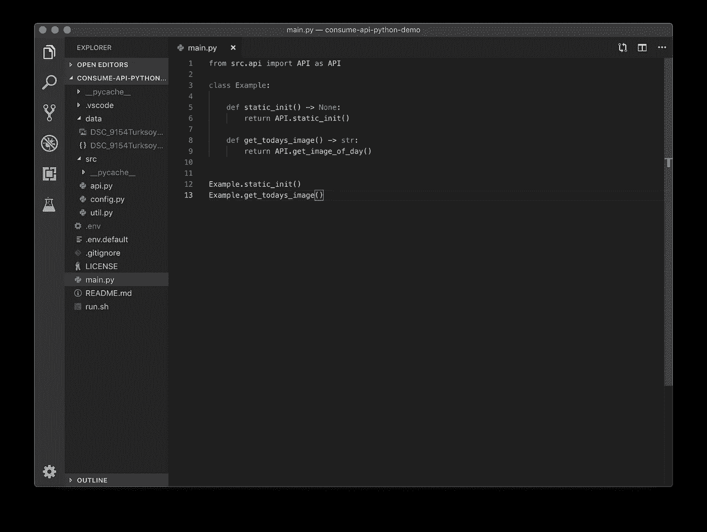
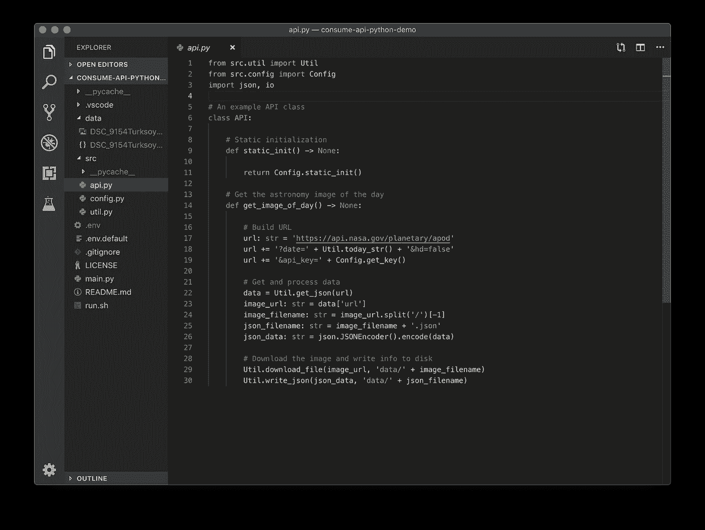
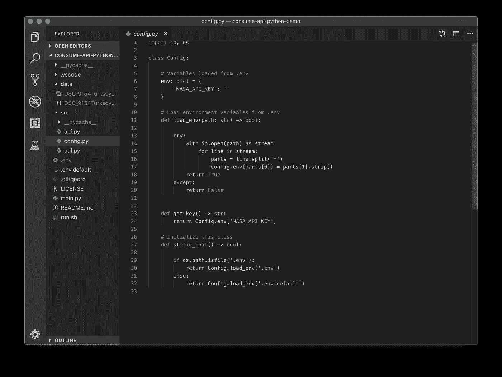
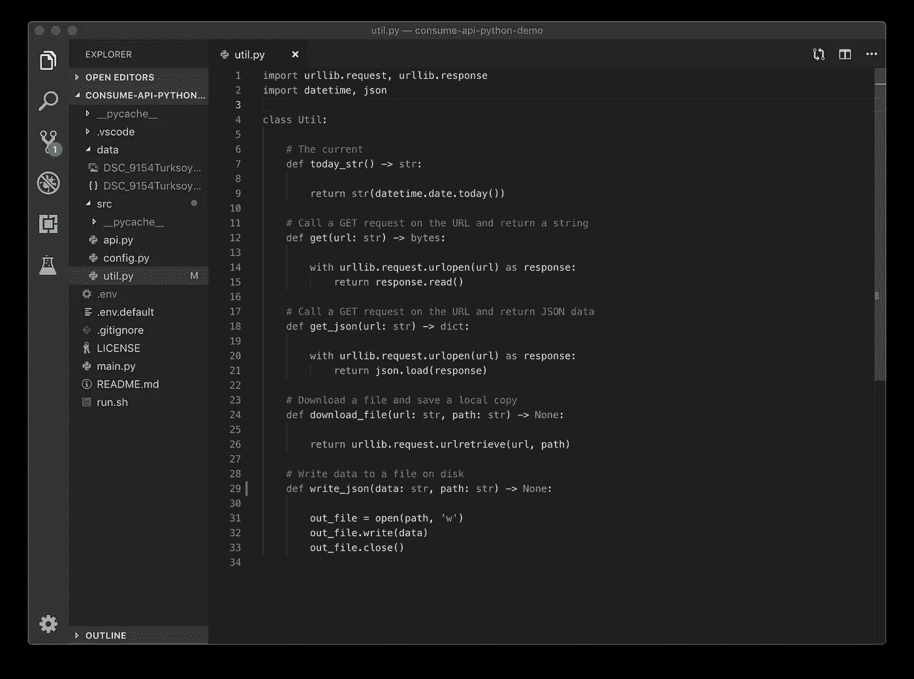
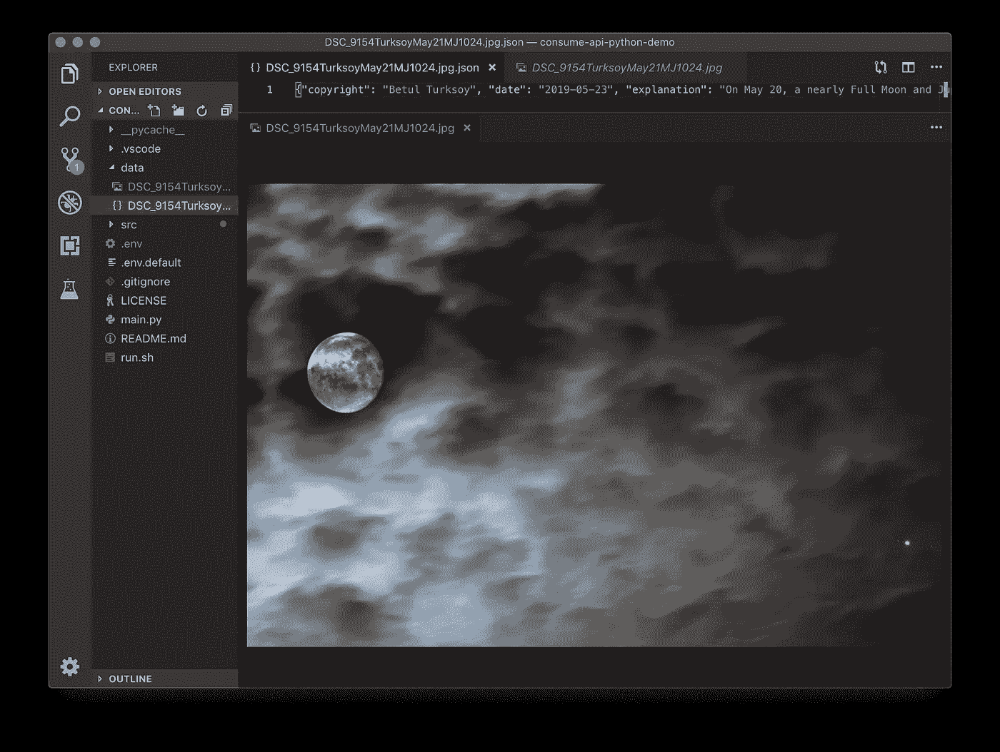

# 使用 Python 消费 Web APIs

> 原文：<https://itnext.io/consuming-web-apis-with-python-fa9b751d2c75?source=collection_archive---------4----------------------->

## 如何使用 Python 消费和处理来自开放 API 的数据

[https://www.python.org](https://www.python.org)

## 介绍

在本文中，我将介绍一种使用 Python 3 在开放 web 上使用 API 的简单方法，Python 3 是一种高度稳定和成熟的语言，具有清晰易读的语法，非常适合快速、轻松地构建 web 应用服务(或任何其他产品)的原型，并且最大限度地减少了挫折。

在这个例子中，我们将使用 NASA 的免费[开放 API，并利用几个类来包装简单的 python 方法，以下载今天的特色天文图片以及相应的照片信息。](https://api.nasa.gov/index.html)

## 一头扎进去

该项目的示例源可在[此处](https://github.com/kenreilly/consume-api-python-demo)获得。如果你还没有 Python 3，[去他们的网站](https://www.python.org/downloads/)下载你的操作系统版本。

让我们来看看项目入口文件， **main.py** :

主项目文件 **main.py**

这个文件作为主要的入口点，因此保持得相当干净，以免养成用一堆东西使项目的第一个文件过载的习惯。这里我们有带有几个方法的**示例**类:

*   **static_init()** 依次初始化 **API** 类
*   **get_todays_image()** 获取当天的*图片*

这个文件就是这样。如果我们想对此进行扩展，我们只需添加新的方法来包装我们的 **API** 类中的各种特性(或者可能是其他特性，比如接受和解析命令行选项)。

我们要检查的下一个源文件是 **src/api.py** :

**src/api.py** 中 **API** 类的内容

文件 **src/api.py** 具有 **API** 类，在本例中，它是一个简单的控制器，用于使用 NASA open API 上的一个端点，如方法 **get_image_of_day()所公开的。**该方法以 API 端点的基本 URL 开始，并附加以下查询字符串参数:

*   **日期**:指定检索图像的日期(默认为今天)
*   **hd**:API 是否应该返回 HD 分辨率的图像(可以更改)
*   **api_key** :在**T3 中指定的 API key。env** (如果未提供，则为 in .env.default)

接下来，调用方法***util . get _ json(****URL****)***来检索 JSON 数据，这些数据将由对指定的 *url* 的 GET 请求返回。这个 **get_json()** 方法是在 **Util** 中定义的一个简单的包装器，我们稍后将对此进行研究。

返回的 dictionary 对象包含一个 *url* 属性，它是一个指向实际图像文件的 url，用于使用另一个实用程序类方法**download _ file(***URL***，** *path* **)** 下载和检索图像，我们也将很快对其进行检查。最后，由 API 返回的 JSON 数据的内容也被保存到一个本地文件中，文件的文件名加上一个*。json* 后缀。

接下来我们来看看配置文件 **src/config.py** :

配置文件 **src/config.py**

文件 **src/config.py** 负责加载*中定义的环境变量。env* (或者如果不可用，在默认文件 *.env.default* )并返回 API 使用的 *NASA_API_KEY* 的本地值。虽然有相关模块可以实现这一点，但我想展示引入一些在*中定义的变量是多么简单。env* 文件。

这就是配置文件。可以为其他 API 端点添加附加属性，或者完成其他配置功能，例如根据当前环境动态选择是否检索 HD 图像。

该系列的最后一个文件是实用程序文件 **src/util.py** :

**src/util.py** 中定义的**实用程序**类

在这个 **Util** 类中，我们有一些执行各种功能的方法:

*   **today_str** ():返回当前日期，格式为*‘YYYY-MM-DD’*
*   **get(***URL***)**:**读取并返回 GET 请求对 ***url*** 的响应**
*   ****download _ file(***URL，path* **)** :从 ***url*** 下载一个文件，保存到 ***path*****
*   ****write_json(** *数据，路径* **)** :将字符串 ***数据*** 写到 ***路径*** 的一个文件中**

**正如我们所看到的，这个文件执行了大部分基本的底层工作，比如处理网络请求和文件系统操作。这使得主应用程序逻辑更加清晰和易于维护——例如，我们可以将 HTTP 请求实现替换为另一个库或其他服务，程序的其余部分将继续正常工作，就像什么都没发生一样，因为从它自己的角度来看，接口仍然按照预期排列。因此，可以安全地执行较低层次的修改，同时保持应用程序结构的其余部分不变(或者同时改进和添加*和*)。**

## **结论**

**在这个例子中，我们看了如何使用来自一个 API 提供者的一个端点(NASA 的每日图片)。除了[众多其他 API 提供商](https://github.com/n0shake/Public-APIs)提供从音乐、视频到科学数据的各种功能和内容之外，仅 NASA 就有更多的终端可用。**

****

**每日一图(上面有 JSON 数据)**

**我希望你喜欢这篇文章。这个例子的源代码是 GitHub 上的[，欢迎任何评论、建议或其他想法。](https://github.com/kenreilly/consume-api-python-demo)**

**感谢您的阅读，祝您的下一个 python 项目好运！**

> **肯尼斯·雷利( [8_bit_hacker](https://twitter.com/8_bit_hacker) )是 [LevelUP](https://lvl-up.tech/) 的 CTO**