# 从头开始的容器

> 原文：<https://itnext.io/container-from-scratch-348838574160?source=collection_archive---------0----------------------->

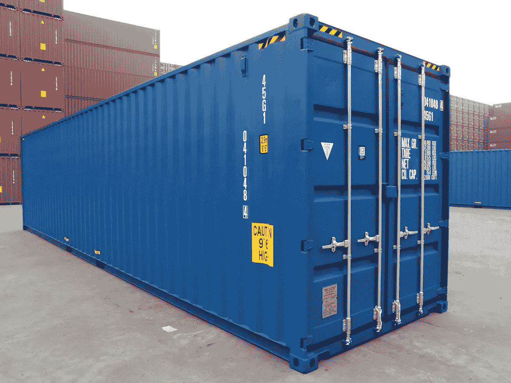

本文最初发表于:[https://www.prabhujayakumar.dev/blog/container-from-scratch](https://www.prabhujayakumar.dev/blog/container-from-scratch)

这是我的第一个博客，我想分享我对容器的认识

如今，在生产中采用容器来运行企业应用软件已经急剧增加。并且大多数容器部署都在使用 docker。Docker 成为运行容器化应用程序的事实上的技术。但是 docker 是建立在什么之上的呢？它是如何将应用程序容器化的？我将在本文中尝试回答这些问题。

# **对集装箱的需求**

在进入容器之前，让我们清楚地了解什么是过程？

当一个程序开始执行时，就创建了一个进程。


过程

我们怎样才能执行一个程序？执行程序的要求是什么？

一个程序需要 libs、env 和资源才能投入执行，从而创建一个进程。例如，要执行一个 python 脚本，我们需要 python 二进制和一些 python 模块、python 环境和资源，如 cpu、内存、磁盘。

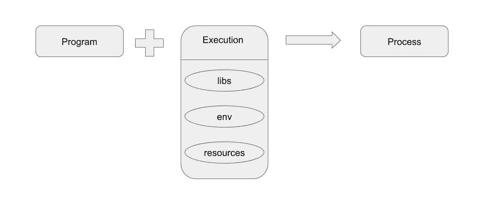

流程执行要求

让我们考虑一个 Web 应用程序，它由许多运行在不同语言和不同版本上的微服务组成。这些微服务不过是后端的一个流程。

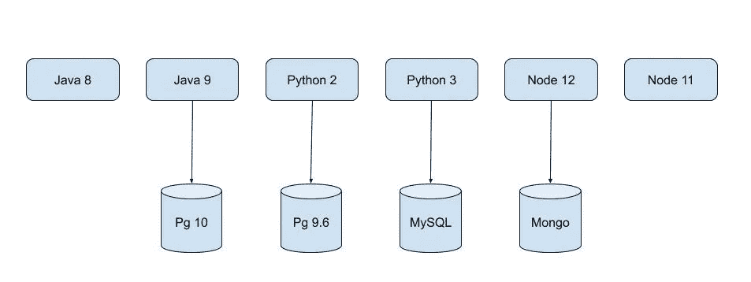

Web 应用程序的微服务

话虽如此，想象一下在物理机器上运行这些服务…

那不是一项容易的任务，仅仅是可能的

但是为什么呢？在一台物理机上运行同一个 web 应用程序的所有这些服务的挑战是什么？

问题是，假设应用程序有两个使用不同 Java 版本的 Java 服务，那么 JAVA_HOME 的值是多少？单个物理机中不能有 2 个 JAVA_HOME 集。

如果我们在一台机器上运行 N 个服务，我们必须为每个服务分配端口，这样就不会发生端口冲突。想想运行 2 个版本的 postgres，5432 端口上的 pg10 和 5433 端口上的 pg9.6。所以所有的服务都应该知道它运行的端口。

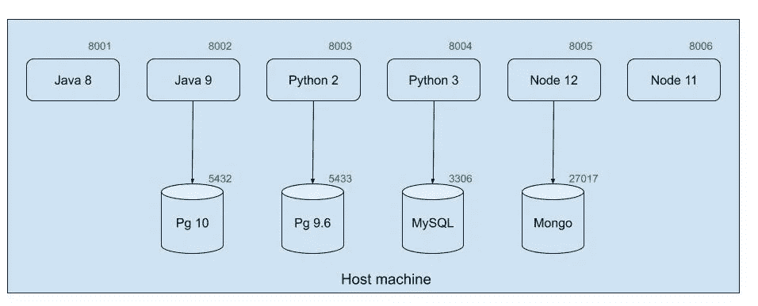

在主机中运行 web 应用的所有微服务

用一个词来概括上面提到的挑战，没有孤立。

由于有不同版本的 libs，因此需要不同的 env，每个服务都需要相互隔离。

为了隔离进程，人们开始使用虚拟机。让我们看看虚拟机是如何解决这个问题的。

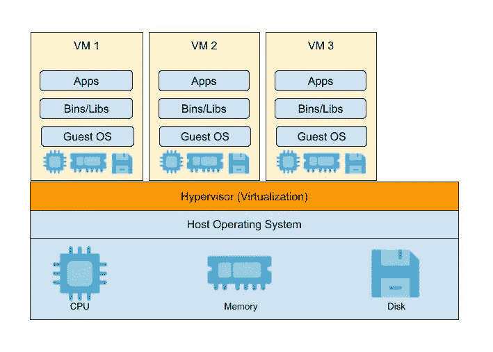

虚拟计算机

虚拟机是由运行在主机上的虚拟机管理程序创建的独立的来宾操作系统。

这种独立的客户操作系统有助于实现隔离的库、环境和资源。

但是在这种情况下使用虚拟机存在一些挑战。

考虑通过创建所需的虚拟机(1 个虚拟机对应 1 个服务)，在一台物理机上运行上述所有服务(流程)。

您可以清楚地看到运行 10 多台虚拟机的物理机的性能开销。原因是，每个虚拟机中的客户操作系统都有自己的内存管理、网络管理等等。

不仅如此，在使用虚拟机时，适当的资源利用成为一项艰巨的任务。

虚拟机方法中这种开销背后的主要原因是，虚拟机管理程序通过为每个虚拟机创建来宾操作系统来虚拟化硬件。

我们想要的是能够隔离库、环境和资源而不必创建单独的操作系统的东西。为什么我们不能使用主机操作系统本身的资源管理，而不是虚拟化硬件，这会导致开销？

是的，我们有一种叫做“容器”的东西，它能够为我们做同样的事情。

容器只不过是一个通过使用一些 linux 技术(如 namespace 和 cgroup)实现的独立进程。

现在让我们深入容器，它们如何为进程提供隔离，什么是名称空间和 cgroup，以及它们是如何使用的。

容器是运行在主机上由名称空间隔离的一组进程。

它提供操作系统级虚拟化。因此，我们可以称之为“轻量级虚拟机”

我们现在对什么是容器有了一个基本的了解。下一步是我们如何创造它？我知道我们中的许多人使用 docker 运行命令创建容器。但是，这是唯一的选择吗？没有，像 lxc，podman 等其他工具很少。如何使用这些工具创建容器？后端流程是什么？

为了理解这一点，让我们看看如何使用 linux 技术(如 namespace 和 cgroup)从头开始创建一个容器。

# **戈朗的简易集装箱**

让我们创建一个简单的 go 程序，它将 command 作为参数，并通过创建一个新进程来执行该命令。假设这个围棋程序是一个 docker。要在 docker 中执行命令，我们将使用“docker run”命令，同样，这里我们使用“go run container.go run”

```
package mainimport ( "fmt" "os" "os/exec")// go run container.go run <cmd> <args>// docker run <cmd> <args>func main() { switch os.Args[1] { case "run": run() default: panic("invalid command!!") }}func run() { fmt.Printf("Running %v as PID %d \n", os.Args[2:], os.Getpid()) cmd := exec.Command(os.Args[2], os.Args[3:]...)\ cmd.Stdin = os.Stdin cmd.Stdout = os.Stdout cmd.Stderr = os.Stderr cmd.Run()}
```

上面的程序将给定的参数作为命令执行。如下图所示，“go run container run echo hello container”执行命令“echo hello container”。它通过创建一个可视为容器的新进程来执行命令。

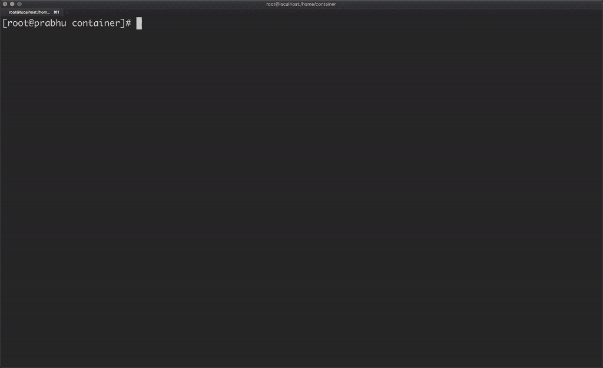

同样，让我们使用`/bin/bash '创建一个进程，并为该容器分配一个专用的主机名。但是更改容器内的主机名，也会更改主机的主机名。

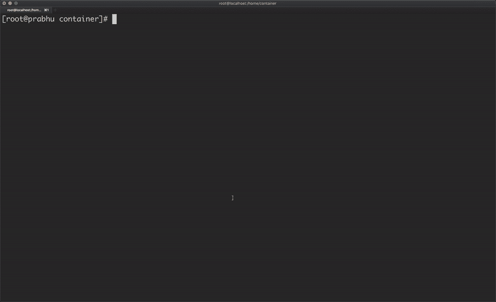

发生这种情况是因为该容器没有隔离主机名。因此，为了创建主机名的隔离，我们可以为容器分配新的 UTS 名称空间。在 golang 中，我们可以通过使用“syscall”包来实现这一点。

```
func run() { fmt.Printf(“Running %v as PID %d \n”, os.Args[2:], os.Getpid()) cmd := exec.Command(os.Args[2], os.Args[3:]…) cmd.Stdin = os.Stdin cmd.Stdout = os.Stdout cmd.Stderr = os.Stderr cmd.SysProcAttr = &syscall.SysProcAttr{ Cloneflags: syscall.CLONE_NEWUTS, } cmd.Run()}
```

现在，如果您更改容器的主机名，这不会影响主机的主机名，因为容器有自己的 UTS 名称空间。

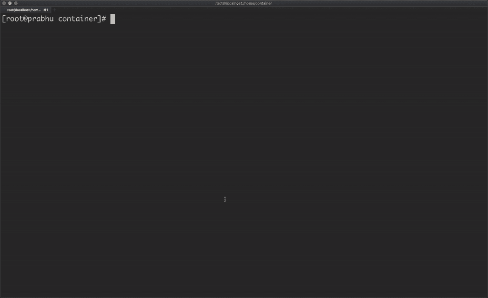

但是我想从 golang 程序中使用 syscall ` syscall . set hostname([]byte(" container-demo "))`将主机名自动分配给容器。但是，在上面的程序中，我可以把这一行放在哪里呢？进程是在' cmd.Run()'上创建的，并在同一行上退出。因此，让我们派生一个子进程，并在其中设置主机名。

```
package mainimport ( “fmt” “os” “os/exec” “syscall”)// go run container.go run <cmd> <args>// docker run <cmd> <args>func main() { switch os.Args[1] { case “run”: run() case “child”: child() default: panic(“invalid command!!”) }}func run() { fmt.Printf(“Running %v as PID %d \n”, os.Args[2:], os.Getpid()) args := append([]string{“child”}, os.Args[2:]…) cmd := exec.Command(“/proc/self/exe”, args…) cmd.Stdin = os.Stdin cmd.Stdout = os.Stdout cmd.Stderr = os.Stderr cmd.SysProcAttr = &syscall.SysProcAttr{ Cloneflags: syscall.CLONE_NEWUTS, } cmd.Run()}func child() { fmt.Printf(“Running %v as PID %d \n”, os.Args[2:], os.Getpid()) syscall.Sethostname([]byte(“container-demo”)) cmd := exec.Command(os.Args[2], os.Args[3:]…) cmd.Stdin = os.Stdin cmd.Stdout = os.Stdout cmd.Stderr = os.Stderr cmd.Run()}
```

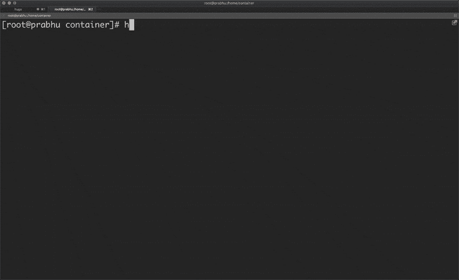

这里的另一个问题是，容器能够看到主机上运行的所有进程。

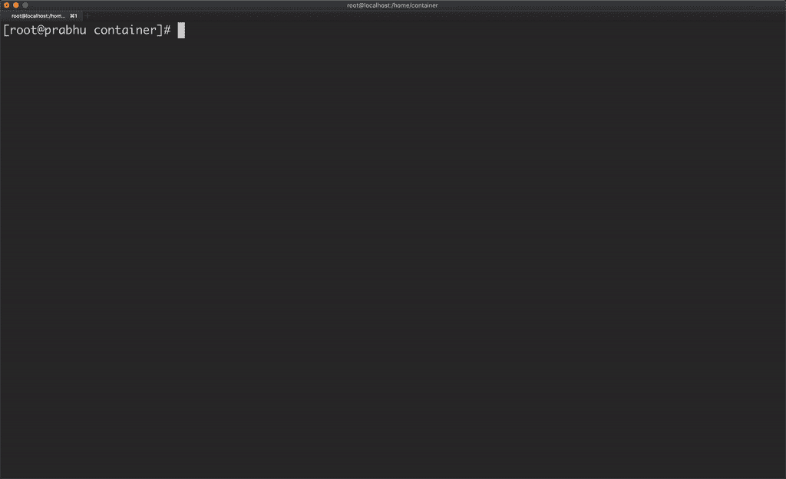

容器应该只能看到在该容器中运行的进程，这可以通过使用 PID 名称空间来实现。

```
cmd.SysProcAttr = &syscall.SysProcAttr{ Cloneflags: syscall.CLONE_NEWUTS | syscall.CLONE_NEWPID,}
```

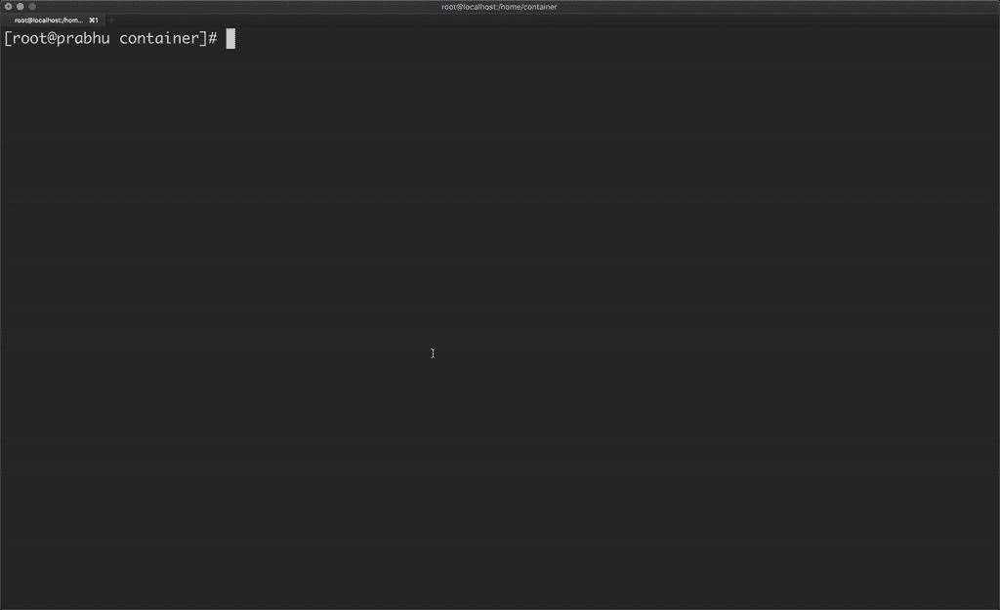

即使这样，容器也能够看到主机的进程。原因是`/proc `;容器使用与主机相同的根文件系统。因此，一个不同的根文件系统将被用于容器，并将`/proc '装入其中。

`/containerfs `目录包含操作系统的文件，该操作系统几乎没有二进制文件，如 python 和核心 linux 实用程序。因此，将这个目录挂载为 container 的根文件系统使得它对于 linux 实用程序来说是自给自足的，而对于二进制文件来说不依赖于主机。它还为此容器提供了单独的环境。

```
func child() { fmt.Printf(“Running %v as PID %d \n”, os.Args[2:], os.Getpid()) syscall.Sethostname([]byte(“container-demo”)) cmd := exec.Command(os.Args[2], os.Args[3:]…) cmd.Stdin = os.Stdin cmd.Stdout = os.Stdout cmd.Stderr = os.Stderr syscall.Chroot(“/containerfs”) os.Chdir(“/”) syscall.Mount(“proc”, “proc”, “proc”, 0, “”) cmd.Run()}
```


现在，我们已经使用 PID 名称空间实现了进程 id 隔离。类似地，我们可以使用网络和用户名称空间提供网络和用户的隔离。

基本上，名称空间是关于你能在容器中看到什么。它允许我们创建系统的受限视图，如进程树、网络接口、挂载和用户。以下是可用于提供隔离的各种名称空间:

*   UTS(Unix 分时)名称空间:主机名和域名
*   PID 命名空间:进程号
*   挂载名称空间:挂载点
*   IPC 命名空间:进程间通信资源
*   网络命名空间:网络资源
*   用户名称空间:用户和组 ID 号

现在，让我们看看资源管理在容器中是如何工作的。我有一个 python 脚本` *hungry.py`* ,它每 0.5 秒消耗 10mb 的内存。使用 container.go 程序运行此 python 脚本，允许容器进程消耗主机中的所有可用内存。

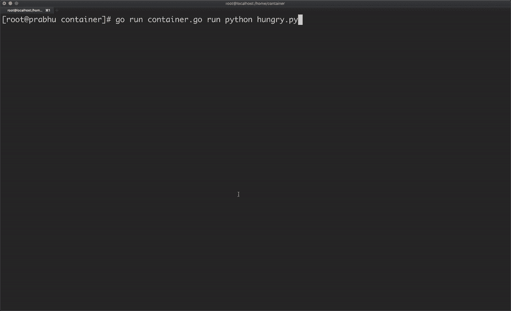

为了管理内存、cpu、磁盘块等资源，我们可以使用 cgroups。

每个系统在“/sys/fs/cgroup/”中都有控制组，内存使用“/sys/fs/cgroup/memory”中的默认值。您可以看到“/ sys/fs/cgroup/memory/memory . limit _ in _ bytes”中的值非常大，允许一个进程消耗主机中尽可能多的可用内存。

在这个 go 程序中，我创建了一个控制组“prabhu ”,并给定了 100mb 的最大内存限制，同时禁用了交换内存。并且还将容器的进程 id 分配给 c group‘prabhu’的任务。

```
func child() { fmt.Printf(“Running %v as PID %d \n”, os.Args[2:], os.Getpid()) syscall.Sethostname([]byte(“container-demo”)) controlgroup() cmd := exec.Command(os.Args[2], os.Args[3:]…) cmd.Stdin = os.Stdin cmd.Stdout = os.Stdout cmd.Stderr = os.Stderr syscall.Chroot(“/containerfs”) os.Chdir(“/”) syscall.Mount(“proc”, “proc”, “proc”, 0, “”) cmd.Run()}func controlgroup() { cgPath := filepath.Join(“/sys/fs/cgroup/memory”, “prabhu”) os.Mkdir(cgPath, 0755) ioutil.WriteFile(filepath.Join(cgPath, “memory.limit_in_bytes”), []byte(“100000000”), 0700) ioutil.WriteFile(filepath.Join(cgPath, “memory.swappiness”), []byte(“0”), 0700) ioutil.WriteFile(filepath.Join(cgPath, “tasks”), []byte(strconv.Itoa(os.Getpid())), 0700)}
```

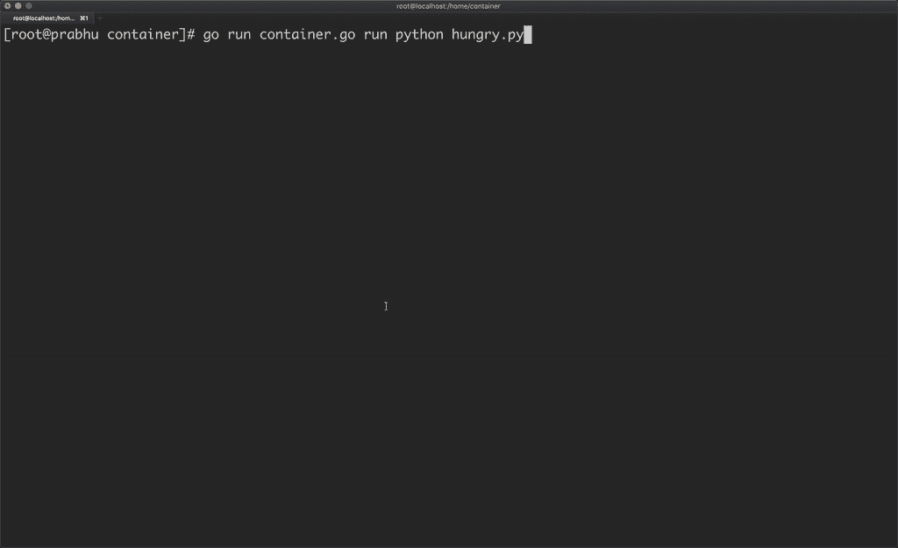

因为分配给容器进程的 cgroup `prabhu '只允许 100mb 的内存，所以一旦 python 进程试图超过这个内存限制，它就会被杀死。

通过使用 cgroups，系统管理员获得了对分配、区分优先级、拒绝、管理和监视系统资源的细粒度控制。硬件资源可以在任务和用户之间适当划分，从而提高整体效率。因此我们可以在容器生态系统中使用 cgroups 进行资源管理。

这里，我创建了一个简单的容器，使用相应的名称空间隔离主机名、mount(`/proc `)和进程树，还使用 cgroups 对容器进行了内存管理。

# **结论**

容器只是运行在单个主机上的隔离的进程组，这种隔离利用了 Linux 内核中内置的几种底层技术，如名称空间、cgroups 和 chroots。

这就是 docker 如何将应用程序与许多其他功能(如根据 Docker 映像存储和传输文件)封装在一起。

Docker 并不是帮助运行容器的唯一技术。还有其他选项，如 RedHat 的 Podman，CoreOS 的 LXC Linux Containers 和 rkt(项目现已关闭)。

灵感来自[在围棋中从零开始建造一个容器——利兹·赖斯](https://www.youtube.com/watch?v=Utf-A4rODH8)