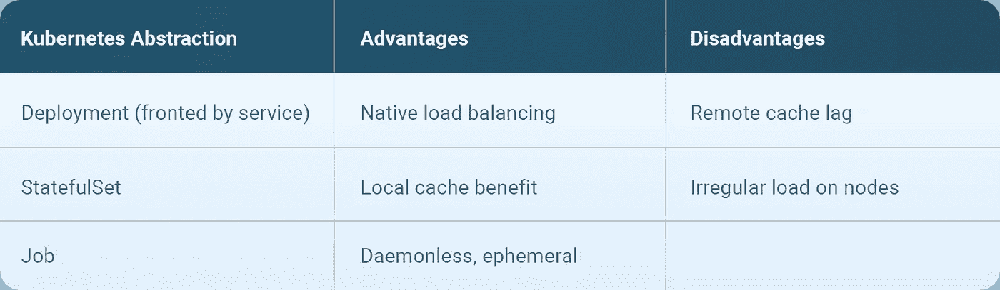

# 使用 BuildKit 构建容器图像

> 原文：<https://itnext.io/container-image-building-with-buildkit-13b283602be0?source=collection_archive---------8----------------------->

在这个系列的最后一篇文章中，我们将回到 Docker 的莫比项目，这是它开始的地方，以及一个名为 [BuildKit](https://github.com/moby/buildkit) 的子项目。

BuildKit 是 Docker 的[莫比项目](https://mobyproject.org/projects/)提供的第二代映像构建器，从 Docker CE 18.09 开始提供使用。正如我们在之前的文章中看到的 Img builder，BuildKit 并不仅限于与 Docker 一起使用。这是一种通用的映像构建功能，可以作为独立的二进制文件(在守护程序或无守护程序模式下)和库来使用。事实上，BuildKit 可以用来构建任何工件([而不仅仅是容器图像](https://twitter.com/tonistiigi/status/1047921976763867136))，只要构建步骤可以被翻译成它的低级构建器(LLB)表示。我们在这里主要关心容器映像构建，所以让我们看看 BuildKit 为聚会带来了什么。

# 构建步骤优化

Docker 提供的原始构建后端最常遇到的挫折之一是 Dockerfile 指令的构建步骤执行的顺序性。在引入了[多阶段构建](https://docs.docker.com/develop/develop-images/multistage-build/)之后，可以将构建步骤分组到同一个 docker 文件中的独立的逻辑构建任务中。

有时，这些构建阶段彼此完全独立，这意味着它们可以并行执行，或者根本不需要执行。不幸的是，传统的 Docker 映像构建体验并不能满足这种灵活性，有时会在不需要的时候执行构建步骤。这意味着构建时间通常比绝对必要的时间要长。

相反，BuildKit 创建了一个构建步骤之间的依赖关系图，并使用它来确定可以忽略哪些构建元素；其可以并行执行；并且需要顺序执行。这提供了更有效的构建执行，这反过来对开发人员来说是有价值的，因为他们为他们的应用程序迭代映像构建。

# 高效灵活的缓存

虽然传统 Docker 映像构建中构建步骤的缓存非常有用，但它并没有达到应有的效率。作为构建后端的重写，BuildKit 对此进行了改进，并提供了更快、更准确的缓存机制。它使用为映像构建生成的依赖关系图，并基于指令定义和构建步骤内容。

BuildKit 提供的另一个巨大好处是构建缓存的导入和导出。正如 [Kaniko](https://blog.giantswarm.io/container-image-building-with-kaniko/) 和 [Makisu](https://blog.giantswarm.io/container-image-building-with-makisu/) 允许将构建缓存推送到远程注册表，BuildKit 也是如此。然而，BuildKit 让您可以灵活地将缓存嵌入到映像中(内联),并将它们推到一起(尽管不是每个注册表都支持),或者将它们单独推到一起。还可以将缓存导出到本地目录，供后续使用。

当构建环境是从零开始构建的，没有以前的构建历史可以利用时，导入构建缓存的能力就有了用武之地。导入会“预热”缓存，对于短暂的 CI/CD 环境尤其有用。

# 构建工件

当使用传统的 Docker 映像构建器构建映像时，生成的映像会被添加到由 Docker 守护程序管理的本地映像缓存中。需要单独的`docker push`将图像上传到远程容器图像注册中心。再一次，新一代的映像构建工具允许您在构建调用时指定映像推送，从而增强了体验。BuildKit 也不例外，它还允许几种不同格式的图像输出；本地目录中的文件、本地 tarball、本地 OCI 映像 tarball、Docker 映像 tarball、存储在本地高速缓存中的 Docker 映像以及被推送到注册表的 Docker 映像。那可是好多格式啊！

# 扩展语法

在`docker build`体验中[经常重复](https://github.com/moby/moby/pull/30637)的许多功能要求之一是安全处理镜像构建期间所需的机密。莫比项目抵制这一呼吁多年。但是，利用 BuildKit 灵活的“前端”定义，为 Buildkit 提供了一个[实验前端](https://github.com/moby/buildkit/blob/master/frontend/dockerfile/docs/experimental.md)，它扩展了 Dockerfile 语法。扩展的语法为`RUN` Dockerfile 指令提供了有用的补充，其中包括安全特性。

[引用](https://docs.docker.com/develop/develop-images/build_enhancements/#overriding-default-frontends)的 docker 文件实验前端可以为`RUN`指令临时挂载秘密。使用`docker build`的`--secret`标志将秘密提供给构建。类似地，使用 ssh 挂载类型可以实现 SSH 代理连接的转发，从而实现安全的 SSH 身份验证。

以这种方式扩展事实上的 Dockerfile 语法的能力是 BuildKit 独有的。

# 消费构建工具包

BuildKit 还有许多其他特性，这些特性极大地改进了构建容器图像的技巧。如果它是一个适用于许多不同环境的通用工具，如何使用它呢？

这个问题的答案是多种多样的，取决于你工作的环境。让我们看一看。

# 码头工人

鉴于 BuildKit 是一个莫比项目，它可以作为 Docker (v18.09+)的首选构建后端也就不足为奇了。它还不是默认的后端，因为它在 Windows 平台上不受支持，但在 Linux 上构建映像时，它很容易打开。

简单地设置一个环境变量(`DOCKER_BUILDKIT=1`)就可以了，或者将下面的键/值对添加到守护程序的配置文件中以便永久使用；`"features":{"buildkit": true}`。

在这种配置中，由于 Docker 守护进程当前的一些限制，Docker 并没有完全展示 BuildKit 的全部功能。出于这个原因，Docker 客户端 CLI 被扩展为提供插件框架，允许使用插件来扩展可用的 CLI 功能。一个名为 [Buildx](https://github.com/docker/buildx) 的实验性插件绕过守护进程中的遗留构建函数，使用 BuildKit 后端进行所有构建。它提供了所有熟悉的映像构建命令和特性，但是增加了一些特定于 BuildKit 的附加特性。

BuildKit，通过扩展 Buildx，支持多个构建器实例。这是生态系统中其他映像构建工具所没有的重要特性。这实际上意味着一群构建器实例可以被共享用于构建目的；也许一个项目被分配了一组构建器实例，而另一个项目得到了一组不同的实例。

默认情况下，Buildx 插件以`docker`驱动程序为目标，该驱动程序使用 Docker 守护进程提供的 BuildKit 库，但有其固有的限制。另一个驱动程序是`docker-container`，它透明地在容器中启动 BuildKit 来执行构建。它可以提供 BuildKit 中可用的全部功能。第三个驱动程序是 Kubernetes，它使在 pods 中运行的 BuildKit 的构建器实例成为映像构建的目标。这一点特别有趣，因为它支持为 Kubernetes 中运行的 BuildKit 启动构建——全部从 Docker CLI 启动。这是否是一个理想的工作流程，完全取决于个人或公司的选择。

# 库伯内特斯

越来越多的组织在短暂的基础设施上实施他们的应用程序工作流。这包括 Kubernetes，并且经常看到容器映像构建作为 CI/CD 工作流的一部分出现在 pods 中。当谈到在 Kubernetes 中运行 BuildKit 实例时，有许多不同的配置可用。每种部署策略都有其优点和缺点，并且适合不同的目的。

除了使用 Docker CLI 为 BuildKit 启动面向开发人员的构建之外，构建还可以由各种 CI/CD 工具触发。使用 BuildKit 构建容器映像可以作为 [Tekton 管道](https://github.com/tektoncd/pipeline)任务执行，例如。

# 结论

本文没有足够的篇幅来介绍 BuildKit 提供的其他特性，比如[多平台映像](https://github.com/docker/buildx#building-multi-platform-images)和[无根](https://github.com/moby/buildkit/blob/master/docs/rootless.md)映像构建。然而，它提供了 BuildKit 为容器映像构建带来的许多重大改进。

*许多新一代的构建工具都试图缓解与传统构建过程相关的问题，而 BuildKit 则试图更进一步，进行创新。*

当然，BuildKit 还处于早期，一些特性需要随着社区的采用而成熟和发展。长期以来，一直局限于一个适当但不完美的容器映像构建体验，当面对今天可用的选择时，可能会有点困惑。有些人必然会基于隶属关系做出选择；红帽的 Buildah ，谷歌的 [Kaniko](https://blog.giantswarm.io/container-image-building-with-kaniko/) ，Docker 的 BuildKit。但是，可以肯定地说，由于现在有了不同的选择，构建容器映像的工作变得更加容易了。快乐形象塑造！

由[Puja Abbas si](https://twitter.com/puja108)——开发者倡议@ [巨型群体](https://giantswarm.io/)撰写