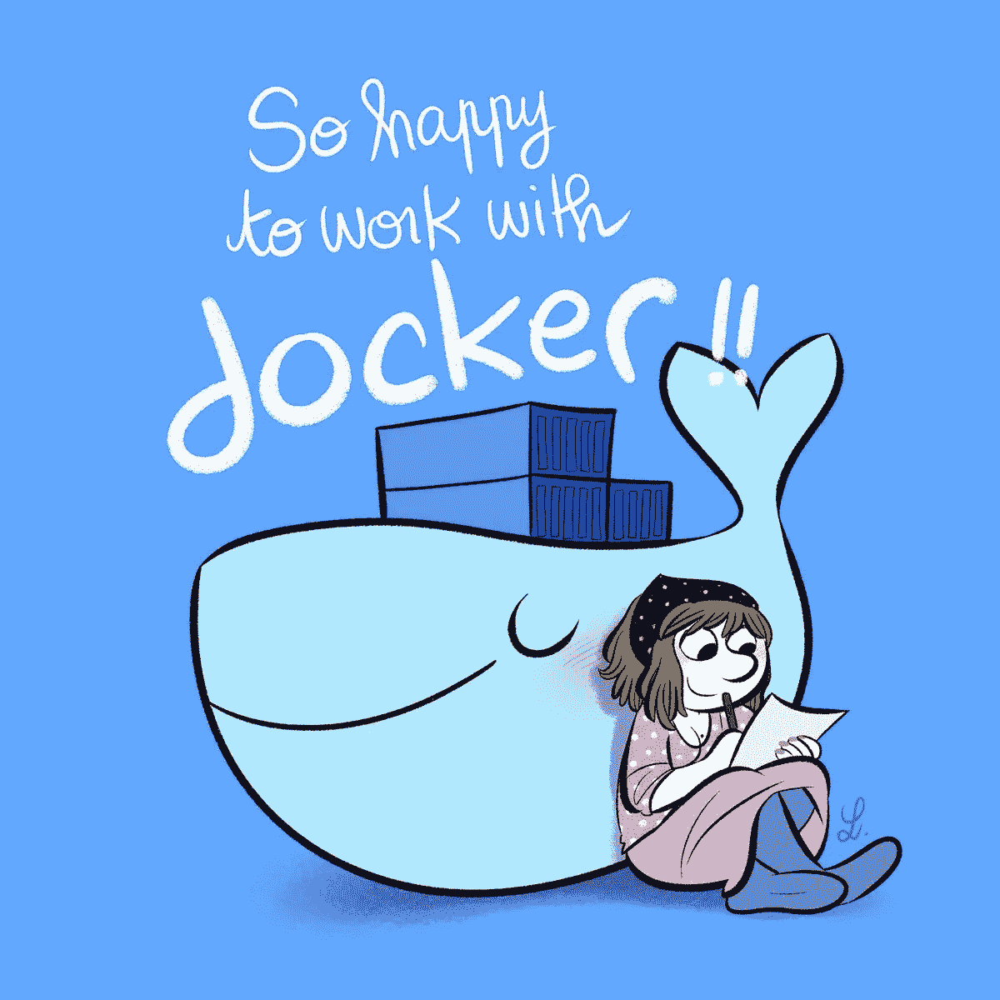
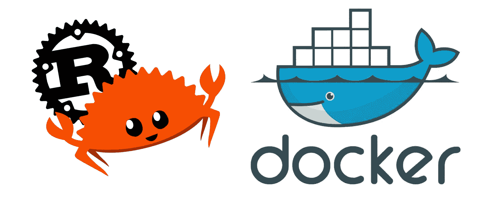
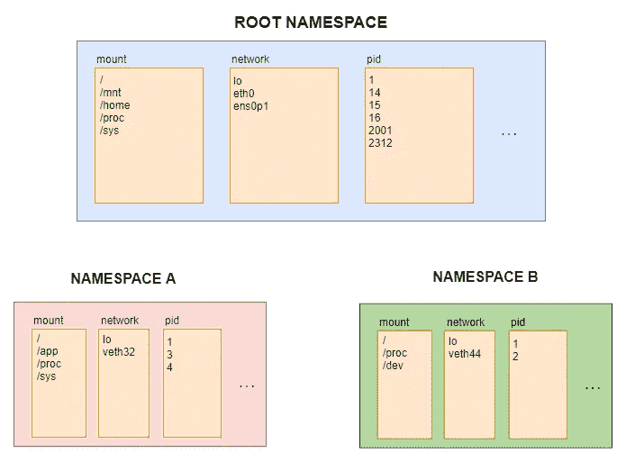
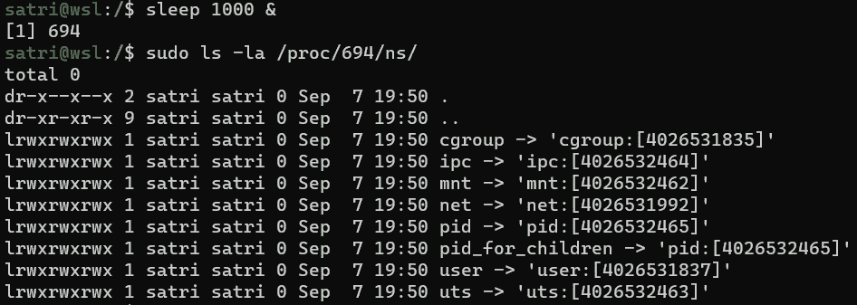
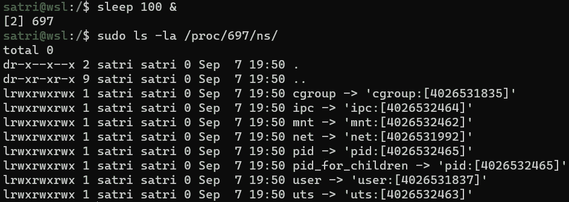
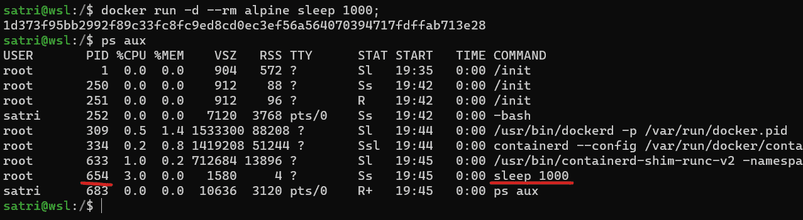
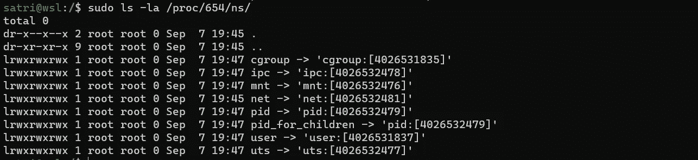
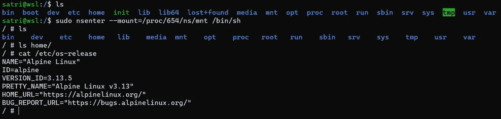

# Rust 中的容器运行时—第 0 部分

> 原文：<https://itnext.io/container-runtime-in-rust-part-0-7af709415cda?source=collection_archive---------1----------------------->

Docker、Podman、Kubernetes 和其他容器工具家族的成员:谢谢你们！



来源:https://twitter.com/laurelcomics

从 DevOps 的角度来看，我只能说活着是多么美好的时光！随着容器的兴起，我们在设置虚拟机、备份/恢复程序、动态资源调配方面遇到的所有困难都迎刃而解，因为使用量增加而扩展，因为未优化的架构设置而扩展，等等。通过一个 *docker-compose* 文件或一个像 *helm install my-app* 这样方便的一行程序，一切都烟消云散了(嗯，几乎是以上列表中的一切)。

但是，容器本质上是什么，Docker 是如何工作的呢？

这将是一个系列，描述我用除了 Rust 之外的其他语言编写一个小的、实验性的容器运行时的旅程。第 0 部分描述了 Linux 操作系统的系统特性，Docker 和其他工具利用这些特性来启动一个被隔离和保护的进程，换句话说，就是一个**容器。**整个系列都基于 Linux 容器，所以任何出现的**容器**都可以与“ **Linux 容器**”互换。

这篇文章的完整源代码可以在[这里](https://github.com/penumbra23/pura)找到。



Rust 中的容器运行时

# 容器

当被要求用尽可能少的词描述容器是什么时，大多数开发人员感到失望。用一个技术词汇来描述，这是一个分叉或克隆的过程。它有一个专用的 PID，由一个用户和一个组拥有，你可以用 *ps* 命令列出它并向它发送信号(是的，信号#9 也是)。仅此而已，周围没有什么超级花哨的出血边缘，只是一个老式的工艺。

但是它是如何与系统的其他部分隔离开来的呢？

答案是 [**名称空间**](https://en.wikipedia.org/wiki/Linux_namespaces) 。

命名空间为在不同命名空间集中运行的进程提供了资源的逻辑隔离。有不同类型的名称空间，例如，当前进程可以看到的所有装载点的装载名称空间，网络接口和流量规则的网络名称空间，进程树的 PID，等等。在不同 PID 名称空间中运行的两个进程看不到相同的进程树。一个独立的网络命名空间拥有自己的网络堆栈、路由表、防火墙和环回接口。具有不同网络名称空间的两个进程绑定到各自的环回设备，它们被绑定到一个单独的逻辑接口，这样流量就不会在它们之间产生干扰。

挂载名称空间包含一个进程可以看到的挂载点列表。当第一次从装载命名空间(CLONE_NEWNS 标志)克隆时，所有装载点都从父命名空间复制到子命名空间。在子挂载点中创建的任何附加挂载点都不会传播到父挂载名称空间。此外，当子进程卸载任何挂载点时，它只在其挂载名称空间内受到影响。



三个独立的 MNT、网络和 PID 命名空间的示例

root(“/”)也不例外。对于不同的挂载名称空间，根挂载点不必是(大部分不是)同一个目录。当运行一个容器时，Docker(特别是 [containerd](https://containerd.io/) )为每个容器的根挂载点创建一个目录。在实际的容器运行用户定义的进程之前，容器运行时负责将该目录挂载为容器的根目录。这样，每个容器都有自己的根挂载点，它独立于文件系统的其余部分和主机上运行的所有其他容器。

每个进程在主机上都有一个 */proc/PID/ns* 子目录，包含它们所属的每个名称空间(PID、net、user、cgroup、…)的符号链接。如果两个进程属于同一个名称空间，它们的符号链接将是相同的。

让我们看看一个简单的 *sleep* 命令有哪些名称空间(当然是在我的机器上):



PID 为 694 的睡眠进程的名称空间

在同一个 shell 中运行另一个进程并检查其名称空间，会得到与上面相同的符号链接:



PID 为 697 的睡眠进程的名称空间

这两个进程无需任何额外的命令或设置即可运行，它们具有相同的名称空间符号链接，因此属于相同的名称空间。

Linux 从 *sched.h* 库中提供了 [**UNSHARE**](https://man7.org/linux/man-pages/man2/unshare.2.html) syscall 来改变进程的执行上下文，并允许它创建和输入新的名称空间。在用特定的位掩码(结合哪些名称空间要从执行上下文中“取消共享”的标志)调用了**取消共享**之后，正在运行的进程从根名称空间分离到它自己的名称空间集中。不幸的是，仅仅调用 **UNSHARE** 并期望拥有一个隔离的容器是不够的(例如，一个“取消共享”PID 名称空间的父进程，仍然在根 PID 名称空间中运行，但是任何后来创建的子进程都将进入新创建的 PID 名称空间)。通常在容器运行时调用 **UNSHARE** 之后，它会跟随一个 **fork/vfork** 调用来创建实际的容器进程。

[**克隆**](https://man7.org/linux/man-pages/man2/clone.2.html) syscall 是一个好得多的选择，在 [Rust 的 nix 包](https://docs.rs/nix/0.22.1/nix/sched/fn.clone.html)中的实现感觉更加健壮和细粒度。它提供了指定名称空间标志的能力，如 **UNSHARE，**fork 一个子进程并为该子进程创建堆栈。

**SETNS**syscall(**NSENTER**command)提供了通过文件描述符将给定名称空间更改为现有名称空间的选项。例如，要派生进入 PID 为 15 的进程的 mount 命名空间的 shell 进程，请输入一个新的 shell(具有 root 权限):

```
nsenter --mount=/proc/15/ns/mnt /bin/sh
```

**够理论**！为了证实上面所说的一切，让我们跳到一个基于 Docker 的例子。我们将运行一个 alpine 容器，列出主机系统上的进程，检查其名称空间，并使用 **SETNS** 将 *docker exec* 插入其中。

让我们运行一个长期运行的睡眠容器:



运行“sleep 1000”(唯一运行相同命令的进程)的 alpine 容器的 PID

检查完容器的 PID 之后，让我们看看 */proc/PID/ns* 下的名称空间符号链接:



有意思！一些名称空间与我们在终端中运行的上述 sleep 命令相同(具体来说是**用户**和**c 组**名称空间)，但大多数名称空间是不同的，这证明 Docker 将容器分隔在不同的名称空间中。

现在，让我们尝试在容器内部执行一个 shell 来检查文件系统:



NSENTER 命令打开 alpine 容器的 MOUNT 名称空间内的 shell

开始有意义了吗？嗯，差不多…

这里发生的事情是，我们已经运行了 **NSENTER** 来启动容器进程的 mount 名称空间内的 *shell* 进程。容器的挂载名称空间不同于根目录，因为根目录列出的树结构与我的 WSL 实例上的略有不同。此外，在我的 Debian 实例上，打印容器内的 Linux 发行版信息( */etc/os-release* )显示了一个 Alpine Linux 发行版。所以我们得出结论:

```
docker exec -it <CONTAINER_ID> <CMD>
```

等于:

```
nsenter -a -t <CONTAINER_PID> <CMD>
```

*** n 输入-a** 进入具有 **-t** arg 中指定的 PID 的进程的所有名称空间

# 码头工人

大多数读者已经熟悉了 Docker 客户机-服务器模型，因此没有必要解释 CLI 如何调用后台运行的**Docker**服务上的命令。让我们打开前盖，看看下面是什么。

在最后一个例子中，我们看到了 *docker run* 命令在一个单独的名称空间集中派生出一个进程。实际发生的情况是，Docker(同样，更具体地说是 containerd，但现在让它保持简单)调用底层容器运行时来创建指定的名称空间，准备容器环境，并在实际的用户定义命令开始之前执行一些需要的特殊命令。

但是如果这是运行时的责任，我们用 Docker 做什么呢？

Docker 在创建容器之前做好了一切准备，包括两个最重要的部分:

1.  **config.json**
2.  **容器根目录**

这两个部分(以及我们将在本系列中发现的其他内容)被称为**容器包**。

**config.json** 文件具有整个容器生命周期的完整布局，从容器开始到容器删除。它包含容器根目录的路径、需要取消共享的名称空间列表、容器进程的资源限制、需要在特定时间点执行的挂钩以及许多其他设置。

**容器根目录**是挂载名称空间部分提到的目录。这是主机系统上某处的子目录，将成为容器的根目录。用户定义的进程一定不知道在容器根目录之外有一个完全不同的世界，它基本上将用户进程“关”在容器根目录内(大多数文献称之为“监狱”)。

除了这两件最重要的事情之外，Docker 还做了其他准备工作(例如，从远程存储库中提取图像层，如果容器启用了网络，则设置网络接口，等等)。

# OCI 规格

标准化是任何软件集成的关键部分。从编写 REST APIs 或 gRPC 服务到设计底层网络协议，一切都从一个定义良好的文档开始，该文档描述了什么是(不)预期的行为以及实现需要履行的最小契约。

[开放容器倡议(OCI)](https://opencontainers.org/) 创建并仍然维护着 OCI 运行时规范，可以在[这里](https://github.com/opencontainers/runtime-spec/blob/master/spec.md)找到。这是一个仍在发展和添加新特性的规范，容器运行时可以或可能在启动容器进程时执行这些新特性。

我不会深入到规范的细节，因为它在文档中描述得很好，但至少这里是它的概括。

符合 OCI 标准的**容器运行时**是实现以下命令的 CLI 二进制文件:

*   **创建***<id><bundle _ path>*
*   **开始** *< id >*
*   **状态** *< id >*
*   **杀死** *< id > <信号>*
*   **删除** *< id >*

和其他新兴规范一样，OCI 运行时规范描述了创建容器的最基本特性。流行的容器运行时实现，如[**runc**](https://github.com/opencontainers/runc)**或[**crun**](https://github.com/containers/crun)**有额外的参数帮助设置进程的 PID 文件、容器状态的根文件夹或容器终端的套接字文件。****

****但是不用担心这些部分。在本系列接下来的文章中，我们将用一些 Rust 代码更深入地研究它。****

****接下来: [**第一部分**](https://penumbra23.medium.com/container-runtime-in-rust-part-i-7bd9a434c50a)****

# ******参考文献******

1.  ****[Linux 名称空间手册页](https://man7.org/linux/man-pages/man7/namespaces.7.html)****
2.  ****[OCI 运行时规范库](https://github.com/opencontainers/runtime-spec)****
3.  ****[**runc** 储存库](https://github.com/opencontainers/runc/blob/master/man/runc.8.md)****