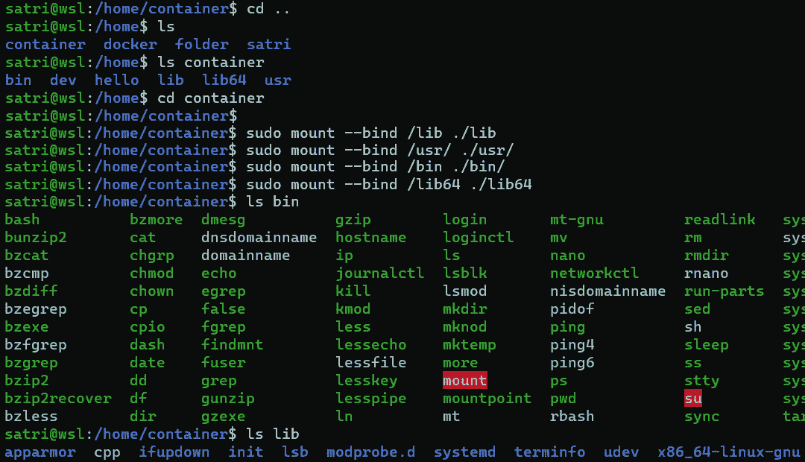
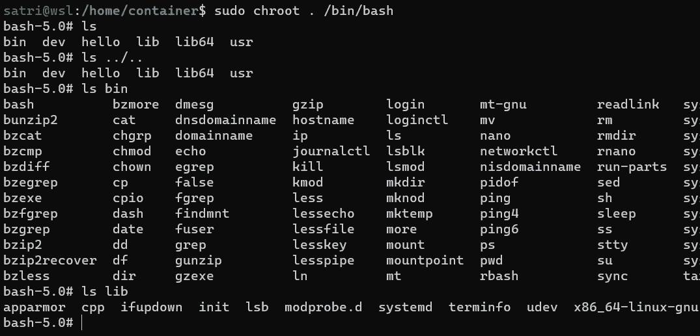
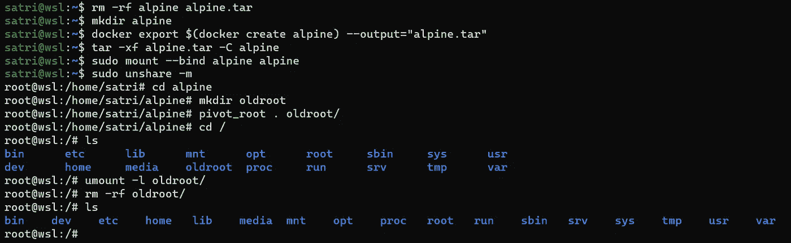

# Rust 中的容器运行时—第一部分

> 原文：<https://itnext.io/container-runtime-in-rust-part-i-7bd9a434c50a?source=collection_archive---------2----------------------->

应用程序结构和“监禁”容器


锁定容器进程

在本系列的第 0 部分中，我们已经看到了进程如何获得它们所看到的资源的受限视图。这部分将解释容器运行时如何为容器进程准备和创建一个隔离的环境。

本部分的先决条件是了解 Linux 文件系统如何工作，什么是 inodes、符号链接和挂载点。

这篇文章的完整源代码可以在[这里](https://github.com/penumbra23/pura)找到。

首先，让我们从 OCI 规范开始。

# 操作

在撰写本文时，OCI 规范定义了最少五个标准操作:创建、启动、状态、删除和终止。考虑到这一点，使用 [**clap**](https://crates.io/crates/clap) 库，我们可以很快生成一个漂亮的 CLI 界面。它应该是这样的:

我们将主要关注**创建**和**启动**命令，因为这是运行`docker run`命令时最重要的两个命令。

包目录包含 **config.json** 文件，该文件保存了用于创建容器的所有元数据:

*   *OCI version*-OCI 规范的版本
*   *进程*——容器执行的自定义进程(shell、数据库、web app、gRPC 服务等)。)以及必要的参数和环境变量
*   *根目录*——容器根目录的子目录路径
*   容器的*主机名*
*   *挂载点* -容器内挂载点列表

此外，OCI 规范包含一个特定于平台的部分，支持基于运行容器的平台的自定义设置。因为我们只查看 Linux 容器，所以***Linux****部分将对我们有用。*

***create** 命令带有容器 ID 和包路径。其目的是初始化容器进程，挂载所有必要的子目录，将容器“监禁”在**根**内。 **path** 文件夹，更新容器中的所有系统变量(env，hostname，user，group)，执行几个钩子(我们稍后会研究这个)，给容器本身分配唯一的 ID，然后等待 **start** 命令被触发。在 **create** 命令完成后，容器处于 *Created* 状态，用户进程必须等待 **start** 命令来启动实际的容器进程。*

*关于实现，一切似乎都很简单，但是“监禁”部分可能有点令人困惑。是怎么做到的？*

# *克鲁特*

*[**Chroot**](https://man7.org/linux/man-pages/man2/chroot.2.html) 是一个改变调用进程根目录的 syscall。它以新的根路径作为参数，可以是绝对或相对路径。来自终端的 chroot 命令做了同样的事情，除了它需要一个额外的参数，即将要在更改的根目录中执行的进程。*

*在我们看一个例子之前，首先我们需要准备新的 rootfs。不幸的是，jail 中使用的二进制文件必须驻留在 chroot-ed 目录中(很明显)，所以我们需要一个预制的 rootfs。幸运的是，我们可以使用我们的主机操作系统二进制文件并挂载绑定已经存在的文件，最终得到如下结构:*

**

*容器文件夹的文件和目录结构*

*如果您的列表不同，也不用担心，只要确保 bin 目录中有 *bash* 和 *ls* 即可。*

*让我们来看看 chroot 命令(使用 *sudo* 运行):*

**

*和克鲁特一起坐牢*

*正如我们所看到的，列出根目录之外的目录( *ls..*)列出了被监禁的根，似乎我们看不到外面的任何东西。此外，列出 *bin* 和 *lib* 目录的结果与上面的例子相同。*

*你可以说*“这就是容器被囚禁的方式”*，然后从头开始构建容器。但是，事情并没有那么简单… Chroot 既不会改变文件系统，也不会改变进程看到的挂载点。它只是改变了流程根的视图，但是一切都保持不变。而且，打破这个监狱是相当容易的，正如这里所描述的。*

# ***pivot_root***

*[**pivot _ root**](https://man7.org/linux/man-pages/man2/pivot_root.2.html)**另一方面正是我们所需要的。给定当前根目录的新根目录和子目录，它将当前根目录移动到子目录，并将新根目录挂载为根目录挂载点。这样，它就改变了根目录的物理挂载文件夹。稍后，我们可以卸载“旧的”根，只留下新创建的根挂载点。***

***我们来看一个例子。***

****** *注意**: pivot_root 更改了根挂载点，可能会破坏您的文件系统，所以一定要遵循下面的步骤。*****

***首先，我们需要一个真正的 rootfs 文件系统。我们不能使用上面的例子，因为我们挂载 bind 主机二进制文件。我们需要一个能够独立存在的独立目录。为此，我们将使用 Docker 从 Alpine 容器中导出一个新鲜的 rootfs。然后我们将使用 **unshare** (还记得我们在[第 0 部分](https://penumbra23.medium.com/container-runtime-in-rust-part-0-7af709415cda)中的朋友)来创建一个新的挂载名称空间。然后我们将在容器内旋转根。它应该是这样的:***

******

***将进程禁锢在基于 alpine 的 rootfs 中***

***简单地将容器中的文件复制到主机系统中的 tar 归档文件中。从 Alpine 映像导出 rootfs 后，我们将 mount 目录绑定到它自己，为什么？因为根据 pivot_root 系统调用的规范， *new_root* 必须是不同于“/”的挂载点的路径。***

***准备好容器根之后，我们需要创建一个新的挂载名称空间，使它与我们的主机环境不同，这样 pivot_root 就不会改变主机挂载名称空间上的任何内容。我们创建一个临时文件夹来保存旧根，旋转根，卸载(或与 *umount -l* 解除链接)旧根*并最终完成交换，删除*旧根*文件夹。****

***瞧啊。现在我们有一个 bash 进程在被监禁的容器文件夹中运行。***

***在 Rust 代码中，用 [nix 板条箱](https://docs.rs/nix/0.22.1/nix/)安装 rootfs 文件夹看起来像这样:***

***在铁锈中安装 rootfs***

***第一次挂载将根挂载点的挂载传播更改为私有(由于显而易见的原因， *pivot_root* 不允许共享挂载传播)。***

***整个旋转过程的代码应该如下所示:***

***注意， **mount_rootfs** 和 **pivot_rootfs** 都是在新创建的挂载名称空间中调用的。***

# *****特殊链接&挂载*****

***OCI 运行时规范定义了一组[特殊符号链接](https://github.com/opencontainers/runtime-spec/blob/master/runtime-linux.md)。这些符号链接用于将*标准输入*、*标准输出、*和*标准错误*流从容器引擎(Docker、containerd)传递到运行时，反之亦然。它只是将容器的标准流绑定到容器进程的外部文件描述符。容器运行时需要在 pivot_root 之前建立这些符号链接。***

***OCI 运行时规范定义了一组需要安装在容器内部的[文件系统](https://github.com/opencontainers/runtime-spec/blob/master/config-linux.md#default-filesystems)。当从 Alpine、Ubuntu、Debian 等映像中提取一些 **config.json** 文件时， */dev/pts* 和 */dev/shm* 挂载点出现在运行时配置规范的 *mounts* 部分中。***

***需要更多关注的两个重要文件系统是 *proc* 和 *sysfs。****

****proc* 文件系统挂载到 */proc* 目录，并作为内核内部结构的接口。对于每个进程，它有一个*/proc/【PID】*子目录，保存文件描述符、cpu 和内存使用情况、挂载信息、页表和许多其他东西。例如，在没有创建这个文件系统之前，不能检查当前的挂载点(使用 *mount* 命令)。安装 proc fs 的确切命令是:***

```
***mount -t proc proc /proc***
```

****sysfs* 文件系统是一个伪 fs 类的*进程*，它提供了一个到内部内核对象的接口。与 *proc* 文件系统相反，它保存系统范围的信息，如块和字符设备的元数据、总线信息、驱动程序、控制组、内核信息和其他全局变量。安装 *sysfs* 与 *proc:* 相同***

***`mount -t sysfs sysfs /sys`***

***当创建新的根挂载点时，需要在 pivot_root 之后挂载 *proc* 和 *sysfs* 。***

# ***设备***

***在 Linux 中，一切都被认为是一个文件。硬盘驱动器、外围设备，甚至进程都通过文件描述符进行全面描述。设备也不例外。软盘，光驱，串口，你连接的任何设备都应该出现在根目录下的 **/dev** 子目录中。设备有类型，大多数设备要么是*块*(存储某种数据)，要么是*字符*(向/从设备传输数据)。终端、伪随机数发生器甚至 */dev/null* 文件也被认为是一个设备。***

***OCI 规范定义了每个容器所需的设备，而 **config.json** 包含了一个*设备*列表，位于 **linux** 部分下。容器运行时负责在容器根目录中创建这些设备。创建设备的系统调用是 [**mknod**](https://man7.org/linux/man-pages/man2/mknod.2.html) 。这个 syscall(也是终端内部的命令)接受 4 个必需的参数:***

*   ****路径名-* 文件位置的完整路径***
*   ****类型* -闭塞、字符或其他设备类型***
*   ****主要&次要* -设备的唯一标识符***

***比如主副号为 1，8 的 char 设备就是代表伪随机数发生器的*随机*设备。每当你的应用程序请求一个随机数，这个设备就会收到一个请求。***

***我们可以很容易地用 nix 的 **mknod** 函数生成特殊设备，或者在绑定到主机设备的情况下(这是 OCI 规范所涵盖的),使用 mount bind 选项。***

# ***结论***

***我们已经看到了 **chroot** 如何改变当前进程的根目录视图，以及 **pivot_root** 如何交换根挂载点，创建文件系统的逻辑隔离。我们还看到了如何创建标准容器设备，以及不同的容器可以在 config.json 文件的 *mounts* 部分中请求特殊设备。***

***知道了**取消共享**和 **pivot_root** 如何工作，我们就能够在终端中手动创建 Linux 容器。在接下来的部分中，我们将更深入地研究实现。特别是关于克隆子进程和启动容器命令的准备工作。***

***接下来: [**第二部分**](https://penumbra23.medium.com/container-runtime-in-rust-part-ii-9c88e99d8cbc)***