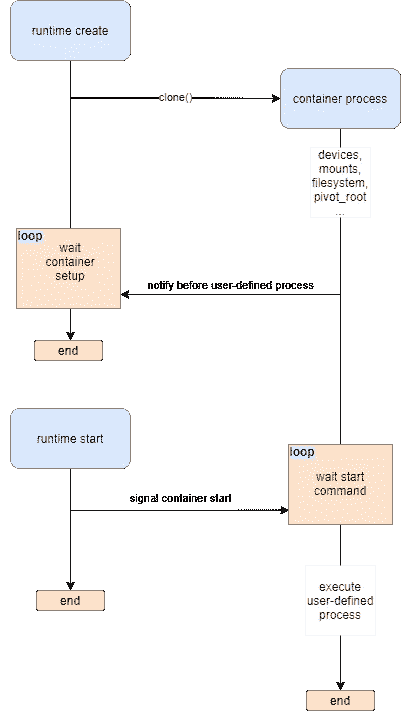

# Rust 中的容器运行时间—第二部分

> 原文：<https://itnext.io/container-runtime-in-rust-part-ii-9c88e99d8cbc?source=collection_archive---------1----------------------->

克隆容器进程和父子通信


Rust 中的容器运行时

本系列的第一部分描述了文件系统布局以及运行时如何将容器进程锁在容器的根文件系统中。

第二部分对实现进行了更深入的探讨，展示了运行时如何创建子进程，以及它们如何通信，直到用户定义的进程开始。它还将描述如何设置伪终端，并展示 Unix 套接字的重要性。

到这一部分结束时，我们应该有一个可以与 Docker 互操作的基本运行时。

# 克隆

第 0 部分简要解释了克隆系统调用。它类似于 fork/vfork，但是有更多的选项来控制子进程。实际上，fork 的一些实现传播了对 clone()的调用。

除了控制执行上下文的哪些部分从父进程共享之外，克隆调用还为我们提供了为子进程的堆栈创建单独的内存块的可能性。克隆的 nix 实现具有以下签名:

```
pub fn clone(
 cb: [CloneCb](https://docs.rs/nix/0.22.1/nix/sched/type.CloneCb.html)<’_>, 
 stack: [&mut [](https://doc.rust-lang.org/nightly/std/primitive.slice.html)[u8](https://doc.rust-lang.org/nightly/std/primitive.u8.html)[]](https://doc.rust-lang.org/nightly/std/primitive.slice.html), 
 flags: [CloneFlags](https://docs.rs/nix/0.22.1/nix/sched/struct.CloneFlags.html), 
 signal: [Option](https://doc.rust-lang.org/nightly/core/option/enum.Option.html)<[c_int](https://docs.rs/libc/0.2.99/x86_64-unknown-linux-gnu/libc/unix/type.c_int.html)>
) -> [Result](https://docs.rs/nix/0.22.1/nix/type.Result.html)<[Pid](https://docs.rs/nix/0.22.1/nix/unistd/struct.Pid.html)>
```

如果指定了`signal`参数，当子进程终止时，它将被发送回父进程。

下面是描述 **create** 命令和父子关系的代码片段:

OCI 创建命令的基本布局

鉴于上述情况，产生的一个问题是父母和孩子之间的沟通。在生成线程的情况下，可以说创建一个内存通道可以解决这个问题(Rust 对多线程和线程安全[多生产者、单消费者队列](https://doc.rust-lang.org/std/sync/mpsc/index.html)有很好的支持)。在我们的例子中，情况并非如此，因为它用自己独立的内存空间创建(或者更好地说是克隆)了一个新进程。

进程间通信(IPC)是一组允许进程相互通信的技术。最广泛使用的两种是:

1.  共用存储器
2.  套接字

在我们的例子中，我们将使用 Unix 套接字(AF_UNIX)在父进程和子进程之间建立一个“客户机-服务器”通道。容器进程将绑定到那个 Unix 套接字，并侦听来自父进程的传入连接。当执行的不同部分通过或失败时，两个进程都将使用套接字连接来通知对方。调用 start 命令时，套接字连接也很方便，它通知容器进程启动用户定义的程序。下图更好地描述了“协议”:



运行时和容器进程通信

# Unix 套接字

对于那些不熟悉 [Unix(域)套接字](https://man7.org/linux/man-pages/man7/unix.7.html)的人来说，这个 Linux 特性有望让人大吃一惊(至少对我来说是这样)。Unix 套接字是一种进程间通信机制，它在同一台机器上运行的进程之间建立双向数据交换通道。人们可以把它们想象成 TCP/IP 套接字，它们不使用网络栈来发送和接收数据，而是文件系统上的一个文件。

在容器运行时的情况下，Unix 套接字为运行时父进程和子进程提供双向数据交换。该交换通道对于容器运行时是必不可少的！如果在子进程中出现问题怎么办？父进程如何继续？或者孩子如何知道启动命令何时被调用？

出于这些目的，容器运行时实现了 IPC 通道。这些是使用 Unix 域套接字的双向通道。一个进程充当“服务器”，其他进程(称为“客户端”)连接到服务器进程。

简而言之，下面是 Rust 代码的大概样子:

Rust 中使用 Unix 套接字的 IPC 通道

服务器调用 **new** 方法并绑定到*。sock* 文件。然后它调用 **accept** 并等待进入的连接。另一方面，客户端只是用同一个*调用**连接**。sock* 文件，在此之后，服务器和客户端可以交换消息。最终，两个进程都调用 **close** ，通信结束。

注意，我使用了`SOCK_SEQPACKET`套接字，因为消息是按顺序出现的，它是基于连接的，消息会被一次刷新(与`SOCK_STREAM`相反)。

# 末端的

为了在容器启动后与它进行良好的交互，如果用户请求终端，运行时应该能够提供一个终端接口。

当运行这样的 Docker 命令时:

`docker run alpine ping 8.8.8.8`

您将看到 ping 命令向 Google 的 DNS 发送 ICMP 请求的输出。ping 命令的输出通过 Docker 传输，但是当我们想要停止命令(通过使用 Ctrl+C)时，什么也没有发生。这是因为当按下 [SIGINT](https://dsa.cs.tsinghua.edu.cn/oj/static/unix_signal.html) 组合键时，信号被发送到 Docker，Docker 没有将命令传递给实际的容器进程。

另一方面，跑步时:

`docker run -it alpine ping 8.8.8.8`

并按 Ctrl+C，该命令会立即终止，就像在主机上运行一样。这是为什么呢？

这是因为在第一个例子中，容器进程没有实例化终端，因此用户和 Docker 都不能通过 tty 将信号转发给容器。

幸运的是，`-t`选项在 **config.json** 文件中设置了`terminal: true`标志。之后，容器运行时负责创建一个所谓的[“伪终端”(pty)](https://linux.die.net/man/7/pty) 。

简单来说，PTY 是一对(主-从)通信设备，就像一个真正的终端。发送到主机的任何命令都会被转发到从机端，从文本输入到处理信号。pty 是 Linux 内核非常重要且常用的特性( *ssh* 使用它！).

现在很简单:

1.  如果`terminal: true`容器运行时创建一个 PTY
2.  从属描述符转到子进程
3.  主描述符转到调用进程(在本例中为 Docker)

但是子进程如何将主描述符发送给 Docker 呢？

唉…这是一个真正的[皮塔](https://www.allacronyms.com/PITA/Pain_In_The_Ass)要找到，解决方案超出了 OCI 运行时规范的范围。`runc`开发了一个解决方案，此处[描述了其步骤](https://github.com/opencontainers/runc/blob/master/docs/terminals.md#detached-new-terminal)。TLDR；我们的朋友 Unix sockets 来帮忙了。Docker 创建一个 Unix 域套接字，并将其作为`console-socket`参数传递给容器运行时。在容器运行时创建 PTY 之后，它用 [SCM_RIGHTS](https://man7.org/linux/man-pages/man3/cmsg.3.html) 将主端发送到同一个 Unix 套接字。

# 结论

最后，我们有了一个可以测试的 OCI 容器运行时！

这一部分解释了克隆系统调用以及它如何将执行上下文从父进程中分离出来。它还有一个灵活的 API，因此我们可以为流程指定新的堆栈。

Unix 域套接字在这里起了很大的作用，因为它们同步整个父子通信，并在双方都出现错误时处理潜在的场景。

第二部分总结了 Rust 系列中的**容器运行时。实验容器运行时的完整源代码可以在这个 [Github repo](https://github.com/penumbra23/pura) 上找到。欢迎提问或指出实现中有趣的事情。**

# 参考

1.  [克隆人手册页](https://man7.org/linux/man-pages/man2/clone.2.html)
2.  [Unix 域套接字](https://man7.org/linux/man-pages/man7/unix.7.html)
3.  `[runc](https://github.com/opencontainers/runc/blob/master/docs/terminals.md)` [终端模式](https://github.com/opencontainers/runc/blob/master/docs/terminals.md)