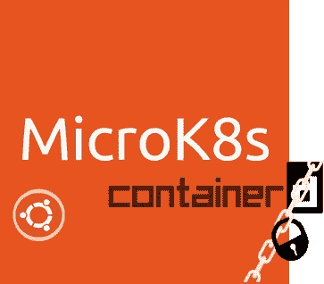

# 更安全的 MicroK8s 上的容器

> 原文：<https://itnext.io/containerd-on-a-more-secure-microk8s-c2c97ac0268f?source=collection_archive---------7----------------------->

我们已经安静了几个月，只是因为我们一直很忙。我们主要致力于我们打算在*1.14 版本*中发布的两个特性:

*   提高安全性
*   过渡到[集装箱 d](https://containerd.io/)



必然的变化将影响 MicroK8s 的向后兼容性和用户体验，这也是我们将它们与即将到来的上游 Kubernetes 版本同步的原因。在这里，我们将提供 a)这些功能的简短描述，b)您测试新 MicroK8s 的方法，以及 c)如果这是您的主要障碍，如何阻止发布的步骤。

## 向容器的过渡

我们用 Containerd 替换 Dockerd 主要有两个原因。

*   在同一台主机上设置两个 dockerd 已被证明是有问题的。MicroK8s 带来了自己的 docker，这可能会与用户可能希望拥有的本地 docker 发生冲突。通过迁移到 containerd，用户可以`apt-get install docker.io`而不影响 MicroK8s。这个切换也意味着`microk8s.docker`将不再可用，你将不得不使用发行版附带的 docker 客户端。
*   性能。这表明使用 containerd 会带来性能上的好处。这并不奇怪，因为 dockerd 本身在内部使用 containerd。通过切换到 containerd，我们实际上删除了一个 docker 特有的层。

## 强化 MicroK8s 安全性

MicroK8s 是开发者的工具。它并不意味着要部署在生产或敌对环境中。说到这里，我们试图通过以下方式使 MicroK8s 更加安全:

*   公开尽可能少的服务。下表列出了我们未解决的问题以及相关的访问限制:

*   CA 和证书在部署时创建一次。

## 试用即将发布的补丁

我们准备了一个临时分支，您可以使用它来评估上述更改:

```
snap install microk8s --classic --channel=1.13/edge/secure-containerd
```

如果您已经安装了 MicroK8s，您可以切换 MicroK8s 正在使用的频道:

```
snap refresh --channel=1.13/edge/secure-containerd microk8s
```

尝试一下，如果我们错过了什么，请[告诉我们](https://github.com/ubuntu/microk8s/issues)。

## “谢谢，我不去了”

到目前为止的所有版本系列都不会受到此更改的影响。这意味着您可以让您的 MicroK8s 部署遵循 1.13 版本:

```
snap refresh --channel=1.13/stable microk8s
```

## 总结

一个重要的更新即将到来。请务必尝试使用:

```
snap install microk8s --classic --channel=1.13/edge/secure-containerd
```

如果你不喜欢你所看到的，请告诉我们通过提交问题和继续使用 1.13 轨道的中断。

# 参考

[](https://kubernetes.io/blog/2018/05/24/kubernetes-containerd-integration-goes-ga/) [## Kubernetes 集装箱集成正式上市

### kubernetes Containerd Integration Goes GA 作者:刘澜涛，软件工程师，谷歌和迈克布朗，开源…

kubernetes.io](https://kubernetes.io/blog/2018/05/24/kubernetes-containerd-integration-goes-ga/) [](https://github.com/ubuntu/microk8s/issues) [## ubuntu/microk8s

### kubernetes 集群在一瞬间。在 GitHub 上创建一个帐户，为 ubuntu/microk8s 的开发做出贡献。

github.com](https://github.com/ubuntu/microk8s/issues)