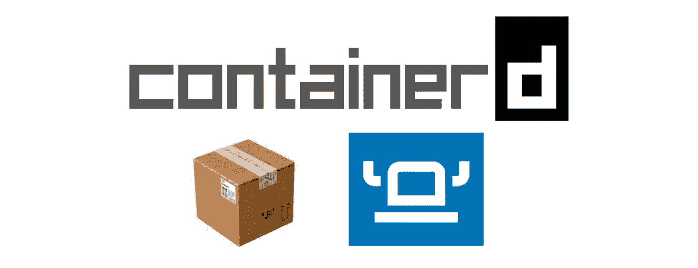
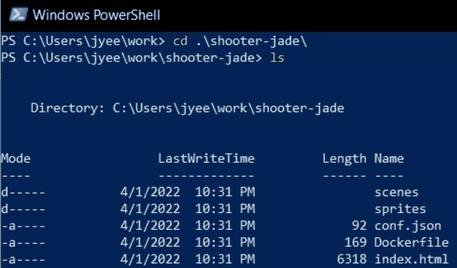
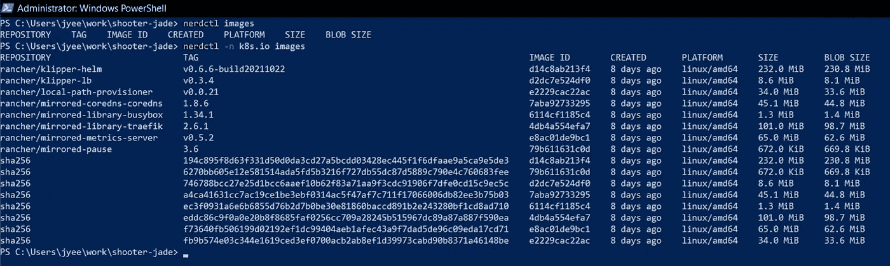
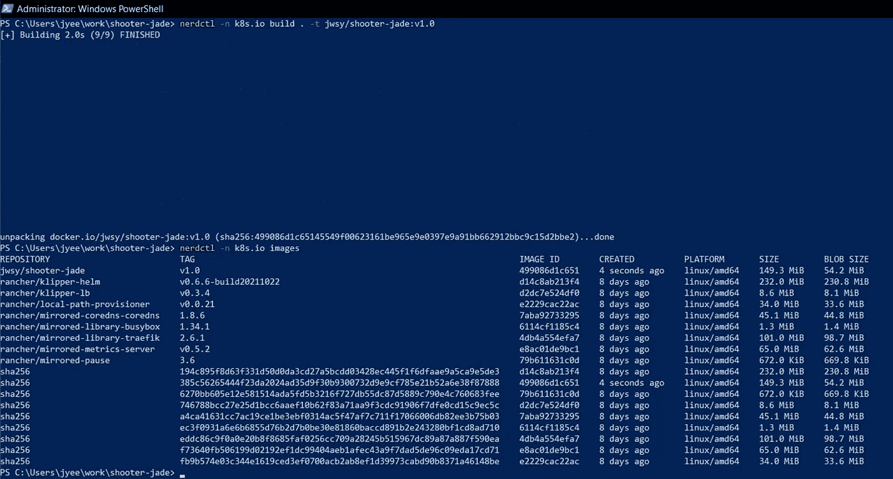
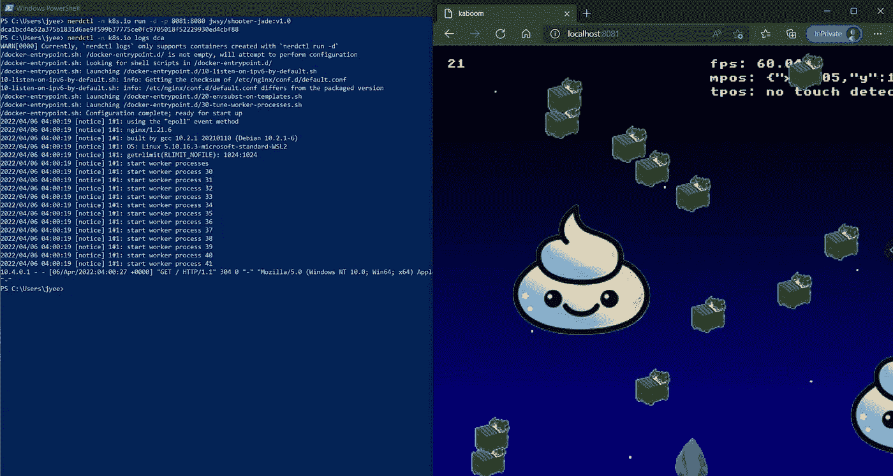
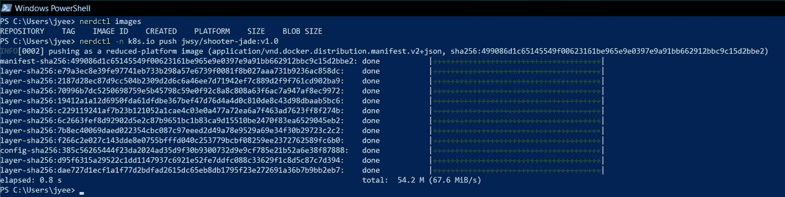
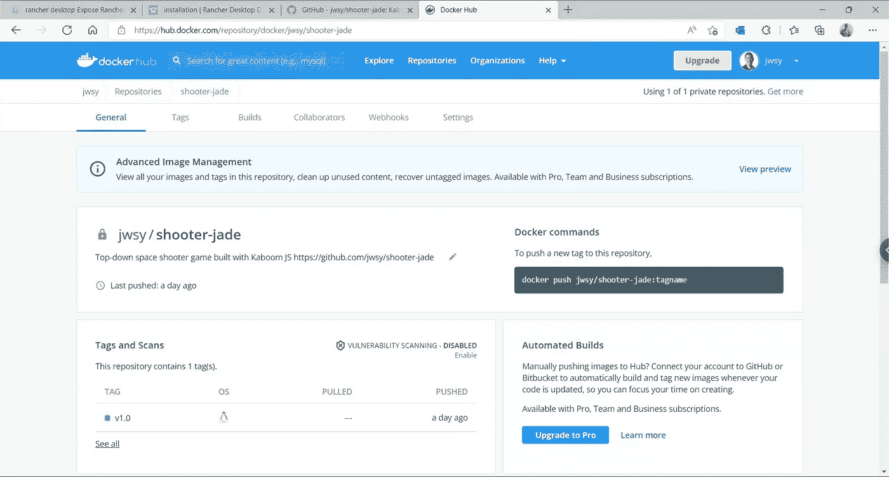
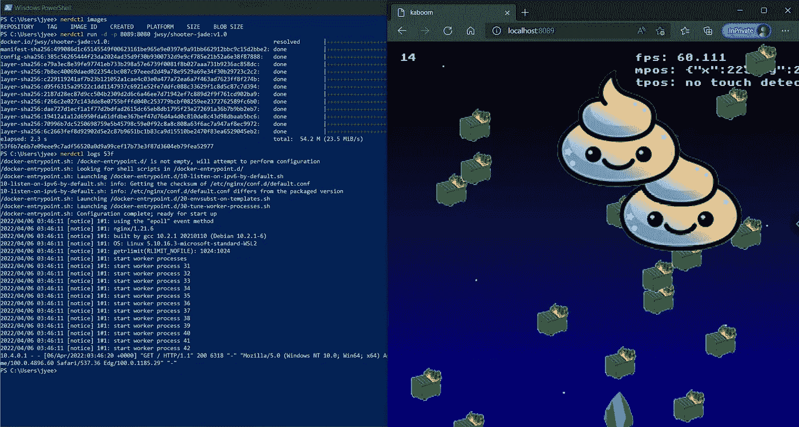

# 用 nerdctl & Rancher 桌面容器化一个基本的 HTML/CSS/JS 应用程序

> 原文：<https://itnext.io/containerize-a-basic-html-css-js-app-with-nerdctl-rancher-desktop-817981ede2a4?source=collection_archive---------1----------------------->



容器📦是在客户的基础设施上部署应用程序及其所有库/依赖项的便捷而安全的方式。在本教程中，我将使用免费工具 [containerd 的 nerd CTL](https://github.com/containerd/nerdctl)&[Rancher Desktop](https://rancherdesktop.io/)(不是 Docker Desktop)来容器化一个我使用 KaboomJS 编写的基本 HTML/CSS/JS 应用[。](https://kaboomjs.com/play?demo=movement)

**先决条件:** [自由牧场主桌面](https://rancherdesktop.io/)，又名[双击为 K8s](https://jyeee.medium.com/elasticsearch-kibana-on-k8s-w-rancher-desktop-rancher-cluster-manager-2-6-f155c86164c0) 🙌，以获取 [nerdctl](https://github.com/containerd/nerdctl) 和一个本地容器注册表。

> 这里有一个不错的[牧场主桌面安装视频](https://www.youtube.com/watch?v=lYM5lCHhbL8)

在本教程中，我们将

1.  基于托管 JS 应用程序的安全 nginx 非特权映像编写 Dockerfile
2.  基于 docker 文件构建容器映像，并运行本地托管的容器映像
3.  额外内容:登录 Docker Hub(免费)，推送容器映像，运行托管在 Docker Hub 上的容器映像

# 1/3 基于托管 JS 应用程序的安全 nginx 非特权映像编写 Dockerfile

[](https://javascript.plainenglish.io/kaboom-js-repl-it-custom-top-down-shooter-in-5-min-ebad8157073a) [## 使用 kaboom.js 和 repl.it 在 5 分钟内创建一个自定义的自上而下的射手

### 我小时候喜欢玩自上而下的射击游戏，比如《银河战舰》和《太空入侵者》,希望我也能自己定制一款…

javascript.plainenglish.io](https://javascript.plainenglish.io/kaboom-js-repl-it-custom-top-down-shooter-in-5-min-ebad8157073a) 

首先克隆我在 Kaboom 中构建的游戏 shooter-jade repo，它模拟了您编写和构建的基本 HTML/CSS/JS 应用程序。

```
git clone [https://github.com/jwsy/shooter-jade.git](https://github.com/jwsy/shooter-jade.git)
cd shooter-jade
```



这是我最近添加的一个非常简单的 nginx 非特权 [Dockerfile](https://docs.docker.com/engine/reference/builder/) 例子(只有下面显示的五行！)将应用程序的文件添加到最小的[nginx-无特权容器映像](https://hub.docker.com/r/nginxinc/nginx-unprivileged)中。相比之下，nginx:alpine 容器图像具有方便但不必要的工具，如 vi 和 wget。

> 这个 other 文件中显示的容器的一个重要安全特性是，您必须*显式地公开*默认的 nginx 端口，并且没有其他端口是开放的。

# 2/3 基于 docker 文件构建容器映像，并运行本地托管的容器映像

现在您已经有了一个 Dockerfile 文件，使用它来构建一个容器映像。在这个例子中，我们用我的公共 Docker Hub repo*jwsy/shooter-jade*的名字构建并标记它。你仍然可以在 Docker Hub 上免费托管图片(相对于你可能需要在工作中付费的 Docker 桌面应用)[https://hub.docker.com/repository/docker/jwsy/shooter-jade](https://hub.docker.com/repository/docker/jwsy/shooter-jade)

首先，让我们用`nerdctl images`命令看看现有的容器图像。比较当您省略或使用由 Rancher Desktop 提供的 K8s 集群中指定容器注册表的`-n k8s.io`参数时所看到的内容。现有的注册中心拥有用于运行 K8s 集群的容器。

```
nerdctl images
nerdctl **-n k8s.io** images
```



现在构建图像，然后在 K8s 注册表中的图像列表中查看带有 *jwsy/shooter-jade:v1.0* 标签的图像

```
nerdctl **-n k8s.io** build . -t jwsy/shooter-jade:v1.0
```



我们现在可以看到我们的图像，它*只占用 54.2 兆字节*！！由于容器的魔力，这比我们曾经创建的任何 VM 设备映像都要小得多。让我们使用`nerdctl run`在本地运行这个本地托管的映像，注意我是如何在本地端口 **8081** 上公开服务的，目标端口是容器映像公开的端口。

```
nerdctl -n k8s.io run -d -p **8081**:8080 jwsy/shooter-jade:v1.0
```

浏览至[http://localhost:**8081**](http://localhost:8081)**享受 app！**

> **这比摆弄 VirtualBox 网络设置好多了！**

****

```
# See container logs for dca1...
nerdctl -n k8s.io logs dca# Stop & remove this container dca1... 
nerdctl -n k8s.io rm dca # or use rm -f to remove it completely
```

# **3/3 奖励内容:登录 Docker Hub，推送容器镜像，运行托管在 Docker Hub 上的容器镜像**

**登录到 [Docker Hub 容器注册表](https://hub.docker.com/)🐳📦(你需要注册，但仍然是免费的)，使用`nerdctl login`。如果你想推送其他注册中心，包括 ECR、ACR、GHCR、GCR 等，你也可以阅读这些 nerdctl 注册中心文档。**

```
nerdctl login -u jwsy
```

**登录后，使用`nerdctl push`将本地托管的映像推送到 Docker Hub。您仍然需要使用`-n k8s.io`，因为您使用的是本地容器注册表。**

```
nerdctl **-n k8s.io** push jwsy/shooter-jade:v1.0
```

****

**您的容器图像将显示在 Docker Hub**

****

**现在，运行托管在 Docker Hub 上的映像，这次不带`-n k8s.io`并在端口 **8089** 上运行(与本地托管映像的 8081 相反)。注意 nerdctl 将如何从 Docker Hub 下载映像，因为它不存在于非 K8s 注册表中。**

```
nerdctl run -d -p **8089**:8080 jwsy/shooter-jade:v1.0
```

**浏览到 [http://localhost:8089](http://localhost:8089) 并享受应用程序！**

****

**恭喜你！如果您已经做到了这一步，那么您可能想要尝试部署您在 Kubernetes 集群上创建的这个新映像，您可以使用 Rancher Desktop，如下文所示。**

**[](/rancher-desktop-and-nerdctl-for-local-k8s-dev-d1348629932a) [## 适用于本地 K8s 开发的 Rancher Desktop 和 nerdctl

### 我花了相当长的时间(2.6)试图(2.5)为 Kubernetes 初学者找出(2.4)一个好的本地开发设置(2.3)

itnext.io](/rancher-desktop-and-nerdctl-for-local-k8s-dev-d1348629932a) 

如果你有兴趣通过例子探索 K8s 是如何工作的，那么这篇我们安装 Elasticsearch & Kibana 的文章可能也会有所帮助。

[](/elasticsearch-kibana-on-k8s-w-rancher-desktop-rancher-cluster-manager-2-6-f155c86164c0) [## K8s 上的 Elasticsearch & Kibana，带有 Rancher Desktop & Rancher Cluster Manager 2.6

### 唯一的先决条件:从 https://rancherdesktop.io/安装牧场主桌面

itnext.io](/elasticsearch-kibana-on-k8s-w-rancher-desktop-rancher-cluster-manager-2-6-f155c86164c0) 

请考虑加入 Medium，并添加您自己的故事来帮助社区！ [*我没想到我简单的研究文章会被成千上万的其他技术人员阅读，但他们的确是——我很高兴我分享了这些！*](https://jyeee.medium.com/membership)

[](https://jyeee.medium.com/membership) [## 通过我的推荐链接加入 Medium-Jason Yee

### 我不认为我简单的研究文章会被成千上万的其他技术人员阅读，但他们确实是——我很高兴我分享了这些文章！

jyeee.medium.com](https://jyeee.medium.com/membership)**