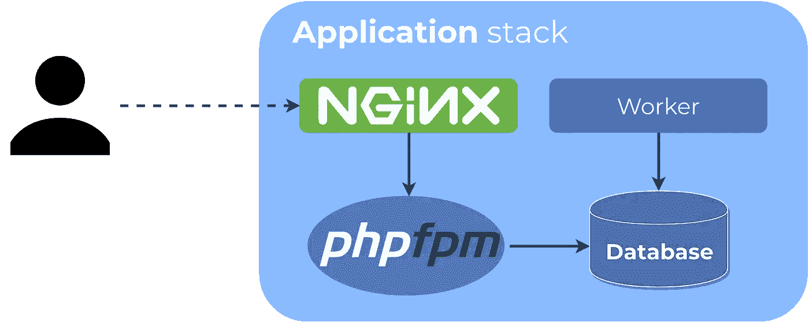
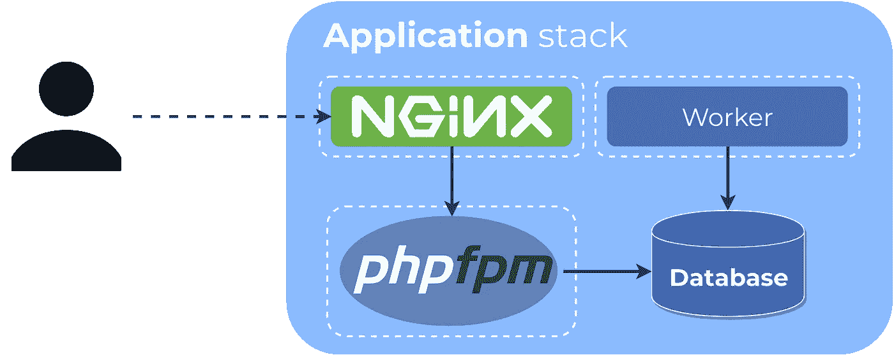

# 容器化 Symfony 应用程序

> 原文：<https://itnext.io/containerizing-a-symfony-application-14d03f9c0b18?source=collection_archive---------0----------------------->

最近，我的任务是在 Kubernetes 上部署和操作 Symfony 应用程序。由于 PHP 不再是我的主要工作领域，我希望找到一些关于该主题的最新指南和/或最佳实践，但遗憾的是根本没有，所以我决定写关于应用程序容器化、构建基础设施并将其部署在 Kubernetes 上的过程。

由于这是一个相对较大的话题，我决定把它分成几个小帖子。在这一部分中，您可以了解如何将 Symfony 应用程序容器化。

如果你对最终结果很好奇，可以在 [Gitlab](https://gitlab.com/docker-symfony) 上找到。

# 应用程序堆栈

这些年来，我成了一个画画的人。不是因为我擅长，而是因为形象化有助于理解问题，让思考过程更容易遵循。

基于之前对 Symfony 的一些了解，第一张图纸可能是这样的:



如图所示，应用程序环境有四个主要组件:

*   PHP-运行应用程序的 FPM
*   Nginx 提供内容并通过 FastCGI 与 FPM 通信
*   某种背景工作者
*   保存应用程序数据的数据库

在现实生活中，堆栈可以有更多的组件(例如，更多的工人，缓存等)。)，但为了简单起见我们就从这四个开始。

现在让我们给图片添加一些容器:



如果你在互联网上搜索，你可以找到 Symfony 的各种容器设置，通常与上面的有很大不同:

*   用 modphp 代替 Nginx 和 FPM 的 Apache
*   Nginx 和 FPM 在同一个容器中
*   Nginx 和 FPM 和工人在同一个集装箱里(通常与[主管](http://supervisord.org/)结合使用)

虽然这些肯定是工作设置，但作为 web 服务器，我更喜欢 Nginx 而不是 Apache。此外，在容器环境中，有一种常见的(我甚至可以说是最好的)做法是将每个进程放入单独的容器中。遵循这些偏好和指导原则，上面的设置似乎是最佳的。

(注意，我们谈论的是*容器*，而不是*图像*。)

您可能已经注意到，我没有将数据库放在容器中。虽然在容器中运行数据库在开发(甚至预览/测试)环境中完全有效，但我更喜欢在生产中使用托管服务。几乎所有的云提供商(甚至 Digital Ocean now)都提供托管数据库服务，这最终会比运营自己的数据库集群便宜得多(就直接和间接成本而言)。

# 应用图像

让我们继续创建我们的第一个容器图像。这个映像将用于启动 FPM 和工作容器，因为它们共享代码库和运行时环境。

(记住:我们正在从*容器*切换到*图像*。)

为了确保最终图像不包含任何不必要的垃圾或构建时间依赖，我们将使用[多级](https://docs.docker.com/develop/develop-images/multistage-build/) `Dockerfile`来创建图像。

# 第一阶段:FPM 基地形象

第一阶段是 FPM 基础映像，因为这是最不可能改变的，我们希望利用构建缓存。

```
FROM php:7.3.3-fpm-alpine as base

WORKDIR /var/www

# Override Docker configuration: listen on Unix socket instead of TCP
RUN sed -i "s|listen = 9000|listen = /var/run/php/fpm.sock\nlisten.mode = 0666|" /usr/local/etc/php-fpm.d/zz-docker.conf

# Install dependencies
RUN set -xe \
    && apk add --no-cache bash icu-dev \
    && docker-php-ext-install pdo pdo_mysql intl pcntl

CMD ["php-fpm"]
```

> 专业提示:对基本图像使用精确版本。升级变成了手动的，但是它保证了你在任何地方都使用相同的版本。

这个阶段相对简单:我们将 workdir 设置为所需的(web 服务器)docroot，安装一些依赖项，并将 FPM 配置为默认命令。

唯一奇怪的部分是这个配置覆盖使 FPM 监听 Unix 套接字。在传统的设置中，Nginx 和 FPM 将使用 Unix 套接字进行通信，但是在容器设置中，它们位于不同的容器中(记住一个进程，一个容器的规则)，没有共享的文件系统。这就是为什么官方的 FPM 镜像启用了 TCP，这是可以理解的。

但是在两个容器之间共享文件是完全可能的:使用卷。因此，我们不再使用 TCP，而是将配置改回 Unix 套接字，我们将把它安装在 Nginx 容器中。

# 第二阶段:作曲家

进入下一阶段:使用 [Composer](https://getcomposer.org/) 安装依赖项。

```
FROM composer:1.8.4 as composer

RUN rm -rf /var/www && mkdir /var/www
WORKDIR /var/www

COPY composer.* /var/www/

ARG APP_ENV=prod

RUN set -xe \
    && if [ "$APP_ENV" = "prod" ]; then export ARGS="--no-dev"; fi \
    && composer install --prefer-dist --no-scripts --no-progress --no-suggest --no-interaction $ARGS

COPY . /var/www

RUN composer dump-autoload --classmap-authoritative
```

这个阶段有两件事值得一提:

1.  `APP_ENV` build 参数控制是否安装开发依赖项。这在下一阶段会很有用。
2.  为了生成用于自动加载的权威类别映射，我们在此阶段将所有内容复制到映像中。

> **Pro 提示:**在 Composer 的[平台](https://getcomposer.org/doc/06-config.md#platform)配置中将 PHP 版本锁定为您的生产环境中使用的版本，以确保正确的 PHP 版本的依赖关系得到解决。

除了这些，这个舞台和作曲家的安装是非常标准的。

# 最终阶段:应用程序映像

构建的最后阶段也很简单。

```
FROM base

ARG APP_ENV=prod
ARG APP_DEBUG=0

ENV APP_ENV $APP_ENV
ENV APP_DEBUG $APP_DEBUG

COPY --from=composer /var/www/ /var/www/

# Memory limit increase is required by the dev image
RUN php -d memory_limit=256M bin/console cache:clear
RUN bin/console assets:install
```

我们可以再次看到`APP_ENV`建造的论点。在这种情况下，它将是用于构建和运行应用程序的 Symfony 环境。所有的缓存预热和基本上每个改变容器的进程都必须在这里发生，这样运行的容器每次都可以快速启动并以相同的方式运行。

通过更改`APP_ENV`变量，我们可以构建单独的开发和生产映像。开发图像在调试的预览环境中很有用。

构建映像还需要一个东西(除了应用程序本身):一个`.dockerignore`文件。很像`.gitignore`，它控制什么应该从图像中去掉。当 docker 文件中有像`COPY . /whatever`这样的语句时，这很有用，在我们的例子中就是这样。

因此，在点击`docker build`命令之前，将以下内容放在项目根目录下的一个名为`.dockerignore`的文件中:

```
*

!/bin/
!/config/
!/public/
!/src/
!/templates/
!/translations/
!/.env
!/composer.*
!/symfony.lock
```

如你所见，它看起来和一个`.gitignore`文件非常相似，工作方式也很相似。在我们的例子中，我们从排除图像中的所有内容开始，并为我们需要的文件添加例外。这样，您可以确保只有那些运行应用程序所必需的文件才被复制到最终映像中。

如果您需要其他文件/文件夹来运行应用程序，请确保将它们添加到忽略文件中，否则您可能会看到如下错误:

```
Step 22/23 : COPY docker/nginx/default.conf /etc/nginx/conf.d/default.conf
COPY failed: stat /var/lib/docker/tmp/docker-builder152684387/docker/nginx/default.conf: no such file or directory
```

您现在可以开始构建生产映像了:

```
docker build -t symfony-app:local .
# OR build a development image
docker build -t symfony-app:local-dev --build-arg APP_ENV=dev .
```

# Web 服务器映像

互联网上的大多数指南和帖子会告诉你 docker 文件应该是自包含的，这意味着你应该能够通过代码和 docker 文件本身来构建图像。遗憾的是，在我们的例子中，这意味着必须复制应用 Dockerfile 中的大部分指令，因为从`public/`目录提供的资产也必须构建。

虽然这样做肯定没有错，但是我将向您展示另一个解决方案，它需要的维护开销要少得多，并且会导致更快的 CI 构建时间。

您可能已经注意到资产构建已经是应用程序映像的一部分。它不是偶然出现的，我们将把资产文件从已经构建的应用程序映像复制到 web 服务器映像中。以下是方法:

```
ARG ASSET_IMAGE

FROM ${ASSET_IMAGE} AS assets

FROM nginx:1.15.9-alpine

COPY docker/nginx/default.conf /etc/nginx/conf.d/default.conf

COPY --from=assets /var/www/public /var/www/public
```

上面的 Dockerfile 文件将期望一个名为`ASSET_IMAGE`的构建参数，这是我们刚刚构建的应用程序映像的名称。映像将作为构建阶段挂载(因此这也是一个多阶段构建)，最后一个阶段将从第一个阶段复制所需的文件。将以上几行粘贴到 Dockerfile 文件中(例如`Dockerfile.nginx`)。

在进行映像构建之前，我们还需要做一件事:配置 nginx。以下配置基于 [Symfony 文档](https://symfony.com/doc/current/setup/web_server_configuration.html#nginx)中的最小示例:

```
# Based on https://symfony.com/doc/current/setup/web_server_configuration.html#nginx
server {
    listen 80 default_server;

    server_name localhost;
    root /var/www/public;

    location / {
        # try to serve file directly, fallback to index.php
        try_files $uri /index.php$is_args$args;
    }

    location ~ ^/index\.php(/|$) {
        fastcgi_pass unix:/var/run/php/fpm.sock;
        fastcgi_split_path_info ^(.+\.php)(/.*)$;
        include fastcgi_params;

        # When you are using symlinks to link the document root to the
        # current version of your application, you should pass the real
        # application path instead of the path to the symlink to PHP
        # FPM.
        # Otherwise, PHP's OPcache may not properly detect changes to
        # your PHP files (see https://github.com/zendtech/ZendOptimizerPlus/issues/126
        # for more information).
        fastcgi_param SCRIPT_FILENAME $realpath_root$fastcgi_script_name;
        fastcgi_param DOCUMENT_ROOT $realpath_root;
        # Prevents URIs that include the front controller. This will 404:
        # http://domain.tld/index.php/some-path
        # Remove the internal directive to allow URIs like this
        internal;
    }

    # return 404 for all other php files not matching the front controller
    # this prevents access to other php files you don't want to be accessible.
    location ~ \.php$ {
        return 404;
    }

    # Turn off logging for favicons and robots.txt
    location ~ ^/android-chrome-|^/apple-touch-|^/browserconfig.xml$|^/coast-|^/favicon.ico$|^/favicon-|^/firefox_app_|^/manifest.json$|^/manifest.webapp$|^/mstile-|^/open-graph.png$|^/twitter.png$|^/yandex- {
        log_not_found off;
        access_log off;
    }

    location = /robots.txt {
        log_not_found off;
        access_log off;
    }
}
```

在将以上几行粘贴到`docker/nginx/default.conf`并将`!/docker/`添加到`.dockerignore`文件后，您可以继续构建图像:

```
docker build -t symfony-web:local --build-arg ASSET_IMAGE=symfony-app:local -f Dockerfile.nginx .
# OR build a development image
docker build -t symfony-web:local-dev --build-arg ASSET_IMAGE=symfony-app:local-dev -f Dockerfile.nginx .
```

# 设置 Docker 撰写

是时候测试我们的容器化应用程序了。在这一点上，手动启动容器是很容易的，但是将来我们可能也会使用测试环境，所以使用 Docker Compose 似乎是一个显而易见的选择。现在，让我们只关注 web 和应用程序容器:

```
version: "3.7"

services:
    app:
        image: symfony-app:local
        volumes:
            - phpsocket:/var/run/php

    web:
        image: symfony-web:local
        ports:
            - 8080:80
        volumes:
            - phpsocket:/var/run/php
        depends_on:
            - app

volumes:
    phpsocket:
```

注意卷挂载，它在容器之间共享 unix 套接字。

将上面的代码片段保存为`docker-compose.yml`，并执行以下代码:

```
docker-compose up -d
```

如果一切顺利，您应该会看到一个 404 页面(因为我们在 prod env 中，我们没有添加任何控制器)。您可以尝试修改合成文件以使用开发图像，Symfony 欢迎页面应该会欢迎您。

# 结论

容器化 Symfony 应用程序相对容易，与任何传统设置没有太大区别，但更具可移植性和可伸缩性。所提供的 Docker Compose 设置已经能够作为开发/测试环境。向它添加额外的组件(数据库、工作程序等)是很简单的。

示例应用程序和 Docker 编写设置都可以在 [Gitlab](https://gitlab.com/docker-symfony) 上找到。

在接下来的文章中，我将自动构建容器映像，设置一个简单的 Kubernetes 集群，并配置构建管道来自动部署应用程序。

*原载于*[*sagikazarmark . Hu*](https://sagikazarmark.hu/blog/containerizing-a-symfony-application/)*。*