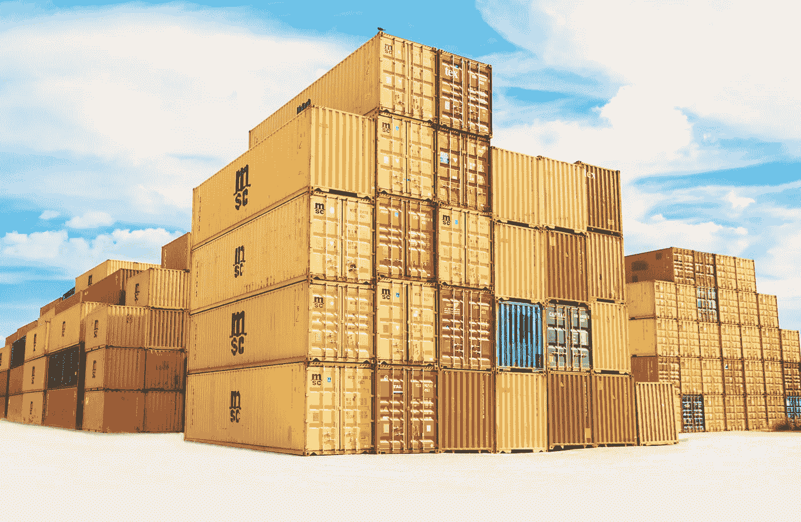
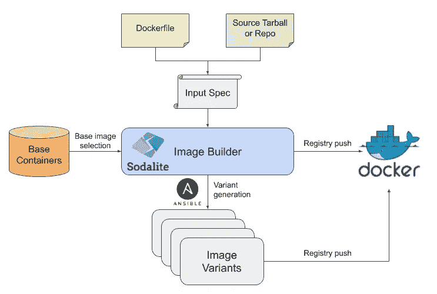
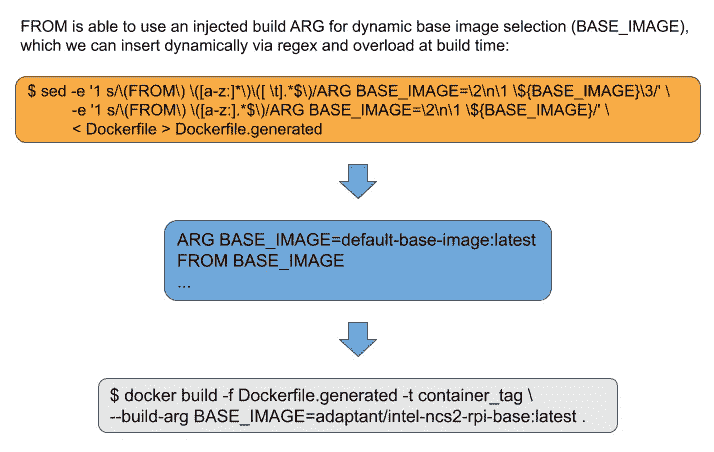

# 容器化多拱基础加速器运行时环境

> 原文：<https://itnext.io/containerizing-multi-arch-base-accelerator-run-time-environments-f814aa02706e?source=collection_archive---------8----------------------->



在[方钠石 H2020 项目](https://sodalite.eu/)中，我们处理利用各种异构加速器的应用部署的部署和重新配置。虽然大多数加速器都提供了易于安装的环境来支持其运行，但我们观察到了以下局限性:

*   大多数加速器运行时环境都不是以现成的容器化格式提供的。
*   尽管没有特定的架构依赖性，但许多加速器运行时环境并不是开箱即用的多拱感知环境。
*   加速后的应用程序花在 docker 文件上的时间和花在应用程序需求上的时间一样多，导致了大量不必要的样板文件，很快就过时了。
*   加速的应用程序可能能够利用不同的加速器来完成相同的任务，特别是当加速器不可知的框架，如 [ONNX](https://onnx.ai/) 被越来越多地采用时。
*   支持以特定加速器类型为目标的预配置映像变体，允许在异构 Kubernetes 集群中细粒度地放置和执行应用容器，例如基于节点标签放置。

考虑到这一点，我们决定谨慎地尝试将加速器运行时环境和应用程序逻辑的设置分离，建立一组易于扩展的最小加速器特定基本容器，在这些容器上放置加速的应用程序。

# 步骤 1:为多拱准备 minideb

最小 debian 环境的一个流行选项是`bitnami/minideb`。由于大多数供应商为他们的运行时环境提供 debian 包，我们决定坚持使用`minideb`(而不是其他解决方案，如 Alpine)作为加速器映像的基础。然而，到目前为止，多拱支持还不是`minideb`的优先事项——GitHub 有一个问题专门跟踪这个问题:

[](https://github.com/bitnami/minideb/issues/76) [## Arm64 支持问题#76 bitnami/minideb

### 解散 GitHub 是超过 5000 万开发者的家园，他们一起工作来托管和审查代码，管理项目，以及…

github.com](https://github.com/bitnami/minideb/issues/76) 

因此，我们被迫创建自己的多拱建筑，并在清单后面发布。最终结果是[adaptent/minideb](https://hub.docker.com/repository/docker/adaptant/minideb/general)映像，它包括对 amd64 和 arm64 的开箱即用支持(如果您觉得这很有用，并且希望看到其他目标架构得到支持，请在我们的[问题跟踪器](https://github.com/adaptant-labs/accelerator-base-containers/issues)中打开一个问题)。

# 步骤 2:准备加速器基础容器

建立了多拱起点之后，下一步是深入研究不同加速器的运行时环境。出于这一目的，并且为了使其他人不必经历同样的过程，我们建立了一个专门用于管理这些内容的存储库:

[](https://github.com/adaptant-labs/accelerator-base-containers) [## 适配器-实验室/加速器-基础-容器

### 各种异构加速器的基本容器和它们各自的运行时这个项目旨在提供一个…

github.com](https://github.com/adaptant-labs/accelerator-base-containers) 

虽然这只是一个开始，但我们希望这对其他人有用，并欢迎 PRs 添加新配置！

# 步骤 3:在实践中使用基本容器

以 EdgeTPU 为例，我们可以使用 [EdgeTPU Python API](https://coral.ai/docs/edgetpu/api-intro/) (在加速器基本容器中提供)编写一个简单的 Python 脚本来查询运行时版本并显示检测到的设备:

为了将其容器化，我们只需要构建一个适当的基本容器(在本例中为`acceleratorbase/edgetpu-std`)并且只需要添加与我们的应用程序逻辑相关的部分:

完整的代码示例可以在[这里](https://github.com/adaptant-labs/accelerator-base-containers/tree/master/examples/edgetpu-devicequery)找到。

为了生成多拱图像，我们使用 [Docker Buildx](https://docs.docker.com/buildx/working-with-buildx/) 来执行构建:

```
$ docker buildx build -t acceleratorbase/example-edgetpu-devicequery --platform linux/amd64,linux/arm64 .
[+] Building 3.2s (9/9) FINISHED
 => [internal] load .dockerignore                             
 => => transferring context: 2B                   
 => [internal] load build definition from Dockerfile
 => => transferring dockerfile: 31B
 => [linux/amd64 internal] load metadata for docker.io/acceleratorbase/edgetpu-std:latest                                                                                                             
 => [linux/arm64 internal] load metadata for docker.io/acceleratorbase/edgetpu-std:latest
 => [internal] load build context          
 => => transferring context: 36B
 => [linux/arm64 1/2] FROM docker.io/acceleratorbase/edgetpu-std@sha256:6f4103ab071d4b6fd7f8797e8858554ceb6d3c255c9c190276bf77716158267c     
 => => resolve docker.io/acceleratorbase/edgetpu-std@sha256:6f4103ab071d4b6fd7f8797e8858554ceb6d3c255c9c190276bf77716158267c   
 => [linux/amd64 1/2] FROM docker.io/acceleratorbase/edgetpu-std@sha256:6f4103ab071d4b6fd7f8797e8858554ceb6d3c255c9c190276bf77716158267c
 => => resolve docker.io/acceleratorbase/edgetpu-std@sha256:6f4103ab071d4b6fd7f8797e8858554ceb6d3c255c9c190276bf77716158267c
 => CACHED [linux/amd64 2/2] ADD devicequery.py /
 => CACHED [linux/arm64 2/2] ADD devicequery.py /
```

使用在`acceleratorbase/example-edgetpu-devicequery`映像名称下生成的多拱映像，我们现在可以在带有 USB 连接的 EdgeTPU 的 amd64 机器上运行相同的映像:

```
$ uname -m
x86_64
$ docker run --privileged acceleratorbase/example-edgetpu-devicequery
BuildLabel(COMPILER=5.4.0 20160609,DATE=redacted,TIME=redacted,CL_NUMBER=291256449), RuntimeVersion(13)
Available EdgeTPU Devices:
/sys/bus/usb/devices/1-9
```

或者在基于 arm64 的 Coral 开发板上集成 EdgeTPU:

```
$ uname -m
aarch64
$ docker run --privileged acceleratorbase/example-edgetpu-devicequery
BuildLabel(COMPILER=6.3.0 20170516,DATE=redacted,TIME=redacted,CL_NUMBER=291256449), RuntimeVersion(13)
Available EdgeTPU Device(s):
/dev/apex_0
```

# 步骤 4:用方钠石生成图像变体

虽然步骤 3 中的示例演示了我们如何能够提供一个多 arch 感知的基础来进行构建，但是如果我们想要为同一应用程序支持不同的加速器或加速器配置呢？

## 静态设备时钟的动态重新配置(EdgeTPU)

例如，基于 USB 的 EdgeTPU 依靠专有库的静态时钟来配置加速器时钟速率。提供了该库的两种变体:

*   `libedgetpu1-std`以标准时钟速率运行。
*   `libedgetpu1-max`以最大时钟速率运行。

正如预期的那样，`-std`变体产生的热量比`-max`变体少，但运行速度也是后者的一半。由于 EdgeTPU 的温度容差相当窄，因此必须监控温度，并根据工作负载的热属性和容差来降低(或提高)时钟频率。允许设备超出其容差会导致难以调试的问题，包括随机推理失败，或者更糟的是，损坏物理设备本身。

> 因此，应用程序必须能够提供针对任一时钟场景预先配置的映像变量，以便在实现最佳性能的同时降低运行时推理失败的风险。

在这种情况下，所需的时钟速率和性能模式在应用程序启动时配置，并由应用程序所链接的库决定。

## 方钠石图像生成器中的图像变体

幸运的是，[方钠石图像生成器](https://github.com/SODALITE-EU/image-builder)为我们提供了一种机制，通过基本图像重载从应用 docker 文件生成多个容器图像变体:



方钠石图像生成器—图像变体生成工作流程

在其核心，image builder 通过解析一个输入模板来工作，该模板为它提供了关于 Docker 文件的位置、要从中克隆源代码的存储库(或者本地路径，如果没有使用 git 的话)、要推送的 Docker 注册表、要生成的图像变量等基本信息。每个图像变体都包括它自己的标签和一个基础图像覆盖。输入文件的格式是:

在幕后，映像构建器为映像的实际构建编排和部署一个可行的剧本。通过获取主 docker 文件并为每个变体配置的基础映像的构建时重载动态重写它，可以启用映像变体(为`latest`标记保留默认基础映像，除非另有说明)。下面更详细地概述了实现这一点的精确过程:



为 docker 文件提供一个可重载的 BASE_IMAGE

值得注意的是，映像构建器负责在构建时为基础映像重载修改 docker 文件，不需要手动修改 docker 文件。它还能够处理单阶段和多阶段 tracker 文件，并且应该能够处理任何扔向它的东西(但是，如果您设法破坏了它，我们将很高兴在[问题跟踪器](https://github.com/SODALITE-EU/image-builder/issues)中收到您的报告)。

## 使用方钠石图像生成器构建图像变体

尽管并非绝对必要，但出于实验的目的，我们在继续之前启动了一个本地图像注册表，并将使用它将我们的图像推送到:

```
$ docker run -d -p 5000:5000 --restart=always --name registry registry:2
```

我们现在可以使用本地注册表为映像构建器准备一个输入文件，并生成`-std`和`-max`变量:

请注意，在这种情况下，我们已经将我们的应用程序推出到 GitHub，并将让 image builder 在构建时直接获取存储库，因为这最像真实世界的应用程序。但是，也可以使用本地构建上下文:

为了调用图像构建器，我们可以使用一个[便利的包装器](https://raw.githubusercontent.com/SODALITE-EU/image-builder/master/image-builder-cli.sh)，它利用了图像构建器的自包含版本:

我们现在可以构建图像变体:

```
$ ./image-builder-cli.sh edgetpu-devicequery-image-variants.yaml
[Worker_0]   Deploying my-workstation_0
[Worker_0]   Deployment of my-workstation_0 complete
[Worker_0]   Deploying image-builder_0
[Worker_0]     Executing create on image-builder_0
[Worker_0]   Deployment of image-builder_0 complete
```

这将生成两个版本的应用程序容器:

*   `adaptant/edgetpu-devicequery:std`层层叠加`acceleratorbase/edgetpu-std`(默认)。
*   `adaptant/edgetpu-devicequery:max`层层叠叠`acceleratorbase/edgetpu-max`。

并将它们推送到本地注册表。我们现在可以从注册中心查询存储库和标记，确认每个变体都已成功生成和推送:

```
$ curl -X GET localhost:5000/v2/_catalog
{"repositories":["adaptant/edgetpu-devicequery"]}$ curl -X GET localhost:5000/v2/adaptant/edgetpu-devicequery/tags/list
{"name":"adaptant/edgetpu-edgetpu-devicequery","tags":["std","max"]}
```

## 限制

由于 Ansible Docker 插件的当前版本不支持 [Docker Buildx](https://docs.docker.com/buildx/working-with-buildx/) ，所以目前仍然必须手工创建和推出多拱清单。目前，我们通过在每个目标体系结构上运行 image builder 实例，同时使用共享注册表，然后手动协调清单来实现这一点。虽然这是一个权宜之计，但它不是长期的，随着 Ansible 中插件支持的改进，我们将更新多拱的图像生成器。

# 结论

在本文中，我们试图解决我们在现成的加速器基础容器中观察到的差距，并展示了应用程序如何直接构建在我们的基础容器和分层方法之上，以便专注于与应用程序逻辑更具体相关的方面，同时简化应用程序 order 文件。

我们还进一步展示了使用方钠石图像生成器如何进一步完善这一工作流程，为应用程序提供一种机制来创建基于不同基础图像的图像变体，允许应用程序提供不同的容器图像，以便在特定类型的加速器上运行。

## 接下来

在下一篇文章中，我们将探讨 SODALITE 运行时监控器和重构器如何利用 Prometheus 和 AlertManager 对部署的应用程序进行热量监控，以便动态地重新配置部署，使其保持在推理引擎的热量容差范围内。

## 承认

本项目获得了欧盟地平线 2020 研究与创新计划的资助，资助协议号为 825480([](https://www.sodalite.eu)**)。**