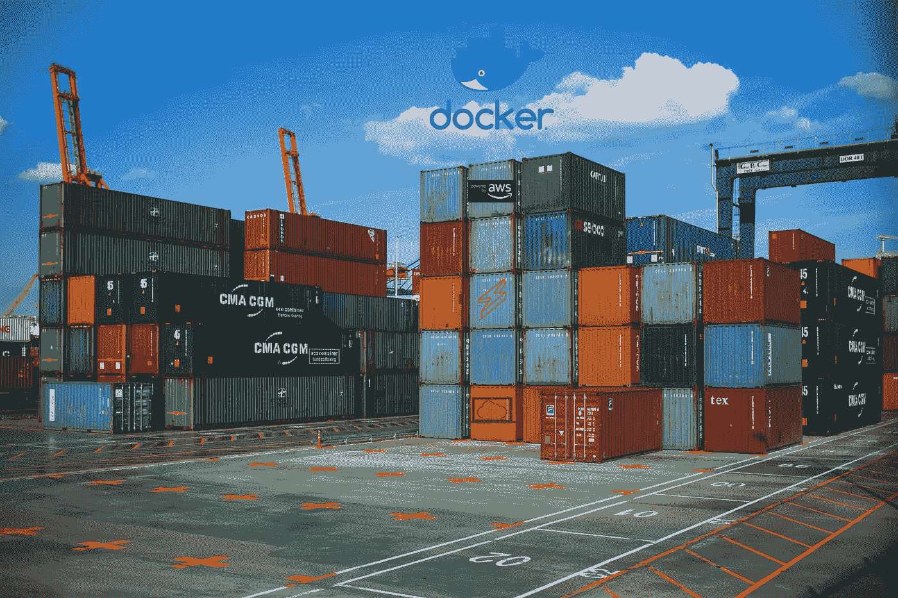

# 容器化无服务器 API

> 原文：<https://itnext.io/containerizing-serverless-apis-d69fa3e6b9c2?source=collection_archive---------1----------------------->

## 使用 Docker、LocalStack 和无服务器框架进行本地开发



品牌积分— [Docker](https://www.docker.com/legal/brand-guidelines) 、 [AWS](https://aws.amazon.com/trademark-guidelines/) 、 [Serverless](https://serverless.com/framework/) 和 [LocalStack](https://localstack.cloud/) 。

[](/build-a-restful-api-using-aws-lambda-api-gateway-dynamodb-and-the-serverless-framework-30fc68e08a42) [## 使用 AWS Lambda、API Gateway、DynamoDB 和无服务器框架构建 RESTful API

### 更新日期:2018 年 10 月 17 日。

itnext.io](/build-a-restful-api-using-aws-lambda-api-gateway-dynamodb-and-the-serverless-framework-30fc68e08a42) 

在使用 Contacts 应用程序来使用我在上面文章中写的 Contacts API 时，我发现打开多个项目和终端来运行这个应用程序很麻烦。

我将为 DynamoDb jar 文件运行一个终端，为无服务器离线模式下的 API 运行另一个终端，为实际的前端应用程序构建和运行再运行一个终端。

为了帮助我专注于前端应用程序的开发，我决定在 Docker 容器中运行 DynamoDb 和我的无服务器 API。这样，我可以让容器在后台运行，让它保存数据，并在我喜欢的时候轻松地拆除或重置它。

## TL；速度三角形定位法(dead reckoning)

从 GitHub 克隆`[contacts_api](https://github.com/vanister/contacts_api)`项目并检查存储库。

用`docker-compose up -d`运行`docker-compose.yml`文件，这会创建两个容器，并在后台启动它们。一个容器应该在只启动 DynamoDb 服务的情况下使用 LocalStack 映像，另一个容器是运行带有`npm start`的`contacts_api`代码的节点容器。

一旦两个容器都启动并运行，执行 seed 命令为 API 播种一些数据。种子数据是`contacts_api`项目中的一个 JSON 文件。

```
# Do this each time **docker-compose down**, 
# then **docker-compose up** is run.**$ docker exec -it contacts_api npm run seed**# Test the API**$ curl -i localhost:3000/contacts**# Should see an array of contacts
```

## 设置

*   [联系人 API 项目](https://github.com/vanister/contacts_api) —为其构建容器的项目。
*   [Docker](https://www.docker.com/get-started) —为您的操作系统下载并安装 Docker for Developers。
*   [LocalStack Docker 映像](https://hub.docker.com/r/localstack/localstack/) —使用它作为托管 DynamoDb 实例的映像。确保使用`localstack/localstack`图像。

从`contacts_api`项目中，在根目录下创建一个`Dockerfile`,并添加以下指令:

```
# File: ./Dockerfile**FROM node:8.12.0**# Copy the package.json and package.lock.json file to the image
**WORKDIR /usr/src/app
COPY package*.json ./**# Run `npm install` to install the dependencies in the 
# package.json file
**RUN npm install**# Copy the contents of the project to the image
**COPY . .**# This is the default port the serverless framework will 
# listen on when it starts
**EXPOSE 3000**# These are just to remind me that these are the
# environment variables this project uses
**# ENV AWS_ENDPOINT='http://localhost:8000'
# ENV AWS_REGION='us-west-1'
# ENV AWS_ACCESS_KEY_ID='from-dockerfile-fake-access-key'
# ENV AWS_SECRET_ACCESS_KEY='from-dockerfile-fake-secret-key'**# Run 'npm start' when the container starts.
# This will start serverless, in offline mode, just like
# running the project from the terminal locally **CMD [ "npm", "start" ]**
```

接下来添加一个`.dockerignore`文件来忽略图像不需要的文件和文件夹。

```
# File: ./.dockerignore**.vscode/
.serverless/****coverage/
node_modules/****.env**
```

创建了`Dockerfile`和`.dockerignore`文件后，添加一个`docker-compose.yml`文件来构建和运行容器。

首先在与`Dockerfile`相同的位置创建一个`docker-compose.yml`文件，并向其中添加以下 YAML 代码:

```
# File: ./docker-compose.yml**version: '3'****services:
  api:** # Look for a Dockerfile at the the root **build: .**# <name> can be the project name, username, anything... **image: <name>/contacts_api
    depends_on:
      - localstack** # Mapping port 3000 to the container's port 3000 since
    # running `npm start` will start serverless offline on
    # that port **ports:
      - '3000:3000'

    container_name: contacts_api** # These are the environment variables that are used by the api
    **environment:
**      # The name of the localstack container is host for dynamodb
 **AWS_ENDPOINT: '**[**http://dynamodb_localstack:8000'**](http://dynamodb_localstack:8000') **AWS_REGION: 'us-west-2'**      # leaving these blank will try and read from the terminal
 **AWS_ACCESS_KEY_ID:
      AWS_SECRET_ACCESS_KEY:** # Use the LocalStack image to run DynamoDb in a container **localstack:
    image: localstack/localstack:latest** # Using port 8000 to be consistent with dynamodb local jar
    # port 8080 is the localstack management portal **ports:**
      **- '8000:8000'
      - '8080:8080'** **container_name: dynamodb_localstack** # Only interested in running dynamodb and having it
    # persist data when the container is stopped **environment:
      SERVICES: dynamodb:8000
      DATA_DIR: '/tmp/localstack/data'**
```

## 构建并运行

打开`docker-compose.yml`文件所在的终端窗口并运行:

```
# Terminal at ./contacts_api (where docker-compose.yml is located)
# the ordering of the print outs might be different**$ docker-compose up** 
# or to run in the background in detached mode:
**# docker-compose up -d**# Successful build and run output should look like this.
# Note - I've edited the output for brevity:**Step 1/7 : FROM node:8.12.0
Step 2/7 : WORKDIR /usr/src/app
Step 3/7 : COPY package*.json ./
Step 4/7 : RUN npm install**...
...# Dependencies from the package.json from the contacts_api
# project are installed...**added 887 packages from 585 contributors and audited 18846 packages in 21.944s****Step 5/7 : COPY . .
Step 6/7 : EXPOSE 3000
Step 7/7 : CMD [ "npm", "start" ]****Successfully tagged <name>/contacts_api:latest**# The localstack image was already pulled to my machine**Creating dynamodb_localstack ... done
Creating contacts_api        ... done**...
...# LocalStack starting the admin portal on port 8080 
# like we told it to**dynamodb_localstack | 2018-10-30T04:46:20:INFO:werkzeug:  
* Running on http://0.0.0.0:8080/ (Press CTRL+C to quit)**# LocalStack starting the DynamoDb service on port 8000**dynamodb_localstack | Starting mock DynamoDB (http port 8000)...
dynamodb_localstack | Ready.**...# This is the output from running `npm start` in the 
# contacts_api container.  It is the same output
# as running `npm start` from the project directly**contacts_api  | > contacts-api@1.0.0 start /usr/src/app
contacts_api  | > sls offline start
contacts_api  |
contacts_api  | Serverless: Starting Offline: dev/us-west-2.
contacts_api  | Serverless: Routes for list:
contacts_api  | Serverless: GET /contacts
contacts_api  |
contacts_api  | Serverless: Routes for get:
contacts_api  | Serverless: GET /contact/{id}
contacts_api  |
contacts_api  | Serverless: Routes for add:
contacts_api  | Serverless: POST /contact
contacts_api  |
contacts_api  | Serverless: Routes for update:
contacts_api  | Serverless: PUT /contact/{id}
contacts_api  |
contacts_api  | Serverless: Routes for delete:
contacts_api  | Serverless: DELETE /contact/{id}
contacts_api  |
contacts_api  | Serverless: Offline listening on http://0.0.0.0:3000**
```

在 API 可用之前，需要创建 DynamoDb 中的 contacts 表，并为其植入数据。在`contacts_api`项目中有一个 create/seed 脚本来做这件事，所以让我们利用它。

使用`(ctrl+p, ctrl+q)`或`ctrl+\`打开一个新的终端窗口或从连接到 docker 进程的终端分离/退出(最后一个可能不起作用)，并运行以下命令:

```
# Execute the seed command against the contacts_api container**$ docker exec -it contacts_api npm run seed**# output from the 'seed' script in the project**> contacts-api@1.0.0 seed /usr/src/app
> node ./seed/runner.js****>> Checking if 'contacts' table exists
>> Creating 'contacts' table
>> Seeding data
>> Done!**
```

作为健全性检查，尝试命中其中一个端点。如果没有错误消息，那么 API 正在按预期运行。

```
**$ curl -i localhost:3000/contacts****HTTP/1.1 200 OK
content-type: application/json; charset=utf-8
cache-control: no-cache
content-length: 411
accept-ranges: bytes
Date: Tue, 30 Oct 2018 05:18:34 GMT
Connection: keep-alive****[...array-of-seeded-contacts]**
```

请注意，每次拆卸容器并使用`docker-compose down`和`docker-compose up`重新提起时，都需要播种 DynamoDb。

要停止和启动容器，只需运行`docker-compose stop`和`docker-compose start`。

就是这样！现在容器在后台运行，我可以专注于开发使用 API 的应用程序。

文章来源:[https://github.com/vanister/contacts_api](https://github.com/vanister/contacts_api)