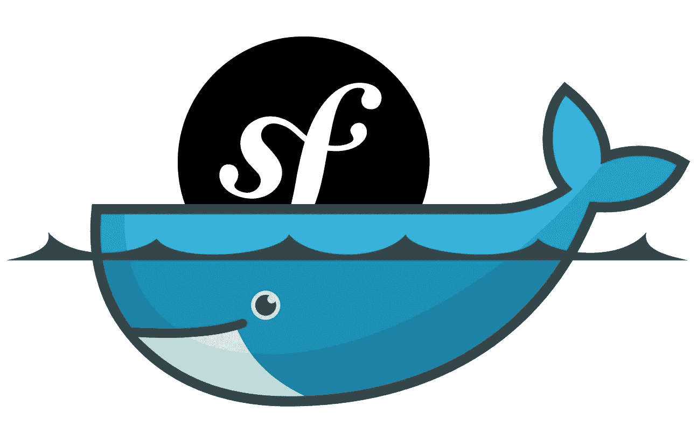

# 让我们将 Symfony 项目迁移到 Kubernetes！第 1 部分:应用程序的容器化。

> 原文：<https://itnext.io/containerizing-symfony-application-a2a5a3bd5edc?source=collection_archive---------0----------------------->

# 关于这个系列

在这个系列中，我们将讨论现有 Symfony 项目到 Kubernetes (K8s)的迁移。无论您当前在何处以及如何发布您的应用程序:裸机、VM、容器编排平台，通过遵循本指南，您将能够将其部署到 K8s 集群。

这些 **how to** 文章的目标读者是那些已经了解 Kubernetes、Docker 和持续集成(CI)的一些基础知识、想要学习新技巧或者只想完成工作的人。

本系列的每一部分都致力于一个特定的主题:构建 Docker 环境，[在不同的级别上测试应用程序](https://medium.com/@babenko.i.a/testing-symfony-application-d02317d4018a)，[用 Helm 将应用程序部署到 Kubernetes】，](https://medium.com/@babenko.i.a/publishing-symfony-application-with-helm-ecb525b34289)[构建 CI 管道](https://medium.com/@babenko.i.a/building-continuous-delivery-pipeline-2cc05e213935)。

# 关于第 1 部分

由于 Kubernetes 是一个容器编排平台，它要求您的应用程序被容器化，以便部署到集群。在本文中，我们将构建一个 Docker 设置，它是为 K8s 部署和开发中的方便使用而准备的。

# 关于虚拟项目

我为这个系列准备了一个简单的 Symfony 4 应用程序，包括:

*   具有三个字段的产品实体:id、价格、名称。

*   具有显示动作的产品控制器，用于呈现给定的产品。

*   用 Bootstrap 构建的布局树枝模板。尽管您可以将 CDN 用于引导资产，但我下载了 css 文件并将其放在项目的 assets 文件夹中，以向您展示如何处理静态文件。

*   产品小枝模板。

# 让我们集装箱化！

要运行虚拟项目，我们需要以下服务:

*   作为数据库的 MySQL。对于生产环境来说，使用数据库容器不是最好的主意，但是对于开发和测试来说，这是一个很好的选择。
*   Nginx 作为 web 服务器。
*   PHP-FPM 处理 PHP 代码。

## MySQL 图像

以下是 MySQL 图像的完整 docker 文件:

参数**版本**允许我们使用单个 Dockerfile 文件构建不同 MySQL 版本的图像。

上下文目录中的 **init** 文件夹包含将在容器启动时执行的文件。让我们在这个文件夹中创建 **products.sql** ，为我们的应用程序初始化 **products** 表:

## Nginx 图像

构建**生产就绪**映像时，尝试:

*   使用**阿尔卑斯山**图片作为基础，它们是轻量级的。
*   避免为生产装载卷，制作完整的映像。
*   如果您的开发映像与生产映像略有不同，请使用阶段。构建映像时，可以指定一个目标，它代表 docker 文件中的一个阶段。最终图像将包括达到目标的所有步骤。

记住以上所有内容，我们可以为 Nginx 创建一个 docker 文件:

您可能会注意到，我们只复制生产阶段的资产，而不复制开发阶段的资产。我们是故意这样做的:为了开发，我们将在容器中装入一个卷。这将允许我们实时查看文件更改，而无需每次都重建映像。

我们复制到镜像的服务器配置几乎重复了 Symfony 教程提供的配置。唯一的变化是文档根目录和 FastCGI url，它指向 PHP-FPM 服务:

## FPM 图片

PHP-FPM Docker 文件比前几个文件更复杂:

让我们一步一步来。

## **系统依赖**

安装系统依赖项时，请尝试:

*   使用 **-无缓存**标志。在这种情况下，软件包管理器不会将下载的文件保存在缓存中，这样会减小图像的大小。
*   将 **- virtual** 用于您希望在某个时候删除的依赖项。

我们在生产中不需要**git**(Composer 需要)或者**autoconf gcc g++ make**(XDebug 需要)。我们将删除这些依赖项，这就是为什么我们将它们标记为 **dev-deps** 。

## PHP 扩展

Docker 附带有用的助手，可以简化 PHP 扩展的安装和配置。让我们使用它们来安装用于数据库连接的 MySQL PDO 驱动程序和用于代码覆盖的 XDebug:

## PHP 配置

您可以通过将 **ini** 文件复制到 image **conf.d** 文件夹来更改 PHP 设置:

在 **default.ini** 文件中，我们更改应用程序的内存限制和报告级别:

## 设计者

我建议将 **hirak/prestissimo** 包和 Composer 一起安装。它将大大减少建造时间:

我们将在 PHP-FPM 开发容器中安装项目文件，这就是为什么我们不复制源文件，也不在开发阶段执行 **composer install** 。

## 测试阶段

最好将应用程序代码及其依赖项封装在映像中，这些代码将用于测试:

并将项目文件所有者更改为默认的 PHP-FPM 用户:

## 生产阶段

我们不需要生产映像中的开发依赖关系:

我们也不需要 XDebug:

Nor dev utils:

# Docker 撰写

Docker Compose 是在本地构建图像和创建容器的最佳选择。它允许你只用一个命令来构建环境: **docker-compose up** 。为了方便起见，Compose 会自动从**加载环境变量。env** 文件，位于执行 **docker-compose** 命令的同一个目录下。

让我们在**中为 Docker 设置声明一些有用的变量。env** 文件:

我们指定了我们想要使用的软件的确切版本和数据库凭证。

我们准备在 **docker-compose.yml** 文件中为开发环境设置服务:

乍看起来相当复杂，但不用担心，我们将仔细研究每个服务。

## Nginx 服务

使用**的 Nginx 版本。env** 文件，我们需要将其声明为一个构建参数:

我们使用应用程序的根目录作为上下文，因为我们需要访问 assets 文件夹:

由于上下文文件夹不同于 Dockerfile 所在的文件夹，我们需要显式设置 Dockerfile 的位置:

现在让我们指示 Docker 只为开发阶段构建 Nginx 映像:

正如我之前提到的，对于开发环境，我们将在容器中挂载 assets 文件夹:

没有 PHP-FPM 启动 Nginx 容器是没有意义的:

为了访问 web 服务器，我们需要将端口从我们的主机转发到容器。为了避免一些冲突，我们将使用 **8000** :

让我们再看一下完整的 Nginx 服务定义:

## PHP-FPM 服务

PHP-FPM 服务定义与 Nginx 非常相似:

我想在这里澄清几件事:

*   我们将所有项目文件挂载到容器 **app** 文件夹中，因为我们希望立即看到 PHP 文件中所做的更改。
*   在启动时，我们安装 Composer 依赖项并启动 PHP-FPM 守护进程。如果我们在 Dockerfile 中安装依赖项，然后挂载应用程序文件，供应商目录将会丢失，如果它在主机上不存在的话。

## MySQL 服务

数据库定义略有不同:

上下文目录是一个专用的 **mysql** 文件夹:这个图像不需要访问项目文件。我们使用环境变量来指定数据库和 root 密码。我们共享一个卷来保存数据库更改，以防重启容器。

# 让我们运行应用程序吧！

Docker 设置就绪。现在我们只需要配置应用程序。让我们创建 **.env.dev** 文件并设置数据库连接:

最后，我们可以使用以下命令构建开发环境:

启动 PHP-FPM 服务需要一些时间，因为我们首先安装 Composer 依赖项，然后才启动 PHP-FPM。

当所有服务准备就绪后，在浏览器中打开[http://localhost:8000/products/1](http://localhost:8000/products/1)。您应该会看到一个产品页面:

# 下一步是什么？

应用程序现在已经容器化，可以部署到 K8s 了。[在下一个指南](https://medium.com/@babenko.i.a/publishing-symfony-application-with-helm-ecb525b34289)中，我将向您展示如何定义一个 Helm 包并将其部署到 Kubernetes Docker 桌面。

感谢您的阅读，下次再见！