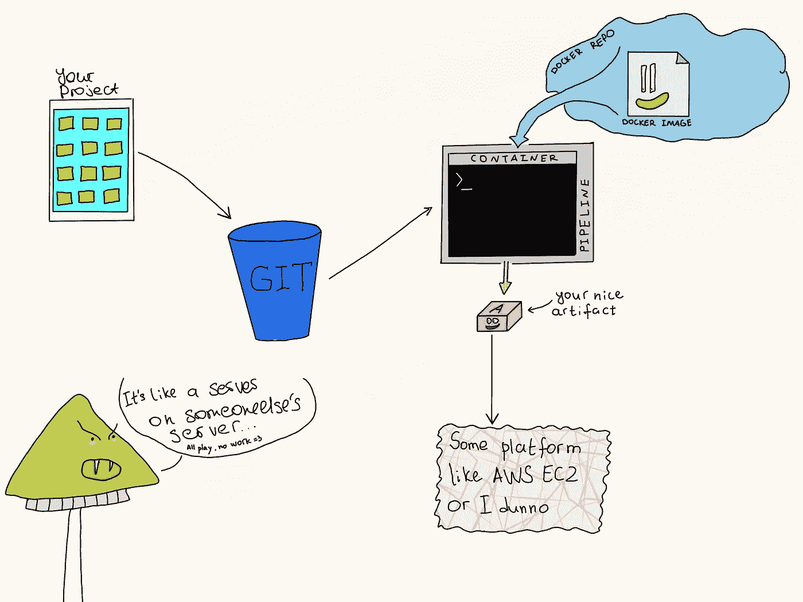
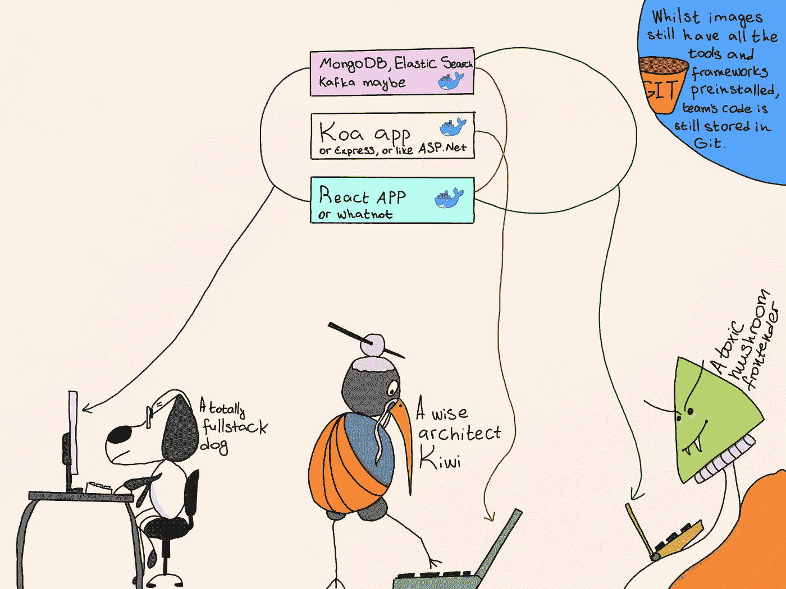

# 我不认识的集装箱

> 原文：<https://itnext.io/containers-as-i-didnt-know-them-67cd4eaf3739?source=collection_archive---------3----------------------->

哟。

容器走进了我们的生活，改变了我们部署和托管 web 应用程序的方式。在我第一次阅读 Docker 的“[入门](https://docs.docker.com/get-started/)指南之前，我就知道这一点。我知道这一点，但我对此一无所知，因为直到我开始使用容器后，我才意识到这个想法的全部潜力，它们不仅仅是一些承载 REST APIs 的瘦虚拟机。今天，让我们来谈谈容器如何让你的生活变得更好，即使你发誓永远不会把你珍贵的猫排名应用程序部署到除裸机之外的任何地方。以下是我在过去六个月中发现的一些不太正统的容器使用方式。

# 作为构建/部署服务器的容器

这是我一切开始的地方。

问题是——我喜欢 DevOps。在我职业生涯的某个时候，我了解到了 TeamCity 和 Octopus Deploy 这两个充满活力的组合，它们闪耀着 CI/CD 的白色魔力，令我着迷。我是我的团队中唯一一个乐于贡献时间来编写脚本、维护开发服务器和建立新环境的人，但那对我来说主要是乐趣。除了那些糟糕的时候，因为我们所有的基础设施都是一堆物理服务器和 Azure 虚拟机，我并不总是能够访问它们。

快进一下，不久前，我开始着手一个 1000%云原生的新项目。我们最初的协议之一是将我们的基础设施作为代码进行维护，并尽可能实施最佳 CI/CD 实践。然后，由于我们都不想被公司内部网络的边界所束缚，我们决定我们所有的运营技术也应该是基于云的“即服务”，这样我们就可以从世界各地访问我们的 docker、git 和 npm repos，只要这个地方有互联网连接。也就是说，我卷起袖子，开始寻找构建服务器的最佳候选人，脑子里有一个恼人的想法:“没有服务器，我究竟要如何构建构建服务器？”。我最担心的是，没有能力在网上创建我想要的任何环境，我将无法控制，我将在构建、交付和审核我们的工件的方式上受到限制。有那么一会儿，我处在一个非常黑暗的地方。

不过，我并没有惊慌。首先，我知道我们需要一个基于云的版本控制系统，经过一些讨论后，尽管我非常支持 GitLab，我们还是决定使用 Atlassian 的 T2 bit bucket。知道 GitLab 和 GitHub 都有自己的优秀产品，我决定看看 Bitbucket 有什么锦囊妙计，结果发现了一个叫做 [Bitbucket Pipelines](https://bitbucket.org/product/features/pipelines) 的东西。天哪，我真的很失望。

因此，管道的概念如下:你提供一系列命令和规则，说明为什么以及何时应该运行这些命令——这些就是你所谓的管道。现在，一个管道可能包括从构建和运行单元测试到部署到生产和验证部署的大量操作。这个故事最精彩的部分是，您在管道中使用的命令只是 bash shell 命令，它们在根据您选择的映像构建的 docker 容器中执行。该过程如下所示:

这是我学到的关于容器在现实生活中实际应用的第一课。我个人认为，在云中拥有自己的按需构建和部署服务器的想法非常强大，我看不出有什么理由不在所有的云部署中使用它。在我看来，这种方法的主要优势如下:

1.  如果您从 docker 文件创建映像，跟踪 CI/CD 基础架构中的变化将变得非常容易。因为，既然你的基础设施变成了代码，你就可以把它放进你的版本控制系统。这使得发现错误、精确定位需要改进的地方以及将知识传递给团队成员变得更加容易。
2.  在 docker 文件中进行更改要比在虚拟机中容易得多。
3.  无需维护物理基础设施。我想这是显而易见的。
4.  成本效率。花费在 bitbucket premium 订阅和工件存储上的钱是非常值得的，因为硬件、许可证和开发人员/运营人员花费在连接一切和修复故障上的时间都很少。

如果这些听起来对你有吸引力，试一试吧。虽然我只提到了 Atlassian 的管道，但还有其他有效的选项，如 [Jenkins](https://jenkins.io) 或 [GitLab C](https://about.gitlab.com/features/gitlab-ci-cd/) I. [Bitbucket 的](https://bitbucket.org)入门级帐户层是免费的，如果你出于某种原因不喜欢 Atlassian，你可以尝试竞争对手的选项，我相信它们会非常相似。我不在乎，让我们继续下一个。

# 作为开发工作区的容器

我们大多数开发人员的机器上都安装了很多开发工具。我们甚至可能不记得其中的一些，直到有一天我们试图再次安装它们，并得到通知说我们将要安装的任何东西的版本与已经安装的版本冲突。更糟糕的是，在我们的机器升级/更换后，需要重新安装所有的东西。大多数时候，找到我们需要的所有工具、库和扩展需要花费很长时间，有时这是一个反复试验的问题。像这样:“安装这个东西，安装那个插件，看看我能不能建一个项目。哦，我不能！快点，亚历克斯，少了什么？啊，我为什么不买一个偏远的黄瓜地，成为一个农民呢！?"。

当你经常在公司里雇佣新的开发人员时，这就成了一个更大的问题，你有一群人经历着同样的浪费每个人时间的过程。如果我们能够配置和分发封装的开发工作区，生活会变得容易得多。事实上我们可以做到。如果我们使用容器，它是。然而，一篇博文不足以涵盖这个话题，所以我将转到这个 YouTube 视频:[https://youtu.be/vE1iDPx6-Ok#t=34m35s](https://youtu.be/vE1iDPx6-Ok#t=34m35s)。与今天的故事相关的部分从 34:35 开始，但其余部分仍然值得一看。

我也忍不住要补充一个我是如何看待这个过程的如下图示。

当然，这个概念并不适合每个人，你很可能需要在你保存在机器上的东西和你作为容器运行的东西之间找到一个折衷点，但是，嘿，软件开发就是要找到折衷点！下一节将详细介绍这一点。

# 作为“独立工作空间模块”的容器

我必须承认，尽管我计划实施一个类似于视频中描述的解决方案，但我还没有这样做。部分是因为我很懒，有点是因为我们没有任何需要它的新开发人员，没关系。但重要的是，那次演讲已经成为我灵感的巨大源泉。

我仍然没有一个 docker 映像，包括我进行开发所需的所有工具和基础结构。然而，我已经创建了一组包含 AWS 命令行界面，无服务器等东西的图像。，我不想直接安装到我的机器上。我还在容器中托管我的应用程序所依赖的所有类型的服务器，比如 PostrgreSQL、Redis、ES。

尽管不如上一节中完全自动化且包装精美的解决方案高效，但这种方法仍有一些明显的好处:

1.  更干净的系统——我在容器中使用的每个应用程序都被隔离在这个容器中，不会对整个主机系统产生任何副作用。
2.  我仍然有一些可移植性，因为我的容器是用相同的命令运行的，这将在任何装有*nix shell 的机器上以相同的方式工作。
3.  自动化的潜力。我可以创建将不同的容器集合捆绑在一起的 shell 脚本。例如，只需一个命令就可以启动和停止 Redis 服务器、MySql 服务器和几个 Koa 应用程序。
4.  能够使用管道的映像进行本地构建，这意味着我可以确保所有的工件在我的本地机器上以与它们在“构建服务器”上完全相同的方式被创建。我还可以给我的 docker 图像添加标签，并对它们进行版本控制，以确保每次我构建代码的某个修订版时都能得到相同的结果。
5.  测试新的或有风险的东西的能力。说到专业的 it 卫生，有两个轶事我记得很清楚。首先是一个关于俄罗斯系统管理员的故事，他非常偏执，他在一个特殊的虚拟机中打开了所有的电子邮件附件。另一个是我两年前看到的 twitter 帖子(当时只是一条 twit 和下面的一些回复)。一位博客作者/安全研究员发布了一个 shell 脚本，根据描述，它应该播放一些令人惊叹的 ASCII 动画，但实际上是将僵尸网络客户端下载到受害者的机器上。几天后，这个人就拥有了一个拥有数万名客户的强大僵尸网络。这只是一个练习，旨在向人们展示一些来自网络的随机代码有多危险。所以我的观点是，尽管我们可能不像俄罗斯的系统管理员那样坚定和谨慎，但我们仍然可以在使用隔离容器来试验新事物方面找到妥协——不管它们看起来有多么有害。

容器是开发人员的镜像维度🤯漫威影业有限责任公司。

我必须说，我很遗憾没有更早地投资学习 docker 的最基本的知识，只是开始以这种方式使用容器——就像我的主机系统中的分离工作区一样。这肯定可以帮助我更好地组织我的工作流程，但最重要的是，它可以节省我花在清理另一个配置错误的服务器所造成的混乱的时间。

下面是一个 dockerfile 的例子，我用[无服务器框架](https://serverless.com)、[纽曼](https://www.getpostman.com/docs/v6/postman/collection_runs/command_line_integration_with_newman)、 [localstack](https://localstack.cloud) 和 [AWS CLI](https://aws.amazon.com/cli/?sc_channel=PS&sc_campaign=acquisition_NZ&sc_publisher=google&sc_medium=command_line_b&sc_content=aws_cli_e&sc_detail=aws%20cli&sc_category=command_line&sc_segment=161192218749&sc_matchtype=e&sc_country=NZ&s_kwcid=AL!4422!3!161192218749!e!!g!!aws%20cli&ef_id=W5jLqgAAARyrTEwS:20180912085941:s) 构建了一个映像，我用它从我的/git 文件夹本地运行无服务器项目。最后一行是我执行的一个 shell 命令，用于在交互模式下从这个映像运行一个容器(假设我已经将我的映像命名为*“my-dev-image-yo”*)。

# 算是结论吧

如果你一直在问自己是否应该开始花宝贵的时间学习容器，那么答案是肯定的。你绝对，完全应该。如果你的公司还停留在 COBOL 和电传打字系统上，你可能仍然会发现你的 docker 技能很有用。集装箱是一件大事，甚至比̶j̶Q̶u̶e̶r̶y̶还要大。

[Docker 官方入门指南](https://docs.docker.com/get-started/#containers-and-virtual-machines)是一个很好的起点。不要忘记我上面提到的 conf 视频。然而，Docker 现在最大的好处是它庞大且不断增长的社区，所以你可以确保如果你在谷歌上搜索“我如何在 Docker 容器中打电话给 it-thing-name”你不会失望。

再见。